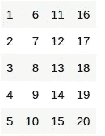
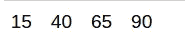

# “应用”系列的终极瑞士军刀

> 原文：<https://medium.com/analytics-vidhya/the-ultimate-swiss-army-knife-of-apply-family-in-r-27ed5ef09f43?source=collection_archive---------9----------------------->

# 概观

*   数据操作是机器学习生命周期中最关键的步骤之一
*   让我们学习使用最广泛使用的一组 **apply** 函数来转换 R 中的数据

# 介绍

数据操作是机器学习生命周期中最关键的步骤之一。它需要转换所提供的数据，以便可以用于构建预测模型。

此外，在这里，一个熟练的数据科学家运用他们的直觉和经验，从数据中提取尽可能多的信息。因此，毫不奇怪，Python 和 R 中有太多的函数和工具来帮助我们完成这项任务。


今天，我们将使用 R 并了解最广泛使用的一组用于在 R 中转换数据的'**'函数。这一系列函数提供了高效快速的数据操作。当我们只想处理某些列时，这尤其有用。这组函数称为 apply()函数。以及它的变体如 sapply()、mapply()等。我们得到了一把多用途的瑞士军刀用于数据处理。**

***如果你有兴趣从事数据科学方面的职业并了解这些令人惊叹的事情，我推荐你查看我们的* [*认证 AI & ML 黑带加速*](https://blackbelt.analyticsvidhya.com/accelerate?utm_source=blog&utm_medium=the-ultimate-swiss-army-knife-of-apply-family-in-r) *计划。***

# **目录**

**该系列中的各种功能包括:**

*   **应用**
*   **拉普利**
*   **伤感的**
*   **vapply**
*   **塔普利**
*   **地图**

# **设置背景**

**我将首先使用简单的数据集介绍上面的每个函数是如何工作的，然后我们将使用一个真实的数据集来使用这些函数。**

**所以，打开你的笔记本或 R studio，让我们开始吧！**

**我们不需要安装任何其他库来使用 apply 函数。让我们从创建一个简单的矩阵开始，矩阵中的数值从 1 到 20 分布在 5 行 4 列中:**

```
data <- matrix(c(1:20), nrow = 5, ncol = 4) 
data
```

****

**这是我们矩阵的样子。现在，让我们从 apply()函数开始**

# **应用()**

**使用帮助部分可以获得 apply()函数的一般语法。只需执行这段代码就可以获得详细的文档**

```
?apply
```

**我们可以看到，apply 函数的结构是 apply(X，MARGIN，FUN，…)。这里，**

*   **x 指的是我们将要应用操作的数据集(在我们的例子中是矩阵)**
*   **MARGIN 参数允许我们指定是按行还是按列应用操作(对于行，MARGIN = 1；对于列，边距= 2)**
*   **FUN 指的是我们想在 X 上‘应用’的任何用户定义的或内置的函数**

**让我们看看计算每行平均值的简单示例:**

```
mean_rows <- apply(data, 1, mean) 
mean_rows
```

****

**这相当简单！我们可以看到如何使用 apply()函数来总结我们的数据。同样，让我们试着沿着每一列寻找 e 和:**

```
sum_cols <- apply(data, 2, sum)
sum_cols
```

****

**如果我们想在所有元素上应用这个函数，我们只需像这样编写 apply 函数:**

```
all_sqrt <- apply(data, 1:2, sqrt)
all_sqrt
```

****

**如果我们想对数据应用用户定义的函数，该怎么办？例如，我有一个函数可以为每一行找到(x-1)的平方根:**

```
fn = function(x) { return(sqrt(x - 1)) }
```

**然后，我们对每一行应用该函数:**

```
apply(data, 1, fn)
```

****

**到目前为止，我们已经使用了只有一个参数的函数，并将它们应用于数据。apply 系列最好的一点是，它们还可以处理具有多个参数的函数！让我们应用一个带有 3 个参数的用户定义函数:**

```
fn = function(x1, x2, x3) { return(x1^2 + x2 * x1 + x3) }
```

**我们将 x1 作为“数据”中的每个值，将 x2、x3 作为其他参数，这些参数将首先声明，然后通过 apply 函数传递:**

```
b = 2
c = 1 
# apply along each row:
row_fn <- apply(data, 1, fn, x2 = b, x3 = c)
# apply along each column:
col_fn <- apply(data, 2, fn, x2 = b, x3 = c)
```

**让我们检查 row_fn 和 col_fn**

```
row_fn
```

****

```
col_fn
```

****

**apply()系列的其余部分遵循类似的结构，具有类似的参数，只是有一些变化。接下来让我们使用 lapply()函数。**

# **拉普利()**

**上面的 apply()函数有一个约束条件，即数据必须是一个至少二维的矩阵，才能对其执行 apply()函数。lapply()函数消除了这个约束。list-apply 的缩写，可以在 list 或 vector 上使用 lapply 函数。无论是一个向量列表还是一个简单的向量，lapply()都可以使用。因为我们现在处理的是向量/列表，所以 lapply 函数也不需要 MARGIN 参数。也就是说，lapply 的返回类型也是 list。**

**它只将数据和函数作为基本参数:**

**lapply(X，FUN)**

**让我们看一些例子:**

```
# define a list
cart <- c("BREAD","BUTTER","MILK","COOKIES")

# use lapply to convert all to lower case
cart_lower <- lapply(cart, tolower)

#output
cart_lower
```

****

**我们现在来看一个更复杂的列表:**

```
data <- list(l1 = c(1, 2, 3, 4),
             l2 = c(5, 6, 7, 8),
             l3 = c(9, 10, 11, 12))

# apply the 'sum' function on data:
sum_list <- lapply(data, sum)

#output
sum_list
```

****

# **萨普利()**

**sapply()函数(简化应用的缩写)类似于 lapply 函数。唯一的区别是输出的返回类型——s apply()根据返回值简化了输出。我创建了一个简单的表，告诉我们返回的是什么类型:**

**我们将看到上述所有场景的示例:**

## **场景 1:每个元素的长度= 1**

```
data <- list(l1 = c(1, 2, 3, 4))

# apply the 'sum' function on data:
sum_sapply1 <- sapply(data, sum)

#output
sum_sapply1
```

****

**使用 lapply 查看输出差异:**

```
sum_lapply1 <- lapply(data, sum) sum_lapply1
```

****

## **场景 2:每个元素的长度> 1 且相同**

```
sum_lapply1 <- lapply(data, sum)
sum_lapply1
```

****

**lapply()给了我们什么输出？**

```
sum_lapply2 <- lapply(data, sum)
sum_lapply2
```

****

## **场景 3:每个元素的长度> 1 且不同**

```
data <- list(l1 = c(1, 2, 3),
l2 = c(5, 6, 7, 8),
l3 = c(9, 10))

# apply the 'sum' function on data:
sum_sapply3 <- sapply(data, sum)

#output
sum_sapply3
```

****

**让我们将它与 lapply()在相同数据上的输出进行比较:**

```
sum_lapply3 <- lapply(data, sum) #output
sum_lapply3
```

****

# **vapply()**

**来到 vapply()函数。lapply()、apply()和 vapply()三者是专门为所有类型的向量定制的。与 lapply()和 sapply()为我们决定输出的数据类型不同，vapply()允许我们选择输出结构的数据类型。因此，vapply()的参数是:**

****vapply(X，好玩，好玩。值)****

**这里好玩。值用于提供所需的数据类型。**

**当我们的列表/向量包含数字和字符串的混合时，这是最有用的:**

```
data <- list(l1 = c(1, 2, 3, 4),
             l2 = c(5, 6, 7, 8),
             l3 = c(9, 10, 11, 12),
             l4 = c("a", "b", "c", "a"))

# apply the 'max' function on data:
sum_vapply <- vapply(data, max, numeric(1))
```

****

**不出所料，我们得到了一个错误，因为不可能从字符列表中计算最大值。numeric(1)指定我们希望输出为单个数值，其中每个元素的长度为 1。如果我们用 lapply()或者 sapply()会怎么样？**

```
lapply(data, max)
sapply(data, max)
```

****

**因此，我们可以看到 lapply()和 sapply()实际上为相同的。事实上，sapply()甚至将输出转换为 character 类型的向量。理想情况下，这不是我们想要的。一般来说，这就是我们使用 vapply()函数的方式**

```
data <- list(l1 = c(1, 2, 3, 4),
             l2 = c(5, 6, 7, 8),
             l3 = c(9, 10, 11, 12),
             l4 = c("a", "b", "c", "a"))

# apply the 'max' function on data:
sum_vapply <- vapply(data, max, numeric(1))
```

****

**因此，在处理具有不同要素数据类型的数据框时，使用 vapply()总是更好。**

# **塔普利()**

**用最简单的话来说，tapply()允许我们将数据分组，并对每个组执行操作。因此，当您提供一个向量作为输入时，tapply()对向量的每个子集执行指定的操作。它需要的参数是:**

****tapply(X，INDEX，FUN)****

**其中 INDEX 表示要用于分隔数据的因子。听起来很熟悉？是的，tapply()只是一个简单的方法来执行分组操作，并对分组数据应用一些函数！**

**为了观察 tapply()如何工作，让我们创建两个简单的向量**

```
item_cat <- c("HOME", "SNACKS", "BEVERAGE", "STORAGE", "CLEANING", "STORAGE", "HOME", "BEVERAGE", "ELECTRONICS", "SNACKS")item_qty <-c(25, 30, 45, 66, 15, 50, 35, 20, 15, 35)
```

**现在让我们使用 tapply 来获得每个项目类别的平均数量:**

```
tapply(item_qty, item_cat, mean)
```

****

**tapply()函数做了什么？我们按照 item_cat 向量对 item_qty 向量进行分组，以创建向量的子集。然后我们计算每个子集的平均值。**

**使用 tapply()之所以如此简单，是因为它自动从 item_cat 向量中获取唯一值，并几乎立即对数据应用我们想要的函数。我们甚至可以在每个子集上获得多个值:**

```
tapply(item_qty, item_cat, function(x) c(mean(x), sum(x)))
```

****

**现在，我们来看 apply()函数族中的最后一个函数 mapply()函数。**

# **地图应用()**

**mapply()代表多元应用，基本上是 sapply()的多元版本。mapply 函数最好通过例子来解释——所以让我们先使用它，然后试着理解它是如何工作的。**

**让我们首先来看一个函数，它通常不接受 2 个列表或 2 个向量作为参数——例如，max 函数。我们先看两个列表:**

```
list1 <- list(a = c(1, 2, 3), b = c(4, 5, 6), c = c(7, 8, 9))list2 <- list(a = c(10, 11, 12), b = c(13, 14, 15), c = c(16, 17, 18))
```

**现在，如果我们想找到每对列表元素之间的最大值呢？**

```
max(list1$a, list2$a)
```

****

**现在，这个函数不能同时应用于 list1 和 list2 的所有元素。在这种情况下，我们使用 mapply()函数:**

```
mapply(function(num1, num2) max(c(num1, num2)), list1, list2)
```

****

**因此，mapply 函数用于对通常不接受多个列表/向量作为参数的数据执行函数。当您想要创建新列时，它也很有用。让我们首先从我们最初定义的矩阵创建一个数据帧:**

```
df <- as.data.frame(data)
```

****

**我们现在将创建一个新变量，它包含列 V1 和 V3 的乘积:**

```
mapply(function(x, y) x/y, df$V1, df$V3)
```

****

**因此，我们看到在处理数据框时，mapply 是一个非常方便的功能。**

**现在，让我们看看如何在真实数据集上使用这些函数。为简单起见，我们来看看虹膜数据集:**

```
iris_df<-datasets::iris head(iris_df)
```

****

**我们现在可以使用 apply()函数计算每行的萼片长度和萼片宽度的平均值:**

```
iris_df['Sepal_mean'] <- apply(iris_df[c("Sepal.Length", "Sepal.Width")], 1, mean)
```

****

**类似地，我们可以获得数据框架中每个物种的每个列的汇总值:**

```
tapply(iris_df$Sepal.Width, iris_df$Species, mean)
```

****

**我们还可以使用 mapply()函数创建一个显示花瓣长度和花瓣宽度之和的新列:**

```
iris_df['Sum_Petal'] <- mapply(function(x, y) x+y, iris_df$Petal.Length, iris_df$Petal.Width)
```

****

# **结束注释**

**到目前为止，我们已经学习了 r 中 apply()函数族中的各种函数。这些函数集提供了在瞬间对数据应用各种操作的极其有效的方法。本文涵盖了这些函数的基础知识，目的是让您理解这些函数是如何工作的。**

**我鼓励你在更复杂的数据集上尝试更复杂的函数，以充分理解这些函数有多有用。这些函数对您在 R 中处理数据集有什么帮助？请在下面分享你的回复和任何问题！**

**您也可以在我们的移动应用程序上阅读这篇文章**

***原载于 2021 年 2 月 11 日*[*【https://www.analyticsvidhya.com】*](https://www.analyticsvidhya.com/blog/2021/02/the-ultimate-swiss-army-knife-of-apply-family-in-r/)*。***