# 终极变形金刚和你需要的关注。

> 原文：<https://medium.com/analytics-vidhya/the-ultimate-transformer-and-the-attention-you-need-1dafaf8cb6c7?source=collection_archive---------4----------------------->

照片由 [note thanun](https://unsplash.com/@notethanun?utm_source=medium&utm_medium=referral) 在 [Unsplash](https://unsplash.com?utm_source=medium&utm_medium=referral) 上拍摄

我会尽可能简单地解释这个话题，包括算术部分。

> ***要讲的话题***

*   变压器介绍
*   了解变压器的编码器
*   了解变压器的解码器

> 变压器初级读本

Transformer 是最流行的深度学习架构，主要用于 NLP 任务。自从变压器出现以来，它已经取代了 RNN 和 LSTM 的各种任务。几个新的 NLP 模型，如伯特，GPT，T5 是基于变压器架构。

> 变压器介绍

RNN 和 LSTM 被广泛用于顺序任务，如单词预测，机器翻译，文本生成。然而，他们面临的主要挑战之一是获取长期依赖。

为了克服这一点，在“关注是你所需要的”一文中引入了一种新的架构，名为 Transformer。变压器目前是几个 NLP 任务的模型的艺术状态。变形金刚完全基于注意机制，完全摆脱了递归。变压器使用一种特殊类型的关注机制，称为**自关注**。我们将对此进行讨论，但首先让我们了解语言翻译实际上是如何与 transformer 一起工作的。

该变换器由编码器-解码器结构组成。我们把输入的句子输入编码器。编码器学习输入句子的表示，并将该表示发送给解码器。解码器接收由编码器学习的表示，并产生输出。

假设我们需要将一个英语句子转换成法语。因此，我们的输入将是一个英语句子，我们将馈送给编码器，编码器将学习我们的英语句子的表示，并将表示转发给解码器，解码器将相应地产生一个输出。

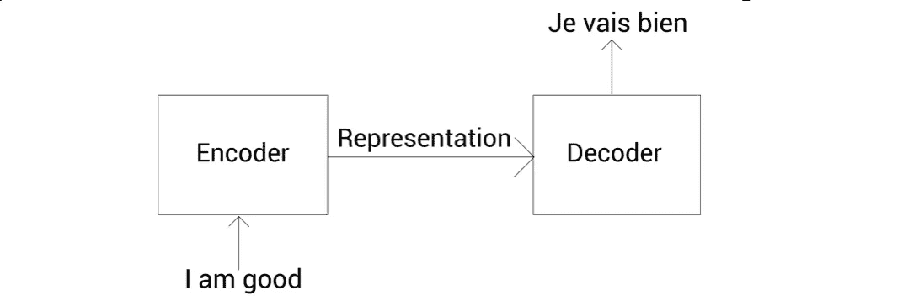

***那么究竟发生了什么？***

> 了解变压器的编码器

该变换器由 N 个编码器的堆栈组成。一个编码器的输出作为它上面的另一个编码器的输入发送。每个编码器将其输出发送给它上面的编码器，最终的编码器返回给定源句子的表示作为输出。

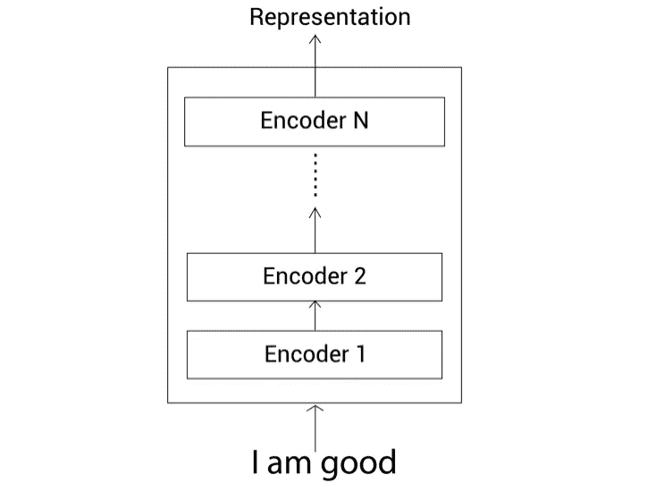

在论文《注意力是你所需要的全部》中，作者使用了 6 个编码器。然而，我们可以尝试 n 个编码器。为了简单起见，我们将只使用 2 个编码器。

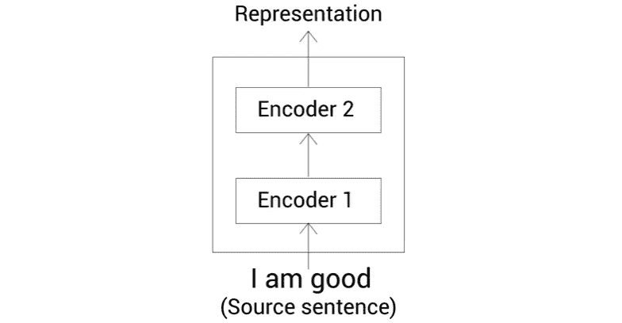

***于是问题又出现了它实际上是如何工作的？***

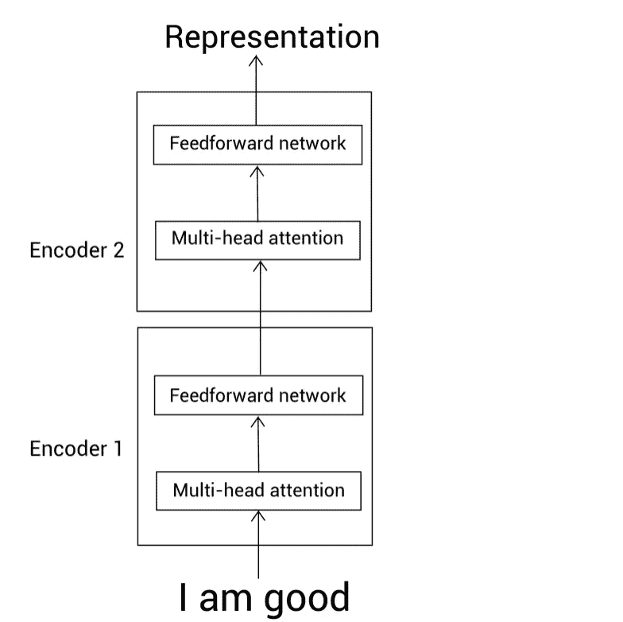

从上图中你可以很容易地理解所有的编码器模块都是相同的。您还可以观察到每个编码器由两个子层组成

*   多头注意力
*   前馈网络

在了解子层之前，让我们先了解什么是**自我关注机制。**

> 自我注意机制

为了更好地理解，让我们考虑一个例子

*“一只狗因为饿了而吃了食物”*

在上面的句子中，代词 *it* 可能指狗或食物。通过阅读这个句子，我们很容易理解它指的是狗而不是食物。这就是自我关注机制帮助我们的地方。在句子“狗吃了食物，因为它饿了”中，我们的模型首先计算单词 *A* 的表示，接下来计算单词 *dog、*的表示，然后是下一个单词，依此类推，直到句子结束。在计算单词的表示时，它将每个单词与句子中的所有其他单词相关联，以了解更多关于单词的信息。例如，假设在计算单词 *it* 的表示时，我们的模型将单词 *it* 与所有其他单词相关联，以了解更多关于它的信息，并且在计算时，我们的模型理解了单词 it 与狗的关系比食物更密切，因为我们可以看到连接单词 dog 的线比食物更粗。

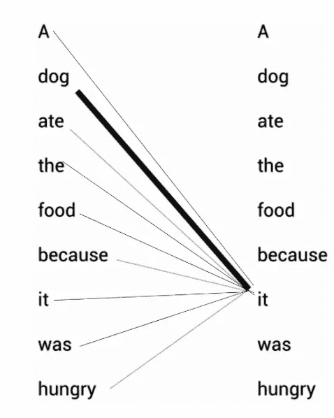

现在让我们理解它实际上是如何工作的。假设我们的输入是“我很好”。首先，我们得到每个单词在句子中的嵌入(嵌入只是单词的向量表示，嵌入的值将在训练中学习。)设 x1 为字 *I 的嵌入，* x2 为*am*x3 为 *good* 。

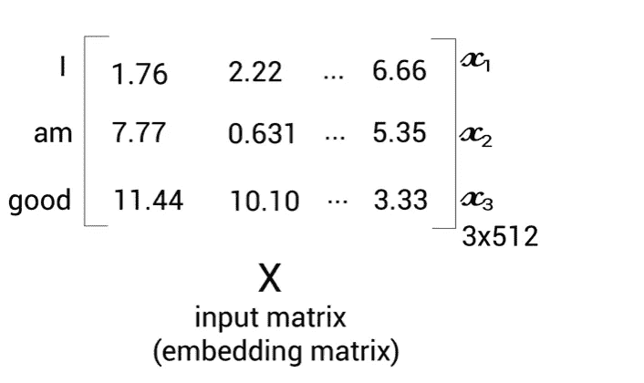

我们输入 X 的维数会是[句子长度*嵌入维数]。我们句子中的单词数是 3，假设我们的嵌入维数是 512，那么我们的输入矩阵的维数将是[3*512]。现在，我们从输入矩阵 X 中创建三个矩阵:查询矩阵 *Q、*密钥矩阵 *K* 和值矩阵 *V* 。

好的，但是我们如何创建三个矩阵呢？

为了创建这三个矩阵，我们引入三个新的权重矩阵 Wq、Wk 和 Wv。我们通过将权重(Wq，Wk，Wv)矩阵乘以我们的 X 来创建查询 *Q* ，密钥 *k* 和值 *V* 。权重矩阵首先被随机初始化，并且在训练期间学习这些最优值。

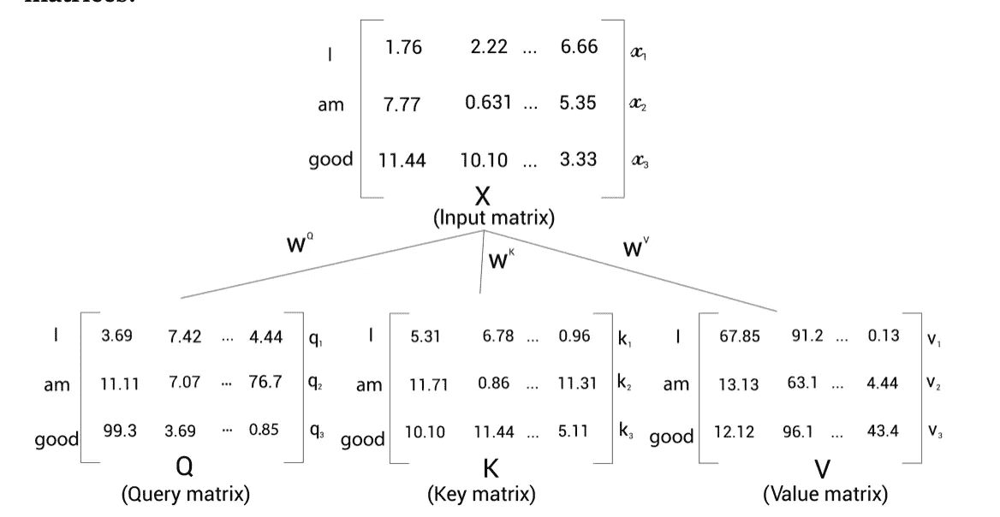

这个图像非常清楚地表明了 q1、k1、v1 代表字 ***I*** ，q2、k2、v2 代表字 ***am*** 以及 q3、k3、v2 代表字*。注意，Wq、Wk 和 Wv 的维数为 64。因此，我们的 Q、K 和 V 矩阵的维数是[句子大小*维数]，即[3*64]。*

*现在的问题是我们为什么要计算这个？*

> *理解自我关注机制*

*我们已经看到如何计算 Q，K，V 矩阵，我们也知道如何从输入矩阵中提取它们。现在让我们看看它们是如何用于自我注意机制的。我们知道，为了计算一个单词的表示，*自我注意机制*将这个单词与给定句子中的所有单词相关联，我们知道理解一个单词如何与所有其他单词相关联会给我们一个更好的表示。自关注*机构*包括四个步骤*

> *第一步*

*自我注意机制的第一步是计算 Q 和 K 矩阵之间的点积。*

*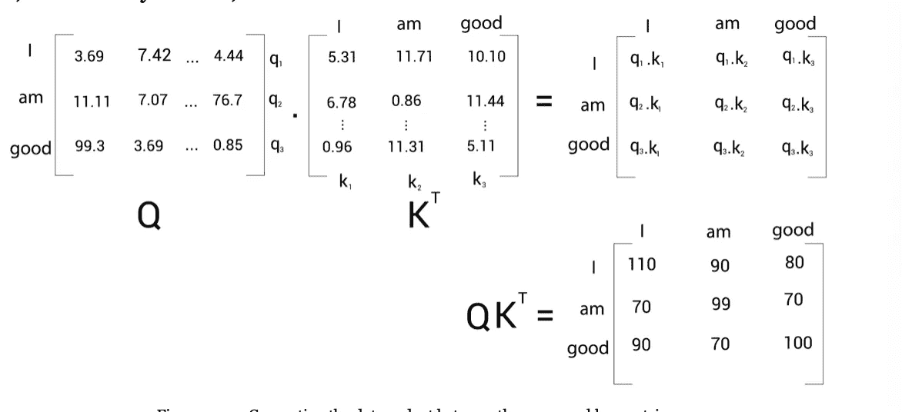*

*让我们观察 QK 矩阵的第一行，它显示了 *I 的查询向量 q1 与向量 K1、k2、k3 有多相似。**

*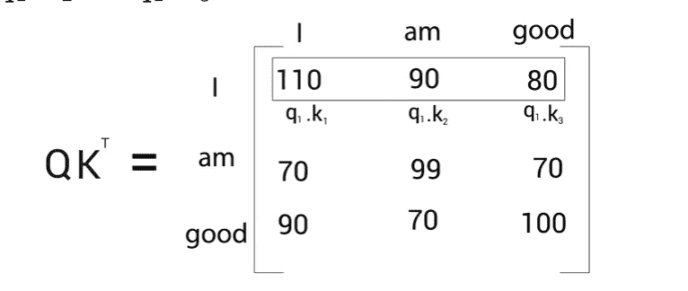*

*类似地，观察第二行，然后是第三行。第三行陈述单词 good 与其自身的关系，接着是 *I* 和 *am。因此，我们可以说，计算点积给了我们每个单词与句子中所有单词的相似度矩阵。**

> *第二步*

*为了获得稳定的梯度，我们将 QK 矩阵除以 K 矩阵维数的平方根。在我们的例子中，K 矩阵的维数是 64，因此 8 是它的平方根。*

> *第三步*

*通过查看前面的相似性得分，我们可以理解它们处于非标准化形式，因此我们使用 softmax 函数进行标准化。应用 softmax 有助于将分数带到 0 到 1 的范围内，分数总和等于 1。*

> *第四步*

*现在我们计算注意力矩阵 z。注意力矩阵包含矩阵中每个单词的注意力值。我们可以通过将得分矩阵乘以 V 矩阵来计算注意力矩阵，我们有*

*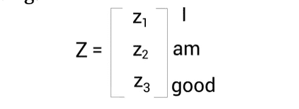*

*注意力矩阵 Z 通过由分数加权的值向量的总和来计算。让我们通过逐行查看来理解它。首先让我们看看单词 *I* 的第一个 *Z1* 是如何计算的。*

*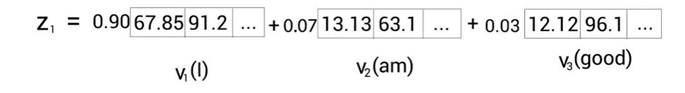*

*由此统计出 *Z1 包含 90%来自矢量 V1****I****，7%来自 V2****am****，3%来自 V3* ***good。****

****但是怎么有用呢？****

*为了回答上面的问题，让我们绕过前面的例子*

*“一只狗吃了食物，因为它饿了”*

*当我们为上面的句子计算 Z 时，我们会意识到单词*比 ***食物更倾向于 ***狗*** 的相似性。*****

*自我关注机制图示如下*

*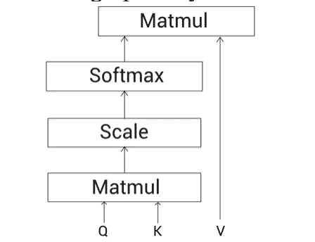*

*自我注意机制也称为**比例点积。***

*为什么？*

*你可能已经有答案了。*

> *多头注意力机制*

*我们可以使用多个注意力头来代替单个注意力，也就是说，我们可以计算多个注意力矩阵，因为这样会更准确。在多头注意力中，我们首先找到每个单词的注意力矩阵，然后将它们连接起来并乘以一个新的权重矩阵。*

****学习位置编码****

*如果我们直接把 x 输入到我们的转换器，它不能理解词序，因此也不能理解句子。因此，我们添加一些指示词序的信息，而不是将输入矩阵直接输入到转换器。这种技术称为 ***位置编码。****

> *前馈网络*

*前馈网络由两个具有 Relu 激活密集层组成。前馈的参数在句子的不同位置上是相同的，而在编码器块上是不同的。*

****添加与定额构件****

*编码器中一个更重要的组件是加法和范数组件。I 连接子层的输入和输出。它基本上是一个通过层标准化流动的剩余连接。层标准化通过防止每层中的值剧烈变化来促进更快的训练。*

*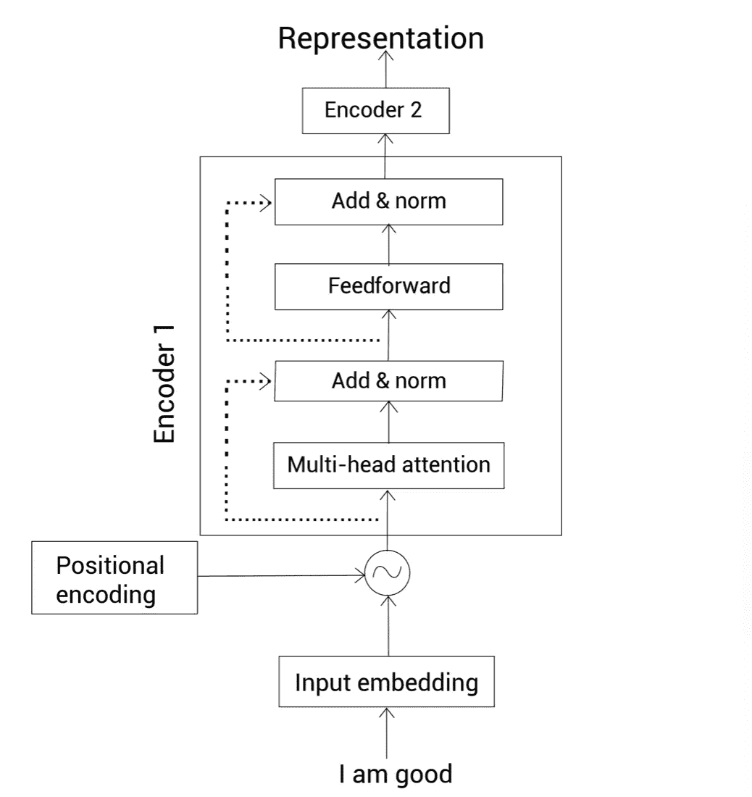*

*编码器的完整再现*

> *了解变压器的解码器*

*现在，我们将编码器表示输入解码器。解码器从编码器获取输入并生成输入。像编码器一样，我们也可以在解码器上叠加 N 个数字。我们还可以观察到，输入句子的编码器表示(编码器输出)被发送到所有解码器。因此，解码器接收两个输入:一个来自前一个解码器，另一个是编码器的表示。*

****好吧但是我们的解码器到底是怎么目标句子的呢？****

*让我们更详细地探索它。在步骤 t=1，解码器的输入将是<sos>，这表示句子的开始。解码器将<sos>作为输入，生成第一个字。在时间步长 t=2 以及当前输入时，解码器从先前的时间步长 t-1 中取出新生成的单词，并尝试生成句子中的下一个单词。类似地，在每个时间步上，解码器将新生成的单词组合到输入中，并预测下一个单词。一旦生成了表示句子结束的<eos>标记，这意味着解码器已经完成了目标句子的生成。</eos></sos></sos>*

*在编码器部分，我们学习了如何将输入转换为嵌入矩阵，并向其添加位置嵌入，然后将其提供给编码器。类似地，这里不是将输入直接馈送到解码器，而是将输入转换为嵌入矩阵并添加位置嵌入。*

*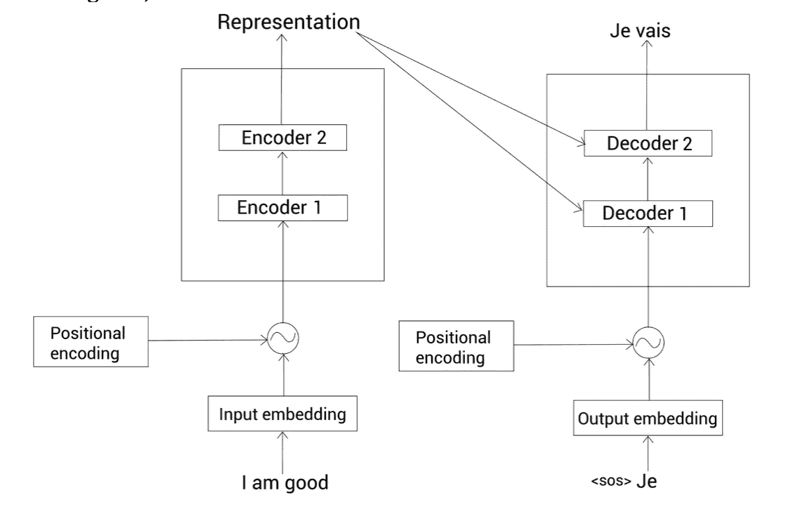*

****好吧，但最终的问题是解码器到底是如何工作的？****

*让我们探索一下解码器模块内部的情况。*

*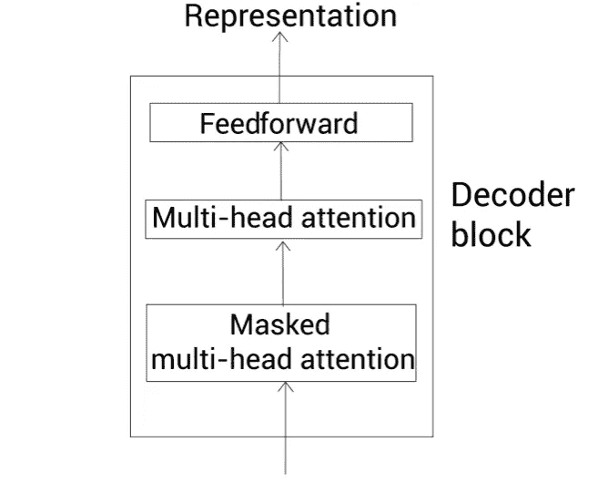*

*与编码器模块类似，解码器也有相同的内层。现在我们有了解码器的基本概念，让我们逐一检查每个组件。*

> *掩蔽的多头注意力*

*在我们的英语到法语的数据集里，假设我们的数据集看起来像这样*

*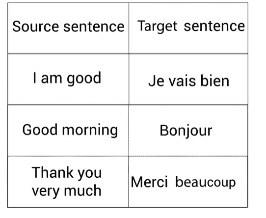*

*在训练过程中，由于我们有正确的目标句子，我们可以将整个目标句子作为输入输入到解码器，但只需稍加修改。我们了解到，解码器将<sos>作为第一个标记，并在每个时间步将下一个预测单词与输入组合，以预测预测目标句子的时间步，直到到达<eos>标记。我们还了解到，我们不是直接将输入输入给解码器，而是将其转换为嵌入矩阵，然后添加位置编码。</eos></sos>*

*假设下面的矩阵 X 是由嵌入矩阵和位置矩阵相加得到的。*

*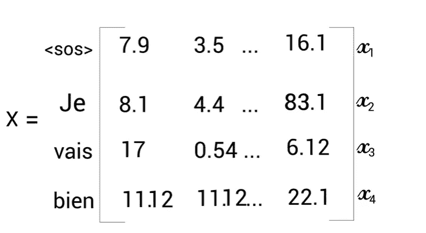*

*现在，我们将 X 馈送给解码器第一层，即掩蔽的多头注意力。这与多头注意力层的工作原理完全相同，但有一点不同。*

*为了创造自我关注，我们创造了向量。因为我们正在计算多头注意力，所以我们创建了 *N* 个 *Q，K，V* 向量。我们解码器的输入句子是 *< sos > je vais bien* ，我们知道自我注意机制如何将每个单词与其他单词联系起来，以获得更好的理解。但在这种情况下，这里有一个陷阱。在测试期间，解码器将仅具有直到前一步骤之前生成的单词作为输入。例如，假设在时间步长 t=2 时，解码器将只有输入字[ *< sos >，je* ，而没有其他字。所以，我们必须以同样的方式训练我们的模特。因此，我们的注意力机制应该只与单词 *je* 相关，而与其他单词无关。为此，我们屏蔽了右边所有模型尚未预测到的单词。*

*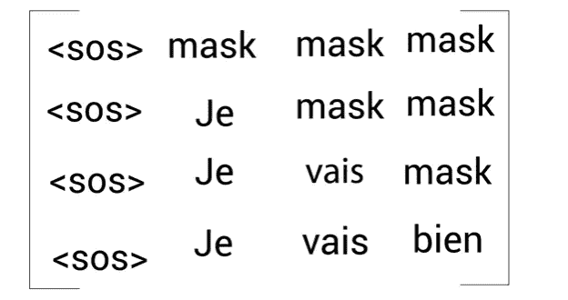*

*像这样屏蔽单词将有助于注意力机制只注意那些在测试期间对模型可用的单词。*

> *多头注意力层*

*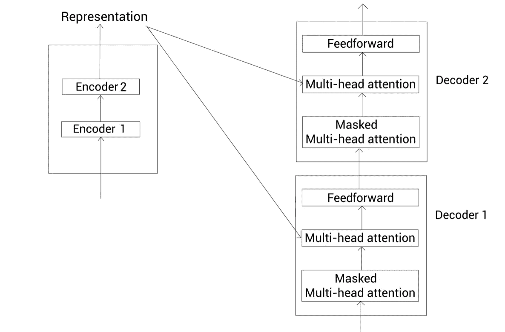*

*让我们用 R 表示编码器表示，用 m 表示作为多头关注子层的结果而获得的关注矩阵。因为这里我们有编码器和解码器之间的交互，所以这一层也被称为 ***编码器和解码器关注层。****

*我们使用从前一子层获得的关注矩阵 M 创建查询矩阵 Q，并且我们使用编码器表示 r 创建关键值矩阵。*

> *前馈网络&加法和范数元件*

****前馈层和添加与定额组件层*** 的工作原理与编码器完全相同。*

> *线性和 softmax 层*

*一旦解码器学习了目标句子的表示，我们就将从最顶层解码器获得的输出馈送到 linear 和 softmax 层。线性层生成大小等于我们的词汇大小的逻辑。*

> *将编码器和解码器放在一起*

*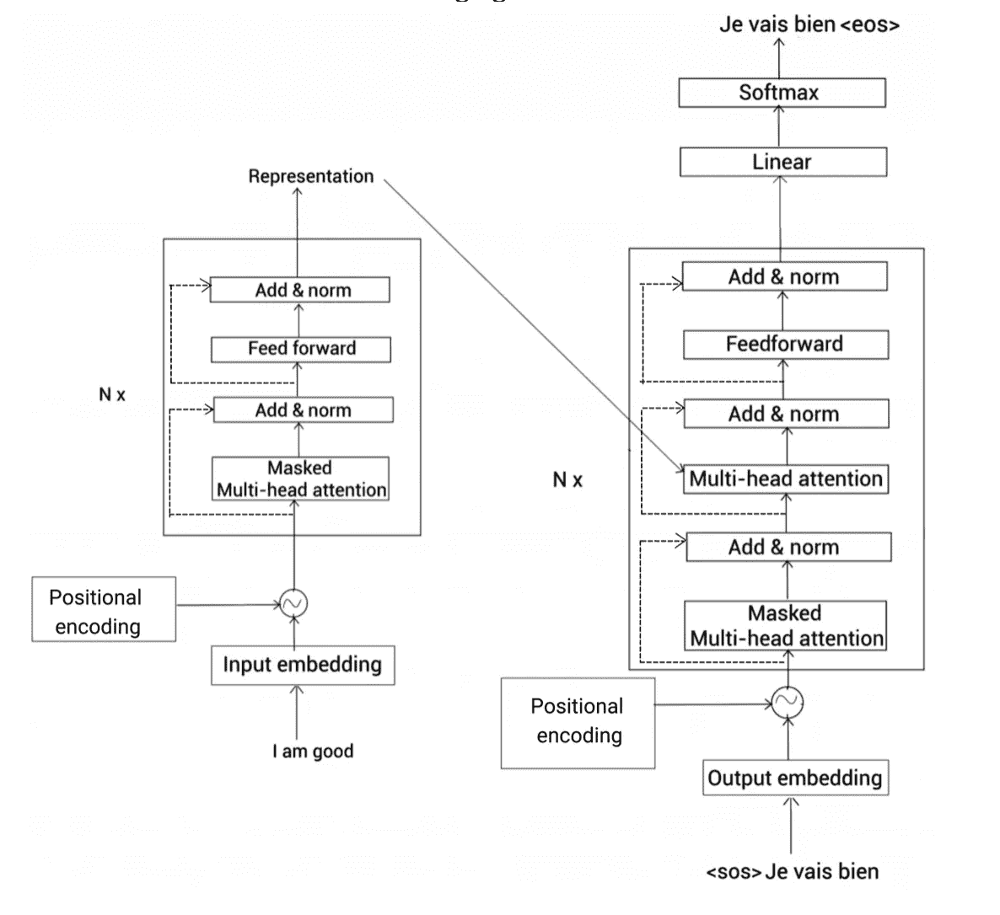*

> *进一步阅读*

*   *关注就是你需要的全部—[https://papers . nips . cc/paper/2017/file/3f 5ee 243547 dee 91 FBD 053 C1 C4 a 845 aa-paper . pdf](https://papers.nips.cc/paper/2017/file/3f5ee243547dee91fbd053c1c4a845aa-Paper.pdf)*

*谢谢你！*