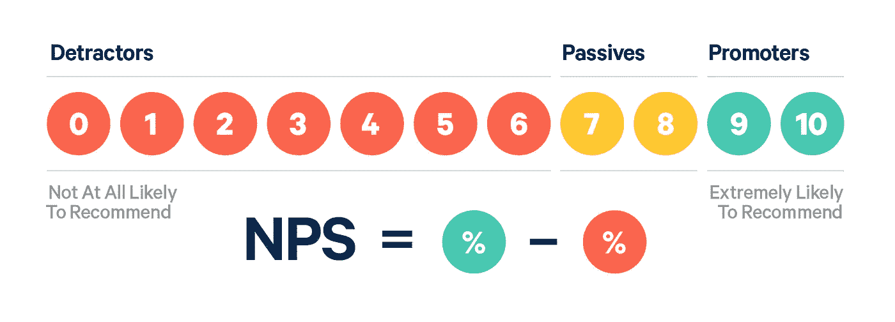

# 净推介值(NPS)指标的使用和误用

> 原文：<https://medium.com/analytics-vidhya/the-use-and-misuse-of-net-promoter-score-nps-metric-39d5448331f7?source=collection_archive---------13----------------------->

检索自:trustmary.com

净推介值(NPS)是一个广泛使用的分数，用来衡量客户推荐你的产品的可能性(Reichheld，2003)。自推出以来，它已经在许多行业造成了严重破坏，将许多指标推到了一边，成为衡量客户忠诚度的最佳指标。

但是由于它的流行，一些危险也随之而来。其中一些是 NPS 指标如何工作的结果，另一些是人们如何使用它的结果。让我自己非常清楚，NPS 是一个度量，当它在正确的条件下正确使用时，可以给你有价值的信息。问题是情况并不总是这样。

因此，本文的目的是与您分享一些关于 NPS 指标的正确使用和误用的想法。这些想法基于简单的研究方法、心理测量学和统计学。

在这种情况下，为了正确使用它，您应该遵循以下准则:

1.  了解业务问题，判断 NPS 是否真的回答了你提出的问题。
2.  避免单独使用它，总是使用更多的指标
3.  将指标分成几个部分，使用整体指标和它们的部分。

在详细介绍之前，我还想和大家分享一下这一指标的危险性:

1.  忽略询问业务问题，因此将指标作为万能工具。

2.由于折叠值来计算指标而缺少信息。

3.收集测量误差，因为客户可能难以区分问题的编号。

**好吧！很好，但是我怎么做这些并避免危险呢？**

最重要的是，当你遵循好的实践的同时，你避免了危险(有点明显，但指出这一点很重要)。

在这种情况下，**我会说，最好的做法是真正理解问题并提出研究问题。** NPS 旨在衡量客户推荐产品的可能性。从这个意义上说，如果你想使用它，你应该非常清楚，你真正想衡量客户推荐的可能性，而不是其他东西。

**理解问题**

NPS 不直接衡量客户满意度。尽管它可以是它的代理，但它并不完全相同。因此，请注意不要认为你可以将推荐产品的可能性与总体客户满意度等同起来。当人们回答这两个问题时，他们可能会有不同的逻辑。你可能对某个产品很满意，但不推荐它，因为你认为它不适合所有人。

这里的重要思想是，当问题真正适合时，使用度量标准。对于客户满意度、购买产品的可能性或不离开移动应用程序，NPS 不是万能的。

**避免单独使用指标**

如果你想了解总体满意度或你的客户使用除了 NPS 以外的许多问题。没有灵丹妙药，因此用一个问题不可能收集到你需要的所有信息。人脑相当复杂，客户满意度和推荐可能性等心理结构最好用多个问题来衡量。

在你测量它之后，你也可以做一些很好的心理测量分析来检查测量的可靠性和有效性的证据。通过用多个问题来衡量你的结构，这是可能的。

**划分指标，以避免信息丢失**

NPS 在 0 到 10 的范围内测量。但是当你计算你真正使用的指标时，9，10(促进者)和 0 到 6(反对者)。因此，计算中不使用 7 和 8。尽管如此，必须回答问题的人必须思考这个问题，从而吸引他/她的注意力和认知能量。这浪费了宝贵的几秒钟，而这些时间可以用来回答另一个问题，这个问题可以给你更多的信息。

此外，0 到 10 的范围相当大，对于一个人来说，很难区分 5 和 6 还是 4 和 3。所有这些案例都是诋毁者。在一个极端的例子中，0 和 6 也被标记为相同。但一个是非常接近被动的一面，另一个是完全不愿意推荐你的产品。这是非常有价值的信息，你会因为压缩数字而丢失。

从这个意义上来说，一件很棒的事情就是减少你在 NPS 中使用的选项数量，这样每个选项对这个人来说都有更有意义的价值。换句话说，这个人能够区分一个数字和另一个数字。

如果你真的不想改变真实的度量，你可以从它那里得到两个测量值。1)您的批评者和推动者群体的真实 NPS，以及 2)回答每个值的人数，以便您可以放大批评者、推动者甚至被动群体。

有可能你有很多人接近另一个群体的边缘(例如，很多人回答了 6 个)，只是为了远离诋毁者。同样，明智的做法是知道有多少人真正会推荐你的产品(10)，以及有多少人根本不会推荐你的产品(可能是 0 或 1)。

**简单回顾一下！**

*   了解问题，检查 NPS 是否真的是您想要解决的业务问题的正确指标。
*   不要单独使用 NPS，做一个好的问卷，你可以收集更多不同的功能，并测试这些信息的可行性。
*   减少 NPS 中的选项数量。对许多人来说，辨别 a 4 和 a 5 的区别可能非常困难。此外，使用真正的 NPS 和整个规模。一个回答 6 的贬低者和一个回答 0 的贬低者是完全不同的，那是有价值的信息。

就这样吧！希望你喜欢！快乐测量！

**参考**

Reichheld，F. (2003 年)。你需要增加的一个数字。*哈佛商业评论。*