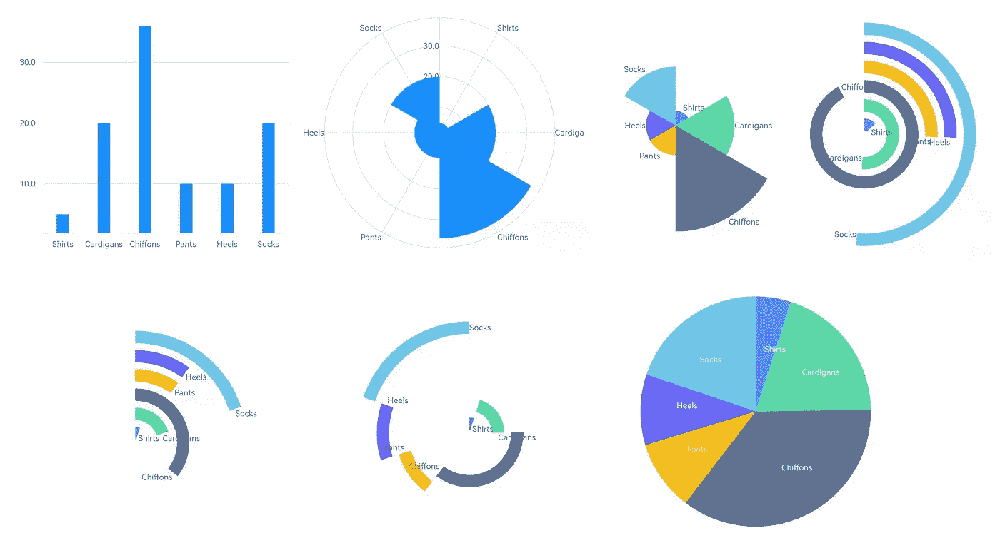

# 图形语法的多样性

> 原文：<https://medium.com/analytics-vidhya/the-versatility-of-the-grammar-of-graphics-d1366760424d?source=collection_archive---------0----------------------->

> *新版的 Flutter 可视化库* [*Graphic*](https://github.com/entronad/graphic) *对其声明性规范语法进行了优化，使其能够更好地表现图形的语法本质。*
> 
> *在本文中，我们多次改变规格，从而将条形图转换为饼图。这部作品展示了图形语法的灵活性和多样性，也向初学者展示了图形语法的基本概念。*
> 
> *如果你之前没学过图形学的语法，看这篇文章没问题。也是* [*图文*](https://github.com/entronad/graphic) *的入门手册。*


条形图和饼图在数据可视化中非常常见。它们乍一看很不一样，但本质是一样的。为什么？让我们一步一步把柱状图转化为饼状图，去探究内在的原因。

让我们从一个简单的条形图开始。数据与 ECharts 的[起始示例](https://echarts.apache.org/examples/editor.html?c=doc-example/getting-started)相同:

```
const data = [
  {'category': 'Shirts', 'sales': 5},
  {'category': 'Cardigans', 'sales': 20},
  {'category': 'Chiffons', 'sales': 36},
  {'category': 'Pants', 'sales': 10},
  {'category': 'Heels', 'sales': 10},
  {'category': 'Socks', 'sales': 20},
];
```

# 声明性说明

[图形](https://github.com/entronad/graphic)采用声明性规范。所有可视化语法都在[图表](https://pub.dev/documentation/graphic/latest/graphic/Chart-class.html)小部件的构造函数中指定:

```
Chart(
  data: data,
  variables: {
    'category': Variable(
      accessor: (Map map) => map['category'] as String,
    ),
    'sales': Variable(
      accessor: (Map map) => map['sales'] as num,
    ),
  },
  elements: [IntervalElement()],
  axes: [
    Defaults.horizontalAxis,
    Defaults.verticalAxis,
  ],
)
```

# 数据和变量

图表的数据由`data`属性导入。它可以是任何类型的`List`。在图表内部，数据项被转换成统一的[元组](https://pub.dev/documentation/graphic/latest/graphic/Tuple.html)对象。如何从数据项中提取[元组](https://pub.dev/documentation/graphic/latest/graphic/Tuple.html)字段由[变量](https://pub.dev/documentation/graphic/latest/graphic/Variable-class.html) s 定义。

从示例代码中我们可以看到，规范的语法很简洁，然而`variables`定义占用了一半的长度。由于 Dart 是一种严格的类型化语言，为了允许任何输入数据类型，详细的[变量](https://pub.dev/documentation/graphic/latest/graphic/Variable-class.html)定义是非常必要的。

# 几何元素

图形语法最伟大的思想是区分抽象的*图形*和可感知的*图形*之间的区别。

例如，一个数据是一个值的*区间*还是一个值的*点*，称为*图*；无论画布上的项目是条形还是三角形，宽度和高度都称为*图形*。创建图形和图形的步骤分别称为几何和美学。

图形和图形的概念达到了数据和图形的内在联系。它们是图形语法摆脱图表类型学束缚的关键。

[几何元素](https://pub.dev/documentation/graphic/latest/graphic/GeomElement-class.html)是定义这两个概念的地方。其类型决定了图形的类型，它们是:

*   [PointElement](https://pub.dev/documentation/graphic/latest/graphic/PointElement-class.html) :点数。
*   [LineElement](https://pub.dev/documentation/graphic/latest/graphic/LineElement-class.html) :连接点的线。
*   [AreaElement](https://pub.dev/documentation/graphic/latest/graphic/AreaElement-class.html) :行间的区域。
*   [IntervalElement](https://pub.dev/documentation/graphic/latest/graphic/IntervalElement-class.html) :两点之间的间隔。
*   [多边形单元](https://pub.dev/documentation/graphic/latest/graphic/PolygonElement-class.html):分割一个平面的多边形。

图表中条形的高度代表 0 和基准值之间的间隔，因此我们选择 [IntervalElement](https://pub.dev/documentation/graphic/latest/graphic/IntervalElement-class.html) 。这样我们就得到了一个非常常见的**条形图**:


让我们回到最初的探索。饼图中的角度也显示区间，所以我们也应该选择 [IntervalElement](https://pub.dev/documentation/graphic/latest/graphic/IntervalElement-class.html) 。但是为什么条形图呈现矩形，而饼图呈现扇形呢？

# 坐标

坐标将变量分配到平面中的不同维度。对于矩形坐标( [RectCoord](https://pub.dev/documentation/graphic/latest/graphic/RectCoord-class.html) )，尺寸为水平和垂直；而对于极坐标( [PolarCoord](https://pub.dev/documentation/graphic/latest/graphic/PolarCoord-class.html) )，尺寸是角度和半径。

上面的例子没有指出`coord`属性，所以设置了一个默认的矩形坐标。由于饼图用角度显示区间，所以应该是极坐标。我们添加一个定义来表明:

```
coord: PolarCoord()
```

然后图表变成了**玫瑰图**:


这似乎越来越接近饼状图。但是图形看起来不完美。它需要修理一下。

# 规模

第一个问题是，扇形半径的比例似乎不等于`salse`值的比例。

这个问题围绕着图形语法的一个重要概念:比例。

原始数据值可以是数字、字符串或时间。即使只是数字，数值也可能相差几个数量级。所以在用于图表之前，它们应该被标准化。这一步称为缩放。

数字、时间等连续数据要归一化到`[0, 1]`；而离散数据(如字符串)应该映射到自然数索引(如 0、1、2、3)...

每个变量都有一个响应范围，在[变量](https://pub.dev/documentation/graphic/latest/graphic/Variable-class.html)的`scale`属性中设置。[元组](https://pub.dev/documentation/graphic/latest/graphic/Tuple.html) s 中的变量值可以是`num`、`DateTime`或`String`中的一个，因此标尺按输入值类型分类:

*   [LinearScale](https://pub.dev/documentation/graphic/latest/graphic/LinearScale-class.html) :将一系列数字归一化为`[0, 1]`，连续。
*   [时间刻度](https://pub.dev/documentation/graphic/latest/graphic/TimeScale-class.html):将时间范围归一化为`[0, 1]`数字，连续。
*   [OrdinalScale](https://pub.dev/documentation/graphic/latest/graphic/OrdinalScale-class.html) :按顺序将字符串映射到自然数索引，离散。

对于数字，默认的[线性标度](https://pub.dev/documentation/graphic/latest/graphic/LinearScale-class.html)将根据输入数据确定范围，因此范围最小值可能不是 0。对于条形图，这将使图表聚焦于条形的高度差异。但它并不适合玫瑰图，因为人们倾向于把半径比当作价值比。

因此，[线性标尺](https://pub.dev/documentation/graphic/latest/graphic/LinearScale-class.html)的量程最小值应手动设置为 0:

```
'sales': Variable(
  accessor: (Map map) => map['sales'] as num,
  scale: LinearScale(min: 0),
),
```

# 审美属性

第二个问题是，由于扇区是相邻的，它们的颜色应该是可以区分的。而且人们更喜欢用标签，而不是轴，来注释玫瑰图。

感知图形的属性，如颜色或标签，被称为美学属性。在[图文](https://github.com/entronad/graphic)中它们是:

*   `position`
*   `shape`
*   `color`
*   `gradient`
*   `elevation`
*   `label`
*   `size`

除了`position`之外，它们都在[几何元素](https://pub.dev/documentation/graphic/latest/graphic/GeomElement-class.html)中由相应的[属性](https://pub.dev/documentation/graphic/latest/graphic/Attr-class.html)类定义。根据定义属性，可以通过以下方式指定它们:

*   直接指示`value`。
*   表示对应的`variable`，以及目标属性`values`和`stopes`。变量值将被插值或映射到属性值。这些类型的属性被称为[通道属性](https://pub.dev/documentation/graphic/latest/graphic/ChannelAttr-class.html)
*   指示如何通过`encoder`将元组编码为属性值。

在本例中，我们以第二种方式指定颜色和标签:

```
elements: [IntervalElement(
  color: ColorAttr(
    variable: 'category',
    values: Defaults.colors10,
  ),
  label: LabelAttr(
    encoder: (tuple) => Label(
      tuple['category'].toString(),
    ),
  ),
)]
```

因此我们得到了一个更好的玫瑰图:


但是如何将玫瑰图转化为饼状图呢？

# 转置坐标

数据的变量往往有一个函数关系:`y = f(x)`。我们说 x 在定义域维度，y 在测度维度。习惯上，对于平面，矩形坐标将域维度分配给水平方向，将测量维度分配给垂直方向；而极坐标将域尺寸分配给角度，将测量尺寸分配给半径。

玫瑰图显示半径值，而饼图显示角度值。所以第一步是切换维度的对应关系。这被称为移调:

```
coord: PolarCoord(transposed: true)
```

然后图形转换成一个**赛车图**:


它似乎更接近于饼状图。

# 可变变换

饼图中的扇形组成了一个完整的圆，弧线与周长的比率是数值与总和的比率。但上图中，弧线之和明显大于周长。

一种解决方案是将`sales`的缩放范围设置在 0 和所有`sales`的总和之间，然后缩放后的`sales`值是总和的比率。但是对于动态数据，我们在定义图表时通常不知道数值。

另一种解决方案是，如果度量维度变量是`sales`的比例，那么我们只需要将比例范围设置为`[0, 1]`。

这就是为什么我们需要[变量转换](https://pub.dev/documentation/graphic/latest/graphic/VariableTransform-class.html)。它可以将统计变换应用于当前变量，以修改元组或创建新变量。这里我们使用[比例](https://pub.dev/documentation/graphic/latest/graphic/Proportion-class.html)，它计算`sales`值的比例，并将它们赋给一个新的`percent`变量，其默认比例范围为`[0, 1]`:

```
transforms: [
  Proportion(
    variable: 'sales',
    as: 'percent',
  ),
]
```

# 图形代数

在我们应用转换后，出现了一个新问题。tuple 之前只有两个变量`category`和`sales`，而它们恰好可以分别赋给两个维度。没什么需要设置的。但是现在，增加了一个额外的变量`percent`。如何给两只猴子分配三个栗子？这里需要一个明确的规范。

为了定义变量和量纲之间的关系，我们需要图形代数。

图形代数用一个连接[变量集](https://pub.dev/documentation/graphic/latest/graphic/Varset-class.html) s(变量集)和操作符的表达式指定变量关系以及它们如何分配给尺寸。有树运算符:

*   `*` : cross，将两个操作数依次赋给两个维度。
*   `+` : blend，将两个操作数依次赋给同一个维度。
*   `/` : nest，根据第二个操作数对所有元组进行分组。

我们需要将`category`和转换后的`percent`分别分配给域维度和度量维度。得益于 Dart 的运算符覆盖， [Graphic](https://github.com/entronad/graphic) 通过 [Varset](https://pub.dev/documentation/graphic/latest/graphic/Varset-class.html) 类实现了所有的图形代数。所以我们定义`position`为:

```
position: Varset('category') * Varset('percent')
```

设置变量变换和图形代数后，图形变成:


# 分组和修改器

弧长的部门进行处理，然后我们应该“拼接”他们。拼接的第一步是将它们的位置调整到首尾相接。

该位置调整由[修饰符](https://pub.dev/documentation/graphic/latest/graphic/Modifier-class.html) s 指定，调整的对象不是单元组，而是元组组。所以我们应该按照`category`对元组进行分组。因此，对于示例数据，每个组将具有单个元组。分组是由图形代数的嵌套运算符指定的。然后我们可以设置[堆栈修改器](https://pub.dev/documentation/graphic/latest/graphic/StackModifier-class.html):

```
elements: [IntervalElement(
  ...
  position: Varset('category') * Varset('percent') / Varset('category'),
  modifiers: [StackModifier()],
)]
```

由于我们使总弧长等于周长，所以这些扇形叠加后就成了首尾相连，可以看作是**日出图:**


# 坐标尺寸

因为扇形的角度已经就位，所以只需要最后一步:扩大半径，使扇形形成一个大洞。

让我们看看半径维度。我们刚刚用代数给它赋值了`category`变量，所以扇区分别落入不同的“轨道”。但事实上，我们不希望它们在半径维度上不同。我们只需要它们的角度不同。换句话说，我们更喜欢极坐标是 1D 坐标。

我们只需要将坐标维数表示为 1，并从代数表达式中删除`category`:

```
coord: PolarCoord(
  transposed: true,
  dimCount: 1,
)
...
position: Varset('percent') / Varset('category')
```

然后扇形膨胀圆半径，我们完成了**饼状图**:


完整的规格是:

```
Chart(
  data: data,
  variables: {
    'category': Variable(
      accessor: (Map map) => map['category'] as String,
    ),
    'sales': Variable(
      accessor: (Map map) => map['sales'] as num,
      scale: LinearScale(min: 0),
    ),
  },
  transforms: [
    Proportion(
      variable: 'sales',
      as: 'percent',
    ),
  ],
  elements: [IntervalElement(
    position: Varset('percent') / Varset('category'),
    groupBy: 'category',
    modifiers: [StackModifier()],
    color: ColorAttr(
      variable: 'category',
      values: Defaults.colors10,
    ),
    label: LabelAttr(
      encoder: (tuple) => Label(
        tuple['category'].toString(),
        LabelStyle(Defaults.runeStyle),
      ),
    ),
  )],
  coord: PolarCoord(
    transposed: true,
    dimCount: 1,
  ),
)
```

在上面的过程中，我们不断地改变图形的规格，如坐标、比例、美学属性、变量变换和修改器。我们得到了一个条形图，一个玫瑰图，一个赛程表，一个日出图，还有一个传统图表类型的饼图，按顺序排列:



由此可见，图形语法跳出了传统图表类型的束缚，可以生成更多的可视化图形，具有更好的灵活性和可扩展性。更重要的是，它揭示了不同可视化图形之间的内在联系，为数据可视化科学提供了理论基础。