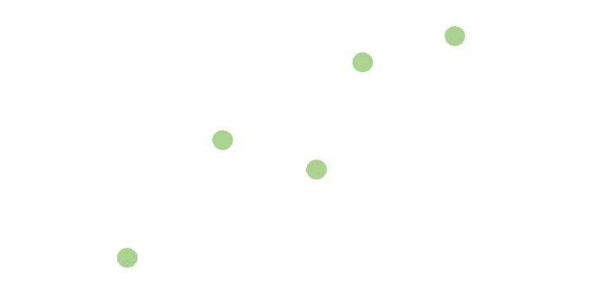
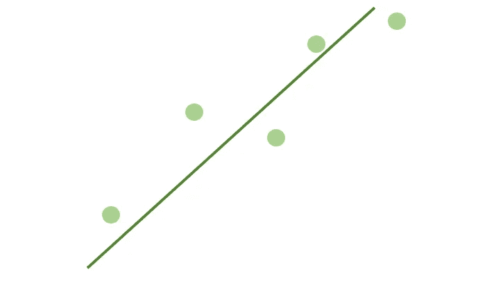
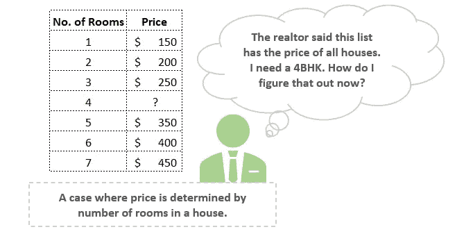
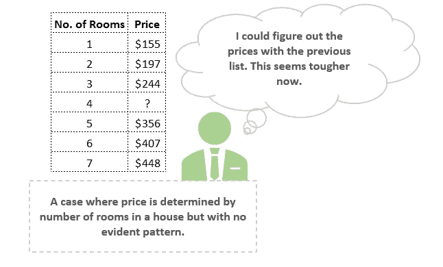
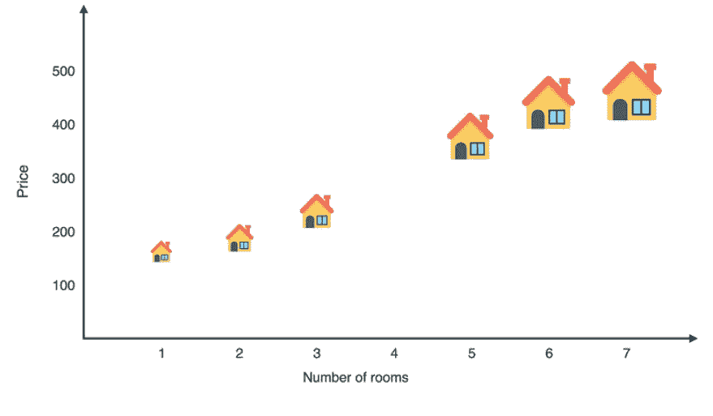
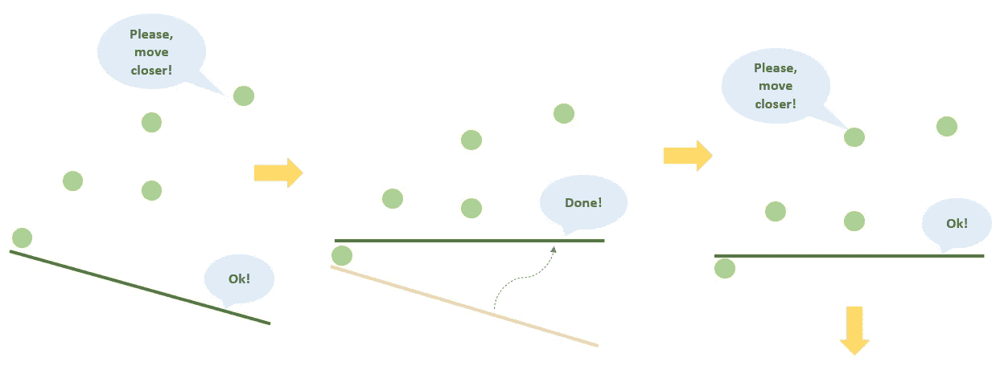
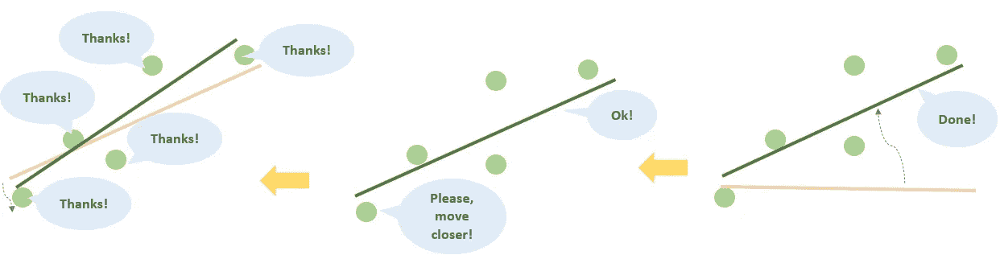
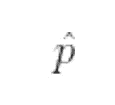

# # 01TheNotSoToughML | "拟合直线"-我们到底是什么意思？

> 原文：<https://medium.com/analytics-vidhya/thenotsotoughml-fit-a-line-what-do-we-even-mean-f05f55f3c1ee?source=collection_archive---------10----------------------->

> “记住→公式化→预测”——路易斯·塞拉诺

# #(标签)是怎么回事？

对于那些看到我的第一篇 [#GeekyStories](/analytics-vidhya/geekystories-1-0-approaching-almost-any-machine-learning-problem-aaamlp-abhishek-thakur-897609f4fe7d) 文章的人来说，他们知道我已经开始为我目前正在探索的各种 ML/DL 书籍写评论了。

同样，因为我喜欢组织我的想法和我一直做的工作，所以这篇文章呼吁开始另一个#(hashtag)系列——**，在那里我通过解释算法/概念背后的直觉，而不是直接给出数学，来消除人们可能对算法/概念的一些差距。**

# 拟合直线。你说什么

当我们开始任何 ML 课程时，我们遇到的第一件事是“画一条接近点的线”。你会经常看到术语“线性回归”与这种描述联系在一起。

**免责声明:虽然这是真的，但这篇文章将更多地帮助你理解线性回归背后的直觉，我们将使用的方程很少(相信我，只有很少很简单的方程)。**

也就是说，我们要做的是自己建立这些方程！

## 那么，我们想做什么？

首先，让我们先确定我们要在哪里拟合一条线。

看以下几点。

这些看起来像是“大致”呈线状吗？

现在，如果我必须画一条穿过这些点的线，我能想到的最好的是这个:

假设，你的头脑也让你想象出和我一样的线，你和我在上面画的，正是线性回归的目标。

因此，我们的目标(或者说是计算机的目标)是画出这条线。

# 这很简单。为什么我们需要一个算法呢？

让我们把这些点想象成城镇中的房屋。

我们想在尽可能靠近每栋房子的地方修建一条道路，这样居民就更容易到达。听起来像一个用例，是吧？

但是当想到我们在上面尝试过的房子和事物时，会有很多问题出现-

1.  *我们是想要一条靠近“所有”房屋的道路，还是要建造一条靠近一些房屋但远离另一些房屋的道路？*
2.  *我们所说的“大致呈线状的点”是什么意思？*
3.  *我们所说的“尽可能靠近每个点(或房子)的一条线(这里是道路)是什么意思？*
4.  我们如何找到这样一条线？
5.  为什么我们要找这样一条线？

在本文中，我们将尝试回答前 3 个问题。现在还不要感到迷茫——对于接下来的两个问题，很快会有一篇单独的文章。

让我们看另一个例子。

比方说，我们想算出镇上房子的价格，这样我们就可以估计出要得到我们梦想中的房子要花多少钱。我们知道有很多因素会影响价格——位置、离市场的距离、房子的大小、房间的数量等等。在一个 ML 世界中，这些被称为**“特征”。**就像*一件乐器、一架钢琴或一架望远镜的特征*一样，描述这件乐器是什么，描述一个模型的特征，什么组成了**“模型”。**一个*模型*是一个从特征中预测**【标签】**的规则或公式。*标签*是我们构建模型的原因、描述的特征以及我们想要**“预测”**的目标。我们预测的或者说*预测*本身就是模型的输出。

*我们能在这一点上找到一个方程吗？一个能告诉我们是否意识到某个特征对我们的标签——价格——有“多大程度和多强”的影响的模型？*

那么让我们浏览一下下面的表格。

一个只有房间数量影响房价的例子。

在上面的例子中，我们认为只有“房间数量”会影响房价。

你能想出一个介于两者之间的合适的价格吗？

你可能会回答——300 美元。你当然是对的。

如果你的猜测也是 300 美元，你在脑子里做了以下等式:

价格= 100 + 50 *(房间数量)

我们所做的是——我们创造了一个模型。这个**模型**根据一个单一的**特征**(房间数量)给出了房价的**预测**。房子的价格是房子里房间数量的几倍(在这种情况下是“50”)，我们称之为**“重量”**，而一所房子的基本价格完全不受该特征的影响，可以认为是 100，我们称之为**“偏差”**。

我们是如何想出这个公式的？

你的大脑注意到了其他的价格，确定了房间数和各自价格之间的模式，建立了一个公式，最后给出了价格。**你脑子里做的是线性回归！**

在这个阶段，让我们在阅读时记住这 3 个步骤——

1.  **记住**当前分、
2.  **公式化**一个等式然后，
3.  **预测**遗漏点。

但是，如果得到答案不是那么简单呢？

*如果模式更复杂，如下图所示，会怎么样？*

这似乎不像旧数据集那样遵循简单的模式。在这个阶段，让我们试着把它形象化。

实际上这也不是很难？

但是，我们如何让计算机想出这条线呢？

# 让电脑帮你找到那条线。

在 ML 中，大多数事情都遵循一个简单的方法— **“一步一步”或者“一点一点”。**

我们将遵循的步骤与我们上面设计的类似。

1.  首先让计算机随机选择一条线。
2.  **记忆** —让计算机记忆一个随机的数据点。
3.  **公式化**——让计算机将直线移近该点。
4.  多次重复步骤 2-3。
5.  **预测** —让计算机返回我们得到的线。

容易吗？

现在为了更深入地理解这一点，是时候引入一些数学知识了(简单的数学——别担心！).

p:数据集中的房价

r:房间的数量

m:每个房间的价格

房子的基本价格

我们还将使用另一个变量:

这是给出预测价格的变量，换句话说就是模型的预测。

因此，这个等式现在看起来是这样的

p^=先生+ b

如果我们描述这个，它说-

预测价格=(每间房价格)*(房间数量)+房屋基价

## 是的，这是有道理的。那么，这是我们希望计算机为我们算出的线吗？

答对了。

每当有人说，“拟合一条线”，甚至只是技术术语——拟合一个线性回归算法，这就是他们在谈论的。

为了进一步重申直觉，让我们考虑另一个例子。

假设我们有一个模型，其中每个房间的价格是 40 美元，房屋的基础价格是 50 美元。该模型通过以下等式预测价格-

p^ = 40*r + 50。

现在说，在我们的数据集中，我们有一栋两居室的房子，价格是 150 美元。这个模型预测房子的价格是 40 * 2+50 = 130 美元。这似乎离实际价格并不太远，但仍低于真实数字。

*或许，这里出问题的是，模型认为房子太便宜了。*

我们有办法改进这一预测吗？

*该模型的基价是否非常低，或者每间客房的估价是否更低，或者两者兼而有之？*

让我们试着玩一下数字游戏。

如果我们把每个房间的价格提高 0.5 美元，把基础价格提高 1 美元，会怎么样？

新的方程式是-

p^ = 40.5*r + 51

两室房屋的新预测价格将是 40.5 * 2+51 = 132 美元。

这比早先预测的 150 美元的实际价格要好或者更接近。对于这个特定的数据点，我们的模型似乎可以更好地预测这些权重和偏差(请注意，我们还不知道这对其他数据点的表现如何，但我们将在下一篇文章中讨论这一点)。

最重要的一点是线性回归要不断重复上述过程多次。

综上所述，线性回归的目标是—

1.  选择一个随机权重和随机偏差的模型(线)。
2.  选择一个随机数据点。
3.  稍微调整权重和偏差，以改善该特定数据点的预测。
4.  重复步骤 2-3 多次。
5.  返回获得的最终型号/系列。

注意，我们仍然遵循“记住-制定-预测”的步骤——我们只是进一步分解了“制定”步骤，仅此而已！

在这一点上，有许多问题浮现在我的脑海中(希望你也是)，但我们现在只关注一个问题。

***问题:***

***我们如何调整线性回归模型中的权重和偏差？***

我们将在下一篇文章中回答这个问题。

这只是让您开始了解我们想要实现的目标。一旦你清楚了这一点，我们将一起尝试通过几个简单的技巧来找出我们如何获得我们想要的数据的线/拟合(我们将进入更多的数学领域，但仍然会很有趣，我保证)。

当然，这只是一个变量。虽然，试图理解这种算法背后的直觉可以使用一个单一的特征本身来完成，但同时考虑现实生活中的情况总是有帮助的。实际上，房子的价格会受到上述文章中提到的多种因素的影响。这叫做**多元线性回归。**

当我们有许多特征时——我们将每个特征乘以它们相应的权重，然后将它们加到预测价格上，就像这样——

价格= 30*(房间数)+ 1.5*(面积)+ 10*(周围学校质量)- 2*(房龄)+ 50

你会注意到，除了“房子的年龄”，所有的功能都有一个积极的权重。因为后者与房价正相关。换句话说，房子(面积)越大，收取的价格就越高。另一方面，由于我们预期旧房子的价格会更便宜，所以年龄特征与**负相关**，因此具有负权重。

权重的“符号”表示特征与标签(或我们的目标变量——价格)的“关联程度”,而权重的“值”表示特征驱动目标变量的“强度”或程度。因此，如果一个特征的权重为“零”，这意味着它与目标没有关系。例如，居住在一个城镇的邻居的名字。同样，如果一个特性与其他特性相比具有较高的权重(例如，在上述模型中，房间数具有最高的权重)，这意味着该特性在确定房屋价格时非常重要。

虽然这种模型的可视化变得更加困难——因为在单个特征的情况下，模型不再仅仅是一条“线”,但是您仍然可以将模型视为一个线性方程。

在下一篇文章中，我们也将继续使用单个特性，但是在理解这种关系的粒度很重要的地方，我们将深入研究多个特性。

这篇文章(以及更多后续文章)的灵感来自于我正在阅读的新书——*T2·路易斯·塞拉诺*的《探索机器学习》。这本书还没有发行，但是我提前买了一本，我认为这是一个明智的选择。相信我，他们的书/材料绝对值得任何想要了解算法和模型如何工作背后的真实想法的人阅读。

我将在六月底写这本书的评论，但是如果你已经对这本书感兴趣，你可以在这里浏览它的内容。

如果你想在 LinkedIn 上与我联系，请随时给我发短信或请求[这里](http://www.linkedin.com/in/anaa-vs)。

当然，你也可以在这里留下你的评论！我也很乐意回答任何问题。

直到下一次，继续唱，唱，唱。最重要的是，不断学习:)