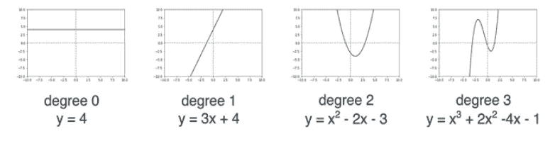
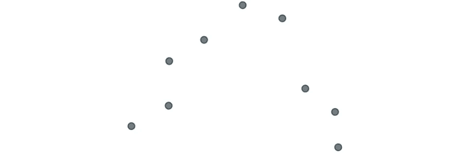
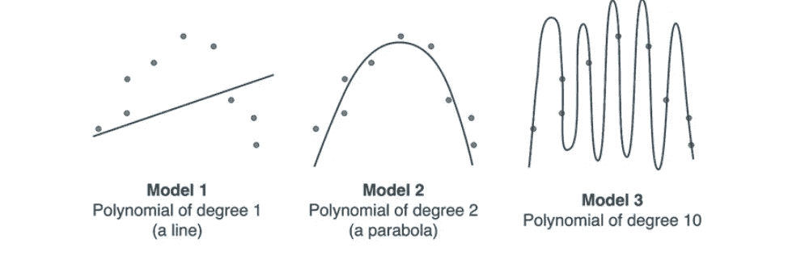
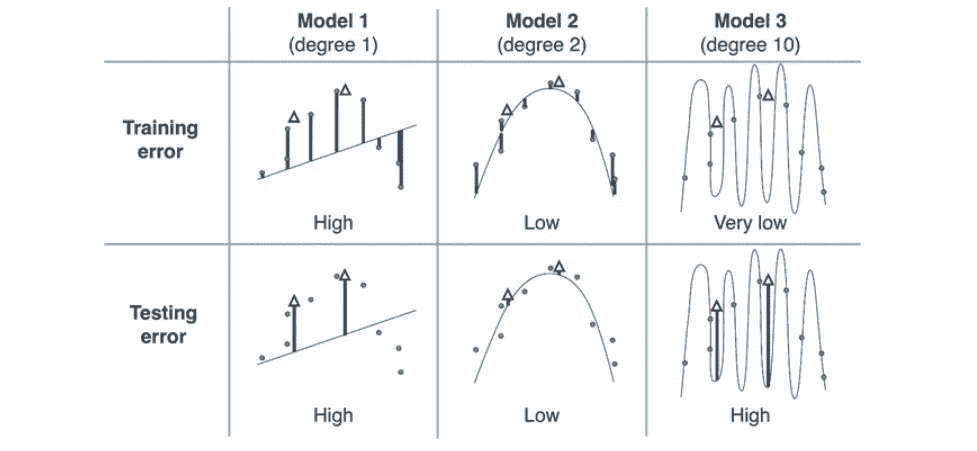
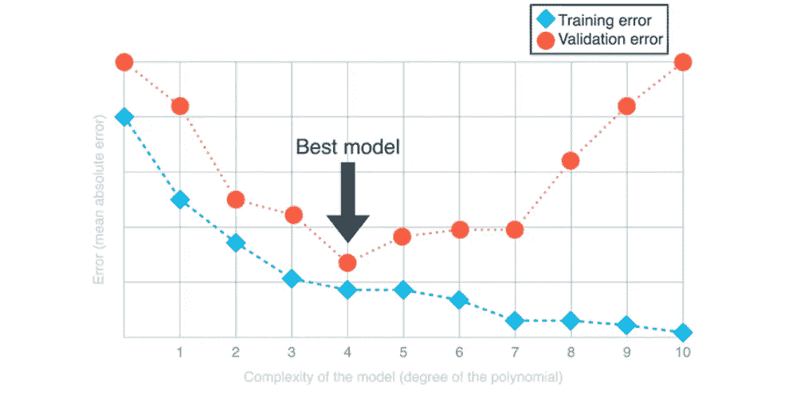

# #04TheNotSoToughML |“让我们，把误差降到最低”——但是，这样就够了吗？

> 原文：<https://medium.com/analytics-vidhya/thenotsotoughml-go-minimize-the-error-but-is-that-enough-24b437e95079?source=collection_archive---------21----------------------->

> 闪光的不一定都是金子—威廉·莎士比亚

# #(标签)是怎么回事？

*不久前，我开始了一个新系列，致力于它所说的——一个系列，* ***，在那里我通过解释算法/概念背后的直觉，而不是直接给出数学，来消除人们可能对算法/概念的一些差距。*** *这只是一种尝试，让你意识到* ***ML 并不难缠。更多的是直觉——通过算法证明。***

如果您想阅读本系列的其他文章，请参考从#TheNotSoToughML 开始的文章。

在[上一篇文章](/nerd-for-tech/thenotsotoughml-regression-errors-descending-from-a-mountain-top-39c748137a3)中，我们谈到了误差函数、梯度下降以及这两个概念之间的关系。

现在，我们将扩展概念来建立问题-

**问:我们如何知道我们的模型有效？**

为此，我们需要理解 ML 中两个非常重要的概念:

*欠拟合和过拟合。*

当我们处理 ML 模型时，这些概念开始发挥作用，突然我们意识到当我们建立模型时——结果似乎是有意义的，但当我们将它投入生产时——随着时间的推移，它已经证明结果是非常错误的，模型在预测方面做得不好。

当然，导致这种“错误”结果的因素数不胜数，但在这种情况下，两个非常常见的重要复杂因素是:欠拟合和过拟合。

在本系列的当前文章中，我们将详细探讨这两种复杂性，并找到解决方法。虽然有许多可用的技术，但我们将主要探讨以下技术:

1.  模型的测试和验证
2.  使用模型复杂度图
3.  正规化(下一篇文章)。

但是首先，

# 适配不足与适配过度——它们是什么？

虽然这些可以有多种解释，但我喜欢把它们看作是一个过度简化和过度复杂之间的问题。

怎么会？

好吧，让我们举个例子。

过于简单化的情况。

比方说，你手头有一个任务是对抗哥斯拉。如果你只带着苍蝇拍去战场会怎样？这是一个*过度简化的例子。*

这种方法不会对我们有利，因为我们低估了问题，而且毫无准备。这是**欠拟合** : *当我们的数据集很复杂，而我们只配备了一个非常简单的模型来建模它。该模型将无法捕捉数据集的复杂性。*

接下来，让我们看另一个例子。

过于复杂的情况。

相比之下，如果我们的任务是杀死一只小苍蝇，而我们得到了一个火箭筒来完成这项工作，这就是一个*过度复杂化*的例子。是的，我们可能会杀死苍蝇，但我们也会毁掉手边的一切，让自己处于危险之中。我们高估了这个问题，我们的解决方案也不好。这是**过度拟合**:当我们的数据很简单，但我们试图用一个太复杂的模型来拟合它。模型将能够适应我们的数据，但它实际上会记住它，而不是学习它。

是的，过度拟合似乎不像欠拟合那样是一个严重的问题，但当我们遇到*看不见的数据时，我们在模型过度拟合时遇到的最重要的障碍。最有可能的是，这些预测将是可怕的！我们将在当前的文章中对此有所了解。*

每个机器学习模型都有[超参数](https://machinelearningmastery.com/difference-between-a-parameter-and-a-hyperparameter/)，这些超参数是我们在训练模型之前拧转的旋钮。为我们的模型设置正确的超参数是非常重要的。如果我们把其中一些设置错了，我们就容易欠适应或过适应。

现在来看一些数据。

## 使用多项式回归的例子理解欠拟合-过拟合

在之前的所有文章中，我们已经学习了如何找到最适合我们数据的直线，假设我们的数据非常像一条直线。但是如果我们的数据不像一条线会怎么样呢？在这种情况下，有用的是线性回归的强大扩展，称为*多项式回归*，它帮助我们处理数据更复杂的情况。

图片鸣谢:探索机器学习

到目前为止，我们一直在讨论的线性回归模型，都是 1 次多项式方程。

我们定义多项式的*次*为多项式表达式中最高次幂的指数。例如，多项式 y = 2 x3+8 x2–40 的次数为 3，因为 3 是变量 x 的最高幂。请注意，在上面的示例中，多项式的阶数为 0、1、2 和 3。0 次多项式永远是常数，1 次多项式是线性方程。

多项式的图形看起来很像一条振荡了几次的曲线。它振荡的次数与多项式的次数有关。如果一个多项式的次数为 d，那么这个多项式的图就是一条最多振荡 d-1 次的曲线(对于 d>1)。

由于多项式回归的这一特性，它是了解欠拟合/过拟合如何影响模型从数据中学习并最终影响我们预测的最佳算法。我们将通过调整多项式回归中最关键的参数来做到这一点——它是*次*。

假设我们的数据看起来像这样—

作为人类，我们很容易通过上面的视觉发现，这看起来像抛物线(有点类似于悲伤的脸)。然而，对于计算机来说，识别这条抛物线并不容易。

假设计算机尝试用不同的多项式次数来拟合这些数据，如下所示

请注意，**模型 1** 过于简单，因为它是一条试图拟合二次数据集的线。我们不可能找到一条好的线来拟合这个数据集，因为数据集看起来根本不像一条线。因此，*模式 1 就是一个明显的不适应的例子。*

相比之下，模型 2 与数据吻合得很好。这种型号既不过肥也不欠肥。

**模型 3** 对数据的拟合度极高，但完全没有说到点子上。数据应该看起来像一个有点噪音的抛物线，模型绘制了一个非常复杂的 10 次多项式，它设法通过每个点，但它没有捕捉到数据的本质。*模型 3 是过度拟合的明显例子。*

现在想想一种情况——

从我们的[上一篇文章](/nerd-for-tech/thenotsotoughml-regression-errors-descending-from-a-mountain-top-39c748137a3)中，我们知道，为了让计算机知道哪个模型是最好的，它只需要选择误差*最小的那个*。但是如果是这种情况，那么*****计算机将选择模型 3，因为这些点最接近模型 3 中的曲线(它们在曲线本身上！).但是我们知道三种型号中最好的型号是型号 2！*****

***我们该怎么办？***

****我们需要告诉计算机，最好的模型是模型 2，模型 3 过拟合。****

# ***解决方案 1:通过测试和验证***

***测试模型包括在数据集中挑选一小组点，并选择不使用它们来训练模型，而是用于测试模型的性能。这组点被称为**测试集。**我们用来训练模型的剩余的一组点(大部分)称为**训练集。**一旦我们在训练集上训练了模型，我们就使用测试集来评估模型。通过这种方式，我们可以确保模型善于归纳未知数据，而不是记忆训练集。***

***现在让我们看看这个方法在我们的数据集和模型中是什么样子的。请注意，模型 3 的真正问题不是它不符合数据，而是它不能很好地推广到新数据。换句话说，如果您在该数据集上训练模型 3，并且出现了一些新点，您会信任模型使用这些新点做出良好的预测吗？可能不会，因为模型仅仅记住了整个数据集，而没有抓住其本质。在这种情况下，数据集的本质是它看起来像一个向下的抛物线。***

***让我们尝试可视化上述模型的训练和测试集。***

## *****我们可以使用这个表格来决定我们的模型有多复杂*****

******

***图片鸣谢:探索机器学习***

***这些列表示 1、2 和 10 度的三个模型。这些列还表示训练和测试误差。***

***实心圆是训练集，白色三角形是测试集。***

***每个点的误差可以看作是从该点到曲线的垂直线。每个模型的误差是由这些垂直长度的平均值给出的平均绝对误差(仅为简单起见)。***

***请注意，*训练误差随着模型复杂性的增加而下降。*然而，*测试误差随着复杂度的增加先下降后回升。*从该表中，*我们得出结论，在这三个模型中，最好的是模型 2，因为它给我们的测试误差较低。****

***因此，**判断一个模型是否欠拟合、过拟合或好的方法是查看训练和测试误差。如果两个误差都很高，那么它就欠拟合。如果两个误差都很低，那么它就是一个好模型。如果训练误差低而测试误差高，那么它就过拟合。*****

***这给我们带来了一条黄金法则，在使用 ML 模型时，我们永远不应该打破这条法则:***

***你永远不要把你的测试数据用于训练***

***当我们将数据分为训练和测试时，我们应该使用训练数据来训练模型，并且在训练模型或对模型的超参数做出决策时，我们绝对不应该接触测试数据。如果做不到这一点，很可能会导致过度拟合，即使人类不会注意到。***

***现在你知道了黄金法则，我告诉你我们已经在本文中打破了它，你能找出在哪里和如何打破它吗？***

***这是另一个数据集出现的地方，即**验证集。*****

## ***验证集***

***回想一下，我们有三个多项式回归模型:一个 1 次，一个 2 次，一个 10 次，我们不知道选择哪一个。我们使用训练数据来训练这三个模型，然后使用测试数据来决定选择哪个模型。我们不应该使用测试数据来训练我们的模型或对模型或其超参数做出任何决定。一旦我们这样做，我们就有可能过度适应！***

***那我们能做什么？解决方案很简单，我们更多地破坏我们的数据集。我们引入了一个新的集合，即*验证集*，它随后被用来对我们的数据集做出决策。总之，我们将数据集分为以下三组:***

*   ***训练集:用于训练我们所有的模型。***
*   ***验证集:用于决定使用哪个模型。***
*   ***测试集:用于检查我们的模型做得有多好。***

***因此，在我们的示例中，我们将有两个以上的点用作验证，查看验证错误应该有助于我们决定使用的最佳模型是模型 2。测试集应该只在最后使用，来看看我们的模型有多好。如果模型不好，我建议我们抛开一切，从头开始。***

***这些集合的大小取决于许多因素，取决于数据集本身的大小，但理想情况下，最常见的分割通常是 60–20–20 分割或 80–10–10 分割。换句话说，60%的训练，20%的验证，20%的测试，或者 80%的训练，10%的验证，10%的测试。这些数字是任意的，但它们往往工作得很好，因为它们将大部分数据留给了训练，但仍允许我们在足够大的集合中测试模型。***

# ***解决方案 2:通过使用模型复杂性图***

***假设我们有一个不同的、复杂得多的数据集，我们试图构建一个多项式回归模型来拟合这个数据集。我们想在 0 到 10(包括)之间的数中决定我们模型的次数。正如我们在上一节中看到的，决定使用哪个模型的方法是选择具有最小验证误差的模型。***

## ***模型复杂度图是一个非常有效的工具，可以帮助我们确定模型的理想复杂度，从而避免过拟合和欠拟合***

******

***在上图中，横轴代表几个多项式回归模型的次数，从 0 到 10(即模型的复杂程度)。纵轴代表误差，在这种情况下由平均绝对误差给出。***

***请注意，训练误差开始很大，随着我们向右移动而减小。这是因为我们的模型越复杂，它就越适合训练数据。然而，验证误差开始很大，然后减小，然后再次增大。这是因为非常简单的模型不能很好地拟合我们的数据(它们欠拟合)，而非常复杂的模型拟合我们的训练数据，但不拟合我们的验证数据，因为它们过拟合。***

***在中间有一个快乐点，我们的模型既不欠拟合也不过拟合，我们可以使用模型复杂性图找到它。***

***验证误差的最小值出现在 4 阶，这意味着对于这个特定的数据集，最佳拟合模型(在我们考虑的模型中)是 4 阶多项式回归模型。查看图表的左侧，我们可以看到，当多项式的次数非常小时，训练和验证误差都很大，这意味着模型不适合。在图的右边，我们可以看到训练误差变得越来越小，但是验证误差变得越来越大，这意味着模型过拟合。最佳时机发生在 4 点左右，这是我们选择的模型。***

*****模型复杂度图的一个好处是，无论我们的数据集有多大，或者我们尝试了多少不同的模型，它看起来总是像两条曲线，一条总是下降(训练误差)，另一条下降然后回升(验证误差)。**当然，在一个大而复杂的数据集中，这些曲线可能会振荡，这种行为可能更难发现。然而，模型复杂性图表对于数据科学家来说始终是一个有用的工具，他们可以在该图表中找到一个好的位置，并决定他们的模型应该有多复杂，以避免欠拟合和过拟合。***

# ***接下来呢？***

***接下来是**解决方案 3:正规化*****

***这是防止过度拟合的另一个解决方案，也是一个更有效的解决方案，但是*这需要一篇完整的文章来专门讨论，所以我们将在下一篇文章中讨论这个问题。****

***这篇文章(以及更多后续文章)受到了我最近探索的一本书的启发——Luis Serrano 的 *Grokking Machine Learning* 。这本书还没有发行，但是我提前买了一本，我认为这是一个明智的选择。相信我，他们的书/材料绝对值得任何想要了解算法和模型如何工作背后的真实想法的人阅读。***

***我很快会写一篇关于这本书的评论，但是如果你已经热衷于阅读这本书，你可以在这里浏览它的内容。***

***如果您想在 LinkedIn 上与我联系，请在此处[给我发送一条信息或请求](http://www.linkedin.com/in/anaa-vs)。***

***当然，你也可以在这里留下你的评论！我也很乐意回答任何问题。***

***直到下一次，继续唱，唱，唱。最重要的是，不断学习:)***