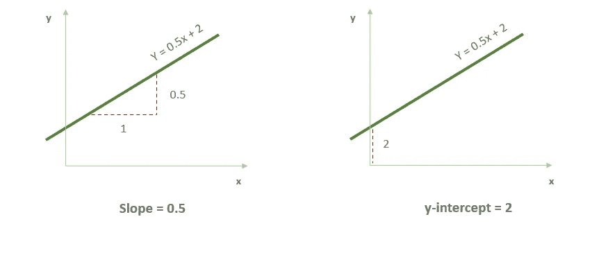
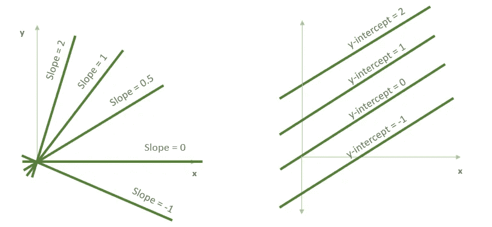
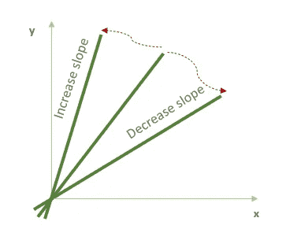
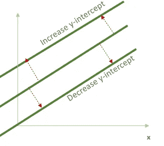
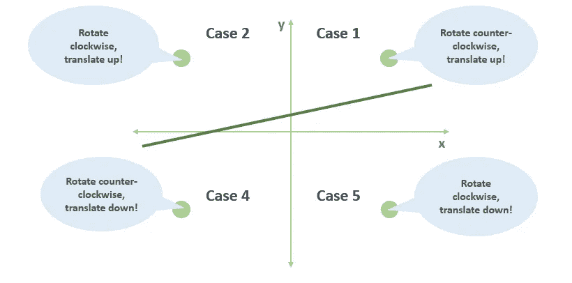
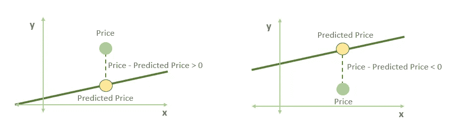
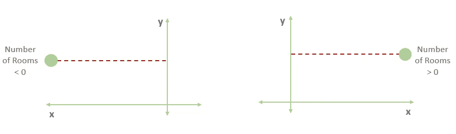
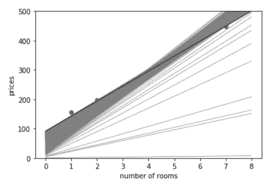

# # 02TheNotSoToughML |适合一条线的技巧

> 原文：<https://medium.com/analytics-vidhya/thenotsotoughml-tricks-to-fit-a-line-af982eeac01a?source=collection_archive---------5----------------------->

> “音乐理论和实践是复杂的课题。但是当我们想到音乐时，我们想到的不是乐谱和音阶，而是歌曲和旋律。然后我就在想，机器学习也是这样吗？真的只是一堆公式和代码，还是背后有旋律？”路易斯·塞拉诺

# #(标签)是怎么回事？

就在不久前，我开始了一个新的系列，致力于它所说的——一个系列，我通过解释算法/概念背后的直觉，而不是直接给出数学，来消除人们可能对算法/概念的一些差距。这只是试图让你明白 **ML 并不强硬。更多的是直觉——通过算法证明。**

在[系列的第一篇](https://anaa-vs.medium.com/thenotsotoughml-fit-a-line-what-do-we-even-mean-f05f55f3c1ee)文章中，我们经历了— *当我们说“拟合一条线”时，换句话说，线性回归是什么意思。它解释了算法背后的直觉，以及我们希望通过将这条线拟合到我们的数据上来实现什么。*

我们离开了我们在第一篇文章中一起编织的故事，对下面的问题:

***问:我们如何调整线性回归模型中的权重和偏差？***

这就是我们将在本文中探讨的内容。

如果你还没有读过第一部，那完全没问题。我相信自由意志，所以继续吧，如果你已经先打开了这一个，读一读，然后如果你想回去的话！

# 这里所说的“招数”会有什么结果？

在上一篇[文章](https://anaa-vs.medium.com/thenotsotoughml-fit-a-line-what-do-we-even-mean-f05f55f3c1ee)中，我们的结论是**“拟合一条线”意味着得到一条尽可能接近我们的数据点的线。**

我们是否希望这条线尽可能靠近每一个点，以及这是否可能，我们稍后会谈到。

我们也明白这样一条线可以这样表达，对于我们的*房价预测问题*:

p^=先生+ b

其中 p^ =预测价格，m:每个房间的价格，r:房间数量，b:房屋的基础价格

我们称每间房价格(m)的倍数为特征房间数(r)的**【权重】**，称房屋的基价为等式中的**【偏差】**。

如果你想回忆这个例子，再看一遍这篇文章，你就会明白了:)

*我们意识到，当我们调整等式中的权重和偏差时，即使是很小的数字，预测结果也更接近实际数据点。*

这就是我们在这篇文章中试图解决的问题

*   有什么技巧可以让我们找到这些权重和偏差吗？
*   **这些技巧将如何帮助算法知道，改变多少权重和偏差，以及在哪个方向？**
*   **如果有多种花样，我们选择哪一种？**

简而言之，*我们将回答这个问题:*

**“我们如何调整权重和偏差？”**

那我们准备好了吗？

# 但是首先，重量和偏差——这些是如何改变界限的？

让我们给我们的“重量”术语取一个新名字——“斜率”(这也是有原因的)。

现在，回想一下上面的等式有两个部分-

1.  倾斜
2.  y 轴截距(或偏差)

当我们使用这两个指标画线时，我们会得到这样的结果:

一条 y = 0.5x + 2 的线看起来像什么的例子。

斜率告诉我们直线有多陡(因此得名“斜率”)，y 轴截距告诉我们直线的位置。前者由上升除以行程给出，后者是直线与 y 轴的交叉点。

## 那么，方程 y = 0.5x + 2 是什么意思呢？

*当我们说斜率为 0.5 时，这意味着当我们沿着这条线行走时，我们向右移动的每一个单位，都是向上移动 0.5 个单位。*如果我们完全不向上移动，斜率可以为零，如果我们向下移动，斜率可以为负。

如果我们画一条与上图中的线平行的线，这条线每向右移动一个单位也会上升 0.5 个单位。

这就是 y 截距的用武之地。y 轴截距告诉我们直线与 y 轴相交的位置。这条线在高度 2 处与 x 轴相交，这就是 y 轴截距。

换句话说，直线的斜率告诉我们直线指向的**方向**，y 轴截距告诉我们直线的**位置**。

当我们分别改变斜率和偏差时会发生什么。

简单吗？

现在让我们记住我们的房价预测问题，上面的变化分别是斜率(我们每间房的价格)和基价(房屋的基价)的变化。

如果我们在上面的图中再添加一些细节，我们会得到这样的结果-

*   如果我们**增加一条线的斜率**，这条线将**逆时针旋转。**
*   如果我们**减小直线的斜率**，直线将**顺时针旋转。**

这些旋转是在线和 y 轴的交点上。

*   如果我们**增加一条线的 y 轴截距**，这条线将**向上平移**。
*   如果我们**减小一条线的 y 轴截距**，这条线将**向下平移**。

现在我们已经清楚了所有的要素——斜率、y 轴截距和直线方程，是时候玩些小把戏了？是啊！

终于！

# 移动一条线靠近一组点的简单技巧，一次一个点

这很简单，通过下图可以更好地理解:

我们希望算法如何响应单个点的不同情况

记住，从我们的房价预测方程来看，y 是我们的房价，x 是房间数。因此，每个数据点将是某个坐标(r，p)。

如果我们必须为这个简单的魔术写一个伪代码-

我们有，

输入:

*   斜率为 m，y 轴截距为 b，方程为 p̂=mr+b.的直线
*   坐标为(r，p)的点。

输出:

*   一条带有方程 p̂=m'r+b 的线，它更接近这个点(这里“m”上面的符号是一个“散列”)。

我们如何实现这个简单的技巧？

挑选两个非常小的随机数，称它们为η1 和η2 ('eta ')。

情况 1:如果点在线的上方，y 轴的右侧，我们逆时针旋转线并向上平移。

*   将η1 加到斜率 m 上，得到 m'+η1
*   将η2 加到 y 轴截距 b 上，得到 b'+η2

情况 2:如果点在线的上方，y 轴的左侧，我们顺时针旋转线并向上平移。

*   将η1 减去斜率 m，得到 m'-η1
*   将η2 加到 y 轴截距 b 上，得到 b'+η2

情况 3:如果点在线的下面，y 轴的右边，我们顺时针旋转线并向下平移。

*   将η1 减去斜率 m，得到 m'-η1
*   将η2 减去 y 轴截距 b，得到 b'-η2

情况 4:如果点在线的下方，y 轴的左侧，我们逆时针旋转线，并将其向下平移。

*   将η1 加到斜率 m 上，得到 m'+η1
*   将η2 减去 y 轴截距 b，得到 b'-η2

返回:带有 p̂=m'r+b'.方程的直线

所以，

*   *如果模型给我们的房价比实际价格低太多，* ***在每间房的价格和房子的基价上加*** *一个小的随机数字。*
*   *如果模型给我们的房价高于实际价格，* ***从每间房的价格和房屋的基价中减去*** *一个小的随机数字。*

但是，这个技巧也有问题。比如？

*   我们能为η1 和η2 选择更好的值吗？
*   我们能不能把 4 个案子压缩成 2 个，或者 1 个？

这就是我们下一个技巧派上用场的地方！

# 将我们的线移近其中一个点的方块技巧

正方形技巧将通过找到具有正确符号(+或-)的值来添加到斜率和 y 截距，从而使直线始终向该点移动，从而将这四种情况合并为一种情况。

在这个简单的技巧中，请注意:

*   当点在线上时，我们在 y 轴截距上增加一点。当它低于这条线时，我们减去一点点。
*   如果一个点在线上，p-p̂值(价格和预测价格之间的差异)为正。如果低于该线，则该值为负。

将这两点合二为一，我们得出结论，如果我们将 p-p̂差加到 y 轴截距上，则直线将始终向该点移动，因为当该点在线上时，该值为正，当该点在线下时，该值为负。

但是在 ML 中，当我们做出调整时，我们总是小心翼翼，小步前进。在这里，我们将引入另一个术语——学习率。

**学习率**

我们在训练模型前挑选的一个很小的数字。这个数字将帮助我们通过训练确保我们的模型变化非常小。

学习率将由η表示，即希腊字母 *eta* 。

既然学习率很小，那么η(p-p̂).值也很小这是我们添加到 y 轴截距的值，目的是将直线向点的方向移动。

向斜坡走来。它类似于我们对 y 截距所做的，只是稍微复杂一点。

*   在这个简单的技巧中，当点在例 1 或例 4 中时(在线的上方和垂直轴的右侧，或者在线的下方和垂直轴的左侧)，我们逆时针旋转线。否则(情况 2 或 3)，我们顺时针旋转它。
*   如果一个点(r，p)在纵轴的右边，那么 r 为正。如果点在垂直轴的左边，那么 r 是负的。注意，在这个例子中，r 永远不会是负的，因为它是房间的数量。然而，在一般的例子中，特征可以是负的。

考虑价值 r(p-p̂).当 r 和 p-p̂都为正或都为负时，该值为正。这正是场景 1 和场景 4 中的情况。类似地，r(p-p̂)在情况 2 和 3 中是负的。

因为我们希望这个值很小，所以我们再次将它乘以学习率，并得出结论，将ηr(p-p̂添加到斜率将总是沿着点的方向移动直线。

如果我们必须为方块魔术写一个伪代码-

输入:

*   斜率为 m，y 轴截距为 b，方程为 p̂=mr + b 的直线
*   坐标为(r，p)的点。
*   小正值 n(学习率)。

输出:

*   方程为 p̂ = m'r + b '的直线。这才是重点。

**我们如何实现方块戏法？**

*   将η(p-(p))̂加到 y 轴截距 b 上，得到 b' = b+η(p-(p))̂(这是直线的平移)。
*   将ηr(p-(p))̂加到斜率 m 上，得到 m' = m+ηr(p-(p))̂((这样旋转直线)。

返回:方程为 p 的直线̂ = m'r + b '

# 最后一个技巧——绝对技巧，另一个有用的技巧是将线移近点

方块戏法非常有效，但还有另一个有用的戏法——绝对戏法*，介于简单戏法和方块戏法之间。*

*在平方技巧中，我们使用了两个量 p-p̂(价格——预测价格)和 r(房间数量)来帮助我们将四种情况减少到一种。*

*在绝对值中，我们只使用 r 来帮助我们将四种情况减少到两种。*

*简言之，*

*如果该点在线上(即，如果 p>p̂)).*

*   *将η加到 y 轴截距 b 上，得到 b' = b+η(这将直线向上平移)。*
*   *将ηr 与斜率 m 相加，得出 m' = m+ηr(如果点在 y 轴的右侧，则逆时针旋转直线，如果点在 y 轴的左侧，则顺时针旋转直线)。*

*如果点在线的下面(即，如果 p < p̂).*

*   *Subtract η to the y-intercept b. Obtain b’ = b-η (this translates the line down).*
*   *Subtract ηr to the slope m. Obtain m’ = m-ηr (this rotates the line clockwise if the point is to the right of the y-axis, and counterclockwise if it is to the left of the y-axis).*

# *What do we do next?*

**我们运行平方/绝对技巧(简单的技巧只是为了说明)多次，使线更接近点，简单！**

*每当我们使用“多次运行”这个表达时，我们实际上是指在一个循环中运行某个东西，在 ML 中——循环中的每次迭代被称为一个“**时期**”。*

*“时期”的这个数字是在模型运行的开始或之前设置的。*

*因此，我们的线性回归模型现在将以这种方式运行:*

*   *从斜率和 y 轴截距的随机值开始*
*   *重复多次(历元):*

1.  *选择一个随机数据点*
2.  *使用绝对值或平方技巧更新斜率和 y 轴截距。*

*这将给你你的线性回归算法！*

# *在数据集上做一些测试怎么样？*

*嗯，我有一个现成的数据集(来自《T4》一书——参见文章倒数第二节)，我可以测试算法在每个时期后如何移动或转向。*

*我们使用了上面的技巧来公式化和识别直线(我们的线性回归算法)，经过 1000 个纪元后，我们可以看到直线是如何旋转和平移的，正如我们上面所理解的那样。*

**

*我相信你也一定对在数据集上测试它感兴趣，但是我建议你真的把这本书拿到手——它真的很棒！(不，我不会为此得到报酬，相信我。)*

# *为什么我们要在这里结束？*

*嗯，因为我认为这是一个公平的点，让我们消化，吸收，甚至思考我们为下一篇文章留下的问题。*

## *此时我们想到的问题是什么？*

*我希望，你正在思考这样的问题:*

*   *我们应该调整多少权重？*
*   *我们应该重复这个过程多少次？*
*   *我怎么知道这个模型有效呢？*

*为了更好地研究这些问题，我们将更深入地探讨一些概念，比如，**误差、最小化该误差以及非常著名的梯度下降。***

*别走开，我很快会回来的！*

*这篇文章(以及更多后续文章)受到了我正在阅读的新书的启发——Luis Serrano 的 *Grokking Machine Learning* 。这本书还没有发行，但是我提前买了一本，我认为这是一个明智的选择。相信我，他们的书/材料绝对值得任何想要了解算法和模型如何工作背后的真实想法的人阅读。*

*我将在六月底写一篇书评，但是如果你已经对这本书感兴趣，你可以在这里浏览它的内容。*

*如果你想在 LinkedIn 上与我联系，请随时给我发短信或请求[这里](http://www.linkedin.com/in/anaa-vs)。*

*当然，你也可以在这里留下你的评论！我也很乐意回答任何问题。*

*直到下一次，继续唱，唱，唱。最重要的是，不断学习:)*