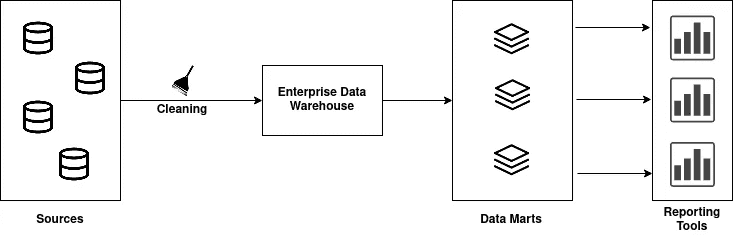
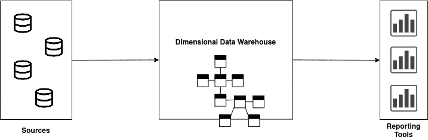

# 金博尔和英蒙关于数据仓库设计的理论

> 原文：<https://medium.com/analytics-vidhya/theories-of-kimball-and-inmon-about-data-warehouse-design-c16260fab5e9?source=collection_archive---------5----------------------->

图片来源:datawarehouseinfo.com

ill Inmon 和 Ralph Kimball 是两位先驱，他们在企业范围的信息收集、信息管理和决策支持分析方面阐述了不同的理念。他们形成了一场关于数据仓库的大辩论。他们用不同的观点、设计技术和实现策略来处理问题。Inmon 建议通过数据仓库创建一个单一的企业，以产生一个全面的商业智能系统。Kimbal 建议创建几个小型数据集市，用于产生部门级的分析和报告。

# 体系结构

比尔·恩门的意见建议从建立一个集中的企业范围的数据仓库开始，通过几个数据库来满足各部门的分析需求，这就是后来的数据集市。因此这种方法被称为自上而下的 T2。

自上而下的方法—按作者分类的图表

比尔·恩门模型的核心是企业数据仓库。从所有组织运营系统集成的数据的中央存储库。这是所有业务数据表示的最终一致性。这意味着所有公司决定哪些数据的命名定义是真实的，它们的冲突值和所有其他数据清理操作在进入数据仓库之前执行。数据以规范化的形式存储，并且不直接创建仓库。相反，数据被送入不同的数据集市，在那里数据被过滤成特定需求的子集。例如，营销部门将拥有仅供营销团队使用的数据。检索数据的应用程序将连接到这些数据集市。

Ralph Kimball 的哲学建议建立几个数据集市，服务于各部门的分析需求，然后通过信息总线虚拟集成这些数据集市以实现一致性，这种方法被称为**自下而上**方法。

自下而上的方法—按作者分类的图表

这个想法是当数据被规范化成一个通常被称为星型模式。这种格式使得查询编写快速简单，并能尽快生成报告。首先，来自特定主题领域或流程的数据被放入一个星型模式中。这是 Kimbal 设计的数据集市。多个数据集市可以通过共享属性连接起来，这就形成了一个多维数据仓库。

这两种体系结构共享相同的共同特征，但是它们都有一个集成的原子数据存储库。当 Inmon 的架构被称为企业数据仓库时，Kimballs 的架构被称为维度数据仓库。在 Inmon 的方法中，数据集市与企业数据仓库在物理上是分离的，它是为部门使用而构建的。然而，在 Kimballs 方法中，没有必要将数据集市从多维数据仓库中分离出来。

# 结构化数据

除了方法上的不同，他们还提出了不同的数据组织方法。Inmon 的方法使用关系(ER)模型，这是企业数据仓库中的 3NF，而 Kimbal 的方法使用多维模型，这是一个星型模式和雪花来组织多维数据仓库中的数据。Inmon 认为，数据处于关系模型中，它将获得企业范围的一致性。这使得在维度模型中生成数据集市变得更加容易。Kimbal 认为，如果数据以维度模型的形式构建，以支持信息总线，那么实际用户可以更容易地理解、分析、聚集和探索数据的不一致性。在金布尔的方法中，数据可以直接从分析系统中获取。在 Inmon 的方法中，分析系统只能通过数据集市访问企业数据仓库中的数据。

# 哪种方法适合你？

这些方法在不同的场景中都有其优点。Inmon 的方法很耗时，但易于维护。Kimball 的方法花费的时间更少，但是很难维护，而且经常是多余的，需要修改。Kimball 支持初始业务支持需求和单个业务数据集成需求，而 Inmon 支持战略性业务支持需求和企业范围的数据集成需求。当你有一个通用的小团队时，金博尔的方法适合你，当团队更大和专业化时可以去英蒙的方法。当你迫切需要第一个低启动成本的数据仓库时，你可以选择 Kimbles 方法。但是如果你有很高的启动成本和更多的时间来满足你的业务需求，你可以使用因曼方法。