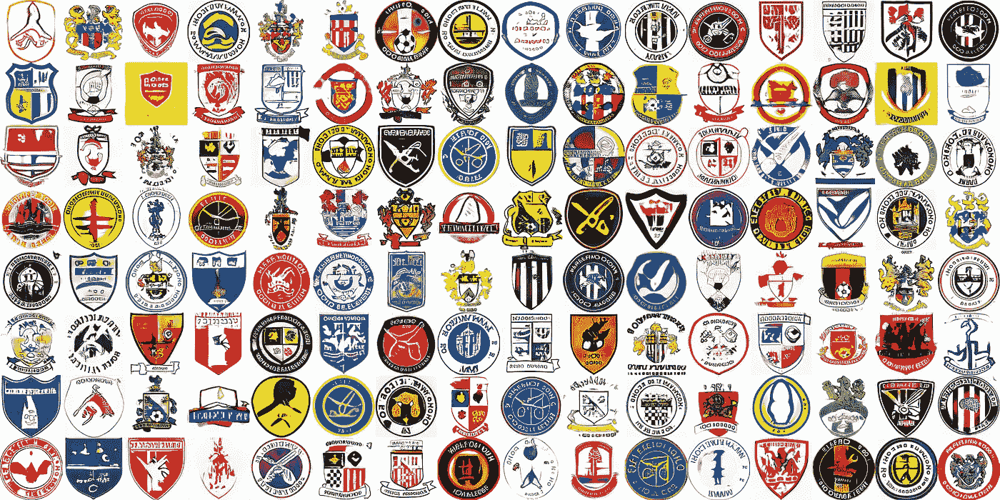
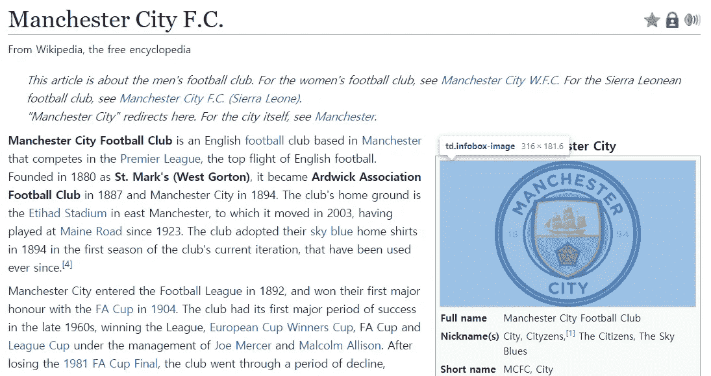
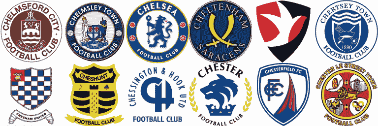
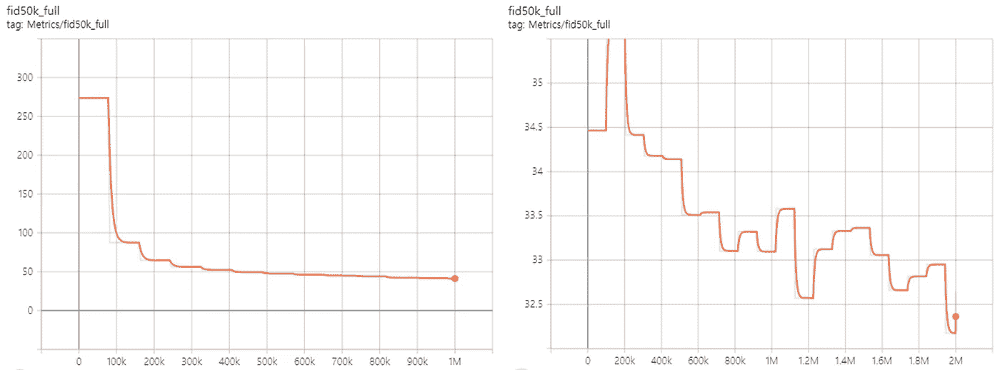
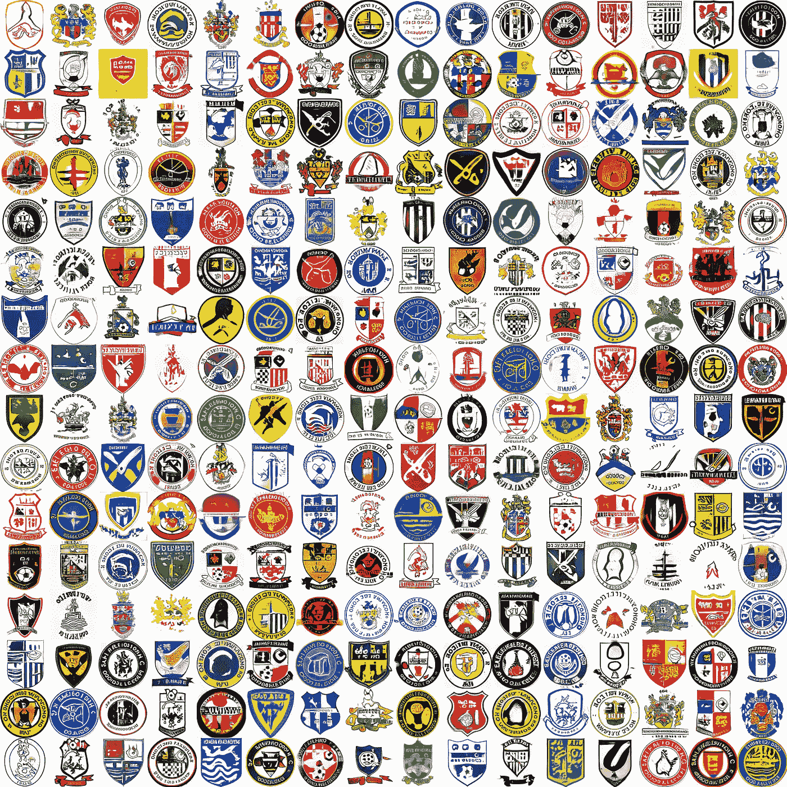
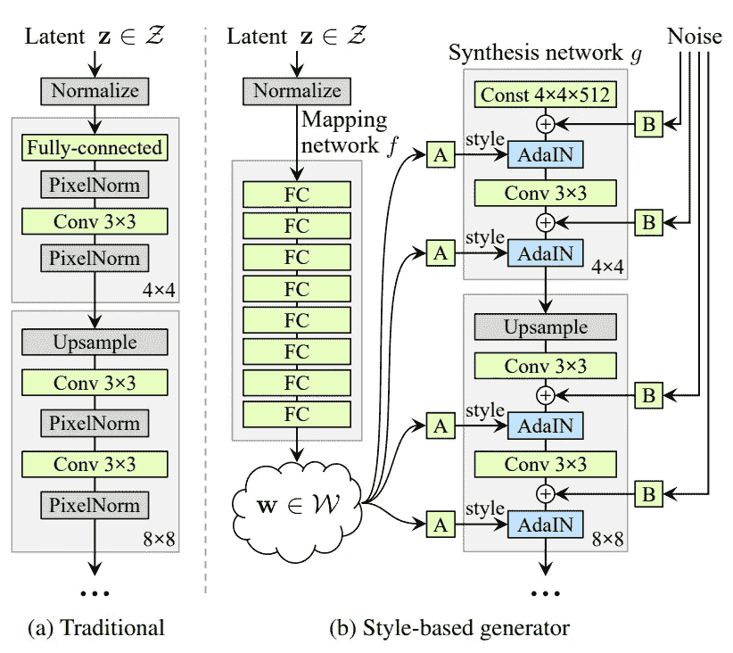
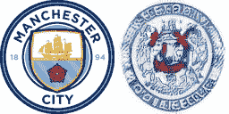
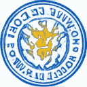
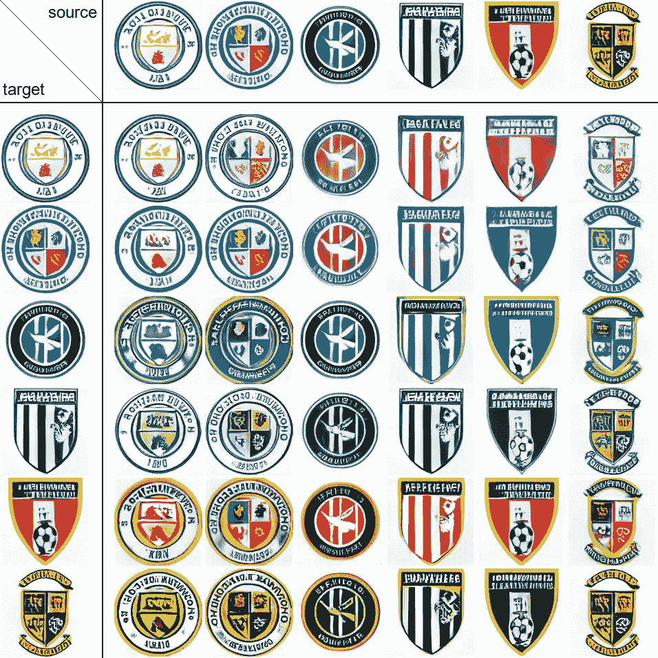

# 这些足球俱乐部并不存在——分享我和 StyleGAN 的经历

> 原文：<https://medium.com/analytics-vidhya/these-football-clubs-dont-exist-sharing-my-experience-with-stylegan-7d02e4b34914?source=collection_archive---------6----------------------->

## 使用约 1K 幅英国足球俱乐部标志图像的训练风格



图片由作者提供。StyleGAN 设计的足球俱乐部标志。

# 这篇文章包括

*   通过网络搜集准备自定义数据集
*   一个简单但实用的使用自定义数据集训练风格的方法
*   如何在 StyleGAN 中获得潜在向量并操纵它们

# 介绍

生成对抗网络(GAN)是一种用于无监督学习的生成模型，自 2014 年由 [Ian Goodfellow](https://arxiv.org/pdf/1406.2661) 首次开发以来，发展迅速。GAN 的主要目标是学习真实世界数据的分布，并合成与原始真实世界数据难以区分的真实“假”数据。

[NVIDIA 在 2018 年开发的一个基于风格的 GANs](https://www.google.com/url?sa=t&rct=j&q=&esrc=s&source=web&cd=&cad=rja&uact=8&ved=2ahUKEwi5r4u2ovDwAhUuzIsBHY75DzwQFjABegQIBBAD&url=https%3A%2F%2Farxiv.org%2Fabs%2F1812.04948&usg=AOvVaw1zXrhtPzBsKVrNqpiKiBgV) (StyleGAN)生成器架构，现在是最知名的 GANs 之一。StyleGAN 不仅能够生成逼真的高分辨率图像，而且在解缠结方面也很强，因此能够进行精细的风格控制。关于原论文的详细解释，请参考本帖:

[](https://towardsdatascience.com/explained-a-style-based-generator-architecture-for-gans-generating-and-tuning-realistic-6cb2be0f431) [## 解释:一个基于风格的 GANs 生成器架构-生成和调整现实…

### NVIDIA 针对生成式对抗网络的新型架构

towardsdatascience.com](https://towardsdatascience.com/explained-a-style-based-generator-architecture-for-gans-generating-and-tuning-realistic-6cb2be0f431) 

由于 StyleGAN 最初是使用人脸数据训练的，因此在其他非人脸图像上微调 StyleGAN 很困难，因为很难建立一个大型的自定义数据集。StyleGAN 有一些更新，在撰写本文时最新的版本是 [StyleGAN2，带有自适应鉴别器增强(ADA)](https://arxiv.org/abs/2006.06676) 。最新版本的意义在于，你可以用相对有限的数据来训练网络，而不会过度拟合。

幸运的是，NVIDIA research 提供了 StyleGAN 所有版本的 Github 库，包括 StyleGAN2-ADA 的 Tensorflow 实现(最新版本是 StyleGAN2-ADA 的 Pytorch 实现):

[](https://github.com/NVlabs/stylegan2-ada) [## NVlabs/stylegan2-ada

### 用有限数据训练生成性对抗网络

github.com](https://github.com/NVlabs/stylegan2-ada) 

因此，我想在足球俱乐部徽标图像上试用 StyleGAN2-ADA，并与那些希望用相对较小的自定义数据集训练 StyleGAN 的人分享我的经验。

让我们从克隆 StyleGAN2-ADA 存储库开始:

```
git clone https://github.com/NVlabs/stylegan2-ada.git
```

这些是我用过的包:

# 来自维基百科的网络抓取

由于我找不到任何公开的数据集，我决定从互联网上收集图片。虽然世界各地都有足球俱乐部，但我还是选择了英格兰的俱乐部，以便更容易地浏览网页。在撰写本文时(2020-2021 赛季)，根据[这个维基百科页面](https://en.wikipedia.org/wiki/List_of_football_clubs_in_England)，有 1056 个俱乐部在英格兰足球联赛系统内竞争。我注意到这些俱乐部的每个维基百科页面都在 HTML 类“infobox-image”下包含一个徽标图像，所以网络抓取并不困难。



摘自[维基百科](https://en.wikipedia.org/wiki/Manchester_City_F.C.)

我使用`requests` + `bs4` (BeautifulSoup)+ `urllib`从维基百科页面中提取俱乐部标志图片的源 URL。我不打算详细介绍代码，因为它是我的数据集特有的。我用于网页抓取的代码如下:

# 正在为 StyleGAN 准备数据集

在删除了来自同一地区的一些带有相同标志的俱乐部和那些在维基百科页面上没有标志图像的俱乐部后，我最终得到了总共 1030 个俱乐部标志。大多数下载的图像是 4 通道的 PNG 文件，它们的宽度和高度从 100 像素到 400 像素不等。

现在，对于 StyleGAN 要使用的输入数据有一些要求。

*   必须有 3 个通道(RGB)
*   必须具有相同的宽度和高度
*   宽度和高度必须是 2 的幂(256，512 等。)
*   宽度和高度至少应为 128(使用预训练模型)

首先，我必须在边界添加白色像素，使图像呈方形，并将透明像素(PNG 的第四通道)转换为白色。

接下来，我选择将图片尺寸调整为 128×128。然而，由于有小于 128 像素的图像，调整这些图像的大小会产生非常差的图像质量。因此，我使用了[剩余密集网络模型](https://arxiv.org/abs/1802.08797)(谢天谢地，一个预先训练的模型是[可用的](https://github.com/idealo/image-super-resolution)！)从调整大小前的小图像中创建 ***超分辨率*** 图像。

数据集现在准备好了！



数据集中的例子。

# 培养

我使用了 NVIDIA 的官方 TensorFlow 实现 StyleGAN2-ADA ,我的超参数配置也是基于这个库中的例子。

在定型之前，请将数据集转换为 TFRecords。

```
python dataset_tool.py create_from_images ./datasets/logo ../YOUR_DIRECTORY
```

我的训练分为两个阶段:

```
#1
python train.py --outdir=./training-runs --gpus=1 --data=./datasets/logo --res=128 --kimg=1000 --mirror=True --gamma=16 --augpipe=bgcfnc --freezed=2 --resume=ffhq256#2
python train.py --outdir=./training-runs --gpus=1 --data=./datasets/logo --res=128 --kimg=2000 --mirror=True --gamma=16 --augpipe=bgcfnc --resume=PATH_LAST_NETWORK_FROM_1
```

1.  从 FFHQ 转移学习培训 256 +冻结
2.  从 1 开始恢复，不冻结

[冻结](https://arxiv.org/abs/2002.10964)是一种利用冻结的鉴别器低层进行微调的技术，它被认为是有效的，尤其是在数据有限的情况下。

该培训是在一个具有 1 Tesla V100 GPU 的 GCP 虚拟机实例上进行的。第一阶段耗时 5.5 小时，第二阶段耗时 11 小时。为了监控训练过程，您可以定期检查 FID 指标或 StyleGAN 创建的样本图像(由`--snap`控制)。



图片由作者提供。FID 度量。左:ffhq 256+冻结，右:从左开始恢复整个图层。



图片由作者提供。我训练过程的最后一个例子。

训练甘可能非常棘手。如果您使用自己的数据集，您应该使用不同的超参数尝试不同的方法。我就是这样做的。请在[官方风格库](https://github.com/NVlabs/stylegan2-ada)或本帖中查看更好的微调建议:

[](https://towardsdatascience.com/stylegan-v2-notes-on-training-and-latent-space-exploration-e51cf96584b3) [## StyleGAN v2:训练和潜在空间探索笔记

### 一个笔记和结果收集的集合，同时训练多种风格和探索学习的潜在模型

towardsdatascience.com](https://towardsdatascience.com/stylegan-v2-notes-on-training-and-latent-space-exploration-e51cf96584b3) 

# 探索潜在空间

现在我们有了一个训练有素的生成高质量图像的 StyleGAN。为了控制生成图像的风格，您需要知道哪个输入(在 GAN 中称为潜在向量或潜在代码)映射到哪个输出。在 GAN 中操纵输出的基本概念是，如果你从点 A 到 B“在潜在空间中行走”，你也将获得从 G(A)到 G(B)的输出的平滑过渡。

与大多数以前的 GANs 不同，StyleGAN 利用了传统潜在向量和输出之间的“中间向量”,众所周知，这有助于 StyleGAN 中出色的特征解缠。你实际上只需要中间的潜在向量来控制风格。



[来源](https://arxiv.org/pdf/1812.04948.pdf)。注意中间的潜在空间 **W** 。

有两种方法可以获得中间潜在向量:

1.  使用随机输入生成图像，检查生成的图像，并选择您想要处理的图像
2.  首先选择要操作的图像，并找到尽可能靠近这些图像的映射到输出的输入

## 如何生成随机图像

像任何其他 GANs 一样，您可以在 StyleGAN 中从潜在空间中的随机向量生成输出。然而，在将随机潜在向量映射到中间向量之后，StyleGAN 并不直接使用中间向量来生成新的图像，而是使用“**截断技巧”**。为了避免在训练数据的分布之外生成过于随机的图像，StyleGAN 只对位于训练数据的平均中间向量周围的特定范围内的中间向量进行采样。确定的范围由原论文和代码中的一个变量 ***truncation_psi ψ*** 决定。鉴于此，您可以生成随机图像，并确保您保留中间向量。

## 如何将图像投射到潜在空间

您可以反其道而行之，先获取图像，然后找到相应的输入，而不是先对随机输入进行采样并检查输出。官方的 StyleGAN 库提供了一个投影仪代码，它通过一个迭代过程来完成这项工作。

```
python projector.py --outdir=out --target=targetimg.png --save_video=False --network=YOUR_NETWORK_PATH
```



图片由作者提供。将图像投影到潜在空间 1000 次迭代的例子。

我选择了第二个选项——将图像投射到潜在空间——因为在许多随机输出中进行选择很麻烦。然而，投影仪的缺点是速度慢，有时不准确。你可以使用一个编码器模型作为替代，但我不会在这篇文章中详细介绍。如果您感兴趣:

 [## 风格编码:一种用于图像到图像翻译的风格编码器

### 我们提出了一个通用的图像到图像的翻译框架，像素 2 样式 2 像素(pSp)。我们的 pSp 框架是基于…

arxiv.org](https://arxiv.org/abs/2008.00951) 

# 插入文字

如果您使用官方 StyleGAN 存储库中的`projector.py`，输出目录将包含一个`dlatents.npz`文件以及目标和投影的图像。`dlatents.npz`是具有投影的中间潜在向量的文件，所以你现在可以用它操纵潜在空间。

一件事是你可以在潜在空间的两个点之间插值，你也可以在图像之间得到平滑的插值。编码相对简单。你只需要在两个潜在向量之间进行线性插值，然后运行生成模型。



图片由作者提供。插值的例子。

# 风格混合

插值很酷，但是中点的两个潜在向量可能不会像你想要的那样与两幅图像的混合版本相关联。这是因为特征是有层次的:从粗糙的(如姿势、形状)到精细的(如配色方案、微观结构)。正如在简介中提到的，StyleGAN 以其在特性解缠方面的优势而闻名。

中间向量变量`dlatents`的一个元素具有`(1,12,512)`的形状，实际上是 12 个相同的 512 大小的中间向量的堆栈。你可以用`all(dlatent[0][i]==dlatent[0][j])`来检查这个，对于 0~11 中的任何一个(I，j)。这种结构与 StyleGAN 的音阶特异性控制能力有关。您可以根据所操纵的层来控制高级到低级的属性。风格混合的代码如下:

上面代码的关键一行是:

```
mix[0][:6] = dlatents[t][0][:6]
```

它混合了两幅图像的风格。您可以根据想要控制的样式级别来更改要切换的图层。

我创建了一个样式混合的交叉表，用六个图像作为源和目标，这样我可以看到控制粗略或精细样式的效果。注意同一行中的混合图像与目标具有相同的颜色组合，同一列中的混合图像与源具有相同的形状。我很惊讶的是，即使使用大约 1K 的训练图像，特定比例的控制风格 GAN 也显示出如此好的效果。



图片由作者提供。注意风格混合:源的形状+目标的颜色。

# 结论

你可以训练 StyleGAN2-ADA，这是目前 NVIDIA 最新版本的 StyleGAN，允许用有限的数据进行微调，具有约 1K 图像的自定义数据集。操纵潜在空间是可能的，并且在定制数据集上训练的 StyleGAN 的结果是令人满意的。