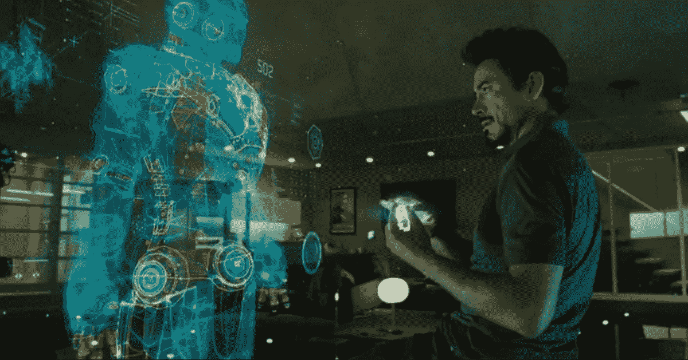
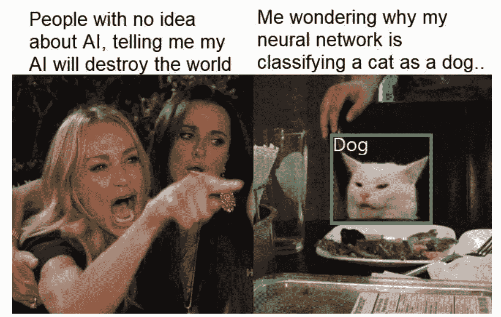
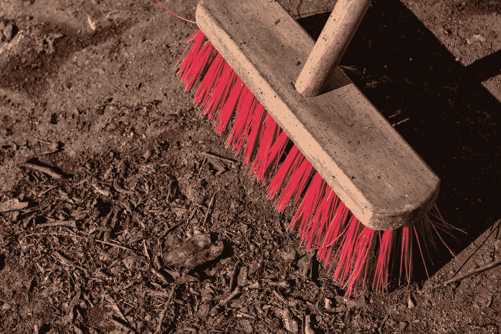
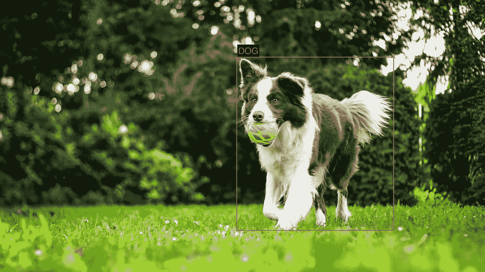

# 关于 AI 的事情你应该知道但没人会告诉你

> 原文：<https://medium.com/analytics-vidhya/things-about-ai-you-should-know-but-no-one-will-tell-you-acc14bba14e3?source=collection_archive---------9----------------------->

托尼·斯塔克(小罗伯特·唐尼饰)在《钢铁侠》和《复仇者联盟》中一直对着他的人工智能系统 J.A.R.V.I.S .说话。

**人工智能(AI)** 大概是当今使用最多、最强的流行语之一。你说你正在构建一个人工智能应用程序，它立即引起了你朋友、家人和投资者的注意。

今天，人工智能被认为是一个**魔盒**。“如果一个问题无法通过任何其他方式解决，或者太难解决，那么使用人工智能就可以解决它。”这是我们今天很多人的误解。

我们对人工智能期望过高，这不完全是我们的错。钢铁侠中的 J.A.R.V.I.S 和终结者中的天网可能影响了我们对 AI 的思考。

在现实世界中，原型和概念验证项目愚弄我们，让我们以为我们正在走向漫威漫画中的生活，但当我们试图规模化生产时，我们却看到了悲剧。

我相信你已经看过这个迷因无数次了。

9gag 上关于神经网络的迷因([来源](https://9gag.com/gag/a0Rv7LQ))

作为一名人工智能工程师，这个迷因在我看来是对的。我第一次偶然发现这个的时候，我忍不住笑了起来，不是因为它很有趣，而是因为它太有共鸣了。*(如果你也有这种感觉，我很乐意分享你的故事。发表评论加入对话)*

但这是为什么呢？为什么我们听到有利于人工智能的巨大承诺，却看不到它的行动？

在这个领域工作了 5 年之后，我认为这可以归结为一个简单的原因:**你使用了错误的数据**。

在学习阶段，人工智能显示输入及其相应输出的例子。通过观察这些例子，它学习它们之间的模式和关系。在学习阶段结束后，它被赋予新的输入，并基于其知识做出预测。

在学术界已经显示出巨大成果的 AI 类型被称为深度学习。我们都知道我们需要大量的数据。

到目前为止，你可能已经猜到**数据**对人工智能的成功有多重要。

在实践中，不知何故，我们倾向于快速获取我们可以得到的任何数据，训练并不断微调人工智能，然后想知道“为什么我的模型不够准确？”。当我们知道**数据**对我们的应用程序的成功如此重要时，我们为什么还要匆匆忙忙地处理它呢？我们把所有的注意力都集中在人工智能上，而不是支持它的东西上——为什么？。

数据工程和魔盒本身一样重要。没有它，就没有魔法。你得到的都是失败的把戏。

先说数据工程。在我们定义了我们希望人工智能做什么之后，数据工程是下一步。它包括定义数据、收集数据、清理数据和标记。这些都是我们训练人工智能之前的必要步骤。

让我们深入研究数据工程的每个步骤。

## **第一步:定义数据**

与任何其他软件一样，我们需要首先定义输入和预期输出。如果你正在寻找建立一个猫与狗的分类器，输入将是一个图像，输出将是一个标签“狗”或“猫”。

一只猫和一只狗的图像(照片由 Krista Mangulsone 在 Unsplash 上拍摄)

这对任何人来说都很直观。你会收集成千上万的猫的图像，并把它们标为“猫”，成千上万的狗的图像，并把它们标为“狗”，然后使用这些数据来训练猫和狗的分类器。

这是今天大多数人工智能工程师在人工智能项目的最初概念验证阶段所做的事情，到目前为止效果很好。

但是当项目超出概念验证阶段时会发生什么呢？

在大多数情况下，人工智能的失败率开始增加。在猫和狗的例子中，它会更频繁地对图像进行错误分类。

为什么？

> **因为人工智能接受训练的图像和它现在看到的图像之间存在巨大差异。**

想象你正在建造一个狗探测器。它将用于不同的应用中；一个在家里的摄像头里，另一个在你的手机里。

您将狗的图像定义为输入数据，将狗的边界框坐标定义为输出数据。然后你收集尽可能多的有狗的图像，给它贴上标签，训练一个狗检测器 AI。

然后在两个应用程序中使用狗检测器。两种应用程序的精度是否相同？

答案是可能，但最有可能的是不会。

与家庭安全摄像头上的人工智能相比，手机上的人工智能可以看到各种不同的图像。人工智能训练的是什么？任何有狗的图片，这就是问题所在。

所以这是我们应该做的。

**退一步，更好地理解应用程序。**

这里要问的第一个问题是这将用于何处？你的回答可能是“我想在我的家庭摄像头上安装这个，这样当它看到我的狗在花园附近时就可以通知我”或者“我想在我的手机上安装这个，这样我就可以给狗拍照，它会告诉我所有的事情。”

在这两种情况下，您都在构建一个狗检测器。我的问题是，在这两种情况下，你将收集的用于训练狗探测器的图像是相同的、有些相似的还是完全不同的？

> 如果你的答案是“这是一个棘手的问题”，那你就对了。

在定义训练数据时，经常忽略的是应用程序的重要细节；会用到哪里，感兴趣的对象有多远，感兴趣的对象有多大，方位，角度等等。

在我看来，首先，您可以使用同一组图像来训练两种情况下的初始狗检测器模型。在这一点上，MobilePhone-DogDetector v1 和 HomeCam-DogDetector v1 是相同的。

但是最终您希望分别收集每种情况下的具体示例，并根据更具体的示例对其进行微调。对于 MobilePhone-DogDetector，您希望收集更多从您和您朋友的智能手机上拍摄的图像示例，这些图像可能是特写图像。对于 HomeCam-DogDetector，您希望收集从家庭安全摄像头拍摄的狗狗图像。

现在，您有 DogDetector v2 和 HomeCam-DogDetector v2，这些都经过了微调，因此它们最适合自己的特定场景。

这一概念被称为 Adaptive Radiation，最初是由人工智能思想领袖 Shivy Yohanandan 博士提出的，他是 Xailient 的联合创始人，xai lient 是一家前沿的计算机视觉人工智能初创公司。

神经科学家、人工智能博士 Shivy Yohanandan 博士帮助建造了第一只仿生眼。经过多年的研究，他弄清楚了人类和动物如何高效准确地看到*背后的机制，现在正在教计算机像我们一样看东西。Shivy Yohanandan 博士说:“对于当前最先进的深度学习架构来说，通用的一个模型来统治所有人的人工智能的想法是一个死胡同。要么我们需要在深度学习方面取得一些革命性的范式转变进展，以实现更好的模型通用性，要么我们需要使用现有的最先进技术(如我们受自然启发的自适应辐射解决方案)找出一种更好的方法。甚至 Gartner 炒作周期也显示，计算机视觉炒作已经暴跌，我强烈认为这是因为人们(特别是在行业和现实世界的应用中)正在接受 YOLOs 和 SSD 等通用计算机视觉模型的真正局限性。”*

**

*Gartner 人工智能炒作周期，2020 年*

*底线是训练数据必须尽可能接近人工智能的使用环境。你可以使用一般数据来开始训练你的人工智能，但最终，如果你想要良好的准确性，你需要用尽可能接近用例环境的例子来微调你的人工智能。*

## *第二步:**收集数据***

*定义要收集的数据类型后，开始手动或以编程方式收集数据。例如，对于 HomeCamera-DogDetector，你可以连续一周没日没夜地录制视频剪辑，然后外包某人来提取其中有狗的帧。在此了解收集数据时需要牢记的更多信息。*

## *第三步:**清洗数据***

**

*清洁刷(Lucas van Oort 在 Unsplash 上拍摄)*

*收集数据后，仔细检查样本以了解数据的质量是非常重要的。图像够清晰吗？还是运动模糊？你能在图像中看到一只狗吗？有好的图像变化吗？例如，对于 HomeCamera-DogDetector，是否有狗的图像总是围绕图像的中心，或者有狗的图像也更靠近边缘？*

*只有当你经历了这些，你才会有一个明确的方向，你是否应该继续进行数据标记和训练，收集更多的数据，或者对数据收集过程本身进行调整。*

*在数据清理过程中，您需要确保您的数据集能够很好地表示它所期望看到的内容，以及它在部署时期望在什么情况下工作。*

## *第四步:**数据标签***

**

*狗狗图片上的标签(Anna Dudkova 在 Unsplash 上的原始照片)*

*标签数据是在训练阶段需要输入到人工智能中的数据。数据标记是指，给定一幅输入图像，你说该图像的预期输出是什么，这样人工智能就可以从中学习。要了解数据标签，请阅读我以前的文章。*

*总而言之，对**相关** **数据**的培训是至关重要的，在成功的人工智能应用中有很大的作用。训练数据必须尽可能接近人工智能期望看到的输入数据(例如，光照、角度、距离、方向等)，以达到每个摄像机训练一个人工智能模型的程度！数据收集、数据清理和标记是数据工程的其他步骤。*

*你最喜欢的数据工程技术是什么？ *在下面留下你的想法作为评论。**

**原载于*[*www.xailient.com/blog*](https://www.xailient.com/post/things-about-ai-you-should-know-but-no-one-will-tell-you)*。**

****关于作者****

**Sabina Pokhrel 在*[*xai lient*](http://www.xailient.com/)*工作，这是一家计算机视觉初创公司，已经建造了世界上最快的边缘优化物体探测器。**