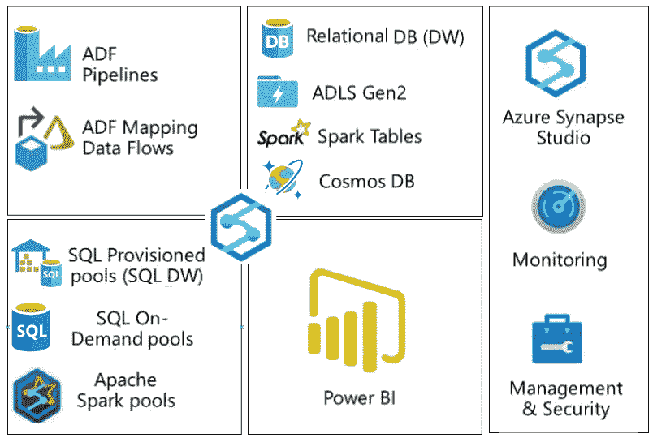

# 迁移到 Azure Synapse Analytics 之前应该考虑的事项

> 原文：<https://medium.com/analytics-vidhya/things-you-should-consider-before-migrating-to-azure-synapse-analytics-245fbf7a3bcc?source=collection_archive---------4----------------------->

Azure Synapse Analytics 已经成为热门话题有一段时间了，许多组织都在考虑将其数据仓库迁移到 Azure Synapse Analytics。因此，让我们看看一些关键的考虑因素，帮助您决定 Azure Synapse 是否适合您的需求

## 您的数据库大小是否接近 1 TB 或更大？

Azure Synapse 非常适合 1 TB 及以上的数据大小和工作负载。根据微软的说法，如果您的数据仓库大小接近 1 TB 或更大，应该考虑 Azure SQL Synapse。

## 您的数据是否越来越庞大，并且需要很长时间来处理？

Azure Synapse 非常适合大数据和 OLAP 工作负载等大规模工作负载。Azure Synapse 将工作负载划分为不同的部分，并并行执行它们，从而加快大型数据加载和复杂查询的执行速度。

## 您是否在为自己的发展寻找一个统一的平台？

Azure Synapse 是一种无限的分析服务，它将数据集成、企业数据仓库和大数据分析结合在一起。它将这些世界与统一的体验结合在一起，通过 Azure Data Factory、映射数据流、SQL pools、Spark pools 和 Power BI 等强大的服务来摄取、探索、准备、管理和提供数据，以满足即时的 BI 和机器学习需求。

借助 Azure Synapse Studio，您可以创建一个端到端的数据分析解决方案，从数据探索→运行实验→开发管道→创建视觉效果→实施解决方案，所有这些都使用一个基于 web 的用户界面。

## 您需要使用 SQL 查询关系和非关系数据吗？

有了 Azure Synapse，现在可以使用 SQL 语言查询关系数据(关系数据库)和非关系数据(Azure 数据湖)。

PolyBase 是一种允许使用 SQL 语言访问数据库外部数据的技术。这在从存储帐户导入数据时非常有用。Azure Synapse 支持 PolyBase 来促进这样的场景。

## 您必须按需扩展并控制成本吗？

Azure Synapse 为我们提供了按需(无服务器)或预配容量(SQL 池)运行大量工作负载的选项。SQL Serverless 选项允许您查询存储在我们的存储帐户或数据湖中的数据，而无需启动任何集群或计算资源。这使组织能够灵活地按需付费，或者拥有一定数量的预配置处理和存储功能

## 你需要一个支持多种脚本语言的服务吗？

Azure Synapse 兼容广泛的脚本语言，如 T-SQL、SQL、Scala、Python 等。Net、Java、R 和 Spark SQL。这使得它适用于广泛的分析任务和数据工程配置文件。

## 经常有人抱怨复杂的查询性能？

Azure Synapse 的资源类可以通过设置并发运行的查询数量和分配给每个查询的计算资源的限制来帮助您配置查询资源。资源类旨在提高数据管理和操作活动的性能。复杂的查询也可以受益于在大型资源类下运行。例如，当资源类大到足以使查询在内存中执行时，大型连接和排序的查询性能可以提高

## 您是否需要在不影响工作负载的情况下分析实时运营数据？

Azure Synapse Link for Azure Cosmos DB 是一种云原生混合事务和分析处理( **HTAP** )功能，使您能够对 Azure Cosmos DB 中的运营数据进行近乎实时的分析。您可以在不影响 Azure Cosmos DB 上的事务性工作负载性能的情况下实现这一点

希望你喜欢读这篇文章，在我的下一篇文章中再见，直到那时保持安全，对人友好。

