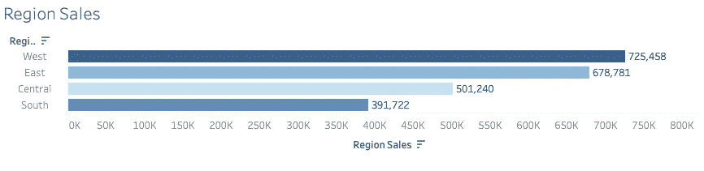
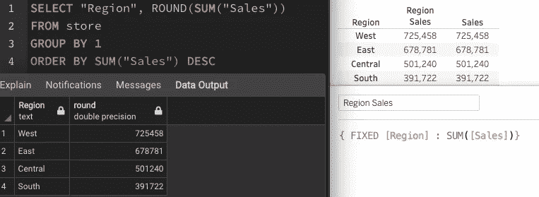
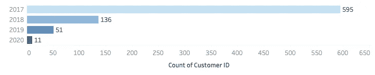
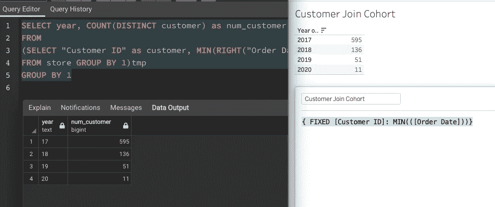
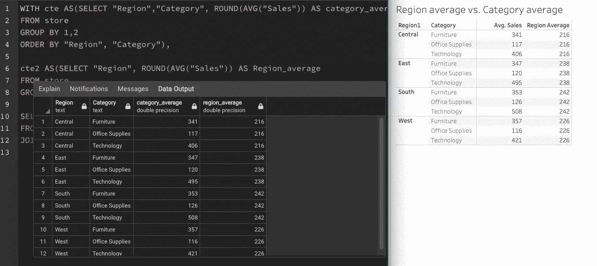

# 如何看待 Tableau 细节层次表达式编写 SQL Group By

> 原文：<https://medium.com/analytics-vidhya/think-tableau-level-of-expression-in-sql-way-998fdc6df0f0?source=collection_archive---------7----------------------->

## 三个例子来展示我如何处理不同的商业问题


[咖啡极客](https://unsplash.com/@coffeegeek?utm_source=medium&utm_medium=referral)在 [Unsplash](https://unsplash.com?utm_source=medium&utm_medium=referral) 上的照片

细节层次表达是 Tableau 计算领域的一个重要概念。

> 固定详细等级表达式使用指定的尺寸计算值，而不参考视图中的尺寸。[固定细节层次表情](https://help.tableau.com/current/pro/desktop/en-us/calculations_calculatedfields_lod_fixed.htm)

在学习如何写 LOD 的时候，我纠结了很多。我不知道我应该把哪一栏放在固定从句后面。有一天，我想到了一个主意。LOD 就像 SQL 的 group by function。

我决定测试一下，我想分享一下我是如何用 SQL 方式思考 LOD 的，它确实帮助我更快地在 Tableau 中编写 LOD 计算。

对于这个演示，我想使用 Tableau 超级商店数据集，并且我已经将该文件导入到我的本地 SQL 数据库中。

## 1.区域销售



在编写 SQL 查询时，我使用“region”作为 group by column。至于 tableau，region 列用作固定子句。

结构化查询语言

```
SELECT "Region", SUM("Sales")
FROM store
GROUP BY 1
ORDER BY SUM("Sales") DESC
```

（舞台上由人扮的）静态画面

```
{ FIXED [Region] : SUM([Sales])}
```



对于 tableau 表，Region Sales 列使用 LOD，而 Sales 使用表视图

## 2.客户最早订单日期群组



对于这个问题，请看看子查询。“客户 id”按每个客户 ID 的最早订单年度分组。至于 tableau，我使用客户 id 作为固定子句。

结构化查询语言

```
SELECT year, COUNT(DISTINCT customer) as num_customer
FROM
(SELECT "Customer ID" as customer, MIN(RIGHT("Order Date",2)) AS year
FROM store GROUP BY "Customer ID")tmp
GROUP BY 1
```

（舞台上由人扮的）静态画面

```
{ FIXED [Customer ID]: MIN(([Order Date]))}
```



2017 年，有 595 个客户下了第一笔订单。新客户的数量逐年大幅下降。

## 3.地区和类别对照表

结构化查询语言

```
WITH cte AS(SELECT "Region","Category", ROUND(AVG("Sales")) AS category_average
FROM store
GROUP BY 1,2
ORDER BY "Region", "Category"),cte2 AS(SELECT "Region", ROUND(AVG("Sales")) AS Region_average
FROM store
GROUP BY 1)SELECT cte."Region", cte."Category", category_average, Region_average
FROM cte
JOIN cte2 USING("Region")
```

（舞台上由人扮的）静态画面

```
{ FIXED [Region1]: AVG([Sales])}
```

至于类别平均销售额，我使用表视图来过滤结果。



## 主要外卖

*想想 SQL，当你想把一列作为 group by 列时，你把该列作为 Tableau 固定子句。*

这是我思考细节层次表达的方式，当我陷入困境时，我发现这对我很有好处。希望这对您有所帮助:)