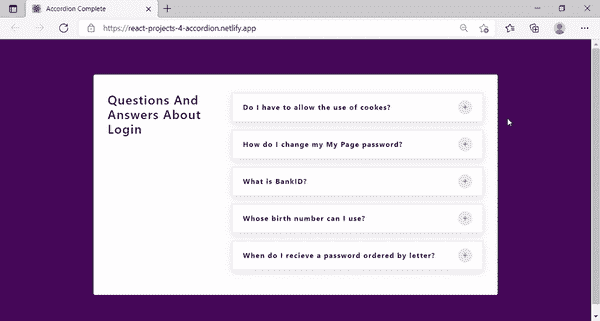
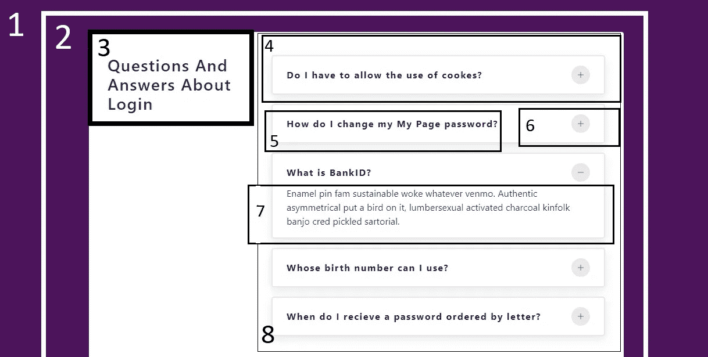
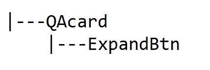
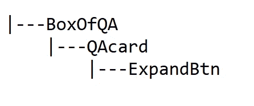
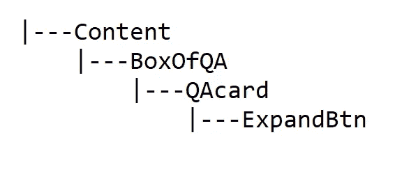
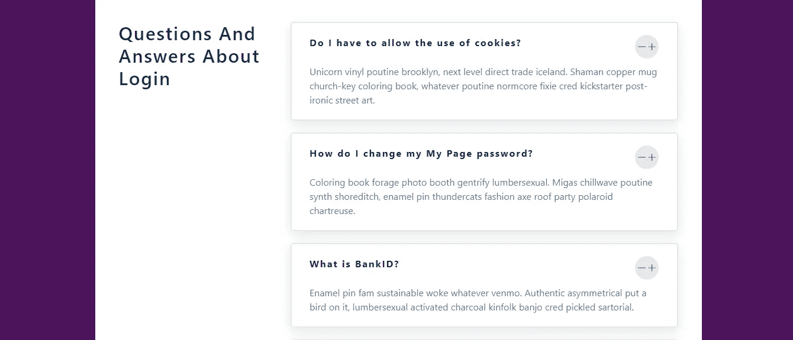
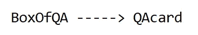
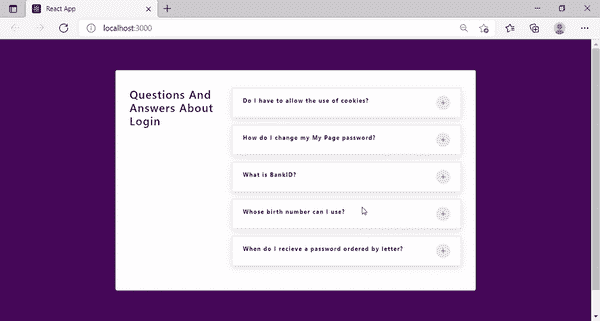

# 在反应中思考

> 原文：<https://medium.com/analytics-vidhya/thinking-in-react-c9661081ef91?source=collection_archive---------4----------------------->

让我们建造

这篇博客的目标读者是 React 的初学者。

## 第 0 节:简介

**这篇博文**的目的是构建一个非常简单的 react 应用，但是我们将按照 react 文档 [**中描述的系统化方法**来完成](https://reactjs.org/docs/thinking-in-react.html#:~:text=%20Thinking%20in%20React%20%201%20Step%201%3A,of%20app%20state%20is.%20Next%2C%20we...%20More%20)****。****

**读完这篇博文后，如果我的读者能够理解这里解释的一些思维过程，并直观地将其融入到他们学习 React 的日常工作流程中，我会很高兴，这将是这篇博文的关键所在。**

**读者不必担心这篇博文中缺少代码。这篇博文的主要目的是向读者阐述在 React 中开发网站时所涉及的一些思维过程。当然，这个项目的代码是作为 GitHub Repo 的链接提供的。**

## **第一部分:主要内容**

**首先，让我们看看我们正在努力构建什么。👇**

****

**我们将使用 React 文档中规定的系统方法构建 web-app**

**正如我们在应用程序中看到的那样，有一堆问题，每个问题都有一个相关的按钮，当用户点击按钮时，应用程序会显示答案。**

**要使用 React 构建这个网站/web 应用程序，文档建议我们从一个模拟开始，就像设计师提供给我们的演示网站一样，将其分成几个部分，并构建一个组件层次结构。把“把它分成小块”想成是指我们给应用程序的每一个可辨别的部分贴上标签。**

****现在，让我们标记应用程序的每个部分，然后决定应用程序的组件层次结构。****

**我已经标记了应用程序的每个可识别的部分如下。就看一眼吧👇**

****

**标有不同部分的应用程序。**

**现在，让我们决定我们需要为这个应用程序构建的组件及其层次结构。**

**让我们从第 4、5、6 和 7 部分组成一个名为 QAcard 的组件。**

**我们可以在 QAcard 中使用条件渲染、道具和状态改变来渲染 5 和 7。对于第 6 部分，我们将构建一个名为 ExpandBtn 的组件。**

**现在 QAcard 的层次结构如下所示👇**

****

**让我们使用组件 QAcard 组成另一个名为 BoxOfQA 的组件。这个 BoxOfQA 组件表示标记为 8 的部分。BoxOfQA 的组件层次结构如下所示👇**

****

**让我们创建一个名为 Content 的组件，它表示标记为 2 的部分，这个组件将包含第 3 部分和 BoxOfQA 组件。我们也不要将 1 作为组件来实现。**

**现在，我们的整个组件层次结构将看起来像这样👇**

****

**现在我们知道了我们的组件和它们的层次结构，让我们通过**构建我们的应用程序**的静态版本来做一些编码。在编码之前，我们最好仔细考虑一下这些组件的功能**。**如果我们**问自己类似**的问题会更好**

1.  **每个组件的职责是什么？**
2.  **两个不同的组件之间是否有一些共同的责任？**
3.  **一个组件是多余的吗？**
4.  **我们可以设想一个不同的组件层次结构吗？**

**无论如何，不管上述问题的答案是什么，我都将继续组装一个静态版本的应用程序。**

****根据** [**React 官方文档**](https://reactjs.org/docs/thinking-in-react.html#step-2-build-a-static-version-in-react) **“到这一步结束时，你将拥有一个可重用组件库来呈现你的数据模型”****

**我用过 create-react-app 并且 src 目录的结构和 app 静态版本的代码可以在这里[阅读。](https://github.com/varadan13/Thinking-in-React)**

****我实现的静态版本的应用程序**看起来像👇**

****

**应用程序的静态版本**

**在这个阶段，按钮不起作用，UI 没有响应。现在让我们让它有反应。**

**是时候识别我们传递给组件和从组件传递来的所有数据了。**

**现在，让我们识别应用程序中的所有数据。**

**作为项目设置的一部分，我们有一个名为 data.js 的文件，顾名思义，它包含我们在应用程序中显示的问题和答案的 json 数据。我们将这个文件导入到我们的应用程序的 BoxOfQA 组件中，并在 QAcard 组件中使用它。因此，基本上在我们的简单应用程序中，这是从一个组件流向另一个组件的唯一数据。下图强调了两个组件之间的数据流。然而，这些数据并不代表一种状态，因为它们不必随着一些用户交互而改变。**

****

**流程图显示了从组件 BoxOfQA 到 QAcard 的数据流**

**因为我们现在已经识别了应用程序中的数据。让我们弄清楚我们需要对这个应用程序进行反应的所有状态。**

**我们确实需要一个状态，当用户点击按钮时，这个状态就会更新。我想就这样吧。有了这一个状态，我们就能实现我们的目标。**

**使用此状态，我们可以:**

1.  **更改按钮上显示的内容**
2.  **显示和不显示问题的答案。**

**现在是时候弄清楚我们必须把我们的状态放在哪里了，为此我们必须参考我们的组件层次结构图。我们有两个选择:**

1.  **这种状态可以由按钮私下管理，这并没有错，因为这种状态是由于我们单击按钮而发生的，因此我们可以使它成为这种状态的唯一所有者，但这可能会导致一个问题，即我们可能会发现很难有条件地显示问题的答案**
2.  **我们可以提升状态，并把它放在一个组件中，我们可以做这两个，即，更新按钮和有条件地呈现答案**

**如果我们仔细看看我们的层次结构图，有一个合适的地方来保存我们的状态，那就是 QAcard 组件。**

**概括地说，我们已经计算出应用程序中的主要数据，我们决定只创建一个州，我们决定将它放在 QAcard 中。现在让我们来实现它。**

**实现状态后，应用程序的行为如下👇**

****

**应用程序的最终版本。**

## **第二部分:结论**

**因为这个应用程序非常简单。很容易找出组件并决定它们的功能。很容易找出组件之间的数据流、状态等。但是在一个普通的 react 项目中，这些活动会消耗大量的时间。理想情况下，你必须在一个更大的项目中尝试这种方法，并检查它是否可行，是否让你富有成效。我认为这确实让你更有效率。**

## **第 3 节:参考**

1.  **我的 [GitHub repo](https://github.com/varadan13/Thinking-in-React) 包含上述应用程序的代码。**
2.  **[思考中反应过来](https://reactjs.org/docs/thinking-in-react.html#:~:text=%20Thinking%20in%20React%20%201%20Step%201:,of%20app%20state%20is.%20Next,%20we...%20More%20)**
3.  **这个 [GitHub repo](https://github.com/john-smilga/react-projects/tree/master/04-accordion/final) 被用作这篇博文中使用的项目代码的参考。**
4.  **上面 GitHub repo 的作者在这里托管了 app****看起来和这篇博文中实现的 app 一模一样。******