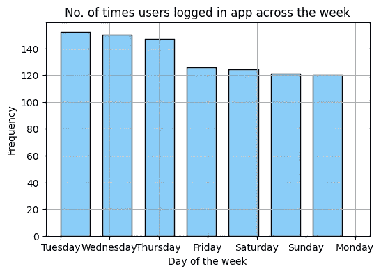

# 谷歌顶石项目:健康技术公司 Bellabeat 如何聪明行事？

> 原文：<https://medium.com/analytics-vidhya/this-case-study-is-for-google-data-analytics-gda-capstone-project-course-54047cccf7cb?source=collection_archive---------0----------------------->

这是一个可选的顶点项目，来自谷歌数据分析课程编号:[顶点项目](https://www.coursera.org/learn/google-data-analytics-capstone?specialization=google-data-analytics)，发布在 [GitHub](https://github.com/katiehuangx/Google-Data-Analytics-Capstone/blob/main/bellabeat-data-analysis.ipynb) 和 [Kaggle](https://www.kaggle.com/code/katiehuangx/case-study-bellabeat-using-python) 上。

分析遵循谷歌课程中教授的数据分析的 6 个步骤:提问、准备、处理、分析、分享和行动。

# 询问

在这一步中，我们定义案例研究的问题和目标及其期望的结果。

## 1.0 背景

Bellabeat 是一家高科技制造商，自 2013 年以来一直致力于为女性提供设计精美的健康智能产品。Bellabeat 通过了解女性自身的健康和习惯来激励和授权女性，并迅速发展壮大，迅速将自己定位为一家面向女性的技术驱动型健康公司。

联合创始人兼首席创意官 ur ska sren 相信，对非 Bellebeat 消费者数据(即 FitBit 健身追踪器使用数据)将揭示更多的增长机会。

## 1.2 业务任务:

分析 FitBit 健身追踪器数据，深入了解消费者如何使用 FitBit 应用程序，并**发现 Bellabeat 营销战略的趋势**。

## 1.3 业务目标:

*   确定的趋势是什么？
*   这些趋势如何适用于 Bellabeat 客户？
*   这些趋势如何影响 Bellabeat 的营销策略？

## 1.4 可交付成果:

*   业务任务的清晰总结
*   使用的所有数据源的描述
*   任何数据清理或操作的记录
*   分析总结
*   支持可视化和关键发现
*   基于分析的高级内容推荐

## 1.5 主要利益相关方:

*   ur ka sren:Bella beat 的联合创始人兼首席创意官
*   桑多·穆尔(Sando Mur):数学家，Bellabeat 的联合创始人，Bellabeat 执行团队的主要成员
*   Bellabeat 营销分析团队:指导 Bellabeat 营销策略的数据分析师团队。

# 第二步:准备

在准备阶段，我们确定正在使用的数据及其局限性。

## 2.1 数据来源信息:

1.  数据在 [Kaggle: FitBit 健身追踪器数据](https://www.kaggle.com/arashnic/fitbit)上公开，并存储在 18 个 csv 文件中。
2.  由受访者在 2016 年 3 月 12 日至 2016 年 5 月 12 日期间通过 Amazon Mechanical Turk 进行的调查生成。
3.  30 名 FitBit 用户同意提交个人跟踪数据。
4.  收集的数据包括以分钟为单位记录的身体活动、心率、睡眠监测、日常活动和步数。

## 2.2 数据集的局限性:

*   数据收集于 5 年前的 2016 年。从那以后，用户的日常活动、健身和睡眠习惯、饮食和食物消费可能都发生了变化。数据可能不及时或不相关。
*   30 名 FitBit 用户的样本量并不能代表整个健身人群。
*   由于数据是在调查中收集的，我们无法确定其完整性或准确性。

## 2.3 数据是 ROCCC 吗？

一个好的数据源是 ROCCC，它代表 **R** eliable、**O**original、**C**comprehensive、**C**current 和 **C** ited。

*   可靠—低—不可靠，因为只有 30 名受访者
*   原始——低——第三方提供商(亚马逊土耳其机械公司)
*   全面的 MED 参数与 Bellabeat 产品的大多数参数相匹配
*   当前—低—数据是 5 年前的数据，可能不相关
*   引用—低—从第三方收集的数据，因此未知

总的来说，数据集被认为是质量差的数据，不建议根据这些数据提出业务建议。

## 2.4 数据选择

选择并复制以下文件进行分析。

```
dailyActivity_merged.csv
```

## 2.5 工具

我们使用 Python 进行数据清理、转换和可视化。

# 第三步:过程

在这里，我们将通过执行以下操作来清理和确保数据是正确的、相关的、完整的并且没有错误和异常值，从而对数据进行处理:

*   探索和观察数据
*   检查并处理缺失值或空值
*   转换数据—格式化数据类型
*   进行初步统计分析

## 3.1 准备环境

为了便于阅读，安装了 Python 库并赋予了别名。

```
*# import packages and alias*
import numpy as np *# data arrays*
import pandas as pd *# data structure and data analysis*
import matplotlib as plt *# data visualization*
import datetime as dt *# date time*
```

## 3.2 导入数据集

读入选定的文件。

```
*# read_csv function to read CSV file*
daily_activity = pd.read_csv("../input/fitbit/Fitabase Data 4.12.16-5.12.16/dailyActivity_merged.csv")
```

## 3.3 数据清理和操作

1.  观察和熟悉数据
2.  检查是否有空值或缺失值
3.  对数据进行健全性检查

预览前 10 行以熟悉数据。

```
*# preview first 10 rows with all columns*
daily_activity.head(10)
```


这只是表格的截图。全表[在这里是](https://www.kaggle.com/katiehuangx/case-study-bellabeat-using-python)，适用于下面所有的表格和画面。

然后，我将找出数据中是否有空值或缺失值。

```
*# obtain the # of missing data points per column*
missing_values_count = daily_activity.isnull().sum()

*# look at the # of missing points in all columns*
missing_values_count[:]Id                          0
ActivityDate                0
TotalSteps                  0
TotalDistance               0
TrackerDistance             0
LoggedActivitiesDistance    0
VeryActiveDistance          0
ModeratelyActiveDistance    0
LightActiveDistance         0
SedentaryActiveDistance     0
VeryActiveMinutes           0
FairlyActiveMinutes         0
LightlyActiveMinutes        0
SedentaryMinutes            0
Calories                    0
dtype: int64
```

找出数据的基本信息:

*   行数和列数
*   列名
*   非空计数
*   数据类型

```
*# show basic information of data*
daily_activity.info()<class 'pandas.core.frame.DataFrame'>
RangeIndex: 940 entries, 0 to 939
Data columns (total 15 columns):
 #   Column                    Non-Null Count  Dtype  
---  ------                    --------------  -----  
 0   Id                        940 non-null    int64  
 1   ActivityDate              940 non-null    object 
 2   TotalSteps                940 non-null    int64  
 3   TotalDistance             940 non-null    float64
 4   TrackerDistance           940 non-null    float64
 5   LoggedActivitiesDistance  940 non-null    float64
 6   VeryActiveDistance        940 non-null    float64
 7   ModeratelyActiveDistance  940 non-null    float64
 8   LightActiveDistance       940 non-null    float64
 9   SedentaryActiveDistance   940 non-null    float64
 10  VeryActiveMinutes         940 non-null    int64  
 11  FairlyActiveMinutes       940 non-null    int64  
 12  LightlyActiveMinutes      940 non-null    int64  
 13  SedentaryMinutes          940 non-null    int64  
 14  Calories                  940 non-null    int64  
dtypes: float64(7), int64(7), object(1)
memory usage: 110.3+ KB
```

我们还将对唯一 id 进行计数，以确认数据是否如调查中声称的那样有 30 个 id。

```
*# count distinct value of "Id"*
unique_id = len(pd.unique(daily_activity["Id"]))

print("# of unique Id: " + str(unique_id))# of unique Id: 33
```

根据上述观察，我们注意到

1.  如“非空计数”下所述，存在空值或缺失值。
2.  数据有 15 列和 940 行。
3.  *ActivityDate* 被错误分类为`object` dtype，必须转换为`datetime64` dtype。
4.  有 33 个唯一 id，而不是预期的 30 个唯一 id。一些用户可能在调查期间创建了额外的 id。

既然我们已经识别了脏数据，那么我们将执行数据操作/转换。

1.  将*活动日期*转换为`datatime64`数据类型。
2.  将*活动日期*的格式转换为`yyyy-mm-dd`。
3.  通过以星期几的形式生成日期来创建新列 *DayOfTheWeek* ,以便进一步分析。
4.  创建新列 *TotalMins* 为 *VeryActiveMinutes* 、 *FairlyActiveMinutes* 、 *LightlyActiveMinutes* 和*sedental minutes*之和。
5.  通过将 4 号中的新列 *TotalMins* 转换为小时数，创建新列 *TotalHours* 。
6.  重新排列和重命名列。

首先，我们将把*活动日期*从`object`转换为`datatime64`d 类型，然后，着手将*活动日期*转换为`yyyy-mm-dd`。

然后，我们确认它是否已经被更新为`datatime64` dtype 和 *ActivityDate* 到`yyyy-mm-dd`。

```
*# convert "ActivityDate" to datatime64 dtype and format to yyyy-mm-dd*
daily_activity["ActivityDate"] = pd.to_datetime(daily_activity["ActivityDate"], format="%m/**%d**/%Y")*# re-print information to confirm*
daily_activity.info()*# print the first 5 rows of "ActivityDate" to confirm*
daily_activity["ActivityDate"].head()<class 'pandas.core.frame.DataFrame'>
RangeIndex: 940 entries, 0 to 939
Data columns (total 15 columns):
 #   Column                    Non-Null Count  Dtype         
---  ------                    --------------  -----         
 0   Id                        940 non-null    int64         
 1   ActivityDate              940 non-null    datetime64[ns]
 2   TotalSteps                940 non-null    int64         
 3   TotalDistance             940 non-null    float64       
 4   TrackerDistance           940 non-null    float64       
 5   LoggedActivitiesDistance  940 non-null    float64       
 6   VeryActiveDistance        940 non-null    float64       
 7   ModeratelyActiveDistance  940 non-null    float64       
 8   LightActiveDistance       940 non-null    float64       
 9   SedentaryActiveDistance   940 non-null    float64       
 10  VeryActiveMinutes         940 non-null    int64         
 11  FairlyActiveMinutes       940 non-null    int64         
 12  LightlyActiveMinutes      940 non-null    int64         
 13  SedentaryMinutes          940 non-null    int64         
 14  Calories                  940 non-null    int64         
dtypes: datetime64[ns](1), float64(7), int64(7)
memory usage: 110.3 KB0   2016-04-12
1   2016-04-13
2   2016-04-14
3   2016-04-15
4   2016-04-16
Name: ActivityDate, dtype: datetime64[ns]
```

使用重新排列的列名创建新列表，并将`daily_activity`重命名为更短的名称`df_activity`。

```
*#r create new list of rearranged columns*
new_cols = ['Id', 'ActivityDate', 'DayOfTheWeek', 'TotalSteps', 'TotalDistance', 'TrackerDistance', 'LoggedActivitiesDistance', 'VeryActiveDistance', 'ModeratelyActiveDistance', 'LightActiveDistance', 'SedentaryActiveDistance', 'VeryActiveMinutes', 'FairlyActiveMinutes', 'LightlyActiveMinutes', 'SedentaryMinutes', 'TotalExerciseMinutes', 'TotalExerciseHours', 'Calories']

*# reindex function to rearrange columns based on "new_cols"*
df_activity = daily_activity.reindex(columns=new_cols)

*# print 1st 5 rows to confirm*
df_activity.head(5)
```


通过将日期分成星期几来创建新列，以便进一步分析。

```
*# create new column "day_of_the_week" to represent day of the week* 
df_activity["DayOfTheWeek"] = df_activity["ActivityDate"].dt.day_name()

*# print 1st 5 rows to confirm*
df_activity["DayOfTheWeek"].head(5)0      Tuesday
1    Wednesday
2     Thursday
3       Friday
4     Saturday
Name: DayOfTheWeek, dtype: object
```

将列从`XxxYyy`重新排列并重命名为`xxx_yyy`。

```
*# rename columns*
df_activity.rename(columns = {"Id":"id", "ActivityDate":"date", "DayOfTheWeek":"day_of_the_week", "TotalSteps":"total_steps", "TotalDistance":"total_dist", "TrackerDistance":"track_dist", "LoggedActivitiesDistance":"logged_dist", "VeryActiveDistance":"very_active_dist", "ModeratelyActiveDistance":"moderate_active_dist", "LightActiveDistance":"light_active_dist", "SedentaryActiveDistance":"sedentary_active_dist", "VeryActiveMinutes":"very_active_mins", "FairlyActiveMinutes":"fairly_active_mins", "LightlyActiveMinutes":"lightly_active_mins", "SedentaryMinutes":"sedentary_mins", "TotalExerciseMinutes":"total_mins","TotalExerciseHours":"total_hours","Calories":"calories"}, inplace = True)

*# print column names to confirm*
print(df_activity.columns.values)
df_activity.head(5)['id' 'date' 'day_of_the_week' 'total_steps' 'total_dist' 'track_dist' 'logged_dist' 'very_active_dist' 'moderate_active_dist' 'light_active_dist' 'sedentary_active_dist' 'very_active_mins' 'fairly_active_mins' 'lightly_active_mins' 'sedentary_mins' 'total_mins' 'total_hours' 'calories']
```


创建新列 *total_mins* 是记录的总时间的总和。

```
*# create new column "total_mins" containing sum of total minutes.*
df_activity["total_mins"] = df_activity["very_active_mins"] + df_activity["fairly_active_mins"] + df_activity["lightly_active_mins"] + df_activity["sedentary_mins"]
df_activity["total_mins"].head(5)0    1094
1    1033
2    1440
3     998
4    1040
Name: total_mins, dtype: int64
```

通过将 *total_mins* 转换为小时数来创建新列。

```
*# create new column *total_hours* by converting to hour and round float to two decimal places*
df_activity["total_hours"] = round(df_activity["total_mins"] / 60)*# print 1st 5 rows to confirm*
df_activity["total_hours"].head(5)0    18.0
1    17.0
2    24.0
3    17.0
4    17.0
Name: total_hours, dtype: float64
```

数据清理和操作完成。因此，现在可以对数据进行分析了。

# 第四步:分析

## 4.1 执行计算

提取统计数据进行分析:

*   计数—行数
*   平均值
*   标准偏差
*   最小和最大
*   百分位数 25%，50%，75%

```
*# pull general statistics*
df_activity.describe()
```


解读统计结果:

1.  平均而言，用户记录了 7，637 步或 5.4 公里，这是不够的。根据 CDC 的建议，一名成年女性每天至少要走 10，000 步或 8 公里，才能从总体健康、减肥和健康改善中受益。[来源:今日医学新闻文章](https://www.medicalnewstoday.com/articles/how-many-steps-should-you-take-a-day)
2.  久坐的用户占大多数，平均记录 991 分钟或 20 小时，占总平均分钟数的 81%。
3.  注意到燃烧的平均卡路里是 2303 卡路里，相当于 0.6 磅。无法详细解释，因为燃烧的卡路里取决于几个因素，如年龄、体重、日常任务、锻炼、激素和每日卡路里摄入量。[来源:健康行文章](https://www.healthline.com/health/fitness-exercise/how-many-calories-do-i-burn-a-day#Burning-calories)

# 分享

在这一步中，我们将创建可视化效果，并根据我们的分析交流我们的发现。

## 5.1 数据可视化和发现

```
*# import matplotlib package*
import matplotlib.pyplot as plt*# plotting histogram*
plt.style.use("default")
plt.figure(figsize=(6,4)) *# specify size of the chart*
plt.hist(df_activity.day_of_the_week, bins = 7, 
         width = 0.6, color = "lightskyblue", edgecolor = "black")*# adding annotations and visuals*
plt.xlabel("Day of the week")
plt.ylabel("Frequency")
plt.title("No. of times users logged in app across the week")
plt.grid(True)
plt.show()
```



**一周内的使用频率**

在这张柱状图中，我们可以看到 FitBit 应用程序在一周中的使用频率。

1.  我们发现，用户更喜欢或记得(给他们带来好处的怀疑，他们忘记了)从周二到周五在应用程序上跟踪他们的活动。
2.  注意到频率在周五下降，并在周末和周一继续。

```
*# import matplotlib package*
import matplotlib.pyplot as plt*# plotting scatter plot*
plt.style.use("default")
plt.figure(figsize=(8,6)) *# specify size of the chart*
plt.scatter(df_activity.total_steps, df_activity.calories, 
            alpha = 0.8, c = df_activity.calories, 
            cmap = "Spectral")*# add annotations and visuals*
median_calories = 2303
median_steps = 7637plt.colorbar(orientation = "vertical")
plt.axvline(median_steps, color = "Blue", label = "Median steps")
plt.axhline(median_calories, color = "Red", label = "Median calories burned")
plt.xlabel("Steps taken")
plt.ylabel("Calories burned")
plt.title("Calories burned for every step taken")
plt.grid(True)
plt.legend()
plt.show()
```


**每走一步消耗的卡路里**

从散点图中，我们发现:

1.  这是一种正相关关系。
2.  我们观察到，当用户在> 0 到 15，000 步的范围内时，燃烧卡路里的强度增加，卡路里燃烧速率从 15，000 步开始下降。
3.  注意到一些异常值:

*   零步骤，燃烧零到最少的卡路里。
*   1 观察超过 35，000 步，每小时消耗< 3,000 calories burned.
*   Deduced that outliers could be due to natural variation of data, change in user’s usage or errors in data collection (ie. miscalculations, data contamination or human error).

```
*# import matplotlib package*
import matplotlib.pyplot as plt

*# plotting scatter plot*
plt.style.use("default")
plt.figure(figsize=(8,6)) *# Specify size of the chart*
plt.scatter(df_activity.total_hours, df_activity.calories, 
            alpha = 0.8, c = df_activity.calories, 
            cmap = "Spectral")

*# adding annotations and visuals*
median_calories = 2303
median_hours = 20
median_sedentary = 991 / 60

plt.colorbar(orientation = "vertical")
plt.axvline(median_hours, color = "Blue", label = "Median steps")
plt.axvline(median_sedentary, color = "Purple", label = "Median sedentary")
plt.axhline(median_calories, color = "Red", label = "Median hours")
plt.xlabel("Hours logged")
plt.ylabel("Calories burned")
plt.title("Calories burned for every hour logged")
plt.legend()
plt.grid(True)
plt.show()
```


**卡路里**

散点图显示:

1.  微弱的正相关关系，即工作时间的增加并不能转化为燃烧更多的卡路里。这主要是由于平均久坐时间(紫线)在 16 到 17 小时之间。
2.  同样，我们可以看到一些异常值:

*   相同的零值异常值
*   一个不寻常的红点，在 24 小时零卡路里燃烧，这可能是由于上述相同的原因。

```
*# import packages*
import matplotlib.pyplot as plt
import numpy as np

*# calculating total of individual minutes column*
very_active_mins = df_activity["very_active_mins"].sum()
fairly_active_mins = df_activity["fairly_active_mins"].sum()
lightly_active_mins = df_activity["lightly_active_mins"].sum()
sedentary_mins = df_activity["sedentary_mins"].sum()

*# plotting pie chart*
slices = [very_active_mins, fairly_active_mins, lightly_active_mins, sedentary_mins]
labels = ["Very active minutes", "Fairly active minutes", "Lightly active minutes", "Sedentary minutes"]
colours = ["lightcoral", "yellowgreen", "lightskyblue", "darkorange"]
explode = [0, 0, 0, 0.1]
plt.style.use("default")
plt.pie(slices, labels = labels, 
        colors = colours, wedgeprops = {"edgecolor": "black"}, 
        explode = explode, autopct = "**%1.1f%%**")
plt.title("Percentage of Activity in Minutes")
plt.tight_layout()
plt.show()
```


**以分钟为单位的活动百分比**

从饼图中可以看出，

1.  久坐时间占了 81.3%的最大份额。
2.  这表明用户正在使用 FitBit 应用程序记录日常活动，如日常通勤、不活跃的运动(从一个地方到另一个地方)或跑腿。
3.  应用程序很少被用来跟踪健身(即。跑步)根据相当活跃的活动(1.1%)和非常活跃的活动(1.7%)的较小百分比。这非常令人沮丧，因为 FitBit 应用程序是为了鼓励健身而开发的。

# 第六步:行动

最后一步，我们将根据我们的分析提出我们的见解和建议。

在这里，我们重温我们的业务问题，并与您分享我们的高级业务建议。

**1。确定的趋势是什么？**

*   大多数用户(81.3%)使用 FitBit 应用程序来跟踪久坐活动，而不是使用它来跟踪他们的健康习惯。
*   与周末相比，用户更喜欢跟踪他们在工作日的活动——可能是因为他们在工作日花更多的时间在外面，而在周末呆在家里。

**2。这些趋势如何适用于 Bellabeat 客户？**

*   两家公司开发的产品都专注于为女性提供健康、习惯和健身数据，并鼓励她们了解自己当前的习惯，做出健康的决定。这些围绕健康和健身的共同趋势可以很好地应用于 Bellabeat 的客户。

**3。这些趋势如何影响 Bellabeat 的营销策略？**

*   Bellabeat 营销团队可以通过教育和向用户传授有关健身益处的知识来鼓励用户，建议不同类型的锻炼(即工作日进行简单的 10 分钟锻炼，周末进行更激烈的锻炼)以及 Bellabeat 应用程序上的卡路里摄入和燃烧率信息。
*   周末的时候，Bellabeat app 还可以提示通知，鼓励用户运动。

数据集和完整代码可以在[这里](https://www.kaggle.com/katiehuangx/case-study-bellabeat-using-python)找到。