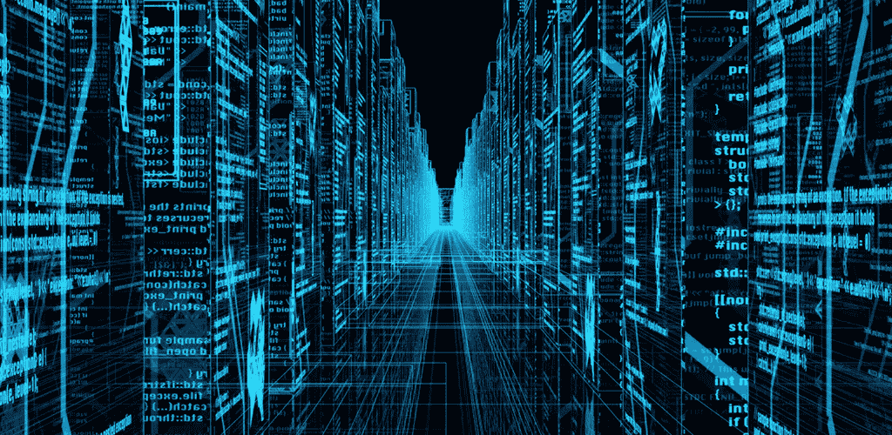
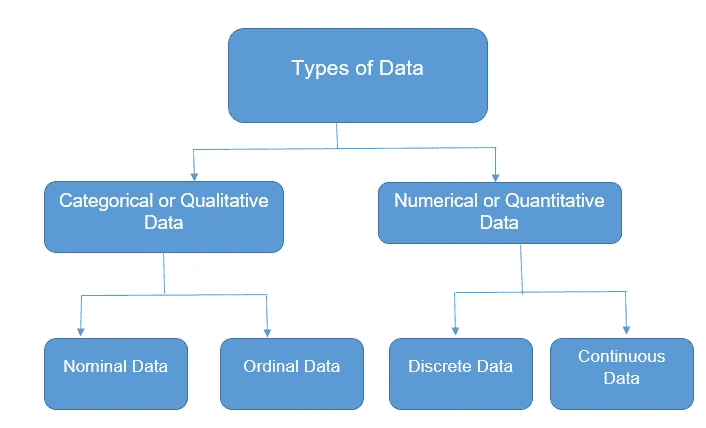
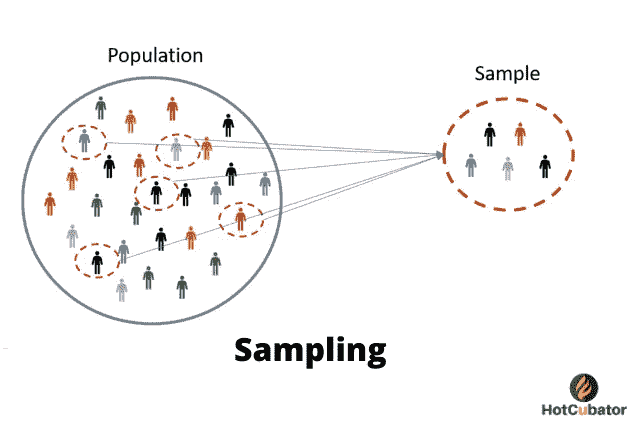
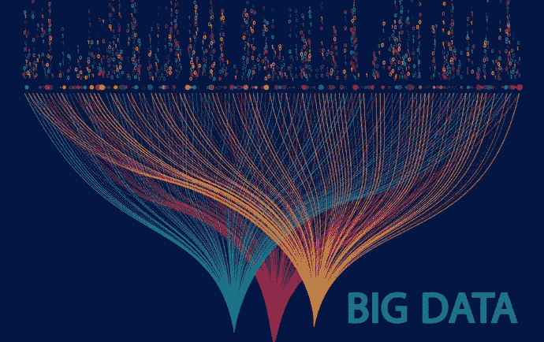

# 这是数据！！！不是数据

> 原文：<https://medium.com/analytics-vidhya/this-is-data-not-data-3f0a42baeb97?source=collection_archive---------29----------------------->

大家好，我是任亚。我想写一些关于数据科学和机器学习的改编故事。如你所料，我会把我学到的重新告诉你。我是这个领域的新手，每天都在努力学习那个时代有用的东西。在写高级题目之前，我想先从基础和主要部分开始。

什么是数据？计算机工程师、程序员、软件工程师、数据科学家总是说数据，但它对我们意味着什么呢？我们可以给变量赋值，并对它们进行一些操作，然后我们说“哦，是的，我已经完成了。我用了数据流，数据和数据 bla bla bla。”数据不是这样的。远不止如此。我能听到你们的声音，请通过介绍，解释一下这个故事的内容，:D，好了，我们开始吧。

数据基本上是一个信息单位。那是什么？仅此而已。完全没有。信息能以定性和定量的方式控制我们。有时只能保持为 1 和 0，或者保持为是或否。当定义定性和定量值时，我们可以面对分类的、数值的、连续的和离散的值。这些是保存数据的统计方法的类型，就像一些统计学家和数据爱好者理解的那样。

**定性**数据总是处理那些不容易测量，但可以主观观察到的特征和描述符。在**名义**数据中，不存在固有的顺序或评级问题，如性别(女性、男性、其他..).在**有序**数据中，我们应该有有序的系列，比如对附近地区的餐馆进行评级。

数据处理的是数字和一些可以客观测量的东西。这可以分为离散和连续数据。**离散**数据被称为分类数据，它可以保存有限数量的可能值，例如 Bershka:)中的客户数量。**连续的**数据可以保存无限数量的可能值，例如特定人的身高或体重。

此外，数据是以这些类型描述的。当连接现实生活中的数据时。现在每个人都有一部手机。当我们每秒点击手机时，意味着我们每秒都在创造数据。作为经典，当你在搜索引擎中搜索任何问题时，这意味着数据，所以在我们的世界里，数据像水一样流动。这真是太棒了。

我想与你分享一些统计数据，这可能很奇怪，但它们是真实的。一秒钟内；

1.  **上传了 1071 张** Instagram 照片。
2.  **885** Tumblr 帖子发布。
3.  9，472 条推文被发送。等等..

这意味着人类、机器人每天、每周、每月都在长时间内产生大量数据。我们如何储存它们，我们使用什么样的工具，或者我们使用了所有的工具。这个问题可以作为另一个话题打开一扇新的门。

我们可以通过使用缩放、归一化、中心分布分析来对数据进行采样，或者我们需要使用一些额外的东西。

这可以打开一个通往大数据的区间。大数据并不意味着你的数据是巨大的。以前没有那种原始的想法。大数据有 3 个属性。这些是速度、变化和体积。这 3 个特征可以定义我们的大量数据及其结构。

简单地说，我谈到了什么是数据和数据分类，以及获得的数据的大小。在我们的下一篇文章中，我将从我停止的地方继续。与健康相伴，与:D 数据相伴