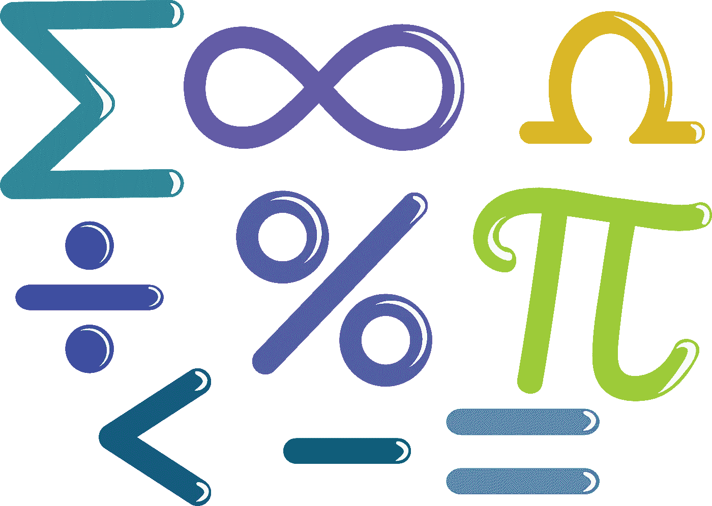
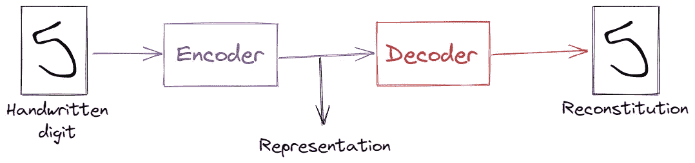
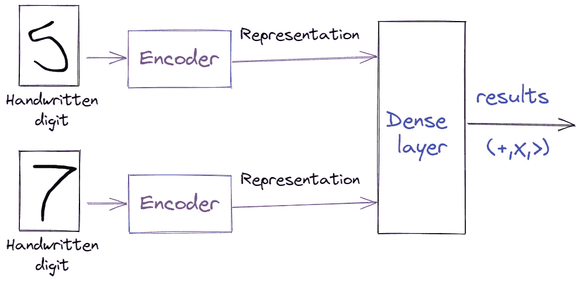
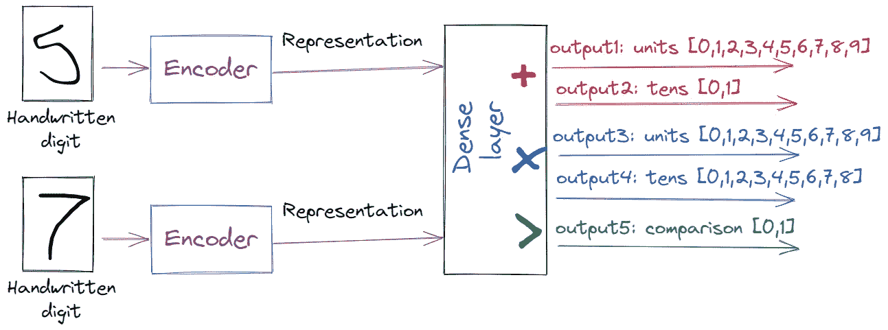

# 这就是神经网络如何学习手写数字的加法、乘法和比较

> 原文：<https://medium.com/analytics-vidhya/this-is-how-a-neural-network-learns-to-add-multiply-and-compare-handwritten-digits-b041198c9759?source=collection_archive---------2----------------------->

# 却不知道他们的价值观！

dl png[[https://dlpng.com/png/6906777](https://dlpng.com/png/6906777)提供

我在[之前的一篇文章](https://jovian.ai/outlink?url=https%3A%2F%2Fblog.jovian.ai%2Fhow-to-train-supervised-machine-learning-algorithms-without-labeled-data-6ebddc01a00f)中描述过，自动编码器在自动贴标中有多有用。这些网络的主要特性是它们能够学习数据中的特征/模式。事实上，这不是自动编码器特有的，可以使用其他无人监管的技术来实现，主要是 **PCA** 。
检测和学习数据特征的能力可以用于其他领域。

在这篇文章中，我将展示一个自动编码器的应用。这将通过两个步骤实现:

*   首先，卷积自动编码器将在 MNIST 数据上被训练。
*   在编码器和解码器的训练之后，我们将冻结它们的权重，并使用它们和附加的密集层来“学习”算术运算，即加法、乘法和比较。

诀窍是*永远不要*明确地将 **MNIST** 数据集中的手写数字与它们各自的标签相关联。我们将会看到，神经网络仍然能够在所有情况下对看不见的数据达到 97%以上的准确度。

下图描述了设计的第一步:

明斯特自动编码器[图片由作者提供]

第二步，我们将使用与密集层串联的编码器来执行算术运算。我们将只训练密集层权重，并将操作结果作为标签提供。请注意，我们不会提供数字(标签)的值。

训练网络学习算术运算[图片由作者提供]

# 在 MNIST 数据上训练自动编码器

类似于[上一篇文章](https://blog.jovian.ai/how-to-train-supervised-machine-learning-algorithms-without-labeled-data-6ebddc01a00f)，我们将在这个实验中使用 MNIST 数据。自动编码器将使用 60000 个训练样本来学习手写数字特征。我们使用 KERAS 库导入 MNIST。

我们必须缩放范围`[0,1]`中的数据，并将其整形为图像的 *KERAS* 格式(NBR _ samples x width x height x channels)。

autoencoder 架构基于一系列卷积层，它会逐渐将 28x28x1 图像(784 像素)编码为 100 个元素的阵列，并将该表示解码回原始格式。训练后的结果图像有望与原始图像相似。

然后使用编码器和解码器创建自动编码器:

每个自动编码器输出将被训练为每个像素的二进制分类器。

提前停止将防止自动编码器过拟合训练数据。有两种方法可以检查网络性能。首先，我们可以评估测试数据的损失函数。我们期望它接近训练数据上的损失值。

两个数据集的值非常接近。验证自动编码器的另一种方法是从测试数据中检查随机样本的重构。

一张图胜过千言万语！很明显，重建的**非常接近**原始图像。

既然我们已经有了一个训练有素的编码器和解码器，让我们来关注一下*编码器*。对于每幅图像，编码器都会生成一个表示，以捕捉最“有趣”或“重要”的特征。这种表示应该足以使用解码器重构图像。这是我们之前使用的示例图像的表示:

解码器使用这 100 个数字，将生成 28×28 的图像(784 像素)。

这里是*有趣部分*开始的地方！使用低维表示，让我们做一些数学计算。

# 学习手写数字的算术运算

这个想法很简单。使用两个图像的表示，我们训练一个神经网络来计算它们的和、它们的积并比较它们。我们将**不提供**每个数字的值，但是我们将在训练步骤中提供**结果**。
我们将对[0–9]范围内的数字执行加法和乘法运算。结果将分别在[0–18]和[0–81]范围内。因此，将使用多个输出对输出进行编码:
1-总和**单位**，多类输出【0，1，2，3，4，5，6，7，8，9】
2-总和**十位**，二进制输出【0，1】
3-乘法**单位**，多类输出【0，1，2，3，4，5，6，7，8，9】
4-乘法

****

**模型表示[图片由作者提供]**

**使用 KERAS 中的功能 API，我们定义了网络架构。首先，我们导入编码器*两次*并冻结其权重:**

**使用编码器的输出，我们构建模型:**

**该模型有两个输入(两个手写数字图像)和五个输出(和与积加上比较结果的单位和十位)。由于输出的性质，我们将使用两种不同的损耗。请注意，有一个 1000 个单元的公共隐藏层，然后是五个分支(每个输出一个)。我们需要创建数据集来训练和测试我们的模型。输入将是手写数字的随机组合。输出将是每个组合的预期结果。**

**现在我们准备训练我们的模型！**

**在训练结束时，所有输出的准确度都相当好(9x%)。让我们先看看模型在测试数据上的表现。**

**结果仍在 95%以上的范围内。让我们展示一个模型预测的随机样本。**

**瞧啊。我们可以通过在更多随机样本上训练模型(增加`train_size`值)或调整模型架构来提高准确性。也就是说，我们设法建立了一个神经网络，它能够解决手写数字*的基本算术运算，而不需要*显式计算它们的值。任务完成。**

# **结论和未来工作**

**在这篇文章中，我们介绍了一个基于 MNIST 图像的自动编码器。在自动编码器训练期间，**编码器**部件学习图像的最重要特征，以便稍后通过**解码器**重建它们。这些特征用于进一步的操作(通过密集或循环层)。我们训练了一个密集的神经网络，与自动编码器串联来学习算术运算。该模型在所有输出上都达到了 95%以上的准确率。**

**自动编码器是无监督学习的一部分。我们仍在触及这些令人惊叹的深度学习技术的表面。我将继续探索这一领域，特别是使用递归神经网络及其在自然语言处理和时间序列中的应用。**

# **参考**

**笔记本[[https://jovian.ai/kara-mounir/mnist-autoencoder](https://jovian.ai/kara-mounir/mnist-autoencoder)**

**杰森·布朗利[[https://machinelearningmastery.com](https://jovian.ai/outlink?url=https%3A%2F%2Fmachinelearningmastery.com)]的机器学习大师博客**

**我的 Github[[https://github.com/zaitrik](https://jovian.ai/outlink?url=https%3A%2F%2Fgithub.com%2Fzaitrik)**

**我的 LinkedIn[[https://www.linkedin.com/in/mounir-kara-zaitri-a01a00208/](https://jovian.ai/outlink?url=https%3A%2F%2Fwww.linkedin.com%2Fin%2Fmounir-kara-zaitri-a01a00208%2F)**