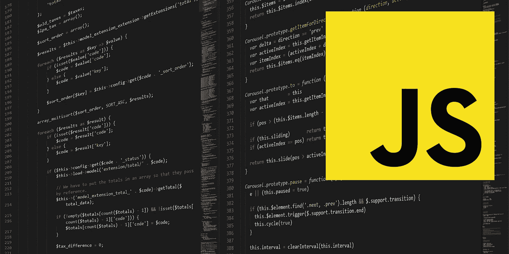
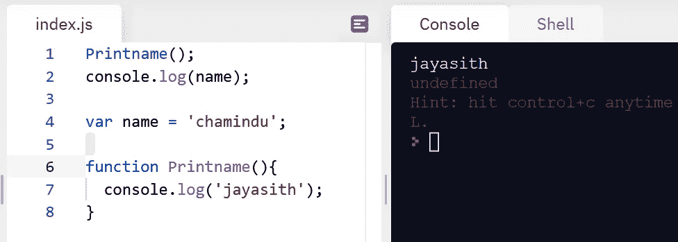
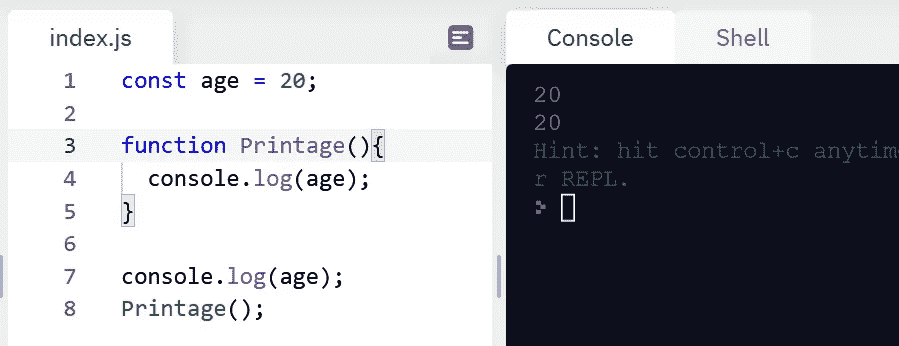
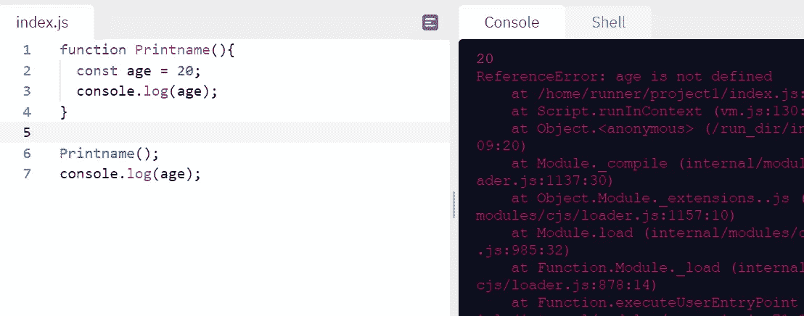
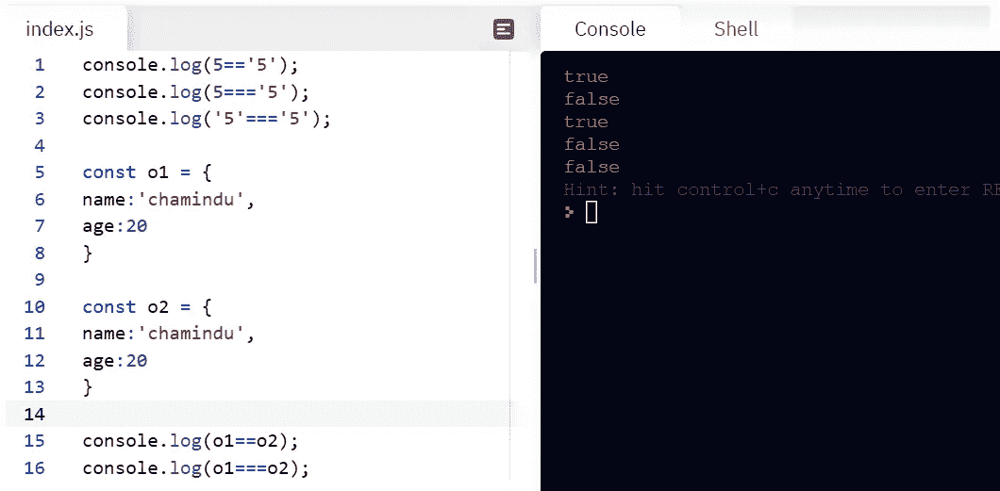

# JavaScript 中的三个重要概念

> 原文：<https://medium.com/analytics-vidhya/three-important-concepts-in-javascript-f3db96aa8620?source=collection_archive---------15----------------------->

我们都知道 JavaScript 是速度最快、最流行的语言之一。JavaScript 就像你在生活中学习的任何其他编程语言一样。JavaScript 中有很多非常重要的概念。如果你是一个 JavaScript 开发者，那么你需要知道这三个概念。

1.  提升
2.  范围
3.  平等

# **吊装**

在上面的代码中，我在函数声明之前调用了 Printname 函数，但是由于提升，我在控制台中得到输出。托管所做的是当我们编译代码时，编译器将所有声明提升到它们作用域的顶部。提升并不意味着所有的声明都移动到它们作用域的顶部。在执行代码之前，编译器会从上到下检查代码，并在内存中为代码中的所有声明创建一个空间。完成编译后，你的代码开始执行。

# 范围

根据我们在代码中使用变量的位置，JavaScript 中有两种不同类型的作用域。

1.  全球范围
2.  局部范围

**全球范围**

在上面的代码中，变量 age 在全局范围内，因为它在脚本的根处声明。在这个脚本中，年龄变量可以在函数内部和外部使用。

**本地范围**

在上面的代码中，变量在局部范围内称为 age，因为它是在函数内部声明的。我们不能从函数外部访问局部变量。如果我们试图从一个函数的外部访问这个局部变量，我们将得到一个错误输出，如上面的。

# 平等

JavaScript 有两个独立的运算符来检查相等性。一个是双重相等，测试抽象相等，另一个是三重相等，测试限制相等。不同的是抽象等式不检查数据类型它只检查每个变量的值另一方面限制等式检查每个变量的值和数据类型。当我们检查具有相同命名对象和相同赋值的对象时，我们得到的结果是 false。当两个对象被一个相等的操作符检查时，它只检查两个对象的内存地址是否相等。这就是为什么上面两个等式操作符的输出都是假的。当我们创建一个对象时，它会生成一个新的内存地址。

在本文中，我简要解释了 JavaScript 中的三个重要概念。如果你有兴趣或者想了解更多关于 JavaScript 的概念，你可以参考下面的链接。

[每个 javascript 程序员必须知道的 15 个 javascript 概念。](/@madasamy/15-javascript-concepts-that-every-nodejs-programmer-must-to-know-6894f5157cb7)