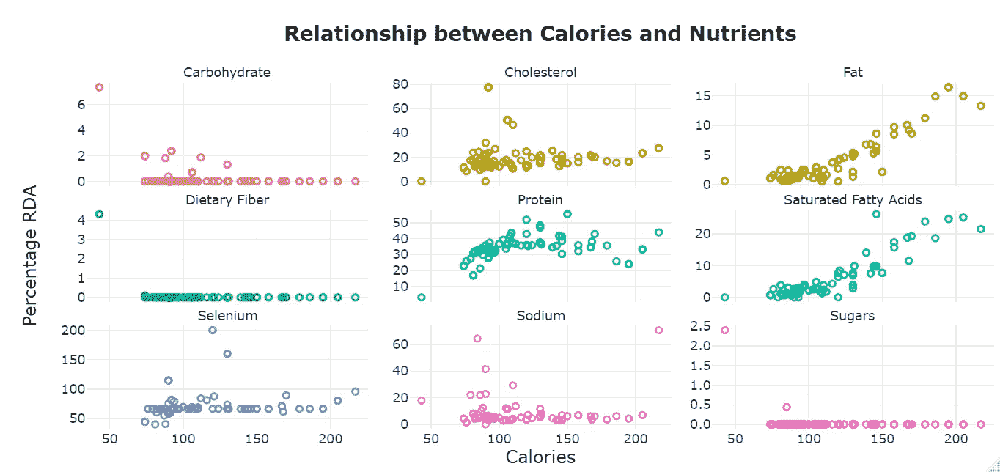

# 为什么是时候采用海鲜饮食的三个原因

> 原文：<https://medium.com/analytics-vidhya/three-reasons-why-it-is-time-adopt-a-seafood-diet-1bd9521e1fd6?source=collection_archive---------16----------------------->

## 数据可视化让你的盘子里有了更多海鲜

在 [Unsplash](https://unsplash.com/?utm_source=unsplash&utm_medium=referral&utm_content=creditCopyText) 上由 [Travis Yewell](https://unsplash.com/@shutters_guild?utm_source=unsplash&utm_medium=referral&utm_content=creditCopyText) 拍摄的照片

人类的饮食可以像指纹一样独特。我们都有自己的怪癖，从对红肉、素食或纯素食的一般偏好，到像加香料或不加香料这样的细节。也许现在是我们就消费的某些方面达成共识的时候了。如果不是为了我们自己的身体，那么是为了我们共有的一个身体:地球母亲。我们消费的东西对我们的身体、生态系统和地球有着直接的影响。现在是时候确保我们的消费习惯对生态系统的负面影响最小，同时仍然维持我们的营养需求。

为了尽自己的一份力量，我开始研究各种选择，并最终采用了[“派斯卡塔里亚饮食法”](https://www.medicalnewstoday.com/articles/323907#:~:text=What%20is%20a%20pescatarian%20diet%3F&text=In%20the%20pescatarian%20diet%2C%20a,and%20fish%20products%20may%20enhance)，即一个人的动物蛋白主要来源于鱼和其他海鲜。工业化红肉生产对环境的影响和对健康的担忧使海鲜成为一种有利的替代饮食。

我决定分析并直观探索我对水生食物来源的了解:

*   可持续性。**目标:**探索美国捕鱼区环境和鱼类种群的可持续性。
*   营养价值。**目标:**确定美国海洋环境中鱼类的营养价值。比较物种，确定趋势，并与其他食物来源进行对比，如牛肉、家禽、蔬菜和猪肉。

该项目主要分析来自[美国国家海洋和大气管理局(NOAA)](https://www.fishwatch.gov/resources) 的渔业管理数据集。有五个渔业区属于 NOAA 的监管范围。大大西洋地区是美国捕获和出售的最多海鲜物种的家园(悬停在地图上查看物种数量)。

通过研究美国国家海洋和大气管理局地区的物种的最新数据，我发现了海鲜应该在我们的日常饮食中占据更重要位置的三个强有力的原因。

## 1.环保的

我分析的第一件事是，在美国的渔业区，海鲜产业的环保程度如何。这里考虑了两个主要因素:第一，海洋环境的相对“健康”。重要的是，该行业没有表现出过度捕捞和破坏鱼类种群和生态系统的迹象。第二，我探索了海鲜的碳足迹，并与红肉行业进行了比较。在美国，鱼的捕获和供应是季节性的或全年性的。以下是我对 117 个物种的分析结果。

超过 65%的鱼类数量超过了 NOAA 的监管目标，这表明这是一个可持续的海鲜来源。由于大部分品种一年到头都可以在市场上找到，这意味着你选择的海鲜饮食很可能是你需要的。

图表作者:[弗雷德里克·博舍](https://www.linkedin.com/in/fredrick-boshe/)

一些地区，如太平洋群岛和东南部，其捕鱼率可以被 NOAA 的规定归类为稳定。没有一个地区的过度捕捞率超过 19%。总的来说，这是稳定和可持续的鱼类生态系统和种群的标志。

谈到行业的碳足迹，根据加拿大科学家的[研究](https://www.imas.utas.edu.au/news/news-items/beef,-lamb,-lobster-or-fish-fisheries-study-shows-impact-of-food-choice-on-carbon-emissions#:~:text=lobster%20or%20fish%3F-,Fisheries%20study%20shows%20impact%20of%20food%20choice%20on%20carbon%20emissions,alternatives%20like%20beef%20or%20lamb.)，与其他食物来源相比，海鲜是碳足迹最低的食物之一。

由[弗雷德里克·博舍](https://rickyboshe.github.io/Fredrick-Portfolio/)制作的信息图

## 2.营养健康

研究同样的数据发现，海鲜富含蛋白质，热量低。利用美国[推荐膳食限额(RDA)](https://ods.od.nih.gov/HealthInformation/Dietary_Reference_Intakes.aspx) 作为比较海鲜种类营养价值的指导，看起来大多数鱼富含蛋白质、硒和胆固醇。[研究](https://aquaculture.ca.uky.edu/sites/aquaculture.ca.uky.edu/files/srac_7300_nutritional_benefits_of_seafood.pdf)还发现，一份海鲜(70-100 克)几乎提供了一个成年人每日所需蛋白质的一半。除了大西洋大眼金枪鱼和太平洋蓝马林鱼，所有鱼类的营养成分都在美国推荐的膳食允许量之内。

所有物种都含有少量的糖、脂肪和饱和脂肪酸，这对心脏健康有益。每份鱼的碳水化合物含量很低。对于任何寻找低碳水化合物饮食的人来说，鱼就是答案。

由[弗雷德里克·博舍](https://www.linkedin.com/in/fredrick-boshe/)制作的刻面图

似乎来自鱼的热量与碳水化合物和糖的量有微弱的负相关。鱼的热量与膳食纤维、胆固醇和硒之间没有明显的关系。但是，鱼的热量与脂肪(r = 0.91)、饱和脂肪(r = 0.90)和蛋白质(r = 0.39)之间有很大的关系。

显然，海鲜是蛋白质的极好来源，热量低，而且大多数还含有低水平的脂肪和饱和脂肪酸。

## 3.理想的替代品

最后，我想量化海鲜替代其他食物来源如红肉或补充日常饮食中的蔬菜等的潜力？幸好那是[免费提供的](https://data.world/craigkelly/usda-national-nutrient-db)。感谢美国农业部，我能够分析和比较各种感兴趣的食物。

弗雷德里克·博舍的热图。注:灰色方块表示缺乏数据的观察结果。

弗雷德里克·博舍[的刻面图](https://www.linkedin.com/in/fredrick-boshe/)

上面的两种形象化显示了以下观察结果:

水果:它们是糖、膳食纤维和碳水化合物的重要来源。农产品一直富含淀粉和复合碳水化合物。

蔬菜:它们富含膳食纤维和碳水化合物。像水果一样，它们几乎不含脂肪和蛋白质，同时卡路里含量也最低。

**红肉:**牛肉蛋白质含量高，脂肪含量丰富。与猪肉和家禽相似，红肉也是被分析的食物中热量最高的。

**海鲜:**含有与红肉相似的碳水化合物，但热量更低。膳食纤维和糖也是如此。因此，如果你想减少热量摄入，但保持碳水化合物、纤维和糖的水平，海鲜是红肉的绝佳替代品。与红肉相比，海鲜脂肪含量更低，但蛋白质含量相似或略高。热量更低，脂肪更少，蛋白质水平差不多？就营养而言，海鲜是红肉的绝佳替代品。

## 结论

美国的大部分海产品没有面临过度捕捞的危险，这使得可持续的鱼类种群能够茁壮成长。尽管如此，正如这篇文章明确指出的，在一些地区和一些鱼类品种上还有改进的空间。

与饲养牲畜和生产农作物相比，海鲜的碳足迹水平要低得多。从环境角度来看，海鲜饮食比红肉饮食更有益于地球。

同时，海鲜提供了相似或更好的蛋白质、膳食纤维和糖的营养价值，脂肪和热量更少。对大多数人来说，吃海鲜比吃红肉更健康。

就个人而言，分析海鲜行业帮助我的日常饮食发生了重大转变。知道我的消费变得更加环保和营养合理，值得调整新的饮食。