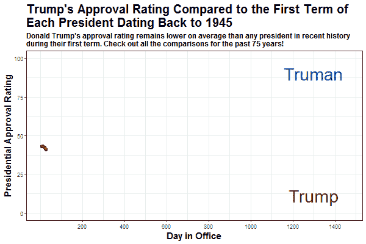

# 热爱数据的非数据科学家的三件事

> 原文：<https://medium.com/analytics-vidhya/three-things-for-non-data-scientists-who-love-data-4a88bf531998?source=collection_archive---------9----------------------->

## 引导你内心热爱数据的自我，即使你不认为自己是一个程序员

爱车是有理由编码的！来自 Unsplash 的 Boitumelo Phetla 的照片

每天当我打开 R 并查看我的代码时，我会想到它写得有多糟糕，或者试图找出我是如何写出如此复杂的东西的。如果你以前编码过，你会有 x100 以上的这种感觉，或者更多。这就是所谓的冒名顶替综合症，它不应该阻碍你作为一名数据科学家的成长。

但对我来说，这种感觉是有理由的。**唉，我不是数据科学家。**我不会整天泡在 R 或 Python 里。我不会造 AI 算法，也不会造 ML 模型。我几乎看不懂我写的一半代码(R 函数 lapply 和 map 仍然不断地困扰着我)。

**尽管我认为自己是一个数据科学骗子，但我无法停止对数据科学的热爱！给我一个问题，一些数据，一个谷歌浏览器和周六早上的几个小时，我会迷失其中，尤其是如果它与政治或选举有关。**

总的来说，**最大的收获是我不是数据科学家，但我热爱数据科学**。在我多年对这个领域的热爱中，我学到了一些可能对有时用 SQL 编码的会计师有帮助的要点；或者**在**班偶遇 R 的学生；或者可能只是一个普通人，他决定**超越 Excel，开始学习 Python，以便在工作/职业生涯中取得进步**。嗯，这篇文章是给你的。

我对热爱数据的非数据科学家的三条关键建议是:

# 1)追随你的激情&在上面撒一些数据分析

政治，体育，电影，艺术，金融，汽车，书籍。无论你的激情是什么，都有数据支持。利用这些公开的数据，稍微整理一下，制作一些很酷的图形、图表或可视化效果。不仅如此，还有针对这些主题的包和模块。

数据分析是关于深入挖掘某些主题并得出新的结论或结果。将这些新的结论/结果与你的爱好或激情联系起来是一种奇妙的感觉。无论是[创建一个显示选举结果的应用](https://www.policyinnumbers.com/apps/)，一个优化你的梦幻足球队的模型，还是可视化 imbd 电影排名，数据科学都可以让你对你的激情有一个全新的看法！

# 2)找出数据分析与你的生活和职业相关的原因

好像 AI 和 ML 无处不在。实际上，这些术语已经变得像“创新”或“协同效应”一样晦涩难懂，你可能遇到的最常见的人工智能是与聊天机器人交谈。但是数据分析无处不在，你不需要成为一个铁杆编码员来做它。

能够自信地阅读、清理和分析数据集将使你超越职场中 90%的人，并帮助你完成几乎任何工作。还记得在做 vlookup()或数据透视表时让你成为办公室里的 Excel 专家吗？现在，为你的团队构建一个简单的应用程序或编写一个自动图表也很容易(每周节省你 2 个小时)。无论你在职业生涯中做什么，数据都将(或可能)参与进来，以帮助提供更好的结果。关键是要弄清楚它会如何帮助你的职业生涯，并采取一些措施在那个领域做得更好。我永远不会编写 AI 或 ML 代码，但作为一名管理顾问和政治极客，创建很酷的可视化来交流信息是非常重要的。这是我通过冷静的想象达到的[，就像下面的](/analytics-vidhya/mesmerize-your-readers-with-animated-graphs-gifs-in-r-d29229f1a104)，这有助于确认我高于平均水平的沟通技巧。

我的总统支持率 GIF 展示了唐纳德·川普在四年总统任期内的支持率变化有多小(来源——迪伦·安德森，[用动画图&GIF 让你的读者着迷)](/analytics-vidhya/mesmerize-your-readers-with-animated-graphs-gifs-in-r-d29229f1a104)

# 3)使用数据科学社区，不要只是单独编码

这是一条我希望在我刚开始编码时就遵循的建议，也是一条我希望现在能更多遵循的建议。作为一名数据科学“冒名顶替者”,我总是对接触更广泛的 R 或 Python 社区感到紧张。然而，每次这样做，我都学到了更多关于数据科学和如何提高技能的知识。

需要知道的是，你并不孤单。实际上，成千上万的人现在正试图学习编码，尽管他们的工作不一定需要它。大多数最优秀的数据科学家都是从同样的职位**开始的**。因此，走出去，问问题，参加研讨会/网络会议，并成为任何你想从中获益的数据社区的一部分。相信我，这些人比你见过的任何人都更乐于助人！

# 总而言之…

我喜欢数据。我喜欢编码。我喜欢解决问题。最重要的是，我不喜欢做数据科学家。因此，尽管我有冒名顶替综合症，但我从所有的政治可视化、随机 Twitter 品牌情绪分析或选举地图中学到了很多，并找到了激情和职业发展之间的最佳平衡点。你也可以，而且你应该**永远不要让成为数据科学家的大胆想法阻止你用数据进化你的生活和职业。**相信我，如果你有任何疑问，请在 [LinkedIn](https://www.linkedin.com/in/dylansjanderson/) 或 [Twitter](https://twitter.com/dylansjanderson) 上直接给我发消息，我会消除你的犹豫！

*我是 Monitor Deloitte 的模拟战略顾问，我使用统计数据和分析为数字双胞胎模型提供信息，这些模型重新发明了公司进行战略决策的方式。在我的空闲时间，我痴迷于政治和政策，一直在数字* *的* [*政策上写博客。你可以在那里或者在我的*](http://www.policyinnumbers.com/)[*LinkedIn*](https://www.linkedin.com/in/dylansjanderson/)*和*[*Twitter*](https://twitter.com/dylansjanderson)*账号找到我(随意连接或者给我一个关注)。*