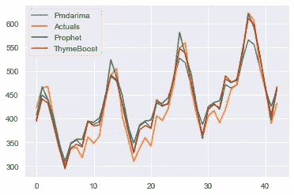

# 百里香增强剂、AutoArima、Fbprophet

> 原文：<https://medium.com/analytics-vidhya/thymeboost-7248297d3165?source=collection_archive---------1----------------------->

一种用于时间序列顺序学习的集成推进方法


大家好，最近怎么样？就像今天之前一样，我很高兴向你们展示序列数据学习领域的新东西，也就是时间序列。

正如你已经看到的，我已经不再为这个话题的含义和定义而东奔西跑。让我们把这个话题变得简单明了。

我有一个新的方法来处理顺序学习，它看起来很强大。

这种方法被命名为“百里香增强”。

根据文件记载

> “百里香增强将时间序列分解与梯度增强相结合，为辣度预测提供了一个灵活的混搭时间序列框架。最细的层次是趋势/水平(向前发展，这只是被称为“趋势”)模型、季节性模型和内生模型。这些用于近似每个“提升回合”的各个分量，后续回合以通常的提升方式拟合残差。”

算法的基本流程:


资料来源:pypi.org

要开始使用，请使用安装百里香增强

```
pip install ThymeBoost
```

我们将使用著名的“AirPassenger.csv”数据集来比较其他几个时间序列算法的性能。

让我们开始吧。

[百里香增强:负载数据](https://gist.github.com/rupak-roy/fc86dab94e0076abfcf6355d1937c1dc#file-thymeboost-load-data)

我们已经完成了数据集的加载和拆分，可以进行训练和测试以进行评估。现在让我们应用百里香增强

[百里香增强:建模](https://gist.github.com/rupak-roy/f22d2b22ec4f5668c337abbb1ddbe857#file-thymeboost-modeling)


百里香森林

搞定了。


绘图 _ 组件()

```
#to extract the components
predicted_output.predicted_seasonality
predicted_output.predicted_trend
```


百里香增强预测 _ 输出

ThymeBoost 还可以用于检测时间序列异常。

这是代码片段。

```
#detect outliers
boosted_model = tb.ThymeBoost()
output = boosted_model.detect_outliers(al_train,
                                       trend_estimator='linear',
                                       seasonal_estimator='fourier',
                                       seasonal_period=25,
                                       global_cost='maicc',
                                       fit_type='global')
boosted_model.plot_results(output)
boosted_model.plot_components(output)
```


绘图 _ 结果()


如果你想探索更多百里香的使用案例，这里有官方回购链接[https://pypi.org/project/ThymeBoost/](https://pypi.org/project/ThymeBoost/)

***就是这样！*** 通过与市场上其他流行的时间序列算法 **FbProphet 和 ARMIA** 的比较，我们将更进一步

[AutoArima，Fbprophet](https://gist.github.com/rupak-roy/247147762ae0893c2a57a00b0aaf9295#file-autoarima-fbprophet)



性能赋值

让我们把这些数字加起来

```
# Creating a dictionary
d = {'mae': [tb_mae,arima_mae,prophet_mae],
     'rmse': [tb_rmse,arima_rmse,prophet_rmse], 
     'mape': [tb_mape,arima_mape,prophet_mape]} 
performance = pd.DataFrame(d,index=["ThymeBoost","Arima","Fbprophet"])
```


表演

显然，我们可以看到百里香增强是所有评估指标的赢家。

我希望你喜欢这篇文章，并觉得它有用？

> L ikewise 带给你许多世界的精华…尽情享受吧！

请随意提问，因为**“好奇成就完美”**

我的一些另类网络存在是[insta gram](https://www.instagram.com/bobrupak/)[Udemy](https://www.udemy.com/course/ai-master-class)、Blogger、Issuu 等等。

Quora @[https://www.quora.com/profile/Rupak-Bob-Roy](https://www.quora.com/profile/Rupak-Bob-Roy)上也有

敬请关注更多更新。！祝你有愉快的一天…


[https://www.quora.com/profile/Rupak-Bob-Roy](https://www.quora.com/profile/Rupak-Bob-Roy)

# ~开心享受，很快聊。


这是工程:Pexel