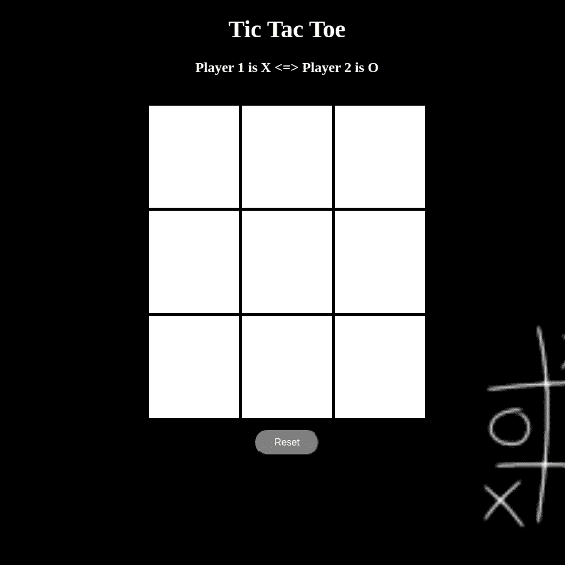

# 井字游戏

> 原文：<https://medium.com/analytics-vidhya/tic-tac-toe-5800d29d5e3?source=collection_archive---------9----------------------->

使用 HTML、CSS 和普通 Javascript

我很确定你还记得童年时的这个游戏，这个游戏是我们在无聊的学校讲座中幸存下来的原因之一，用我们粗糙的笔记本的背面，很怀旧，对吧。



不管怎样，今天我在这里帮助你用 HTML，CSS 和 Javascript 制作这个游戏，就像我曾经有机会发现的那样。

在进入细节之前，如果你想玩离线游戏，看看这个[这里](https://sakshi13-m.github.io/game/)。

让我们开始吧:

*   第一步将是创建一个 3x3 维的盒子，以发挥权利，使这一点，我们必须与 HTML 和 CSS 工作一点点。

```
<!DOCTYPE html>
<html>
<head>
 <title>Tic Tac Toe</title>
</head>// body is the web page shown to the users<body background="tic.jpg">
 <div class="tic" align="center">
  <h1 class="title" style="color: white">Tic Tac Toe</h1><h3 style="color: white">Player 1 is X <=> Player 2 is O</h3>// 3x3 box having 9 cells which will be used later to play <div id="Block">
   <div class="cell" id='a'></div>
   <div class="cell" id='b'></div>
   <div class="cell" id='c'></div>
   <div class="cell" id='d'></div>
   <div class="cell" id='e'></div>
   <div class="cell" id='f'></div>
   <div class="cell" id='g'></div>
   <div class="cell" id='h'></div>
   <div class="cell" id='i'></div>
  </div>
 </div>
</body>
</html>
```

正如你所看到的，这里有一些基本的 html 代码，首先是网页的标题，然后在正文中我们添加了一个 H1 的标题和一些对齐和样式的细节，然后使用

标签将我们的盒子分成九个单元格，每个人都有一个唯一的 id，所以我们可以相应地访问它们。

*   第二步是我们需要添加一些 CSS 样式，这样我们就可以区分 html 标签的单元格、主体、框和背景，因为我们可以使用 html 标签的类名。class”)或者如果我们有一个 HTML 标签的 id，我们可以把它称为(例如#box)，我们也可以直接使用标签的名称来引用标签(例如 body)。

下面是为 html 文件添加生命的 CSS 代码，我们通过在 html 文件的 head 标签中添加这一行来链接两者。

```
<link rel="stylesheet" type="text/css" href="tic_tac_toe.css">
```

你可以从我的 [git 库](https://github.com/sakshi13-m/game)中查看 css 代码。样式是涉及到个人创造力的，这里我使用了一些简单的属性来给我的网页增添活力。

*   第三步，最重要的一步，给网页添加逻辑，对，javascript 部分。因为我们已经有 9 个单元格要玩，所以第一件事就是让它们可点击，因为每当有人点击特定的单元格时，我们需要用“X”或“O”来替代

```
Logic is one thing that should be created by you only but if you want can look at my code.
```

可选:在顶部添加了一个小的计数检查器，以计算您刷新页面之前的胜率。

希望你喜欢这个游戏！！！

很高兴听到你的反馈…..