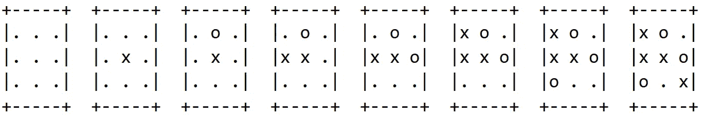
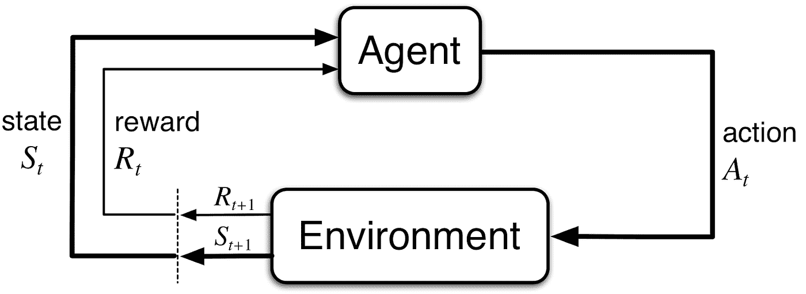
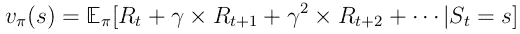
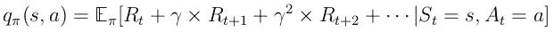
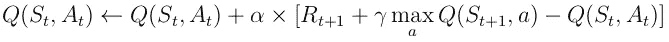

# 强化学习时代的井字游戏:第 1 部分

> 原文：<https://medium.com/analytics-vidhya/tic-tac-toe-in-the-age-of-reinforcement-learning-part-1-f85fc19229b1?source=collection_archive---------12----------------------->

最近我教我的孩子玩*井字游戏*，我记得我小时候也玩过。这是一种规则简单的游戏，因此小时候很容易学会，基本上是从石头剪子布开始的。这个游戏有时也被称为*零和交叉*，两个玩家在一个 3x 3 的桌子上交替放置一个十字(‘x’，玩家 1)和一个零(‘o’，玩家 2)。无论是垂直、水平还是斜向，任何一个玩家首先到达三个，就赢了。这是一个博弈的例子，一系列的移动，第一个玩家(x)获胜。

最终我们中的一个人想出了如何打败这个游戏，至少在作为第一个玩家玩的时候。从那以后，这个游戏就不再有趣了，因为第一个玩家总是会赢。

作为一名研究人员，在过去的几年里，我越来越专注于将机器学习与传统数学算法相结合。井字游戏的简单性使得使用多种技术来解决它成为可能。在这一系列帖子中，我将描述计算机如何使用简单的强化学习形式来学习玩井字游戏。虽然井字游戏并不十分有趣，但在解决这个游戏中起作用的数学思想却非常吸引人。我们将利用这些想法来看看井字游戏的哪些变体会带来更有趣的游戏。

# 强化学习

萨顿和巴尔托的书[1]为强化学习提供了一个很好的切入点，提供了以下直观的描述:

> *“强化学习是学习做什么——如何将情况映射到行动——以便最大化数字奖励信号。学习者不会被告知要采取哪些行动，而是必须通过尝试来发现哪些行动会产生最大的回报。”*

让我们在井字游戏的背景下解开这个描述。这里的*情况*是指游戏的*状态*(称为马尔可夫状态，用符号 *s* 表示)，例子如上图。一个*动作*(用 *a* 表示)是一个可以在特定游戏状态下选择的移动，意味着将玩家的砖块放置在一个开放区域中。一个*数字奖励信号*(用 *r* 表示)旨在引导学习者选择实现其目标的行动，例如奖励一个赢的游戏+100 的奖励，惩罚一个输的游戏-100 的负奖励，甚至惩罚一些负奖励的非法移动。在后一种情况下，学习者可以在没有被明确告知这些规则的情况下学习游戏规则。

这个学习者被称为*代理*，因为它在给定的状态下具有决定采取什么行动的代理。决策过程是一个*策略*，用于将情况映射到行动，描述在每个给定的状态下，每个行动被选择的频率。数学上，这叫做*条件概率分布，*，简明地写成 *π(a|s)* (“在给定状态下选择动作*a*s 的概率”)。

井字游戏是一个简单的游戏，在这个游戏中，很清楚当每个动作被采取时会发生什么。强化学习的主要优势之一是处理不太清楚的情况。通过引入一个*环境*来处理不确定性，该环境代表了代理可以与之交互的代理之外的一切。对于每个给定的状态 *s* 和选择的动作 *a* ，环境描述了游戏多长时间转换到一个新的状态*s’*以及多长时间给出一个相应的奖励 *r* 。在数学上，环境的这种*动态*再次由条件概率分布来表示，简明地写成 *p(s '，r|s，a)* (“对于给定的状态 *s* 和动作 *a* )转换到状态*s’*并获得回报 *r* 的概率)。

因此，代理和环境在选择动作和产生新的状态和奖励之间交替，这可以由下面的循环[1]图形化地描述:

这个循环可以无限地进行下去，或者直到达到某个终端状态(在井字游戏、和棋、赢或输的情况下)。

像井字游戏这样的多人游戏的一个特点是，产生下一个状态的环境的动态可以被解释为遵循某种策略的其他代理。这种对称性可以被用来通过自我游戏更有效地学习策略。

# 学习玩耍

通过对奖励信号的反应，代理人调整其策略，以适应一个越来越擅长击败其他玩家的人。但是它是怎么做到的呢？

几乎所有的强化算法都是通过估计值*v(s；π)* 的状态，或者通过估计值 *q(s，a；π)* 在给定状态下采取的动作。这里的*值*有一个技术定义，即当遵循一个给定的政策 *π* 时可以得到的*预期*的*总*奖励。一旦代理很好地掌握了状态和动作的值，它就可以简单地遵循使该值最大化的策略。

Q 学习提供了一种学习价值函数的简单方法。这里，我们将所有的状态-动作值存储在一个表中，该表列出了状态和动作的所有组合。对于井字游戏，这种组合的数量很少，足以让我们处理。这个 *Q-table* 通过将信息从转换传播到未来状态并使用简单的更新规则返回到早期状态来迭代更新。下面提供了数学细节，但是可以安全地跳过它们。

如果上述循环无限期地继续下去，通过*贴现*未来奖励可以避免讨厌的无限值。事实证明，将未来时间步 *t* 的奖励 *r* 乘以因子γᵗ，其中 0 < γ < 1，得到一个特别优雅的数学公式。准确地说，给定政策 *π* 下的状态 *s* 的值定义为从状态 *s* 开始并遵循政策 *π* 时的期望总贴现报酬:

类似地，在给定政策 *π* 下，在状态*s*采取行动 *a* 的价值被定义为在状态 *s* 采取行动 *a* 并遵循政策 *π* 后的期望总贴现报酬:

Q-learning 中的更新规则是:

在该规则中，通过在下一时间步估计的状态动作值的方向上移动步长 *α* 来校正状态动作值。

虽然价值的概念看起来很直观，但重要的是要注意，它取决于代理人的政策(从现在开始它计划如何行动)和环境，这包含了像井字游戏这样的游戏中对手的政策。

我们首先假设对手玩了一个随机的合法移动游戏(在把这个游戏介绍给我的孩子后，最初就是这样，尽管时间很短)。即使给代理分配一个随机的策略，也已经可以提供对游戏有趣的洞察。在谁先开始的游戏中有一个基本的不对称。两个随机玩家的差异有多大？在我的 Python 实现中模拟 100，00 0 个游戏，结果是玩家 1 赢了 58%的时间，玩家 2 赢了 29%的时间，剩下的 13%的时间游戏以平局结束。

如上所述，在学习状态-动作值之后，代理可以遵循最大化状态-动作值的策略。这将是下一部分的主题。

[1]萨顿和巴尔托，《强化学习:导论》，第二版(2018)