# 整理数据集

> 原文：<https://medium.com/analytics-vidhya/tidying-datasets-15186e0d6c6a?source=collection_archive---------12----------------------->

我的许多朋友、同事和熟人都使用小型数据集，在本文中，我试图解决他们面临的一些问题，并分享我使用小型数据集的经验。

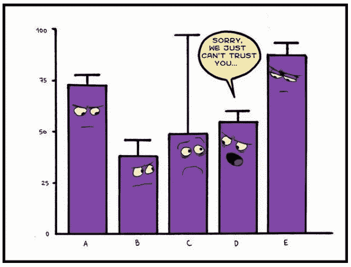

***幸福的家庭都很相似；每个不幸的家庭各有各的不幸。
——列夫·托尔斯泰*** 如果你曾经分析过数据集，托尔斯泰的这句话是有关联的，虽然所有好的/整洁的数据集都是标准的，但杂乱的数据集总是独一无二的，并且要花大量时间来清理/标准化它们。

一个杂乱的数据集有它自己的优势，它可能在视觉上很吸引人，或者很容易创建，但总是不可能用计算机来分析。

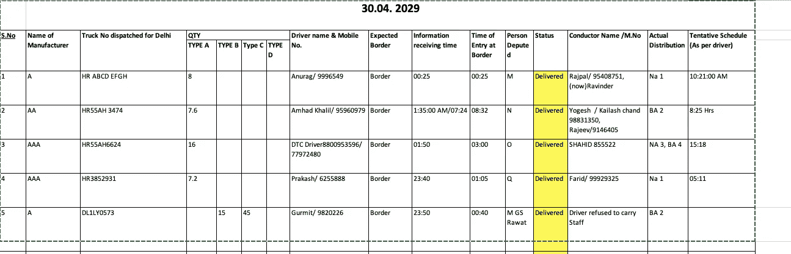

杂乱的数据集

上面显示的数据集是来自实时项目的真实数据集的示例，值已被更改以保持匿名。这个数据集在视觉上是全面的；也就是说，您可以在一行中确定卡车的行程，并提供所有需要的详细信息。如果您正在处理这 5 辆卡车，拥有这种类型的数据集是很好的，但是如果数量增加超过 10 辆，并且您必须了解超过一周的趋势，则该数据集将无法产生任何有意义的分析。

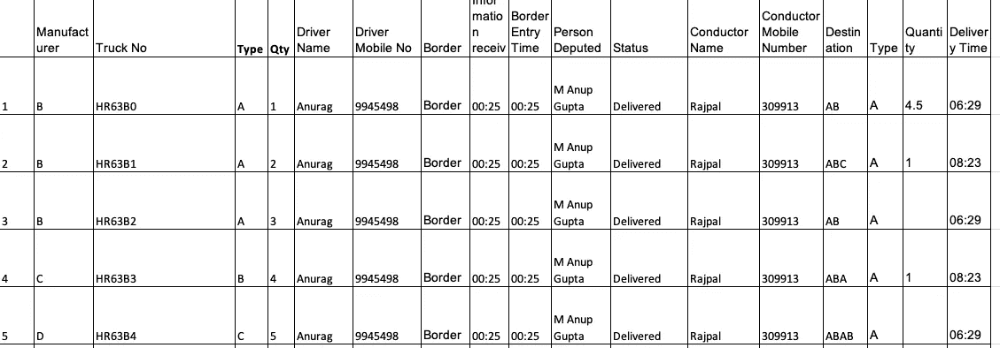

干净的数据

清理后的数据集在视觉上并不吸引人，但可以用来创建可视化和表格报告，如下所示。

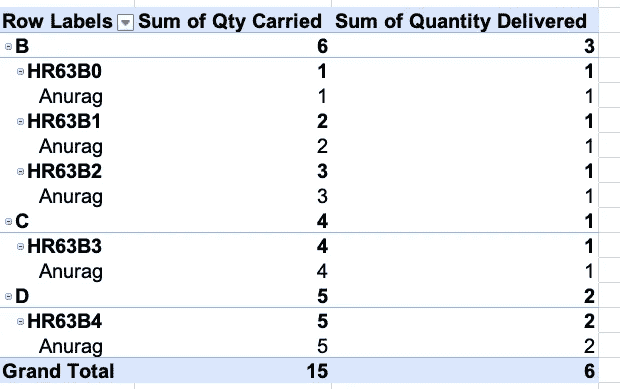

清理数据的数据透视表分析

清理数据集是数据分析的一部分，通常数据分析的大部分时间都花在清理上。进行数据清理是为了提高分析质量，消除人为错误，并根据收集的数据改进决策。

处理小数据集的人们的一个一致的问题是，数据从来不是以标准格式收集的。数据集通常是为直观展示而非分析而设计的。在接下来的段落中，我将分享什么是标准格式以及为什么需要它。我将触及与处理小数据集的人相关的其他几个方面数据分析和可视化。

***什么是数据集？***

"*数据集是可以是定性(数字)或定量(字符串)的值的集合*(Hadley Wickham，Tidy Datasets)
即以预定义结构收集的每个值都是数据集。数据集的结构有助于理解所收集数据的语义(含义)。结构和语义之间有着密切的联系。我们可以用一个通用的数据结构表来探索更多的结构和语义。

表格由行和列组成。可以在一个表中以多种方式收集观察值。

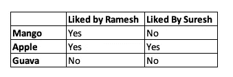

表 1

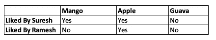

表 2

表 1 显示了与表 2 相同的数据，但是行和列被互换(转置)。

值有两种类型:观察和变量。
" *变量包含所有测量相同底层属性(如长度、宽度等)的值。)跨单位。一个观察值包含在相同单位(如一个人、一天或一场比赛)上跨属性测量的所有值。* ( [哈雷·威克姆，整理数据集](https://vita.had.co.nz/papers/tidy-data.html))

对于任何给定的数据集，识别观察值和变量是非常容易的。一般来说，定义变量和观察值是困难的。表 1 中表示了 18 个值。如果我们将数据从表 1 重新组织到表 3，我们将能够清楚地识别观察值和变量。

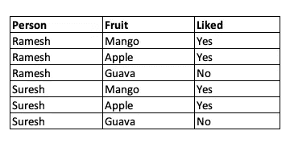

表 3

创建数据集布局时，定义变量是与上下文相关的。例如，对于一个水果商来说，如果他的目标是确定最受欢迎的水果，芒果、苹果和番石榴就是变量(表 2)。但是对于一群朋友做选择比较，他们的名字应该是表 1 中的变量。

但是对于一个处理多个数据集的分析师来说，我们必须使用可读的标准格式，表 3 通过将每个变量存储在一列中，将每个观察值存储在一行中来提供帮助。

***创建数据集的最佳实践是什么？***

*一般的经验法则是，描述变量之间的关系(例如，z 是 x 和 y 的线性组合，密度是重量与体积的比率)比描述行之间的关系更容易，比较观察组之间的关系(例如，A 组的平均值与 b 组的平均值)比比较列组之间的关系更容易。* "( [哈雷·威克姆，整理数据集](https://vita.had.co.nz/papers/tidy-data.html))

*“整齐的数据是将数据集的含义映射到其结构的标准方式。数据集是杂乱还是整齐取决于行、列和表如何与观察值、变量和类型匹配。在整齐的数据中:*

*1。每个变量形成一列。
2。每个观察值形成一行。
3。每种类型的观测单位形成一张表。"* ( [哈雷·韦翰，整理数据集](https://vita.had.co.nz/papers/tidy-data.html))

整齐的数据集有助于分析师或计算机提取所需的变量，因为它们提供了标准化的结构。

***创建数据集时的几个常见错误***

在创建数据集结构时，我们总是在识别变量和观察值时出错。文献中记载的一些常见错误有:

1.  *列名为值* 一个常见的错误是标题行是数字(见表 4)

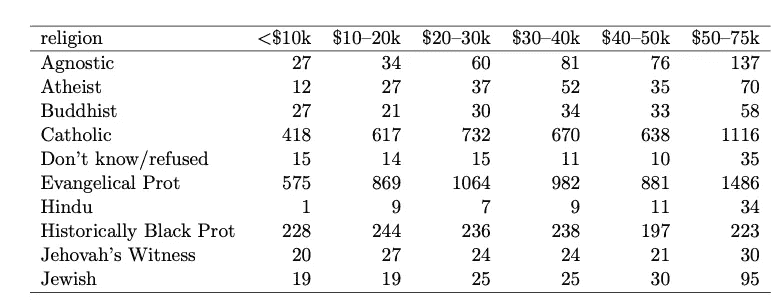

表 4

它在视觉上是显著的，显示了宗教与平均收入的数据；但是为了分析，数据必须按照宗教、收入和频率重新组织，如表 5 所示。表 4 的问题是数据集包含重叠的变量(通常称为熔融数据集)。

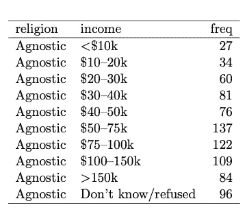

表 5

*2。多个变量存储在一列中。* 这是我们在喜欢速记和整理事物的人身上遇到的独特问题。让我们检查一下这个数据集

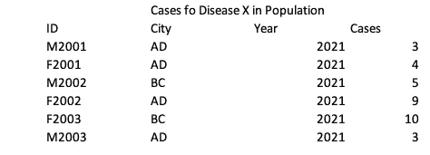

表 6

如果我们看到 ID 列，我们将重新定位 M2001 表示男性，2001。我们需要避免这些编码，除非我们在另一列中单独捕获数据。

*3。变量存储在行和列中* ***s.*** 有时由于视觉奖励，我们倾向于以在行和列中存储变量的方式存储数据集。

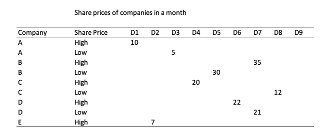

表 7

例如，在表 7(D10-31，未显示)中，高股价和低股价是独立变量，它们以列显示，日期可以记录在一列中。

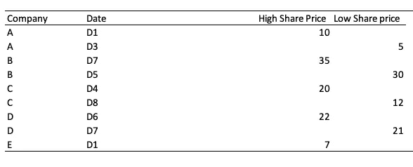

表 8

***报表***

在普通语言中，一切都是数据集或报告，但作为数据的用户，我们需要区分数据集和报告之间的区别。报告是根据对数据集的特定查询生成的，例如，您有一个关于德里一年的平均最高和最低温度的数据集。如果您的经理要求您展示一年中每个月的最高和最低温度，您将拿出相关数据并展示给他/她。你要展示的东西是报告。这不是一个单独的数据库。如果我们的数据库是标准的，并且你知道如何插入数据透视表，我们可以很容易地拉出报告；)

如果您非常确定该数据集永远不会用于分析，那么请将该数据集视为一个报告(我的意思是疯狂地使用数据集的视觉外观)

***数据可视化和数据分析***

经常有朋友和熟人找我，说他们想学习数据分析，我告诉他们 R 和与之相关的编码，吓了他们一跳。我最近意识到，从事小数据集工作的人通常只想学习数据可视化。数据可视化的目标是通过可视化的方式向用户清晰有效地传达信息。Tableau 是改善讲故事的一个强大工具，而 Google data Studio 和微软 BI 是可以使用的工具，如果你有一个不断更新的中型数据库。

数据可视化的高级形式是仪表板。您可以通过提取少量报告和数据图像来生成仪表板，以便对复杂系统有一目了然的了解。

仪表板最初是固定在畜力车/雪橇前部的一块木制/皮革制的木板，用来保护司机免受泥浆的伤害。发动机汽车也有同样的功能，但随着汽车设计的发展，发动机的位置变得更好，仪表盘上的仪表盘可以帮助司机”( [维基百科仪表盘下的条目](https://en.wikipedia.org/wiki/Dashboard))

仪表板非常有用，但是请不要为你参与的每个项目都建立仪表板。除非关键绩效指标/指标清晰明了并能及时衡量以做出决策，并且生态系统鼓励使用实时数据；不要建立一个仪表板，你会节省很多工作时间。对于小型数据集，数据透视表图表和表格在 MS Excel 和 Google Sheets 中都能很好地工作。

PS
在过去的两周里，我和一个充满活力的团队一起工作，目标是用来自多个来源的小数据集改进决策。该团队花了数小时创建漂亮的数据可视化、仪表盘，并生成了多份报告。在最初的日子里，我们都在与不合标准的数据集作斗争，并花费了大量的人力来清理和标准化它们。我写了这篇文章，希望在生活中看到更少的不合标准的数据集。

请永远不要在 MS excel 中垂直/水平合并单元格。我知道它们看起来很美，但对任何分析来说都很讨厌。

//*我很感谢 Hadley Wickham 发表的这篇论文增进了我对这个问题的理解*//