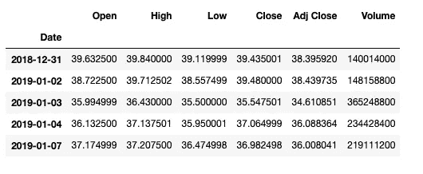
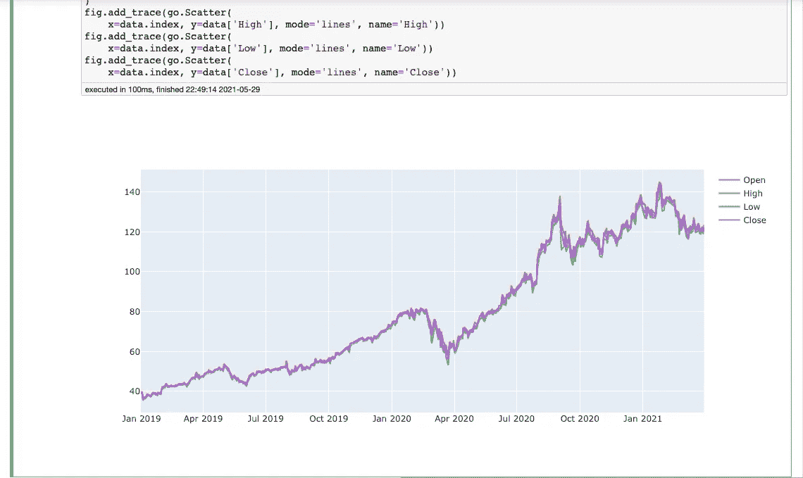
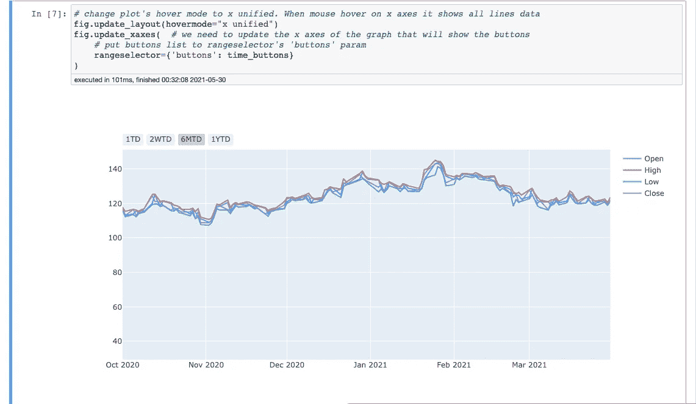

# 折线图的 Plotly 中的时间按钮

> 原文：<https://medium.com/analytics-vidhya/time-buttons-in-plotly-for-line-charts-5c4817cfbcb8?source=collection_archive---------8----------------------->

大家好，在这个故事中，我们将尝试理解 Plotly 的时间按钮。我很兴奋，因为当我在约翰内斯堡学习英语时，我正试着用英语写技术文章。请原谅我的英语:)让我们试着用 Plotly 来解释时间按钮。

可以从[这里](https://github.com/mebaysan/VeriBilimi/blob/master/Python/3-)KesifciVeriAnaliziVeVeriGorsellestirme/Plotly-Dash-Examples/Plotly-TimeButtons/Plotly-TimeButtons.ipynb)访问 jupyter 笔记本获取该代码。

# 自我介绍和准备

在开始使用时间按钮之前，我们需要安装一些依赖项。我们将使用 **yfinance** 包来访问股票数据。因此，我们需要用 pip 安装 yfinance 来安装 yfinance 包。之后，我们需要安装熊猫和 Plotly。

```
pip install yfinance
pip install pandas
pip install plotly
```

# 什么是时间按钮？

我们可以在折线图中添加时间按钮，以过滤或放大特定时间段。我们可以在大多数股票网站上看到它们。他们可以为我们提供特定时间段的详细图像。首先，我们需要学习一些关于这个东西的短代码。

*   **1D** =最后一天的数据
*   **1M** =上个月的数据
*   **1Y** =去年的数据
*   **YTD** =年初至今的数据等。

# 我们如何使用时间按钮？

Plotly 中的时间按钮是一个字典，列表中包含特定的键。

*   **显示在按钮上的文本标签**
*   **计算**当我们点击按钮时要走多少步
*   **步骤**移动日期周期(月、年、日等)。)
*   **步进模式**为**今天**或**向后。**“todate”表示从**步骤**中表示的最近的整个时间段的开始(在通过计数后退之后)。**向后倒**为刚才按**数向后倒。**

## 今天对明天

为了理解**今天**对**向后**，假设一个数据集在 10 月 20 日结束，每个选项有一个 6 个月的按钮。

如果 stepmode 等于 **backward** 将缩放图以在 4 月 20 日开始(因为向后)

如果 stepmode 等于**today**将缩放绘图至 5 月 1 日开始(4 月 20 日最近月份的开始)

# 获取数据并检查

现在我们知道了什么是时间按钮。我们可以把它们用在我们的地块上。我们将使用 **yfinance** 模块的**下载**功能来访问数据。当我们使用这个函数时，我们需要提供"**股票代码"** " **开始日期"**" T8 "**结束日期"**。首先，我们需要导入我们依赖的包。

```
import yfinance as yf
import pandas as pd
import plotly.graph_objects as godata = yf.download("AAPL", start="2019-01-01", end="2021-04-01")data.head()
```



如果您执行相同的代码，您将看到以下结果

# 让我们用计时按钮

## 创建时间按钮

为创建一个列表，其中包含关于带有特定键的按钮的特定词典。

```
time_buttons = [
    {'count': 1, 'step': 'day', 'stepmode': 'todate', 'label': '1TD'},
    {'count': 14, 'step': 'day', 'stepmode': 'todate', 'label': '2WTD'},
    {'count': 6, 'step': 'month', 'stepmode': 'todate', 'label': '6MTD'},
    {'count': 1, 'step': 'year', 'stepmode': 'todate', 'label': '1YTD'}
]
```

## 创建情节图

首先，我们正在创造没有任何情节的形象。之后，我们将为我们需要的列添加跟踪。

```
fig = go.Figure()fig.add_trace(go.Scatter(x=data.index,y=data['Open'],mode='lines',name='Open'))fig.add_trace(go.Scatter(x=data.index, y=data['High'], mode='lines', name='High'))fig.add_trace(go.Scatter(x=data.index, y=data['Low'], mode='lines', name='Low'))fig.add_trace(go.Scatter(x=data.index, y=data['Close'], mode='lines', name='Close'))
```

如果执行这段代码就会看到这个结果。



现在我们需要添加我们的按钮。我们可以用 **update_xaxes** 函数添加它们。

你看，我用了 **update_layout** 函数。用于更新悬停模式，当鼠标悬停在 x 轴上时，显示所有行数据。

我使用了 **update_xaxes** 函数来添加我们的时间按钮。我们需要更新显示按钮的图表的 x 轴。

```
fig.update_layout(hovermode="x unified")fig.update_xaxes(rangeselector={'buttons': time_buttons})
```



如果执行相同的代码，您将看到以下结果

我希望这篇文章能对你理解时间按钮有所帮助。可以从[这里](https://github.com/mebaysan/VeriBilimi/blob/master/Python/3-)KesifciVeriAnaliziVeVeriGorsellestirme/Plotly-Dash-Examples/Plotly-TimeButtons/Plotly-TimeButtons.ipynb)访问 jupyter 笔记本获取该代码。