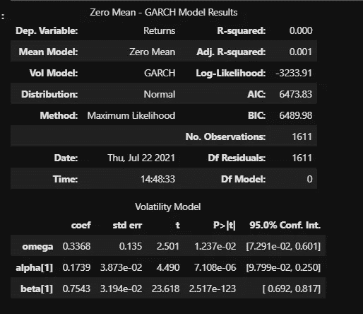

# Python 上的时间序列分析 101

> 原文：<https://medium.com/analytics-vidhya/time-series-analysis-101-on-python-3371deacf81b?source=collection_archive---------10----------------------->

时间序列分析的第一种方法

图片由[卢卡斯·布拉塞克](https://unsplash.com/@goumbik)提供，在 [Unsplash](https://unsplash.com/photos/UAvYasdkzq8)

# **简介**

当我第一次开始学习预测分析时，时间序列模型是我学习的第一件事。整个概念引起了我的兴趣，然而，我很难理解我到底在看什么。ARMA、ARIMA 和 GARCH 模型的模型和摘要页面铺天盖地。我开始做任何其他学生在对一个话题感到困惑时都会做的事情。我开始 ***谷歌*** 。看了一些文章，看了更多视频，比以前更迷茫了。我也没有广泛的数学背景，所以我发现了很多深入的东西。

我回到我的课堂笔记，复习了一会儿，试图抓住这个有趣的话题。一旦我认为我有了一个基本的理解，我回到课堂上和我的助教讨论我的结论，以确保我清楚地理解了一切。回顾我所经历的挫折和困惑，我想我应该分享一下理解这些模型的基本方法。我想告诉你，读者，这将不会进入太多的细节，因为它可能会变得势不可挡。这篇博客的目的是给你一个基础来建立。在这篇文章中，我将使用从雅虎财经收集的亚马逊股票价格来制作 ARMA、ARIMA 和 GARCH 模型。

在我查看每个模型的代码和分析之前，我将提供我将要查看的度量的基本概述。

1) **P 值** —模型中的 *p* 值将告诉我们我们的模型有多精确。通常，该值应低于 0.05 或 1–0.05，后者的准确度为 0.95%或 95%。p 值越低，模型对结果的预测就越好。

2) **系数** —系数是模型在我们的模型中迭代以给出最佳结果的数字。如果我们回想一下公式 y = m *x* + b，这些值就是“m”。系数用于构建我们对数据的最佳拟合线，以帮助我们预测未来的结果。

3) **标准误差** —标准误差是我们的最佳拟合线与实际数据点的距离。如果标准误差较低，这意味着该线更接近数据，可以推断为更好的模型。如果标准误差太低或基本为零，那么我们的模型可能会过度拟合。我们减去系数和标准误差，看这条线离实际数据点有多远。

4) **过度拟合** —过度拟合是指我们的模型在过去的数据上表现惊人，但当新数据到来时，它预测得很糟糕。如果我们的最佳拟合线穿过所有数据点，中间没有任何空间，那么我们可以假设它是过度拟合的。在数据点和最佳拟合线之间留有一些空间有利于预测未来值。

# 数据清理

导入库后，我将制作一个数据框，并绘制收盘价。从这张图中我们可以看出，亚马逊的股价从 11 年前开始呈指数增长。

我从 2015 年开始削减数据集，因为那时我们可以开始看到股票开始增长。

我想看噪音和趋势的原因是因为它显示了股票的波动性。趋势显示了在给定的时间框架内股票价格的方向。

我想看噪音和趋势的原因是因为它显示了股票的波动性。趋势显示了在给定的时间框架内股票价格的方向。

这张图向我们展示了亚马逊的股价在过去的 4-5 年里是如何波动的。趋势线显示了价格的上升，但没有波动。如果你看一下 new_df，你可以看到收盘减去噪声后的趋势。

当我们看噪声图时，我们可以同意上面关于波动性在大约 4-5 年前开始增加的说法。

# ARMA 模型

ARMA 模型由两部分组成，AR 和 MA。AR 是自回归的，MA 是移动平均线。AR 组件基于过去的*值预测未来值。MA 组件基于过去的 ***误差*** 预测未来值。您可能会问自己，这将用于什么样的场景？嗯，有很多预测未来值的用例。我将展示我们如何利用过去的股票价格来预测未来的价格。*

*为了准备在 ARMA 模型中使用这些数据，我们需要使数据集保持稳定。我们通过获取收盘价的百分比变化(例如，通过应用 pd.pct_change()函数)来实现这一点。如果您没有处理财务数据，也可以使用 diff()函数获得相同的结果。*

**

*如果您不确定您的数据是否是静态的，您可以始终应用。plot()函数来找出。由于我在原始数据集中使用了 close 列，如果我像上面那样绘制 close，您可以看到一个向上的斜率。这让我知道它不是静止的，需要转换。如果在应用了百分比变化或差异函数之后，它仍然不是稳定的，那么使用新列(在这种情况下是“Returns”列)并执行另一个百分比变化或差异。*

**

*当我们绘制 pacf 时，我们可以看到有一个重要的异常值。这也让我知道在运行 ARMA 测试时我们可以为订单使用什么。然而，这个异常值并不一定要在订单中使用。在这种情况下，我使用了不同的顺序，因为使用(1，1)在 *p-* 值上给出了完美的分数。我用(5，1)来帮助解释更多的*p*-值。pacf 也可以通过你愿意得到多少错误来解释。*

**

*然后，我从 statsmodels.tsa.arma_model 导入 ARMA，并为我的模型设置参数。*

*然后我把我的模型应用到。fit()函数将数据拟合到图形中。在我们拟合模型之后，我们可以继续绘制亚马逊价格的预测图；在这种情况下，我在未来做了 10 天。*

**

*现在让我们看看 ARMA 模型的摘要页面。正如你所看到的，这个页面上有很多信息。为了理解这个页面的基本思想，并确定我们的模型是否有效，我们应该首先查看一下 *p* -values (P > |z|)部分。这一部分将让我们知道我们的模型有多精确。我们希望看到小于或等于 0.05 的数字，以确保我们的模型具有统计显著性。*

*对于第一个系数，或 ar.L1，返回一个数字，在我们的例子中为 0。零意味着我们的 L.1 .是 100%准确的。但是当我们往下看，我们可以看到其他的数字都在 0.05 之外。记住，从上面我们希望 0.05 或更低的值是最准确的。第二个系数的 p 值为 0.386，这意味着这个系数的精确度为 0.61 或 61%。p*值越精确，我们的模型执行得越好。**

*接下来我们要看的是系数和标准误差。系数是我们的 ARMA 公式中使用的数字。如果计算出的*p*-值为 0.05 或更小，那么我们可以说 ARMA 计算中使用的系数是准确的。如果它们不准确，那么系数就不是用于 ARMA 函数的准确数字。在查看系数和标准误差时，我们减去它们，以查看这些系数与图表上的数据点有多远。这些系数很小，标准误差也小不了多少。我们可以据此推断，最佳拟合的线与数据点之间的距离很远。如果系数大于这些标准误差，那么线和数据点之间的距离会更小。*

*基于*p*-值、coefs 和 std err，我们可以分析得出结论，该模型对于预测亚马逊股票未来 10 天是不可靠的。所获得的*p*-值大于 0.05，这导致需要查看系数，因为这些系数给出了高的*p*-值。然后，查看标准误差，我们可以减去 coef 和 std err，如果 coef 显著下降，这不是好事，但如果变化很小，那就是好事。如果 coef 值显著下降，则可以推断它离最佳拟合线更远了。如果它没有显著降低该值，则可以推断它接近预测线。*

**

# *ARIMA 模型*

*我们要看的下一个模型是 ARIMA 模型。这个模型和 ARMA 模型的主要区别在于我们如何使我们的数据平稳。如上所述，要使数据集稳定，我们必须应用 pd.pct_change()或。diff()函数。一旦我们这样做了，我们就可以继续计算 ARMA。*

*对于 ARIMA，我们不需要做这个额外的步骤；模型为我们做了这件事。我们进口 ARIMA 和阿玛一样，只是把进口改为 ARIMA。然后我们用预测的数据填充我们的 ARIMA 模型。*

*在这种情况下，我们仍然使用收盘价，在填写订单之前，我们必须指定我们正在使用 amzn_data 数据框中的哪一列。该型号的订单也与 ARMA 略有不同。在 ARMA 模型中，阶数等于 AR，即自回归，MA 是移动平均值。对于 ARIMA 模型来说，这两个都是正确的，除了还有一个我们必须输入的值。我们必须插入一个参数使数据稳定。对于这个模型，我使用 1，所以它只做 diff()或 pct_change 一次，如果你做 2，它会做两次。通常情况下，你只需要做一次，使其静止，但如果你需要做更多次，这就是你如何指定运行的次数。你可能会问，“为什么我要做不止一次？”你可能做了一次，模型没有静止，但是你希望它静止。在这种情况下，您可以增加该参数，直到它变得稳定。*

****

*对于这个模型，我在订单中使用了全 1。我使用 pacf 中的主要异常值作为我的推理。*

*现在，让我们构建 ARIMA 模型，并查看摘要页面。*

*在查看该总结时，我们得到了 ARMA 的许多不同结果，并且这主要是基于订单。我在这里用 1 表示 AR 和 MA，在 ARMA 中用 5 表示 AR，用 1 表示 MA。当我们查看 *p* 值时，我们可以看到所有的值都是 0.00。这被认为是一个很好的模型，但是，你只能犯一个错误。当我们查看 coef 和标准差时，我们可以看到标准差比 coef 小，这很好地表明这些数据点接近最佳拟合线。*

**

*如果我们看看这个预报，我们可以看到未来 10 天的预测意味着什么。我们可以看到，第一天是下降，然后又回升，似乎在第 8 天和第 10 天趋于平稳。*

**

*如果我们比较 ARMA 和 ARIMA 总结，我们可以说 ARIMA 模型有更好的输出，仅仅基于我们使用的顺序。使用这些模型时，顺序将对我们的结果产生最大的影响。通常，AR 和 MA 输入的顺序应该相同。然而，在这篇博客中，我想展示什么是糟糕的结果，以及我们如何解释它们。*

# *GARCH 模型*

*如果我们想看看股票的波动预测，我们就使用 GARCH 模型。*

*我们将继续使用上面的亚马逊退货来构建这个模型。当我们定义 garch 变量时，我们插入我们的回报，我们将平均值设置为零，并且 *p* 和 *q* 都等于 1。我们使用 1 的原因与 ARIMA 模型的原因相同。我们可以查看部分自相关，看看有多少异常值来帮助我们确定 *p* 和 *q* 。正如我们之前看到的，只有一个显著的异常值。*

*当我们查看该总结时，p 值低于 0.05 阈值，这表明我们具有良好的系数。系数和标准误差之间的差异也很小，这使我相信我们的点离最佳拟合线不远。总的来说，这个模型特别擅长预测亚马逊股票价格的未来波动。*

**

*如果我们预测未来 5 天，我们可以看到股票价格的波动性将会增加。*

**

*让我们看一个图表来帮助我们更好地理解这一点。*

**

*我希望这是信息丰富的，能够帮助更好地理解这些模型。如果你对我在这里所做的任何工作有任何问题，请随时在 LinkedIn 上给我发消息或给我发电子邮件。*

*[linkedin.com/in/justin-farnan-051378156](https://www.linkedin.com/in/justin-farnan-051378156)*

*电子邮件:justinfarnan@rocketmail.com*

*点击访问代码库[。](https://github.com/justinm329)*