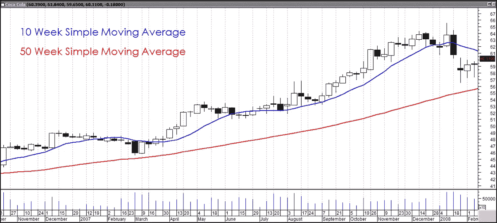

# 时间序列分析

> 原文：<https://medium.com/analytics-vidhya/time-series-analysis-d32cc707f871?source=collection_archive---------8----------------------->

# 正式的定义

时间序列是数据点的序列，通常在连续的时间测量，以均匀的时间间隔隔开。如果你收集地质数据，这个周期或统一的时间间隔可以大到一个世纪，如果你收集生物数据，可以小到一秒，如果你考虑经济数据，可以是四分之一。重要的问题是时间间隔必须一致。

时间序列分析包括用于分析时间序列数据的方法，以便提取有意义的统计数据和数据的其他特征。

时间序列预测是基于已知的过去事件使用模型来预测未来事件:在测量数据点之前预测它们。

**时间序列分析的假设**

过去的模式将延续到未来。

离散时间序列数据应在时间上等距分布。训练数据集中应该没有缺失值(或者应该在数据准备过程中使用适当的缺失值处理来处理)。

时间序列分析不能用于预测随机事件的影响(例如，恐怖袭击或天灾，如海啸、灾难等)。).

**什么是趋势成分？**

趋势是时间序列的长期模式。趋势可以是积极的，也可以是消极的，这取决于时间序列是表现出长期增长模式还是长期下降模式。如果一个时间序列不显示增加或减少的模式，那么该序列是平稳的。例如，人口在一段时间内增长，价格在一段时间内上涨，国家的商品生产在一段时间内增加。这些是上升趋势的例子。由于更好的产品进入市场，一种商品的销售可能会在一段时间内下降。这是下降趋势或下降趋势的一个例子。

销售与时间段

**什么是周期性成分？**

任何围绕给定趋势上下波动的模式都被认为是周期模式。一个周期的持续时间取决于被分析的企业或行业的类型。显示这些振荡运动的商业周期必须经过四个阶段——繁荣、衰退、萧条和复苏。

销售与时间段

**什么是季节性成分？**

当时间序列在每年的同一个月(或几个月)或同一个季度表现出有规律的波动时，就会出现季节性。这种情况年复一年地重复着。造成季节变化重复模式的主要因素是天气条件和人们的习惯。冬天出售的毛织品比夏天多。不管趋势如何，我们可以观察到，每年夏天卖的冰淇淋都多，而冬天卖的很少。节日期间百货商店的销售额比平时多。

销售与时间段

**什么是随机分量？**

这个成分是不可预测的。每个时间序列都有一些不可预测的成分，使其成为一个随机变量。这些变化是时间序列中的波动，持续时间短，性质不稳定，在发生模式上没有规律性。这些变化也被称为残差变化，因为根据定义，它们代表了在趋势、周期和季节变化之后时间序列中被遗漏的部分。不规则波动是由于洪水、地震、战争、饥荒等不可预见事件的发生而导致的。

销售与时间段

由于经济周期很难预测，大多数时间序列模式是根据趋势和季节性来描述的。不规则或随机事件可以通过使用简单、加权或指数移动平均来消除。

**理解不同类型的均线:哪一种更快？**

蓝色- 50 天加权移动平均线，紫色- 50 天指数移动平均线，红色-50 天简单移动平均线

**了解不同时期的均线:找出趋势**

蓝色- 10 周简单移动平均线，红色- 50 周简单移动平均线

现在我们如何进行预测呢？

总的想法是，我们提取一个趋势部分，调整季节性成分的趋势，并进行预测。现在可以有两种变化:

Y = T + C + S + e，或者 Y = T * C * S * e

其中 T =趋势分量

C =循环分量

S =季节性成分

e 是随机部分

这两种变化分别被称为加法和乘法模型。

**各种趋势**

# 参考

# 学术文献

*   [博什纳科夫，2011 年] G .博什纳科夫。 [*关于随机系数模型的一阶和二阶平稳性*](http://www.maths.manchester.ac.uk/~goran/research-reports/psrr03-2009.pdf) 。线性代数应用 434，415–423。2011.
*   [Breitung，2002 年] [*单位根和协整的非参数检验。*](https://pdfs.semanticscholar.org/e31b/c65824cc156d43d25b6ece0e9613b398233d.pdf) 《计量经济学杂志》，第 108 卷第 2 期，第 343–363 页。
*   [达尔豪斯，2012 年]达尔豪斯河(2012 年)局部平稳过程。在*统计手册*(第 30 卷，第 351-413 页)。爱思唯尔。
*   【Nason，2006】[Nason，GP](https://research-information.bristol.ac.uk/en/persons/guy-p-nason(c22adede-c5fc-4692-9b91-24afa15868b6).html) 2006，[平稳与非平稳时间序列](https://research-information.bristol.ac.uk/en/publications/stationary-and-nonstationary-time-series(c0005c54-b407-414e-944c-92fca5df2a2b).html)。在 H Mader & SC Coles(编)*火山学中的统计学。*地质学会，第 129–142 页。
*   [Vogt，2012 年] Vogt，M. (2012 年)。局部平稳时间序列的非参数回归。*统计年鉴*， *40* (5)，2601–2633。
*   古吉拉特语，基本计量经济学，第 5 版，塔塔麦格劳-希尔
*   使用 SPSS 发现统计数据，第二版，Sage 出版物
*   Hair，j .，Anderson，r .，巴宾，b.《多元数据分析》,第 7 版，普伦蒂斯霍尔
*   n . k . malhotra，Dash，s,《营销研究:应用导向》,第 5 版，培生教育
*   Rud，O. P,《数据挖掘食谱:营销、风险和客户关系管理的建模数据》, John Wiley & Sons，2000 年

# 在线参考

*   [特征方程的根与其逆的根的倒数](https://stats.stackexchange.com/questions/185200/roots-of-characteristic-equation-reciprocal-to-roots-of-its-inverse)
*   [随机过程特征](https://www.mathworks.com/help/econ/stationary-stochastic-process.html)
*   [趋势平稳与差异平稳过程](https://www.mathworks.com/help/econ/trend-stationary-vs-difference-stationary.html)