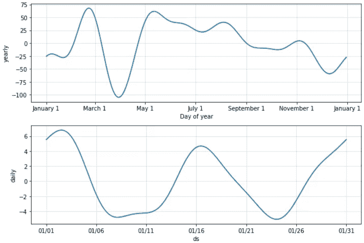

# 基于深度学习和 Fbprophet 的加密货币时间序列分析

> 原文：<https://medium.com/analytics-vidhya/time-series-analysis-of-cryptocurrencies-using-deep-learning-fbprophet-48abdb2e7ebf?source=collection_archive---------2----------------------->

## 理解各种加密货币，并使用机器学习和深度学习来预测它们

科技日报在 [Unsplash](https://unsplash.com?utm_source=medium&utm_medium=referral) 上拍摄的

## 要点

1.  本文由加密货币预测和使用不同算法的分析组成，分析和预测考虑的主要加密货币是比特币(BTC)、以太坊(ETH)、Chainlink (LINK)、比特币现金(BTC)、XRP (XRP)。
2.  加密货币的预测是有形的，需要对日常资金流动有很多了解。
3.  机器学习行业已经取得了很大的进步，并将进一步发展，这种进步使我们有了更大的解决问题的技术，即任何格式的数据预测或趋势分析。
4.  用于这种分析的算法是 LSTM(长短期记忆)，它是深度学习的一部分，还使用了 Fbprophet，它是用于预测的自动机器学习。
5.  用于算法分析的度量是 MAE(平均绝对误差)。使用的编程语言是 Python，它解决了大多数用例。

## 介绍

人工智能是机器学习和深度学习的根源，机器学习是人工智能的子集，深度学习是机器学习的子集。深度学习在许多方面对人工智能的进步发挥着重要作用，使用这样一个重要的特征来预测日常数据会给出更好的结果，也有助于理解各种被忽视的方面。加密货币已经发展并增长到非常大的数量，估计达到十亿美元的产业。理解如此巨大的数字货币是困难的，并且估计趋势的变化也是重要的，因为趋势的变化可能导致特定加密货币的盈利或亏损。一年来，随着新货币的出现，加密货币的数量增加了，数字货币的引入可以告诉市场对它们的需求，由于这种货币的不存在，很难跟踪这种变化，这就是深度学习将派上用场的地方。深度学习不仅可以预测任何货币的高低，还可以根据提供的数据集来判断月、周或日的趋势变化。时间序列分析已被用于分析不同的数字货币，并基于特定货币的每日报告提供估计。使用的加密货币有比特币(BTC)、以太坊(ETH)、Chainlink(链接)、比特币现金(BTC)、XRP (XRP)。这些货币基于每种加密货币的受欢迎程度而具有不同的价值；对这些值的估计可能会因每个值而异。用于分析这种数字货币的深度学习算法是 LSTM，它代表长期短期记忆，是一种特殊的 RNN(递归神经网络)。与前馈神经网络不同，LSTM 有一个反馈连接，这使它很特别。使用的另一个自动预测程序是 Fbprophet，这是一个基于事件预测数据的自动机器学习，它基于线性模型拟合数据集，可以通过调整参数将模型转换为非线性或逻辑增长。

## 文献评论

数字货币在过去几年中一直在增长，这种趋势可以追溯到它开始的那一年，可以观察到加密货币变得越来越大，具有巨大的市场价值。对这种加密货币进行精确预测分析对于跟上行业发展非常重要。时间序列分析起着重要的作用，可以追溯到论文《用机器学习方法预测加密货币价格时间序列》，由 Derbentsev，Vasily 于 2019 年发表，它表明了对加密货币市场价值的理解发生了重大变化，这清除了所有与机器学习概念相关的疑虑[3]。这种信息流有助于通过理解概念来巩固基础。另一篇论文“使用搜索引擎预测加密货币的回报和数量”，发布于 2019 年，该报告使用搜索引擎显示了以交易量为类别的加密货币价格预测。这澄清了与数字货币相关的各种趋势的概念，因为数量与价格的上涨直接相关，反之亦然。机器学习在更好地理解与人工智能相关的概念方面发挥着重要作用，这些概念可以通过使用深度学习来淹没[7]。这种基于各种算法对数据进行预测的分析深度学习的特定概念在“预测加密货币时间序列的集成深度学习模型”一文中得到了澄清。，发表于 2020 年[4]。这篇特别的研究论文使用了深度学习的概念来分析加密货币的时间序列。深度学习概念可能很难与可能不同于机器学习的不同算法相关联，重要的是建立一个适当的模型，该模型可以描述与一系列日期相关的变化值，这特别有助于理解如此重要的标准。另一种方法与自动机器学习算法有关，该算法用于解决季节性相关问题，该问题对于克服数据的时间序列预测非常重要[1]。这篇论文发表为“使用单变量 ARIMA 模型和 Fbprophet 预测开源项目中的软件缺陷趋势”，解决了与 2020 年发布的特定模型相关的查询[5]。

## 方法学

文章的这一部分讨论了用于获得期望输出的不同方法，这些方法在实验结果中进行了解释。该方法分为两个子部分，即:

**长短期记忆算法**

> 递归神经网络被称为 RNN，这是一种反馈神经网络，它向神经元提供输入，其中有不同的隐藏层，并对其进行处理，以获得由用例定义的特定输出。有不同类型的反馈神经网络，其中一种是 RNN。正常神经网络和递归神经网络之间的基本区别在于，基本神经网络从训练数据中学习并确定由激活函数触发的输出，而递归神经网络在从训练数据以及从由输入生成的输出中学习时做同样的事情，这是使特定算法有用的附加特征。递归神经网络的最佳版本是 LSTM，它代表长短期记忆，这个版本的 RNN 用于解决与消失和爆发梯度相关的问题，长短期记忆网络是最受欢迎的网络之一，它使用与递归神经网络相同的概念，它理解对特定用例最有用的信息，并丢弃无用的信息。

**Fbprophet**

> Fbprophet 是一个自动机器学习包，它有助于使用季节性来预测数据，季节性可以基于每天、每周、每月和每年。季节性可能是数据观察者在特定时间后重复出现的东西，最适合季节性的例子是冰淇淋销售在冬季和夏季的变化。这对于最佳拟合数据非常重要。Fbprophet 可用于根据任何季节性来拟合和预测数据，并随后用于获得此类预测的分量，这些分量可根据每周变化、每月变化和每日变化来改变数据趋势。Fbprophet 预测的方程可以通过(1)来理解，这显示了方程的不同组成部分。
> 
> y(t) = g(t)+h(t)+s(t)+et (1)
> 
> 用于拟合日期的 Fbprophet 的以下组件如下
> 
> y(t) =加性回归模型
> 
> g(t) =趋势因子 h
> 
> (t) =假期组成部分
> 
> (t) =季节性成分
> 
> et =误差项

## 实验结果

这篇研究论文的实验部分由各种测试和通过执行迭代获得的结果组成。本文包括基于时间序列数据的加密货币分析，该时间序列数据是使用 python 中的 JSON 从硬币市场通过网络抓取数据而提取的。时间序列分析所遵循的步骤可以在下图中理解。

各种趋势的时间序列架构-作者图片

> 加密货币价格预测的主要步骤包括
> 
> **数据预处理:**是考虑数据清洗和选择对分析重要的参数的部分。
> 
> **构造&分解时间序列:**这是与分析相关的用例被考虑的地方。这些步骤中涉及的重要子因素是每日、每周、每月&年度选择。
> 
> **构建模型:**这一步涉及到根据选定的参数创建一个模型来预测数据。
> 
> **预测:**这最后一步涉及到基于测试数据的模型预测，以及对模型性能的理解。

用于分析和预测的数据集来自 Moneycontrol.com-图片由作者提供

数据集以 80–20 的比例分为训练和测试两部分，80 %用于训练，其余 20 %用于测试。

训练和测试数据集分叉-按作者分类的图像

用于时间序列分析的算法是 LSTM，它是一种智能 RNN，这种特殊的模型是因为其反馈能力而被考虑的。长短期记忆模型是基于不同的参数建立的，这个神经网络中包含的参数是输入层、隐藏层和输出层，时间序列分析中建立的模型的摘要可以在下图中看到。

作者用于预测图像的简单 LSTM 算法

可以观察到，序列模型具有用于输入的 1 层，100 个输入节点连接到 0.2 的丢弃层，以避免模型的过拟合，该模型紧密连接到具有线性激活函数的最后一层。用于模型的优化器是 Adam &损失函数分别是 MSE(均方误差)。该模型分别适用于 20 个时期和 32 个批量的训练数据。实际数据点与预测数据点的比值与 MAE(平均绝对误差)成正比。平均绝对误差可以根据预测值、真值和总数据点来计算。MAE 值越低，获得的预测结果越好，反之亦然。

每种加密货币的预测可以分别从图中看到，该图显示了基于训练数据和对模型的理解的不同加密货币的实际和预测图，该模型被训练用于分析。

比特币 Vs 比特币现金预测-作者图片

以太坊 Vs 链环预测-作者图片

XRP 价格预测-作者图片

另一种时间序列分析方法是基于 Fbprophet，这是一种自动机器学习算法，用于处理数据集的季节性。在本研究中，季节性是每日和每年，用于基于加密货币数据集的趋势分析。下图显示了基于训练数据集的日期预测，应用于所有预测的时间段为 15 天。下图分别是比特币加密货币、比特币现金、以太坊、Chainlink 和 XRP 加密货币的曲线图。

比特币 Vs 比特币现金 Fbprophet 预测-作者图片

以太坊 Vs Chainlink Fbprophet 预测-作者图片

XRP Fbprophet 预测-作者图片

同样，Fbprophet 提供了不同的组件，可以根据这些组件来分析趋势，它每天、每月、每周和每年都有所不同，这有助于避免季节性。季节性是基于相同的频率发生的，最好的例子是“夏季冰淇淋的价格与冬季冰淇淋的价格”。用于趋势分析的季节性曲线图可以从下图中观察到。

使用 Fbprophet 预测比特币年度与每日成分-作者图片

使用 Fbprophet 预测比特币现金年度与每日组成部分-作者图片

作者使用 Fbprophet- Image 进行以太坊年度与每日成分预测

作者使用 Fbprophet- Image 进行链环年度与每日组件预测

作者使用 Fbprophet- Image 进行 XRP 年度与每日成分预测

每种加密货币的平均绝对误差是用于理解基于变化的数据集中的变化的度量，变化是时间。基于不同数据集的不同误差值导致了实际数据点到预测数据点的变化。训练和验证数据集的 MAE 值的这种变化可以通过下图来理解。

平均绝对误差与加密货币-图片由作者提供

可以观察到，在上图中，Chainlink 取得了最高的 MAE 验证分数，其次是以太坊&比特币现金。同样，以太坊和 Chainlink 分别获得了最高的 MAE 训练分数。MAE 越高，实际值和预测值之间的差异越大，反之亦然。

## 结论

该研究旨在了解基于数据集季节性的不同加密货币的时间序列分析。用于这种分析的算法是 LSTM &另一种方法是 Fbprophet。用于评估分数的度量是 MAE，该分数是为所有加密货币生成的，表明值越低，验证数据集的预测越好。在这个实验中，观察到比特币加密货币产生的最低误差值为 0.01867，其次是比特币现金为 0.02632。由于 MAE 得分较低，基于实际数据点与预测数据点的曲线图与上述两种加密货币相同。这意味着训练模型最适合这两种数字货币，因为与其他货币相比，误差率较低。使用的另一种预测方法是 Fbprophet 模型，这是一种自动机器学习模型，用于预测和理解基于季节性的趋势变化，本研究中的季节性是每天的。这显示了 15 天后每种加密货币的预测。

## 参考

[1]卡塔尼亚，利奥波德，斯特凡诺·格拉西。"模拟加密货币金融时间序列."*可在 SSRN 3028486* (2017)获得。

[2]卡塔尼亚、莱奥波尔多、斯特凡诺·格拉西、弗朗切斯科·拉瓦佐洛。"预测加密货币时间序列的波动性."*精算和金融的数学和统计方法*。施普林格，查姆，2018。203–207.

[3] Derbentsev，Vasily 等，“使用机器学习方法预测加密货币价格时间序列” *SHS 网络会议*。第 65 卷。EDP Sciences，2019。

[4] Livieris，Ioannis E .等人，“预测加密货币时间序列的集成深度学习模型。”*算法* 13.5 (2020): 121。

[5]施拉夫、迈克尔·托马斯和埃米尔·约万诺夫。"使用单变量 ARIMA 模型和 FBProphet 预测开源项目中的软件缺陷趋势."*智力。J. Softw。英语。*8.1(2020):1–15。

[6]玛兹德，马什图拉。*利用时间序列数据预测股票价格*。Diss。Brac 大学，2019。

[7] Adur Kannan，Bhuvana 等人，“使用传统方法和机器学习预测备件零星需求-比较研究。” *SMU 数据科学评论* 3.2 (2020): 9。

[8] Mensi、Walid、Khamis Hamed Al-Yahyaee 和 Sang Hoon Kang。"加密货币价格的结构突变和双长记忆:来自比特币和以太坊的比较分析."*金融研究快报*29(2019):222–230。

## 在你走之前

研究论文:[https://ieeexplore.ieee.org/document/9397004](https://ieeexplore.ieee.org/document/9397004)