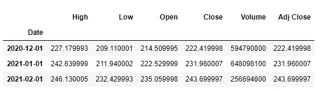
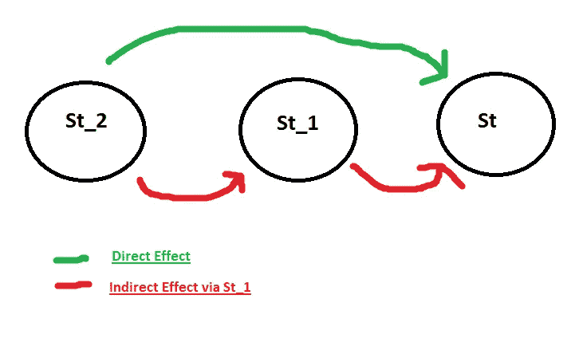
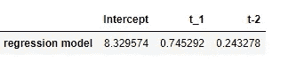
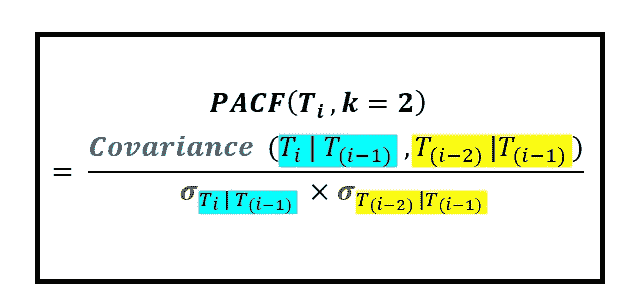

# 时间序列自相关与部分自相关

> 原文：<https://medium.com/analytics-vidhya/time-series-auto-correlation-vs-partial-auto-correlation-7ca55f9fd6e2?source=collection_archive---------13----------------------->

不是只为自己写笔记的博客:)

问题陈述:我们有一只股票的月度数据，我们将通过比较前几个月的价格来预测这只股票的月平均价格，因此在此之前，我们需要了解预测变量与因变量/产出的相关程度

这是我们的情况的符号

Sti =本月的股票价格

Sti _ 1 =上个月的股票价格

Sti _ 2 =个月前的股票价格

> 时间序列中最重要的概念是，它帮助我们根据过去的经验(价值)预测变量(股票)的未来行为

在我们的情况下，当我们有 2 个预测变量 Sti_1 和 Sti_2 时，我们必须找到 Sti(输出)的值

为了检查预测变量是否能帮助我们预测值，我们必须检查它们之间的相关性

让我们看看股票 MSFT 每月的收盘价



MSFT 过去 3 个月的价格

所以我们必须找出当月价格和两个月前价格之间的相关性。在符号形式中，我们必须找到 CoRR(Sti_2，Sti)

一种方法是找出它们 Sti_2，Sti 之间的 ACF(自相关)

我们可以使用 *pearsonr()* SciPy 函数来计算皮尔逊相关系数

```
import pandas as pd
import pandas_datareader.data as webdata = web.get_data_yahoo('MSFT','01/31/2019','01/31/2021',interval='m')corr_data = pd.DataFrame(data.Close,index=data.index)
corr_data['t_2'] = corr_data['Close'].shift(2)
corr_data.dropna(inplace=True)from scipy.stats import pearsonr
corr,_= pearsonr(corr_data.t_2,corr_data.Close)
print('Pearsons correlation: %.3f' % corr)
Pearsons correlation: 0.942
```

从理论上讲，自相关(ACF)包括两个因素

1.  直接影响(直接路线)
2.  间接影响(间接途径)



Sti_2 价格对 Sti_1 价格有某种**直接影响**同样，Sti_1 价格对 Sti 有某种直接影响。因此，我们可以说 Sti_2 通过 Sti_1 对 Sti 价格有一些**间接影响**，但是 Sti_2 价格对 Sti 价格也有一些直接影响。

(在实际情况下，这些影响可能是由各种原因引起的，这些原因与 MSFT 公司对其产品的决策或管理层在市场上推出新产品有关)

所以这两个分量构成了自相关函数

正如我们看到的皮尔逊相关:0.942 相当高，这是因为间接效应成分，我们不能保证 Sti_2 是 Sti 的良好预测因子

所以为了找到它们之间的直接关系，我们使用偏相关

在偏相关中，它只关注 Sti_2 价格(预测变量)对 Sti(产出)的直接影响

为此，我们建立了一个回归模型

St =φ21 St _ 1+φ22 St _ 2+εt

因此，系数φ22 给出了 St_2 对 St 的直接影响(即 k =2 的 Pacf)

```
linReg = LinearRegression(fit_intercept=True)
linReg.fit(corr_data[['t_1','t_2']], corr_data.Close)
loadings = np.insert(linReg.coef_, 0, linReg.intercept_)
out = pd.DataFrame(loadings, columns=['regression model'])
out = out.transpose()
fullNames = ['Intercept'] + ['t_1','t-2']
out.columns = fullNames
```



我们的回归模型截距和系数

所以我们的 St_2 和 St 价格之间的直接相关性是 0.243278

计算部分相关的另一种方法



[理解部分自相关|通过 Sachin 数据|走向数据科学](https://towardsdatascience.com/understanding-partial-auto-correlation-fa39271146ac)

**总结(直接来自博客)**

Ti *_2* 的变化有多少没有被 Ti *_1)* 的变化所解释我们做两件事:

1.  **第一步:**我们用线性回归模型(即直线)拟合 *T i(现价)*对 *Ti_1* 的分布。这个线性模型将让我们从*t1)*预测 *Ti(当前价格)*。从概念上讲，这个线性模型允许我们将 *T* 的方差解释为 *Ti_1* 的方差的函数。但是像所有最佳拟合模型一样，我们的模型不能解释所有的 *Ti* 的变化。这个事实把我们带到了第二步。
2.  **第二步:**在这一步中，我们计算在第一步中建立的线性模型的残差。残差是 *Ti* 的观测值与模型预测值之差。我们对 *Ti* 的每个值进行残差计算，以获得残差的时间序列。这个残差时间序列给了我们想要的东西。它给出了无法用 *Ti-1* 的方差来解释的 *Ti* 的方差，当然还有一些噪声。

为了计算相关性中的第二个变量，即 *Ti_2)* 中无法用 *Ti_1)* 中的方差来解释的方差，我们在 *Ti_2* 和 *Ti-1* 的上下文中执行上述步骤 1 和 2，而不是分别在 *Ti* 和 *Ti_1)* 的上下文中执行。这给了我们寻找变量 2 的残差序列。

最后一步是将皮尔逊相关系数公式应用于这两个残差时间序列。

```
c*orr_data = pd.DataFrame(data.Close,index=data.index)
corr_data['t_1'] = corr_data['Close'].shift(1)
corr_data['t_2'] = corr_data['Close'].shift(2)**corr_data.dropna(inplace=True)
from sklearn.linear_model import LinearRegression
linReg = LinearRegression(fit_intercept=True)**model = linReg.fit(corr_data[['t_1']],corr_data.Close)**corr_data['Predicted_Close|T_1'] =linReg.predict(corr_data[['t_1']])**corr_data['Residuals_Close|T_1'] = corr_data['Close'] -corr_data['Predicted_Close|T_1']**model = linReg.fit(corr_data[['t_1']],corr_data[['t_2']])**corr_data['Predicted_t_2|t_1'] = linReg.predict(corr_data[['t_1']])
corr_data['Residuals_t_2|t_1'] = corr_data['t_2'] - corr_data['Predicted_t_2|t_1']*corr, _= pearsonr(corr_data['Residuals_Close|T_1'],corr_data['Residuals_t_2|t_1'])
corr
0.23979474295389985
```