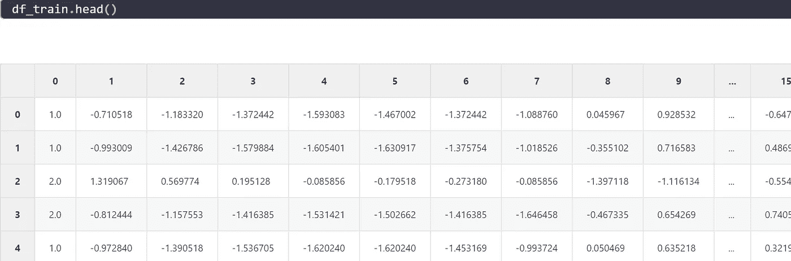

# 卷积时间序列分类

> 原文：<https://medium.com/analytics-vidhya/time-series-classification-with-convolutions-ed5cb33b1e3b?source=collection_archive---------5----------------------->

卢卡·布拉沃在 [Unsplash](https://unsplash.com?utm_source=medium&utm_medium=referral) 上的照片

时间序列可能很难。时间序列可能需要大量的特性工程来完成工作。即便如此，就模型的复杂性而言，结果可能看起来有点平淡无奇。在这篇博文中，我想展示如何用 1D 卷积神经网络来处理时间序列，以及结果是多么令人印象深刻。所以系好安全带上路吧！

在这篇文章中，我将使用意大利电力需求数据集。分类任务是区分 10 月到 3 月(含)和 4 月到 9 月。数据集可以在这里找到[。目前为止，网页上显示的最佳准确率为 97%。让我们看看我们能走多近。](http://www.timeseriesclassification.com/description.php?Dataset=ItalyPowerDemand)

这是数据集的样子。第一列代表我们应该预测的类。接下来的 24 列是代表意大利不同地区电力需求的数据。接下来的任务是正确分类，这个月是冬天还是夏天。

这是两个不同地区不同月份的电力需求的例子。上半部分是 1 类，代表冬天的一个月，下半部分代表 2 类的情况，代表夏天的一个月。

我将使用 PyTorch 实现这个模型，它提供了很大的灵活性和方便的助手类，如 dataset 和 dataloaders。有了这些类，我们可以很容易地批量训练我们的模型，我们也可以利用 CUDA(如果我们想的话)。

既然我们的数据加载器中已经有了数据，我们就可以开始构建模型了。这篇文章是关于动手操作的，我将把数学留到另一篇文章中。所以让我们检查模型，首先我们创建 1D 卷积层。

对于卷积，我们可以自由选择输出维数，但是，卷积后新创建的张量的长度是预定义的，计算如下:

在我们的卷积之后，我们希望 L 维等于 1，所以我们可以把它展平。我们有一个 24 的序列。根据该公式，我们可以计算当相应地设置 kernel_size、padding 和 exploation 时卷积 L 如何变化。或者，我们可以手动检查:

如果你愿意，你可以随便摆弄这些数字。我们希望最终 L 的值是 1。手动网格搜索后，我想出了一个模型，其中我们只使用一个卷积，内核大小为时间帧(至少差不多)。之后，我应用一个 max_pooling 层。现在我们知道如何建立模型:

这看起来并不复杂，对吗？请记住，没有特征工程，没有额外的模型来找到任何时间相关的模式，简单明了的 1D 卷积，然后是 max_pooling，然后是完全连接的层。由于这是一个二元结果变量，我们对损失函数和标准 Adam 优化器使用交叉熵。让我们来训练这个:

我们的模型正在学习，它在验证集上做得很好。然而，这个数据集只有 67 个训练案例(我将其分为 60 个用于训练，7 个用于验证)。真正的测试还在等待，测试集。这套包含 1000 多个案例。所以让我们来看看结果。

光荣！我们达到了 97%的准确率！这是该数据集目前的最佳结果。让我们来看看错误分类的时间序列。

我们可以看到这些案例很难正确分类。尤其是第一种情况看起来几乎像是贴错标签。

在这种非常实用的方法之后，在下一篇博客中，我将讲述一维卷积的工作方式及其背后的数学原理，敬请关注！

拉塞

(本帖最初发布于此:[https://lschmiddey . github . io/fast pages _/2021/04/30/time series _ class ification _ with _ convolutionalneuralnet . html](https://lschmiddey.github.io/fastpages_/2021/04/30/Timeseries_Classification_with_ConvolutionalNeuralNet.html)