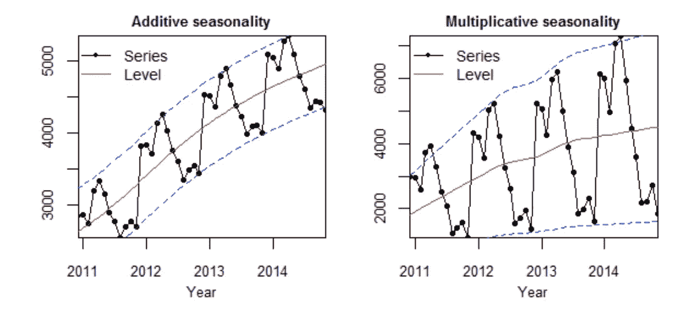

# 时间序列预测 101

> 原文：<https://medium.com/analytics-vidhya/time-series-forecasting-101-9353f9e30c20?source=collection_archive---------13----------------------->

时间序列是按时间顺序进行的一系列观察。

时间序列预测使用有关历史值和相关模式的信息来预测未来活动。通常，这与趋势分析、周期性波动分析和季节性问题有关。

趋势、季节性和随机性的观察

# **为什么要进行时间序列预测？**

如果自变量是

*   未知的
*   无法使用
*   可能不符合数据
*   难以预测

**典型时间序列**

# **时间序列的成分**

*   趋势
*   季节性
*   随机成分

# 趋势

要提取的第一个组件是趋势。有许多方法可以做到这一点，一些最简单的方法包括计算移动平均值或中位数。

# 季节性

一旦数据去除了趋势，季节性将是我们时间序列中出现的循环模式。

当然，去除数据趋势的方法需要加法或乘法，这取决于时间序列的类型。由于此时我们不知道时间序列的类型，我们将两者都做。

# 随机/余数

现在我们有了两个分量，我们可以计算两种情况下的残差，看看哪个更合适。

**将时间序列分解成 3 个分量**

**曲线拟合/时间回归方法**

**回归准时**

当趋势最明显时使用

**纳入季节性——虚拟变量法**

**季节性回归模型**

**纳入季节性——另一种方法**

取趋势预测( **ŷ** )和实际值(𝑦).
根据*加法*或*乘法*模型，计算偏差

(𝑦**ŷ**，if *加法*或𝑦/ **ŷ** ，if *乘法*)并映射为季节性效应

对于每个预测。

*   取季节性值的平均值。用这个来做未来的预测。

**季节性**

季节性是时间序列的共同特征。它可以以两种形式出现:加法和乘法。在前一种情况下，季节变化的幅度与水位无关，而在后一种情况下，季节变化的幅度与水位有关。下图突出了这一点:

加法和乘法季节性

*   如果季节性补偿是稳定的，使用附加季节性
*   如果季节性竞争不稳定，那么就用倍增的季节性
*   注意，在倍增季节性的例子中，季节变得“更宽”。

显然，如果水平降低，倍增情况的季节性幅度也会降低。

为了选择合适的模型进行预测，我们需要了解我们正在处理的季节性类型。

让我们选择附加季节性。

*   在加法时间序列中，各部分相加在一起构成时间序列。如果你有一个增加的趋势，你仍然会看到在整个时间序列中大致相同大小的波峰和波谷。这通常出现在指数化时间序列中，其中绝对值在增长，但变化保持相对。

附加季节性

现在，让我们看看倍增的季节性

*   在乘法时间序列中，各部分相乘得到时间序列。如果你有一个增加的趋势，季节性活动的幅度会增加。一切都变得更加夸张。当你查看网络流量时，这是很常见的。

倍增季节性

**按时回归的问题**

*   如果没有趋势，或者季节性和波动性比趋势更重要，那么系数的表现就很奇怪

让我们在未来的博客中探索更多的限制。

*   霍尔特-温特斯
*   ARIMA
*   ARIMAX
*   萨里玛

**参考文献:**

[https://kourentzes . com/forecasting/2014/11/09/加法和乘法季节性/](https://kourentzes.com/forecasting/2014/11/09/additive-and-multiplicative-seasonality/)

快乐学习！