# 时间序列预测—完全指南

> 原文：<https://medium.com/analytics-vidhya/time-series-forecasting-a-complete-guide-d963142da33f?source=collection_archive---------0----------------------->

在本文中，我将解释时间序列预测的基础知识，并演示如何用 Python 实现各种预测模型。

照片来源 Unsplash 上的 NeONBRAND

预测是一个我们通常与天气联系在一起的词。当我们听或看新闻时，总有一个单独的部分叫做“天气预报”，新闻评论员在那里为我们提供天气预报信息。为什么预测如此重要？嗯，因为我们可以做出明智的决定。

现在，预测方法主要有两类，即定性预测和定量预测。

在定性预测中，预测决策依赖于专家意见。没有可用的数据来研究这些模式，以便做出预测决策。由于涉及到人类决策，因此有可能出现偏差。

在定量预测中，具有模式的数据是可用的，并且这些模式可以在计算机的帮助下被恰当地捕获。因此，不涉及人类决策，因此不存在人类偏见的可能性。

当我们将一个时间或时间成分与预测相关联时，它就成为了**时间序列预测**，并且该数据被称为**时间序列数据。**用统计学术语来说，时间序列预测是使用统计和建模来分析时间序列数据以做出预测和明智的战略决策的过程。它属于定量预测。

**时间序列预测**的例子有下周的天气预报、每天股票收盘价的预测等。

为了做出接近准确的预测，我们需要收集一段时间内的时间序列数据，分析这些数据，然后建立一个有助于做出预测的模型。但是在这个过程中，有一些规则可以遵循，帮助我们达到接近精确的结果。

**粒度规则:**这条规则规定，你的预测越汇总，你的预测就越准确。这是因为汇总数据的方差更小，因此噪音也更小。

**频率规则:**我们需要经常更新数据，以便捕捉任何可用的新信息，这将使我们的预测更加准确。

**眼界法则:**避免做太多未来的预测。这意味着我们应该在短时间内进行预测，而不是对未来进行太多的预测。这将提供更准确的预测。

## 时间序列数据的组成部分

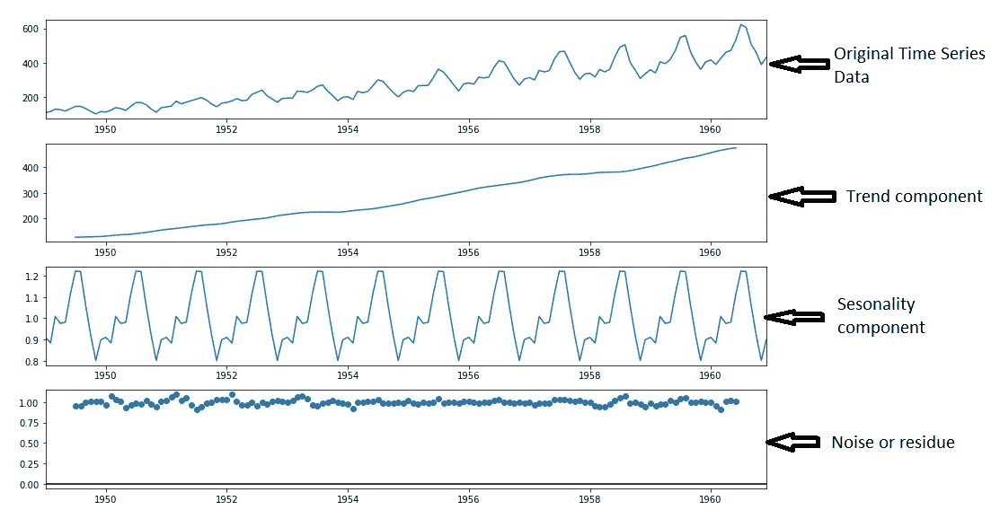

让我们一个一个地了解每个组件的含义。

1.  **级别**:任何时间序列都会有一个基线。在这条基线上，我们加入不同的成分，形成一个完整的时间序列。这条基线被称为**级**。
2.  **趋势**:定义一段时间内，时间序列是增加还是减少。也就是说，它有上升(增加)趋势或下降(减少)趋势。例如，上述时间序列有一个增加的**趋势**。
3.  **季节性:**它定义了一个在一段时间内重复的模式。这种周期性重复*的模式被称为**季节性**。在上图中，我们可以清楚地看到季节性因素的存在。*
4.  ***周期性**:周期性也是时间序列数据中的一种模式，但是它不定期的重复*，也就是说它不会在固定的间隔后重复。**
5.  ****噪音**:我们提取了水平、趋势、季节性/周期性之后，剩下的就是**噪音**。噪声是数据中完全随机的波动。**

**当我们对时间序列进行分解时，我们得到了上述组件。时间序列分解主要有两种类型，即**加性季节分解**和**乘性季节分解**。**

**理解这一点的简单方法是，当手头的时间序列的单个分量相加得到原始时间序列时，它被称为加性季节分解。如果需要将各个分量相乘来获得时间序列数据，则称之为乘法季节分解。使用一种分解类型而不使用另一种的主要原因是残留物不应该有任何模式。也就是说，应该只是一些随机的波动。**

## **时间序列预测 Python 实现**

**借助一个例子，我们现在将看到各种预测技术是如何在 python 中实现的，以及它们的有效性。**

**让我们首先理解我们将用来评估这些预测技术的评估指标的含义。**

****RMSE:R**oot**M**ean**S**Squared**E**rror 是均方误差(MSE)的平方根。MSE 只不过是预测值与实际值或真实值之间差异的一种表示。我们取平方根是为了避免负号，因为误差可能是正的，也可能是负的。它由以下公式表示:**

**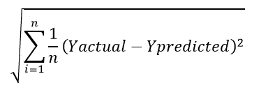**

**MAPE:误差是衡量一个预测系统有多准确的标准。它以百分比的形式来衡量这种准确性，并且可以计算为每个时间段的平均绝对百分比误差减去实际值除以实际值。它由以下公式表示:**

****

**其中 *Yactual* 是真实值，而 *Ypredicted* 是该特定时间的预测值。 *n* 是观察次数。**

**RMSE 和 MAPE 都应该尽可能低。**

****这是问题陈述**:全球超市是一家在全球范围内运营的网上超级大商店。它在全球范围内接受订单并交付货物，服务于 7 个不同的地理区域市场—(非洲、APAC(亚太地区)、加拿大、欧盟(欧盟)、EMEA(中东)、拉丁美洲、美国(美国))。它涉及所有主要的产品类别—消费类、企业类和家庭办公类。我们需要**预测利润最稳定的细分市场的销售额。****

****注意**:文章中使用的代码和图表都在 python 文件中，其链接在文章末尾给出。**

# **分析流程:**

****1。导入所需的库**
**2。阅读并理解数据**
**3。探索性数据分析**
**4。数据准备**
**5。时间序列分解**
**6。建立和评估时间序列预测****

1.  ****导入所需的库****

**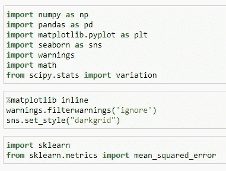**

**2.**阅读并理解数据****

**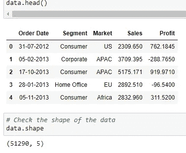****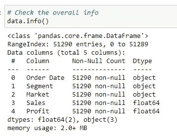**

**我们的数据有 51290 行和 5 列，没有丢失值。**

**3.**探索性数据分析****

**我们对各种属性进行异常值分析，发现在利润和销售额列中确实存在异常值。**

**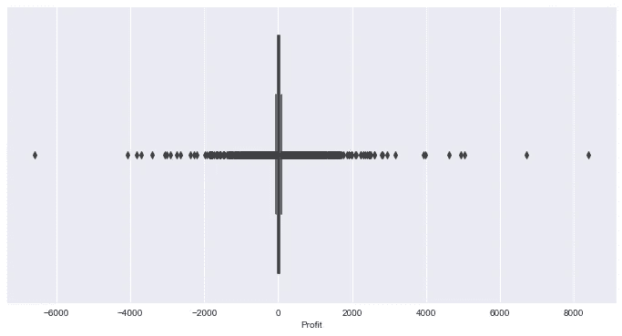****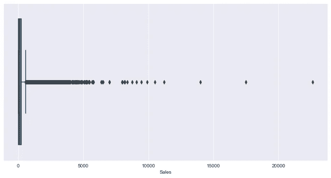**

**在时间序列数据中，存在与所有时间戳相关的观察值，因此我们不能删除异常值，因为这会导致数据丢失并影响其连续性。**

**我们进行了单变量、双变量和多变量分析，这是图表。**

**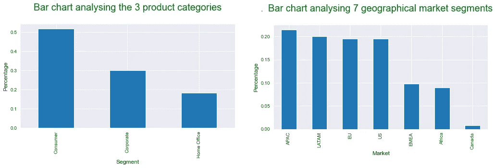**

**单变量分析**

****

**双变量分析**

**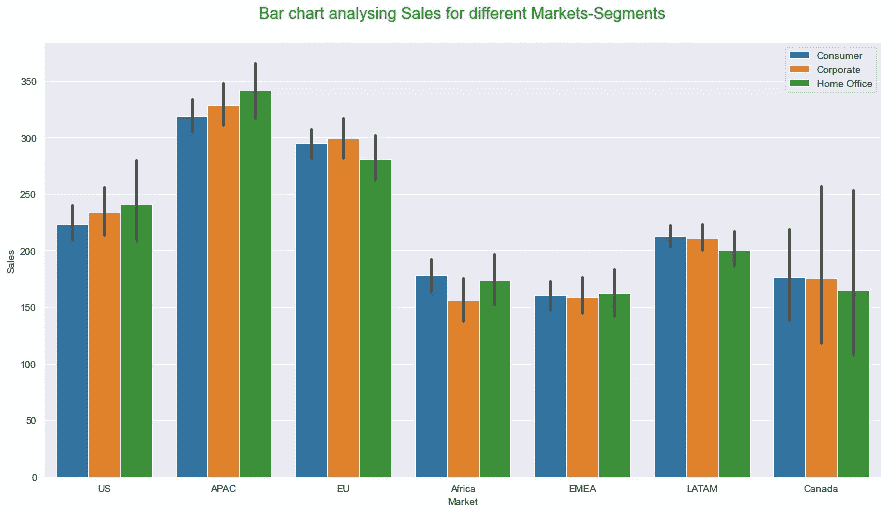****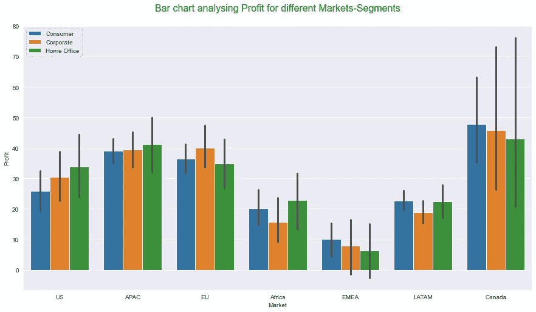**

**从上面的图表中，我们可以看到**加拿大消费者是利润最高的细分市场**而 **APAC 家庭办公是销售额最高的细分市场组合。****

**根据问题陈述，我们需要通过组合 3 个产品细分市场的 7 个地理市场来找到 21 个细分市场。我们通过合并两列(市场和细分市场)来创建一列**细分市场**。**

**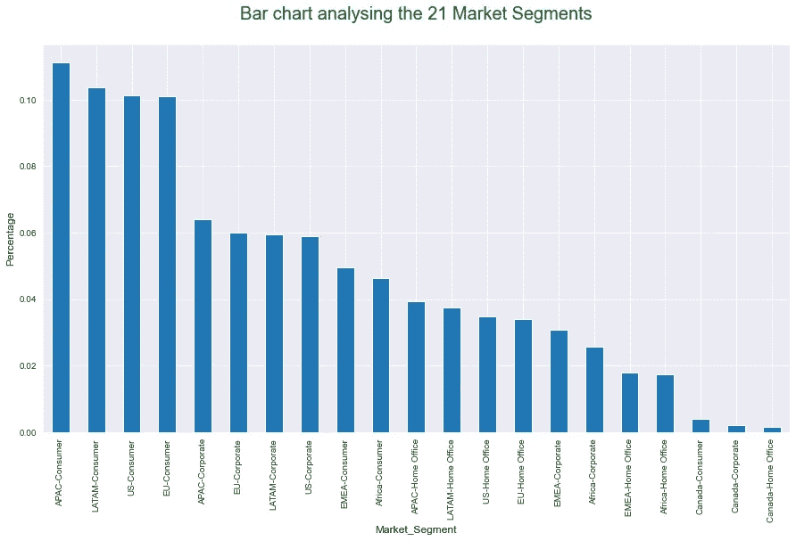**

****训练-测试分割:**我们将数据分割成训练集包含 42 个月，测试集包含 6 个月的数据。**

****持续盈利的细分市场:**变异系数是标准差与均值的比值。我们需要找到利润变异系数最小的细分市场。这是因为，标准偏差越小，意味着利润的变化越小，也就意味着该地区在给定时期的利润数字越一致。我们计算 42 个月内 21 个细分市场的变异系数(训练数据),以确定哪个细分市场持续盈利。**

**我们发现 **APAC 消费者**是变异系数最小的细分市场。这意味着 APAC 消费者细分市场的利润数字在列车组期间保持一致。因此，我们选择这个细分市场来进一步计算和预测销售额。**

****

**我们对**APAC-消费者**市场细分的数据进行过滤，并按订单日期对结果数据帧进行分组，以获得包含订单日期和销售额的时间序列数据。我们称之为数据 1。**

****

# **时间序列分解**

**我们的时间序列数据如下:**

****

**我们执行加法和乘法季节分解如下:**

**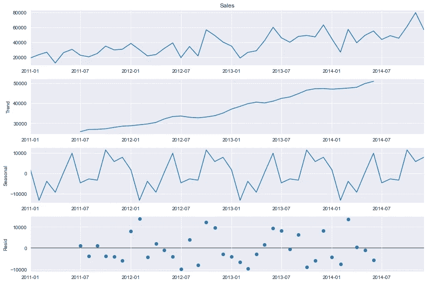****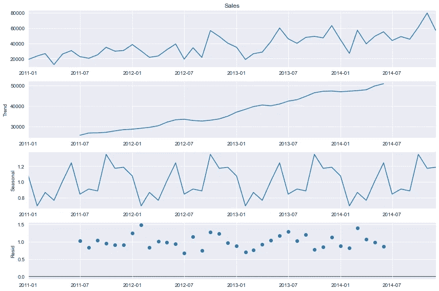**

**左加法季节分解，右乘法季节分解**

**显然，这些数据包含季节性因素。我们建立各种时间序列预测模型，并比较所有模型的 **RMSE** (均方根误差)和 **MAPE** (平均绝对百分比误差)值。RMSE 和 MAPE 的值越低，则模型表现越好。精度计算为(100 — MAPE)。MAPE 值越低，精确度越高。**

**我们现在将看到预测销售额的各种预测方法。**

## **简单时间序列预测方法**

**3 属于这些方法的有简单平均法、简单平均法和简单移动平均法。**

**天真的方法只是延续了最后的观察结果。简单平均法使用所有观察值的平均值进行预测，简单移动平均法使用移动平均值进行预测。**

**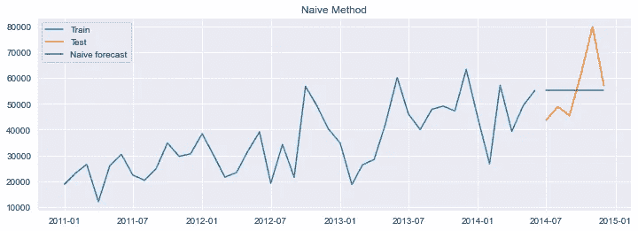********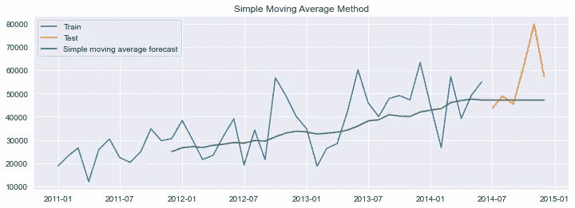**

**RMSE 和 MAPE 值如下所示:**

****

**从上图可以看出，在简单的预测方法中，简单移动平均法表现最好。**

## **指数平滑技术**

**即简单指数平滑技术、霍尔特趋势法和霍尔特温特法。**

**在简单平均法中，过去的观测值被平均加权，而在简单指数平滑技术中，最近的观测值比过去的观测值被赋予更大的权重。它捕捉数据中的水平，但不捕捉趋势或季节性。另一方面，霍尔特的方法可以捕捉水平和趋势，但不能捕捉季节性。霍尔特温特的方法可以捕捉所有的水平，趋势和季节性。**

**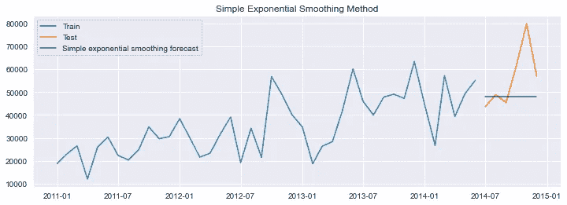****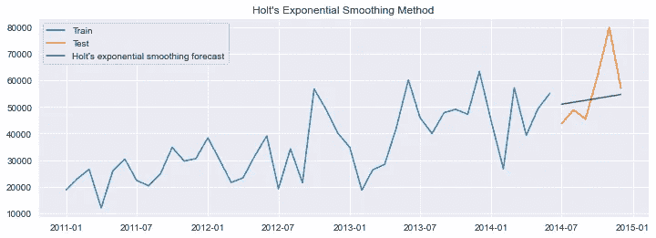****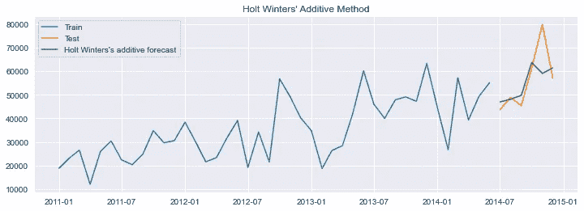****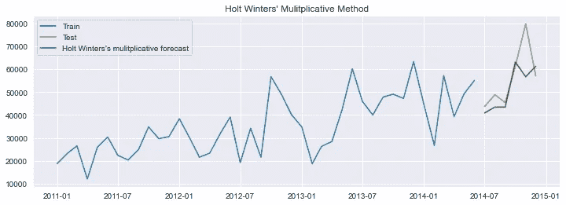****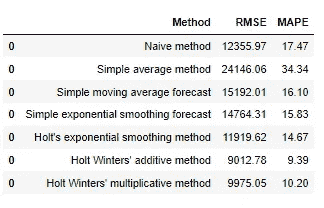**

**我们的结论是，平滑技术中的霍尔特温特斯加法能够预测更接近实际值的销售额。与其他模型方法相比，这种方法的 RMSE 和 MAPE 值较低。这种方法能够很好地捕捉数据中的趋势和季节性。**

## **自回归方法**

**在自回归方法中，回归技术用于预测未来的观测值，使用过去观测值的线性组合。但是对于这一点，时间序列应该遵循两个假设:平稳性和自相关性。**

**对于平稳的时间序列，均值、方差和协方差应该是常数。自相关帮助我们了解一个变量是如何被它自己的滞后值影响的。**

**有两个测试来确认稳定性，如下所示:**

****科维亚特科夫斯基-菲利普斯-施密特-申(KPSS)试验:****

1.  **零假设(H 0):序列是平稳的:p 值> 0.05**

**2.替代假设(H a):序列不是平稳的:p 值≤0.05**

****扩增迪基-富勒(ADF)试验:****

1.  **零假设(H0):序列不是平稳的:p 值> 0.05**

**2.交替假设(Ha):序列是平稳的:p 值≤0.05**

**我们对我们的时间序列数据进行这些测试，并得出结论，时间序列不是平稳的。为了使其平稳，我们需要执行**差分**(使均值恒定)和**变换**(使方差恒定)。**

**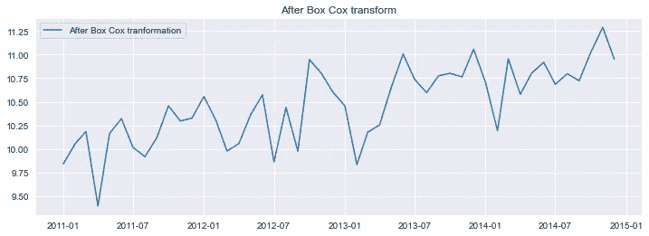****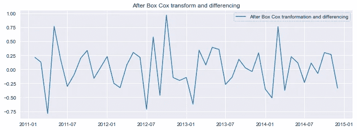**

**我们执行训练测试分割，并使用自回归技术进行预测。**

## **自动回归方法**

**这种方法使用线性回归，利用一个或多个过去的观测值来预测未来的观测值。**

**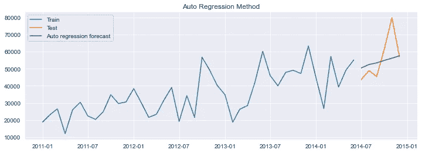**

## **移动平均法**

**在这里，未来值是在类似回归的模型中使用过去的预测误差来预测的。**

**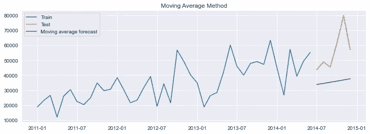**

## **自回归移动平均法**

**是 AR 和 MA 模式的结合。**

****

## **自回归综合移动平均线(ARIMA)**

**它与 ARMA 模型相同，只是增加了一个积分差分部分。之前，我们对数据应用了 box-cox 变换和差分，以使时间序列数据稳定。这里，我们只是在构建模型之前应用 box-cox，并让模型处理差异，即趋势组件本身。**

**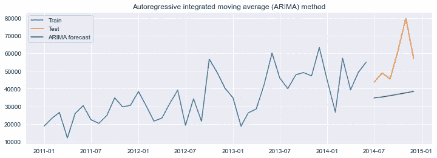**

## **季节性自回归综合移动平均线**

**萨里玛和 ARIMA 一样，只是多了一个季节性因素。**

****

**在实现所有预测模型后，我们计算所有方法的 RMSE 和 MAPE。**

****

**我们的结论是，**霍尔特温特斯加法**和**季节自回归综合移动平均(SARIMA)技术**对数据的销售预测效果最好。这两种方法都具有较低的 RMSE 和 MAPE 值，并且能够很好地捕捉数据中的趋势和季节性成分。**

**这就完成了我们的分析。希望这篇文章内容丰富，易于理解。此外，我希望您喜欢分析分析中包含的彩色图表。**

**请随意评论并给出您的反馈。**

*****可以在领英上联系我:***[***https://www.linkedin.com/in/pathakpuja/***](https://www.linkedin.com/in/pathakpuja/)**

*****请访问我的 GitHub 个人资料获取 python 代码。文中提到的代码，以及图表，可以在这里找到:***[***https://github.com/pujappathak***](https://github.com/pujappathak/Retail-Giant-Sales-Forecasting)***/零售-巨头-销售-预测*****

*****参考文献:*****

**[*https://www . statisticshowto . com/probability-and-statistics/regression-analysis/RMSE-root-mean-square-error/*](https://www.statisticshowto.com/probability-and-statistics/regression-analysis/rmse-root-mean-square-error/)**

**[*https://www . statistics show to . com/mean-absolute-percentage-error-mape/*](https://www.statisticshowto.com/mean-absolute-percentage-error-mape/)**