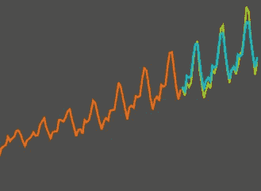
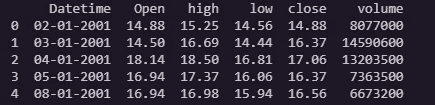
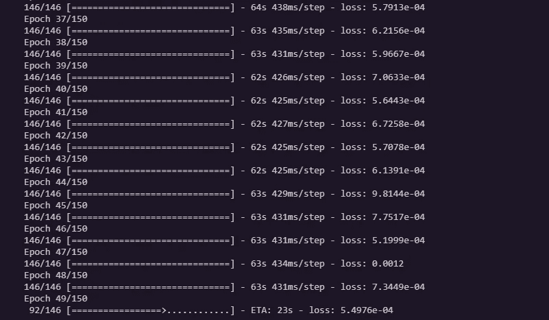
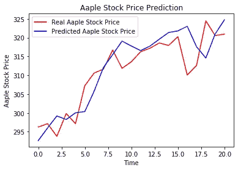

# 时间序列预测:用 LSTM 模型预测苹果股票价格

> 原文：<https://medium.com/analytics-vidhya/time-series-forecasting-predicting-apple-stock-price-using-an-lstm-model-f1bb73bd8a80?source=collection_archive---------7----------------------->

# 时间序列和预测模型

传统上，大多数机器学习(ML)模型使用一些观察值(样本/实例)作为输入特征，但数据中没有**时间** **维度**。

**时间序列预测**模型是能够根据**先前** **观测** **值**预测 **未来值**的模型。时间序列预测广泛用于**非平稳数据**。**非平稳数据**被称为统计属性(如平均值和标准偏差)不随时间保持不变，而是随时间变化的数据。

这些非平稳输入数据(用作这些模型的输入)通常被称为**时间序列。**时间序列的一些例子包括随时间变化的温度值、随时间变化的股票价格、随时间变化的房屋价格等。因此，输入是一个**信号**(时间序列),它是由在时间中连续获得的观察值**定义的。**



时间序列示例

# LSTM 模式

**长短期记忆** ( **LSTM** )是一种用于深度学习领域的人工递归神经网络(RNN)架构。与标准的前馈神经网络不同，LSTM 有反馈连接。它不仅可以处理单个数据点(例如图像)，还可以处理整个数据序列(例如语音或视频输入)。

**LSTM 型号**能够储存一段时间的信息。

# 开始编码吧！

我们将构建一个**多层 LSTM 递归神经网络**来**预测**一系列值的最后一个值**，即本例中的 AAPL 股票价格。**

*所需模块:Keras、Tensorflow、Pandas、Scikit-Learn & Numpy*

让**加载**数据和**检查**它们:

我们将收集 AAPL 最近 20 年的 EOD 数据，越多越好。

我使用的是 AAPL 数据集，它已经被分成了训练集和测试集，但是你可以用一个简单的命令来完成这个划分！

```
training_set = df.iloc[:4780, 1:2].values
test_set = df.iloc[4780:, 1:2].values
```

# 让我们将数据集可视化



数据集的前几行

# 要预测的目标值将是“**收盘**股价值。因此有了下面的陈述。

```
training_set = dataset_train.iloc[:, 1:2].values
```

在**模型** **拟合**之前，**归一化**数据是个好主意。这将提高性能。

# 构建输入变量

作为本文的一个例子，我使用了上面描述的模型来预测 AAPLstock 下一个交易日的收盘价，给出了过去六十个交易日的数据

我们现在已经将**数据重新调整为**以下格式(#值、#时间步长、#1 维输出)。

**现在，是时候建立模型了。**我们将建立有 100 个神经元和 5 个**隐层**的 **LSTM** 。最后，我们将在输出层分配 1 个神经元用于预测标准化的股票价格。我们将使用 MSE 损失函数和 Adam 随机梯度下降优化器。



它会像这样继续下去

# 准备好测试数据并进行预测

# 可视化结果



我们可以清楚地看到，我们的模型表现得非常好。它能够准确地跟踪大多数不可接受的上涨/下跌，但是，对于最近的日期戳，我们可以看到，与股票价格的实际值相比，模型预期(预测)的值较低。

**免责声明**已经有人尝试使用时间序列分析算法来预测股票价格，尽管它们仍然不能用于在真实市场中下注。这只是一篇教程文章，并不打算以任何方式“指导”人们购买股票。

下次见！