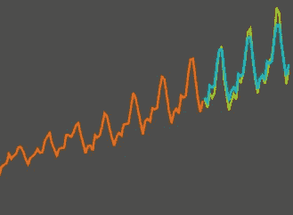
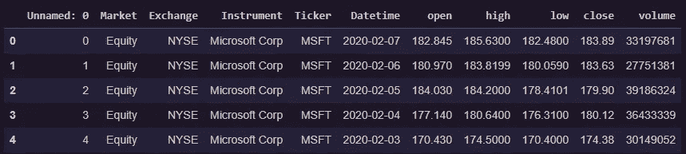
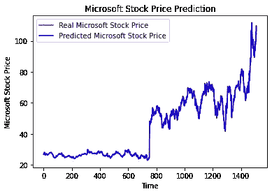

# 时间序列预测:用 ARIMA 模型预测微软(MSFT)的股票价格

> 原文：<https://medium.com/analytics-vidhya/time-series-forecasting-predicting-microsoft-msft-stock-prices-using-arima-model-be1c45961739?source=collection_archive---------5----------------------->

在 LSTM 模式大获成功后，让我们试着用 ARIMA 模式重现成功。首先简单介绍一下时间序列，然后我们将讨论 ARIMA 在微软 20 多年的股票价格数据集上的实现。我们开始吧！

# 时间序列和预测模型

传统上，大多数机器学习(ML)模型使用一些观察值(样本/实例)作为输入特征，但数据中没有**时间** **维度**。

**时间序列预测**模型是能够根据**以前的** **观测值****预测**未来值**的模型。时间序列预测广泛用于**非平稳数据**。**非平稳数据**被称为统计属性(如平均值和标准偏差)不随时间保持不变，而是随时间变化的数据。**

**这些非平稳输入数据(用作这些模型的输入)通常被称为**时间序列。时间序列的一些例子包括随时间变化的温度值、随时间变化的股票价格、随时间变化的房屋价格等。因此，输入是一个**信号**(时间序列),它是由在时间**中连续进行的观察所定义的**。****

****

**时间序列示例**

# **自回归综合移动平均(ARIMA)模型**

**用于时间序列预测的一种著名且广泛使用的预测方法是**自回归综合移动平均(ARIMA)** 模型。 **ARIMA** 模型能够捕捉时间序列数据中一套不同的标准时间结构。**

# **术语**

**让我们来分解这些术语:**

*   ****AR:<>**表示模型**使用一个观测值和一些预定义数量的滞后观测值**(也称为“时间滞后”或“滞后”)之间的依赖关系。**
*   ****I: < Integrated >** 是指模型采用**原始观测值的差分**(例如，它从前一时间步的一个观测值中减去一个观测值)，以使时间序列**平稳。马**:**
*   *****MA: <移动平均>*** 是指模型利用了残差与观测值之间的**关系。****

# **模型参数**

**标准 ARIMA 模型期望 3 个自变量作为输入参数，即 p、d、q**

*   ****p** 是滞后观测值的**数。****
*   ****d** 是差分的**度。****
*   ****q** 是移动平均线窗口的**大小/宽度。****

# **开始编码吧！**

***所需模块:Keras、Tensorflow、Pandas、Scikit-Learn & Numpy***

**在这里加载所有需要的模块。**

**现在，让我们检查一下我们拥有的数据集。**

```
df = pd.read_csv("MSFT.csv")df.head(5)
```

****

# **要预测的目标值将是“接近”的股价值。**

**让我们准备好输入变量！**

# **制作我们的 ARIMA 模型**

**接下来，让我们**将**数据分成一个**训练** (70 %)和**测试** (30%)集合。对于本教程，我们选择以下 **ARIMA 参数:p=6，d=1，q=0。****

# **守则摘要**

*   ****考虑到差分和 AR 模型对先前时间步骤中观测值的依赖性，需要一个滚动预测程序。为此，我们在收到每个新的观察结果后重新创建 ARIMA 模型。****
*   **最后，我们在一个名为 **history** 的列表中手动跟踪所有的观察值，该列表以训练数据为种子，并且在每次迭代中向其追加新的观察值。**

**均方差为 2.3522**

# **准备好测试数据并进行预测**

# **可视化结果**

****

**我会让你们试验 ARIMA 模型的值，让我知道你是否能得到一个更好的 MSE 值！**

**已经有人尝试使用时间序列分析算法来预测股票价格，尽管它们仍然不能用于在真实市场中下注。这只是一篇教程文章，并不打算以任何方式“指导”人们购买股票。**

**给我一个关注，如果你喜欢更多的技术博客！**

**再见了。**