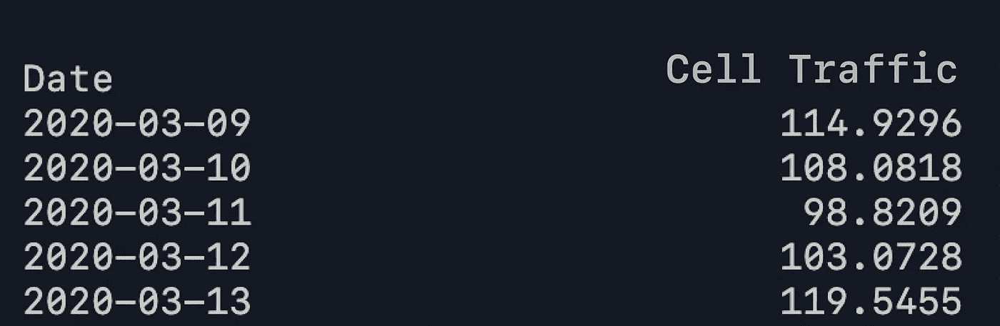
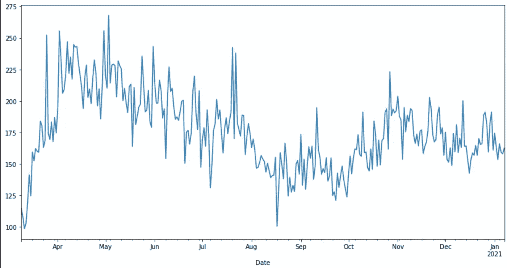
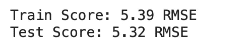
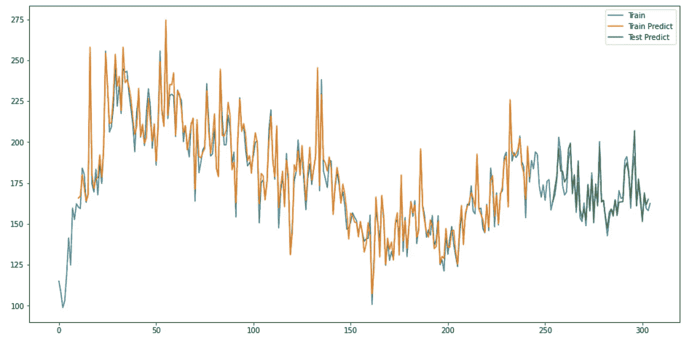
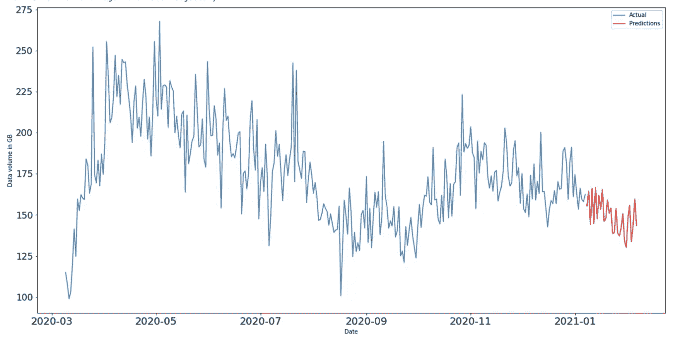

# 时间序列预测:用 LSTM 预测移动通信量

> 原文：<https://medium.com/analytics-vidhya/time-series-forecasting-predicting-mobile-traffic-with-lstm-649e6ba7ee49?source=collection_archive---------2----------------------->

一个 **电信中的人工智能为客户和提供商带来更好的体验。**它有助于行业发展，使流程更加便捷，这是任何企业的最终目标，电信也是如此。

这篇文章是根据我去年在一家领先的电信公司实习时的亲身经历写的。在那里，我被分配到一个项目，该项目涉及预测公司在全国的手机信号塔的未来移动流量。虽然我对编程和机器学习感兴趣，但我从未有过这方面的工业经验。由于公司的规模和预期的工作质量，这是一个非常具有挑战性的项目，但我在享受学习和编码的过程中度过了非常美好的时光。

当我开始这个项目的时候，我对时间序列预测没有太多的经验。我在深度学习方面做了一些个人项目和竞赛，但在预测方面一无所获。所以在开始的时候，它是关于深入学习时间序列预测的神经网络背后的数学，然后我开始钻研代码。事不宜迟，让我们进入技术部分。

通常时间序列预测是困难的，不像回归和分类时间序列问题增加了观测值之间顺序依赖的困难。传统上，时间序列预测一直由线性方法主导，因为它们在许多类型的应用中被很好地理解和有效。但是这些经典方法也有许多局限性。

随着机器学习的进步，神经网络被用来解决这个问题。由于时间序列数据是序列相关的，因此设计了不同类型的神经网络，称为递归神经网络(RNN)。但是简单的递归网络仍然存在一个基本问题，即不能捕获序列中的长期相关性。这是一个问题，因为我们想要跟踪长序列的时间序列数据。为了解决这个问题 [LSTM 是由 Sepp Hochreiter 和 Jurgen Schmidhuber](http://www.mitpressjournals.org/doi/abs/10.1162/neco.1997.9.8.1735) 在 90 年代后期提出的

长短期记忆网络，简称 LSTM，可用于时间序列预测。有许多类型的 LSTM 模型可用于每个特定类型的时间序列预测问题。在这篇文章中，你将看到如何使用长短期记忆模型来预测移动网络流量。

您做出的预测与数据的实际行为相关联。换句话说，你不需要未来确切的流量值，而是移动流量动向。让我们开始吧。

让我们进口我们需要的一切。

## 数据探索

让我们加载数据并查看一下:

数据集形状= (305，1)

## **可视化数据**

## **预处理**

如果我们想提高模型的训练速度和性能，我们必须缩放数据(值将在 0 和 1 之间)。我们将使用 scikit-learn 中的`MinMaxScaler`:

我们将保留数据的前 0.8 部分用于训练，其余部分用于测试:

每个训练示例都包含 30 个数据点的历史序列，以及模型需要预测的真实值的标签。

重塑数据

## **建立模型**

创建模型的架构。这里我们使用张量流和 keras:

## **训练模型**

我们将使用均方差来衡量我们的训练误差。

## **做出预测**

这个模型只能预测未来 30 天。

好的，看起来不错。让我们通过观想来看一看，以获得一个好的视野。

## 对未来日期的预测

我们将使用我们的“训练”模型来预测未来 30 天的流量，并对缩放器进行逆变换:

## 可视化预测

## 保存已训练的模型

## 加载模型以使用新数据重新训练或预测未来

## 为什么保存模型并再次加载以重用？

保存已经训练好的模型的主要优点是保存训练好的参数，以便可以再次使用新数据对其进行重新训练。这被称为迁移学习，这将为我们提供一种选择，避免在每次新数据到来时，用所有数据一遍又一遍地对模型进行长时间的繁重训练。加载已经训练好的模型并用新数据再次训练它将节省时间和计算能力。

# 结论

您了解了如何使用 Tensorflow 和 keras 创建处理时间序列数据的递归神经网络 LSTM 模型。模型性能不是很好，但这是意料之中的，因为数据量很小。

# 参考

 [## 时间序列预测与 LSTM 递归神经网络在 Python 与 Keras -机器学习…

### 时间序列预测问题是一种困难的预测建模问题。与回归预测不同…

machinelearningmastery.com](https://machinelearningmastery.com/time-series-prediction-lstm-recurrent-neural-networks-python-keras/)  [## 用 Python -机器学习掌握时间序列预测

### 用 Python 进行时间序列预测简介了解如何准备数据和开发模型来预测…

machinelearningmastery.com](https://machinelearningmastery.com/introduction-to-time-series-forecasting-with-python/)