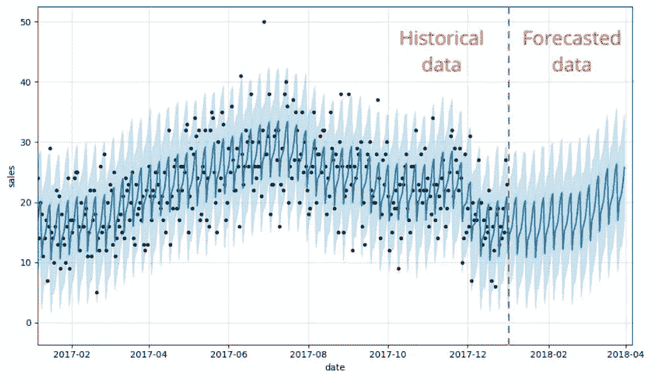
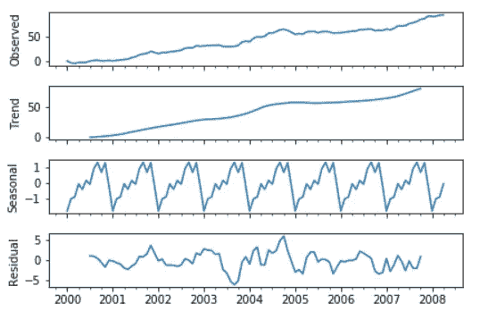

# 时间序列预测:工具和技术。第一部分

> 原文：<https://medium.com/analytics-vidhya/time-series-forecasting-tools-and-techniques-part-1-2e580e190f09?source=collection_archive---------10----------------------->

在这篇文章中，我将讨论用于时间序列预测的各种方法。首先，我将触及与时间序列数据和预测相关的基本术语。然后我将讨论用于时间序列预测的方法。接下来，我将逐一详细讨论每一种方法。

# *与时间序列数据相关的术语。*

T 时间序列:*时间序列数据是按时间顺序索引的一系列数据点。时间序列预测的目标是根据数据点的过去行为预测未来值。只有一个 y 变量的时间序列称为单变量。而具有一个以上 y 变量的时间序列称为多元。*

T rend: *系列上增加或减少的值。(全系列中整体)。当数据长期增加或减少时，趋势就存在。*

Seasuality:*系列中重复的短期循环。当时间序列受季节因素(如一年中的某个时间或一周中的某一天)影响时，就会出现季节性模式。*

误差或噪声:*序列中无法用趋势和季节性解释的随机变化。*

例如，如果你看下图，第一个图代表实际数据绘制。观测数据有三个组成部分，即趋势、季节和残差(误差)。趋势显示，在观察期间，y 变量总体呈上升趋势。季节性因素表明，在每一年中，数据都有一些季节性行为，即有时达到峰值，有时下降。残差分量显示了数据中的噪声，它是趋势和季节分量中没有捕捉到的随机行为。

# 用于时间序列预测的库

下面列出了用于时间序列预测的一些主要方法/库。

1.  ARIMA
2.  萨里玛(属于 ARIMA 家族)
3.  先知(脸书)
4.  向量自回归(VAR)和 VARMA
5.  LSTM (RNN)

让我们从 ARIMA 开始讨论吧！

# ARIMA:自回归综合移动平均数。

ARIMA 有三个部分。(AR+I+MA=ARIMA)。

AR(自回归):利用一个观察值和一些滞后观察值之间的依赖关系的模型。

I (integrated):这样做基本上是为了让数据保持不变。如果数据已经是稳定的，那么这个分量为零。

MA(移动平均线):它利用观测值和应用于滞后观测值的移动平均模型的残差之间的相关性。

这里，“AR”用“p”表示，“I”用“d”表示，“MA”用“q”表示。

注:ARIMA 只能用于非季节性数据。对于季节性数据，我们使用 SARIMA，我们将在后面讨论。

## 应用 ARIMA 的步骤:

整理数据:对数据有一个概念和概述。

R un an ETS 分解:这样做是为了查看数据的趋势、季节性和误差部分。看季节成分对整体数据的贡献有多大。相应地，我们决定数据是否是季节性的。然而，还有其他方法来检查数据是否是季节性的，但 ETS 是最简单的检查方法。

> 代码:
> 
> 来自 stats models . TSA . seasonal import seasonal _ decompose #
> 
> ets = seasonal_decompose(df['A']，model = ' additive ')
> ets . plot()；

使用“pmdarima”确定 ARIMA (p，D，q)的顺序:pmdarima 是一个库，它直接给出 p，D，q 的值，以便您可以使用这些值来拟合实际的 ARIMA 模型。

> 从 pmdarima 导入 auto_arima
> 
> auto_arima(df['A']，季节性=False)。摘要()

增强的 dickey-fuller(adfuller)测试[可选]:这样做是为了检查经过多少次差分后，我们的数据变得稳定。它基本上找到了 d 的值。我们可以使用 adfuller 测试来验证在 pmdarima 上获得的“d”值。

> 你可以访问这个[链接](https://machinelearningmastery.com/time-series-data-stationary-python/)来阅读更多关于 adfuller test 的内容。知道如何检查数据是否平稳以及平稳性的类型是有益的。

A CF 和 PACF 图[可选]: ACF 图用于找出‘q’的值，PACF 图用于找出‘p’的值。我们可以使用 ACF 和 PACF 图来验证从 pmdarima 获得的 p 和 q 值。

> 代码:
> 
> 从 statsmodels.graphics.tsaplots 导入 plot_acf，plot_pacf
> 
> title = ' ACB '
> lags = 40
> plot _ ACF(df[' A ']，title=title，lags = lags)；
> 
> title = ' ABC '
> lags = 40
> plot _ pacf(df[' A ']，title=title，lags = lags)；
> 
> 要了解如何解读 ACF 和 PACF 的剧情，请访问[这里](https://towardsdatascience.com/significance-of-acf-and-pacf-plots-in-time-series-analysis-2fa11a5d10a8)。我将在以后写另一篇文章，只讨论 ACF 和 PACF 的阴谋。

逐步 pmdarima[可选]:它非常类似于我们过去在机器学习中使用的网格搜索。基本上，我们给它一个不同的 p，d，q 值的范围，给我们最好的值。这也用于交叉验证从步骤 3 获得的 p、d、q 值。

> 代码:
> 
> stepwise _ fit = auto _ ARIMA(df[' A ']，start_p=0，start_q=0，max_p=2，max_q=2，m=12，seasonal=False，d=None，trace=True，error_action='ignore '，
> suppress_warnings=True，stepwise=True)
> 
> stepwise_fit.summary()

将数据拆分成训练集和测试集:我们将部分可用数据剪切出来作为测试集(注意，测试集必须是按时间排序的最后几行数据。我们不能像使用 Sklearn 那样分割数据，因为在时间序列中，我们总是预测未来。我们不能回到过去并预测一些事情)。

> 代码:
> 
> train = df . iloc[:280]
> test = df . iloc[280:]

F 将 ARIMA 模型投入列车测试。

> 模型= ARIMA(火车['A']，订单=(p，d，q))
> 结果=模型.拟合()
> 结果.总结()
> 
> 这里用你在第 3 步中得到的值代替 p，d，q。

在测试集上进行预测。

> 代码:
> 
> start = len(train)
> end = len(train)+len(test)-1
> predictions = results . predict(start = start，end=end，dynamic=False，typ='levels ')。重命名(“ARIMA(p，d，q)预测”)

将实际测试设定值与预测值进行比较。您可以根据需要使用一些 MSE 或其他指标。你也可以绘制对比图。

T 对整个数据下模型雨，预测未来！！！

这一切都与 ARIMA 有关。如果你有任何问题，请在评论区提出。我将在接下来的部分写关于萨里玛，先知等。

*考虑点击这篇文章的鼓掌按钮对你有所帮助...快乐学习。*

## 参考资料:

1.  [https://otexts.com/fpp2/index.html](https://otexts.com/fpp2/index.html)
2.  [https://machine learning mastery . com/ARIMA-for-time-series-forecasting-with-python/#:~:text = ARIMA % 20 is % 20 an % 20 缩写%20that，structures % 20 in % 20 time % 20 series % 20 data](https://machinelearningmastery.com/arima-for-time-series-forecasting-with-python/#:~:text=ARIMA%20is%20an%20acronym%20that,structures%20in%20time%20series%20data)。
3.  [https://www . stats models . org/stable/user-guide . html #时序分析](https://www.statsmodels.org/stable/user-guide.html#time-series-analysis)
4.  [https://www . udemy . com/course/python-for-time-series-data-analysis/](https://www.udemy.com/course/python-for-time-series-data-analysis/)