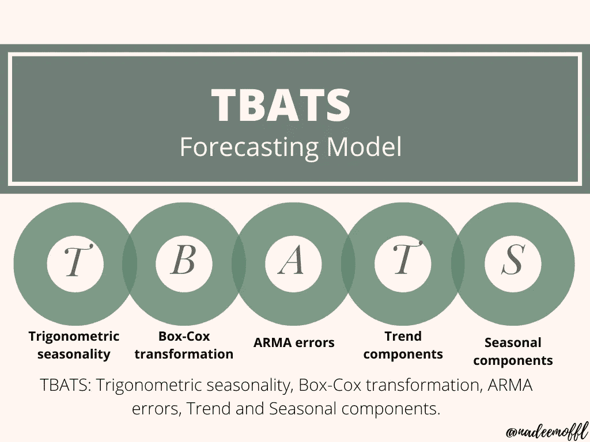
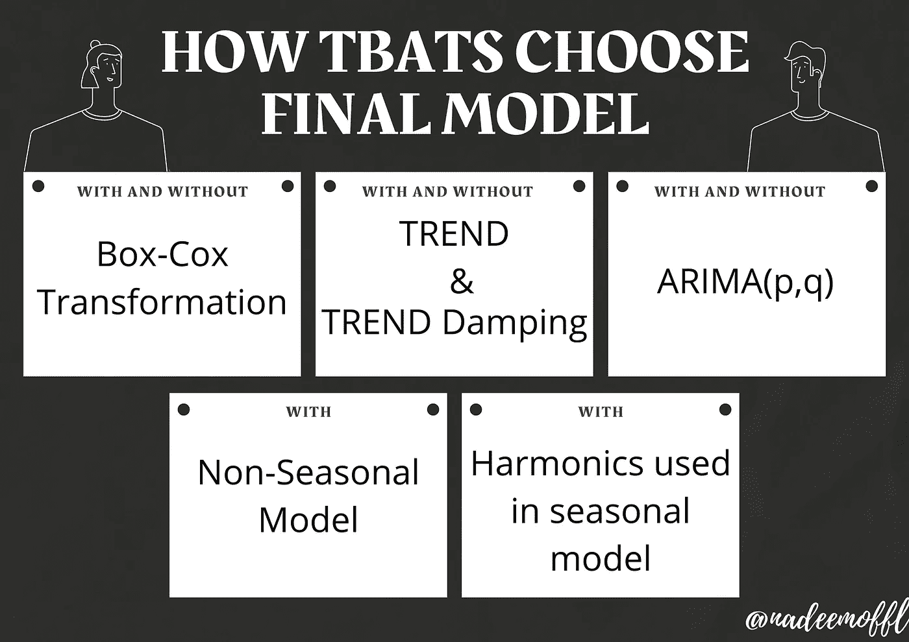
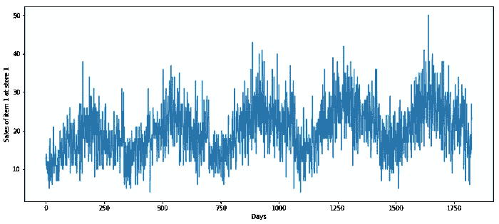
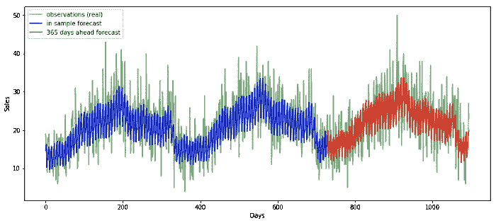
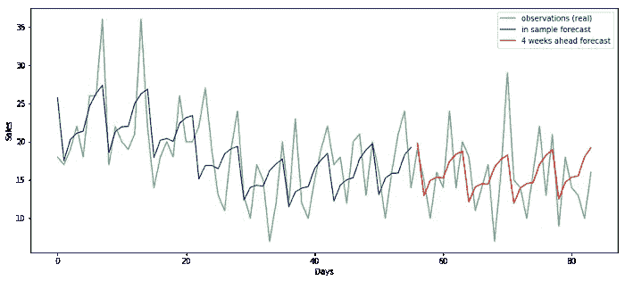
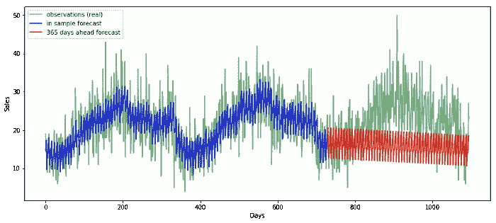

# 基于 TBATS 模型的时间序列预测

> 原文：<https://medium.com/analytics-vidhya/time-series-forecasting-using-tbats-model-ce8c429442a9?source=collection_archive---------0----------------------->

基于 python 和 R 代码的多季节时间序列预测模型


# 介绍

[时间序列预测](/analytics-vidhya/time-series-forecasting-101-9353f9e30c20)是指根据以前观察到的值，使用模型来预测未来值。许多研究人员熟悉时间序列预测，但他们对特定类型的时间序列数据感到困惑。一种这样的数据是带有 **季节性**的**数据。可能存在许多类型的季节性(例如，一天中的时间、每天、每周、每月、每年)。**

TBATS 是一种对时间序列数据建模的预测方法。其主要目的是使用指数平滑法预测具有复杂季节模式的时间序列



TBATS: **T** 精确季节性， **B** ox-Cox 变换， [**A** RMA](/analytics-vidhya/arima-fc1f962c22d4) 误差， **T** 趋势和 **S** 季节性分量。

# 概观

为了开始预测，我们需要首先**安装 tbats 包**。应该执行以下步骤来创建模型:

*   将数据分成两部分(比如说，train_data 和 test_data)。Train_data 用于训练模型，并使模型符合数据。使用 test_data 评估训练的模型。
*   向模型提供有关季节长度的信息(例如，如果存在每小时的数据，则可以每周为一周中的所有 24*7 小时绘制模型)。
*   使用模型的 train_data 来拟合模型的 train_data。
*   在您想要预测的某段时间之前预测模型。

# TBATS 如何选择最终模型

TBATS 将考虑各种备选方案，并适合相当多的型号。它将考虑模型:



*   有无 Box-Cox 变换。
*   有考虑趋势和无趋势。
*   有趋势阻尼和没有趋势阻尼。
*   用 ARIMA(p，q)和不用 ARMA(p，q)过程来模拟残差。
*   非季节性模型。
*   用于模拟季节效应的各种谐波量

将使用 [**赤池信息标准**](https://en.wikipedia.org/wiki/Akaike_information_criterion)**【AIC】**选择最终模型。

特别是，自动 [ARIMA](/analytics-vidhya/arima-fc1f962c22d4) 用于决定残差是否需要建模以及什么 p 和 q 值是合适的。

# 现有实施

到目前为止，唯一可用的实现是 R 语言，在[预测](https://www.rdocumentation.org/packages/forecast)包中。使用 Python 的数据科学家要么不得不放弃测试这些模型，要么被迫使用 R 包装器如 [rpy2](https://rpy2.bitbucket.io/) 来运行它们。

# 新实现

关于 Python 中 **TBATS 的新实现，可从 GitHub 获得。在本文的其余部分，我们将提供示例用法，并将该实现的性能与其他方法进行比较。**

# 装置

来自 PyPI:

```
pip install tbats
```

通过以下方式导入:

```
from tbats import BATS, TBATS
```

# 最小工作示例:

```
from tbats import TBATS
import numpy as np# required on windows for multi-processing,
# see [https://docs.python.org/2/library/multiprocessing.html#windows](https://docs.python.org/2/library/multiprocessing.html#windows)
if __name__ == '__main__':
    np.random.seed(2342)
    t = np.array(range(0, 160))
    y = 5 * np.sin(t * 2 * np.pi / 7) + 2 * np.cos(t * 2 * np.pi / 30.5) + \
        ((t / 20) ** 1.5 + np.random.normal(size=160) * t / 50) + 10

    # Create estimator
    estimator = TBATS(seasonal_periods=[14, 30.5])

    # Fit model
    fitted_model = estimator.fit(y)

    # Forecast 14 steps ahead
    y_forecasted = fitted_model.forecast(steps=14)

    # Summarize fitted model
    print(fitted_model.summary())
```

**读取模型细节**

```
# Time series analysis
print(fitted_model.y_hat) # in sample prediction
print(fitted_model.resid) # in sample residuals
print(fitted_model.aic)# Reading model parameters
print(fitted_model.params.alpha)
print(fitted_model.params.beta)
print(fitted_model.params.x0)
print(fitted_model.params.components.use_box_cox)
print(fitted_model.params.components.seasonal_harmonics)
```

# 解决纷争

bat 和 TBATS 会尝试引擎盖下的众多模型，在拟合太长的时间序列时可能会显得很慢。为了加快速度，可以从约束模型搜索空间开始。建议在没有 Box-Cox 变换和 ARMA 误差建模的情况下运行它，它们是最慢的模型元素:

```
# Create estimator
estimator = TBATS(
    seasonal_periods=[14, 30.5],
    use_arma_errors=False,  # shall try only models without ARMA
    use_box_cox=False  # will not use Box-Cox
)
fitted_model = estimator.fit(y)
```

在某些环境配置中，模型的并行计算会冻结。其原因尚不清楚。如果进程出现停滞，您可以尝试在单核上运行它:

```
estimator = TBATS(
    seasonal_periods=[14, 30.5],
    n_jobs=1
)
fitted_model = estimator.fit(y)
```

预测包比较测试。那些不使用默认测试命令运行的应用程序，您需要安装 R forecast 包:

```
python setup.py test_r
```

# 与 R 实现的比较

Python 实现意味着尽可能等同于预测包中的 R 实现。

*   BATS in R[https://www . rdocumentation . org/packages/forecast/versions/8.4/topics/BATS](https://www.rdocumentation.org/packages/forecast/versions/8.4/topics/bats)
*   R 中的 TBATS:[https://www . rdocumentation . org/packages/forecast/versions/8.4/topics/TBATS](https://www.rdocumentation.org/packages/forecast/versions/8.4/topics/tbats)

# 一些例子和时间序列数据集

为了检验预测方法，我们需要一些时间序列数据。让我们使用 [Kaggle 商店项目需求预测挑战](https://www.kaggle.com/c/demand-forecasting-kernels-only)中的时间序列。这是一个游乐场的挑战，场景很可能是人造的(参见[内核](https://www.kaggle.com/thexyzt/keeping-it-simple-by-xyzt)和[讨论](https://www.kaggle.com/c/demand-forecasting-kernels-only/discussion/65967)中的评论)。那里的数据包含 5 年内 10 家商店 50 种商品的日销售额(总共 500 个不同的时间序列)。出于我们的目的，我们只需要一个时间序列，所以我将任意选择商店 1 中商品 1 的销售额。

```
import pandas as pddf = pd.read_csv('kaggle_sales.csv')
df = df[(df['store'] == 1) & (df['item'] == 1)] # item 1 in store 1
df = df.set_index('date')
y = df['sales']y_to_train = y.iloc[:(len(y)-365)]
y_to_test = y.iloc[(len(y)-365):] # last year for testing
```



图 1:商店 1 中商品 1 的日销售额

销售数据包含每日观察。它**展示每周和每年的季节模式**。这意味着我们正在处理包含多重季节效应的时间序列。其中一个季节性很长，包含 365 次(闰年为 366 次)观测。这就是 TBATS 的设计目的。

# TBATS 模型

为了开始预测，我们需要安装 tbats 包并拟合模型。我们唯一需要手动提供给模型的是季节长度:

```
from tbats import TBATS, BATS# Fit the model
estimator = TBATS(seasonal_periods=(7, 365.25))
model = estimator.fit(y_to_train)# Forecast 365 days ahead
y_forecast = model.forecast(steps=365)
```

你可能已经注意到每年的季节长度不是一个整数。考虑到闰年，它等于 365.25，这是 TBATS 能够处理的功能。

TBATS 似乎在模拟季节效应方面做得相当不错:



图 2: 3 最近几年的销售数据。TBATS 正在模拟每年的季节性影响。



图 3: 12 周的数据。TBATS 也在模拟每周的季节性影响。

如果我们深入了解并查看模型参数，我们会发现 3 个季节谐波用于模拟周模式，11 个谐波用于模拟年模式。TBATS 选择使用λ为 0.234955 的 Box-Cox 变换。趋势没有被建模，ARMA 没有被用于建模残差，因为 p，q 是 0。

```
Use Box-Cox: True
Use trend: False
Use damped trend: False
Seasonal periods: [  7\.   365.25]
Seasonal harmonics [ 3 11]
ARMA errors (p, q): (0, 0)
Box-Cox Lambda 0.234955
Smoothing (Alpha): 0.015789
```

# 具有周季节性的 SARIMA 模型

让我们将传统助产士与另一种广泛使用且广为人知的方法进行比较: [SARIMA](https://www.statsmodels.org/dev/generated/statsmodels.tsa.statespace.sarimax.SARIMAX.html) 。 [SARIMA](/analytics-vidhya/arima-fc1f962c22d4) 已经被证明能够为时间序列预测提供最先进的解决方案。不幸的是，它有两个主要缺点:(1)人们只能模拟单一的季节效应，(2)季节长度不能太长。

然而，让我们使用来自 [pmdarima](https://github.com/tgsmith61591/pmdarima) 包的 auto_arima 来构建 [SARIMA](/analytics-vidhya/arima-fc1f962c22d4) 模型。我们将忽略每年的季节性，而专注于模拟每周的季节性模式:

```
from pmdarima import auto_arima
arima_model = auto_arima(y_to_train, seasonal=True, m=7)
y_arima_forecast = arima_model.predict(n_periods=365)
```

Auto arima 选择了 SARIMA(0，1，1)x(1，0，1，7)模型。因为没有模拟预期的年度模式(见图 4)。



图 4: SARIMA 只模拟周线模式。与图 2 相比。

# 带有傅立叶项的 SARIMAX

人们可以运用[技巧](https://content.pivotal.io/blog/forecasting-time-series-data-with-multiple-seasonal-periods)【4】利用 SARIMAX 中的外生变量，用傅立叶项模拟额外的季节性。

我们将继续用萨里玛的季节部分来模拟每周的模式。对于每年的季节模式，我们将使用上述技巧。我比较了傅里叶项数的多种选择，2 提供了最准确的预测。因此，我们将使用 2 个傅立叶项作为外生变量。

```
# prepare Fourier terms
exog = pd.DataFrame({'date': y.index})
exog = exog.set_index(pd.PeriodIndex(exog['date'], freq='D'))
exog['sin365'] = np.sin(2 * np.pi * exog.index.dayofyear / 365.25)
exog['cos365'] = np.cos(2 * np.pi * exog.index.dayofyear / 365.25)
exog['sin365_2'] = np.sin(4 * np.pi * exog.index.dayofyear / 365.25)
exog['cos365_2'] = np.cos(4 * np.pi * exog.index.dayofyear / 365.25)
exog = exog.drop(columns=['date'])
exog_to_train = exog.iloc[:(len(y)-365)]
exog_to_test = exog.iloc[(len(y)-365):]# Fit model
arima_exog_model = auto_arima(y=y_to_train, exogenous=exog_to_train, seasonal=True, m=7)# Forecast
y_arima_exog_forecast = arima_exog_model.predict(n_periods=365, exogenous=exog_to_test)
```

借助傅立叶项，SARIMAX 能够模拟两种季节模式(图 5)。


图 5:带有傅立叶项的 SARIMAX 模拟了周模式和年模式

# 模型比较

到目前为止，我们只看了情节。让我们使用 365 天的预测来比较模型的性能。我们将使用平均绝对误差作为衡量标准:

*   TBATS: 3.8577
*   萨里玛:7.2249
*   具有两个傅立叶项的 SARIMAX:3.9045

正如预期的那样，SARIMA 提供了一个很差的模型，因为它不能模拟每年的季节性。带有傅立叶项的 TBATS 和 SARIMAX 提供了更好的模型。

# 优势

许多时间序列表现出复杂的多重季节性模式(例如，包含日模式、周模式和年模式的每小时数据)。最流行的模型(如 [ARIMA](/analytics-vidhya/arima-fc1f962c22d4) 和指数平滑)只能解释一个季节性。

TBATS 模型能够处理复杂的季节性因素(例如，非整数季节性因素、非嵌套季节性因素和大周期季节性因素),不受季节性因素的限制，因此可以创建详细的长期[预测。](/analytics-vidhya/time-series-forecasting-101-9353f9e30c20)

# 缺点

不幸的是，蝙蝠和 TBATS 的能力不是免费的。该方法非常通用。在引擎盖下，它构建并评估许多候选模型。这导致了计算的缓慢。当需要为大量并行时间序列训练模型时，这可能是至关重要的。

与 SARIMAX 不同，bat 和 TBATS 不允许将外生变量添加到模型中以改进预测。根据 Rob J Hyndmann 的说法，将它们包含在内并且不陷入可预测性问题中并不容易。

**TBATS 模型(具有 Box-Cox 变换、ARMA 误差、趋势和季节性成分的指数平滑状态空间模型)**

符合应用于`y`的 TBATS 模型，如 De Livera，Hyndman & Snyder (2011)所述。默认情况下，使用并行处理来加速计算。

```
tbats(
  y,
  use.box.cox = NULL,
  use.trend = NULL,
  use.damped.trend = NULL,
  seasonal.periods = NULL,
  use.arma.errors = TRUE,
  use.parallel = [length](https://rdrr.io/r/base/length.html)(y) > 1000,
  num.cores = 2,
  bc.lower = 0,
  bc.upper = 1,
  biasadj = FALSE,
  model = NULL,
  ...
)
```

# 结论

TBATS 使用户能够轻松处理多种季节模式的数据。当季节性随时间变化时，这种模式更可取。

# 参考

1.  De Livera，A.M .，Hyndman，R.J .，& Snyder，R. D. (2011)， [*使用指数平滑法预测具有复杂季节模式的时间序列*](https://www.tandfonline.com/doi/abs/10.1198/jasa.2011.tm09771) ，《美国统计协会杂志》，106(496)，1513–1527。工作文件版本可在 https://robjhyndman.com/papers/ComplexSeasonality.pdf[获得](https://robjhyndman.com/papers/ComplexSeasonality.pdf)
2.  bat 和 TBATS 的 Python 实现:[https://github.com/intive-DataScience/tbats](https://github.com/intive-DataScience/tbats)
3.  R 预测包中的 TBATS:[https://www . rdocumentation . org/packages/forecast/versions/8.4/topics/TBATS](https://www.rdocumentation.org/packages/forecast/versions/8.4/topics/tbats)
4.  具有多个季节周期的预测时间序列数据(傅立叶项):[https://content . pivotal . io/blog/forecasting-Time-Series-Data-with-Multiple-Seasonal-Periods](https://content.pivotal.io/blog/forecasting-time-series-data-with-multiple-seasonal-periods)