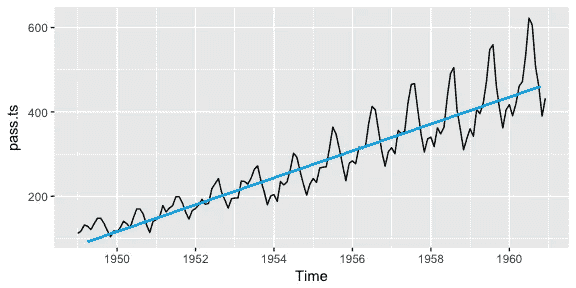

# 时间序列-I 基本概念

> 原文：<https://medium.com/analytics-vidhya/time-series-i-fundamental-concepts-99a2973d5b5c?source=collection_archive---------2----------------------->

照片由 Aron 在 Unsplash 上提供

时间序列是数据科学的主要课题之一。机器学习或深度学习算法可以预测一段时期内商业、金融、科学中的一些测度，姑且称之为“时间序列”分析。物联网等并行技术改进后，时间序列在现实生活中不断发现新的实践。例如，在一个智能工厂或一个能源农场，有审查数据随时间变化。更传统的是，销售预测也是一个时间序列问题。

在我以前的工作经历中，我试图预测公司的销售额。正如我上面告诉你的，这是一个非常大的话题，我们可能不会在一周内成为时间序列专家。随着时间的推移，我对这个话题越来越深入，我想分享我在分析时间序列的旅程中学到的东西。在这篇文章中，我将谈论时间序列的基本概念，然后在接下来的文章中，我将用 Python 制作一个预测算法的教程。

**时间序列**

首先，第一个概念是时间序列自我；这可能是观察结果或数据随时间的变化。在这个系列中，我们有过去的数据，实时数据，我们希望预测未来的数据，以达到我们在数据科学项目中的目标。数据可能在不同的时间段有所不同，例如每小时、每天、每周、每月和每年。例如，股票可能每小时或每天分析一次，销售可能每周或每月分析一次。

**时间序列的三个组成部分；季节性、趋势和残差。**

**季节性**

绘制时间序列时，可以在图表上看到季节性。如果有周期性的行为，说明该序列存在季节性成分。在图中，绘制了来自众所周知的时间序列数据集中的航班乘客数量。在一年中的夏季，乘客数量会猛增，然后在冬季会周期性下降。

**趋势**

趋势项可以用上述相同的时间序列来解释。该变量可以随时间增加或减少。它也会及时改变变量的平均值。蓝色线显示了上升趋势，这意味着对飞机运输的兴趣在整体时间内不断增加。对于一些预测模型，为了平稳性，我们可能需要去掉趋势效应。

**残差/噪声**

从时间序列中去除季节性和趋势性成分后，噪声或残差是时间序列中不相关的剩余随机部分。

**汇总统计数据**

当我们研究时间序列时，我们会用到一些统计规则。首先，我们需要数列的均值。在具有常数平均值的时间序列的情况下，另一个术语序列的平稳性将很快被解释，在某种程度上可能是可能的。

另一个重要的术语是标准差。通过使用皮尔逊相关系数计算方法，标准差用于计算时间序列的自相关。**恒定标准**偏差是时间序列平稳性的前提条件。

**平稳性**

为了预测时间序列中的未来时段，应该在一些预测模型中检查平稳性。平稳性表明序列的统计数据不随时间变化，这使得序列更容易预测。

确定平稳性需要满足三个前提条件。这些是没有季节性效应的**常数均值和标准差。** Dicky fuller 测试用于测试静止的。我们将从 Python 中的“statsmodel”库中调用 adfuller()方法。之后，我们将检查 p 值的显著性，并拒绝或接受相关的假设。

同样，我们可以在绘制非平稳序列后直观地理解它。例如，在(a)中的时间序列下面，具有递增的日均值，因此我们可以说它在 200 天内是非平稳的。在(g)和(h)中，我们可以很容易地看到季节性效应，所以这两个序列也不是平稳的。在下一篇文章中，我将展示如何将一个序列分解成季节性、趋势性和残差成分，并用 dicky-fuller 方法测试其平稳性。

图:非平稳时间序列示例。(图片作者[**otexts.com**](https://otexts.com/fpp2/))

**自相关(ACF)和偏自相关(PACF)**

相关性从统计学上解释了这两个变量的关系。两个变量的标准偏差和平均值进入相关系数的计算。我们需要检查这些相关的概念，以确定序列的可预测性。如果没有相关性，并且观察值在序列中是随机的，我们就不能用数学方法对序列建模来预测未来的周期。自相关是检验时间序列中观察值之间关系的一种方法。用自相关函数解释了观测值随时间变化的关系。Auto 将自反效果添加到相关术语中。传统的皮尔逊相关法被用来计算它。

照片由马特·丹乔拍摄

图:滞后是如何工作的？

滞后是系列中计算相关性的延迟时间。移动序列后会产生滞后，然后将滞后的序列与原始的非滞后序列进行比较。在滞后 1 中，我们将元素与一步后退元素进行比较。在 lag 2 中，我们后退两步来比较系列中的元素，以此类推。说清楚一点，看上图，在一个月的时间序列中，滞后计算中 k=1，滞后 1 表示上月和当月的相关性。假设当前月份是一月，在滞后 1 中，我们通过从二月转移来比较系列。滞后 2，我们在序列中移动两个月后检查相关性。因此，转移系列将于 3 月开始。滞后 3 意味着我们在从 4 月开始的系列延迟之后检查元素的相关性。

部分自相关与 ACF 有点不同。当它被计算时，我们再次使用滞后和 k 值。我们有一个简单的带有误差部分的回归函数来计算和绘制偏自相关函数(PACF)。

为了解释这些 ACF 和 PACF 图，我添加了下面的数字。在 x 轴上，我们看到滞后。默认情况下，两个函数(ACF-PACF)的零延迟相关系数都是 1。蓝色条带显示了相关系数的统计显著性。蓝色波段之外的滞后值并不重要。下面，我们观察到时间序列不是自相关的。因为所有系数都不重要，并且都在蓝色波段内。PACF 仅排名第 21、29、31 和 37 位。我们可以使用这些滞后作为差异水平，使序列在未来的分析步骤中保持平稳。

另一个阅读 ACF 和 PACF 图的例子如下。我们可以看到几乎所有的自相关系数都是显著的，因此我们可以得出序列是自相关的。此外，序列的 PACF 有 1，2，3，4，6 和 7 个显著的滞后，所以我们可以使用这些滞后使序列平稳。

# 结论，

在我关于时间序列的第一篇文章中，我试图解释时间序列的基本概念。当我们有一个时间序列数据集时，我们会在第一阶段尝试从这些角度阅读和解释数据。在构建预测模型之前，我们需要使用这些概念来探索和准备用于分析的时间序列。

下一篇文章将包括一个 Jupyter 笔记本，用于在 Python 时间序列分析中实践所有这些概念。

*最初发表于*[*【https://www.linkedin.com】*](https://www.linkedin.com/pulse/time-series-i-fundamental-concepts-nebile-kodaz/?trackingId=QD5Ps5u5D%2FrPRwN3P9blIg%3D%3D)*。*