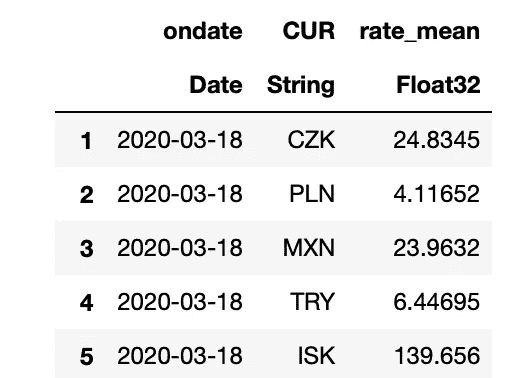
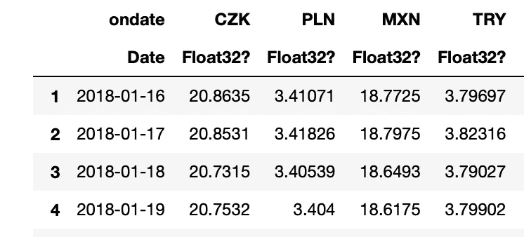
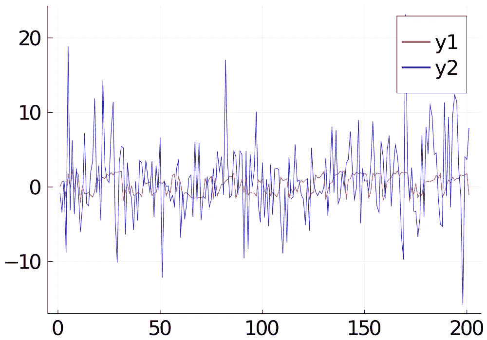
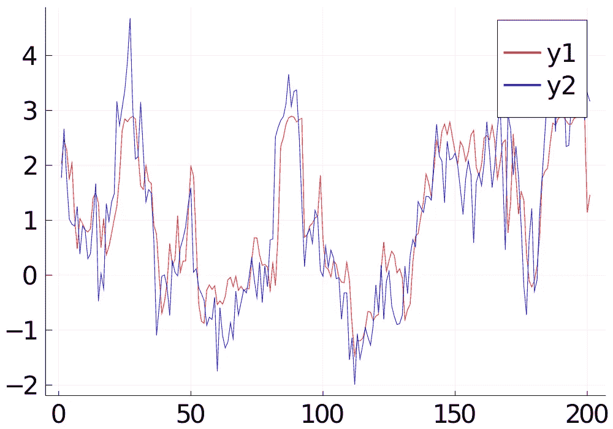
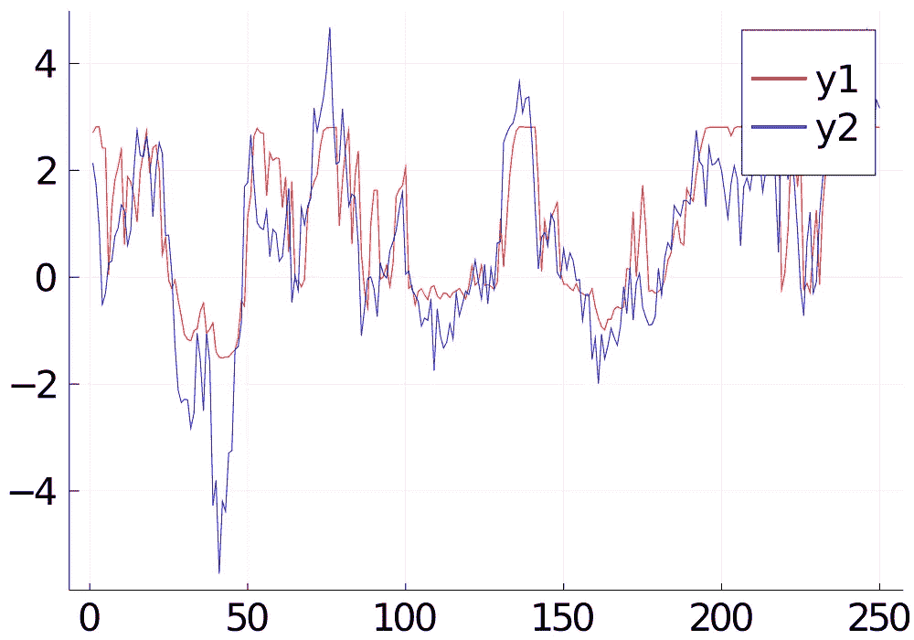
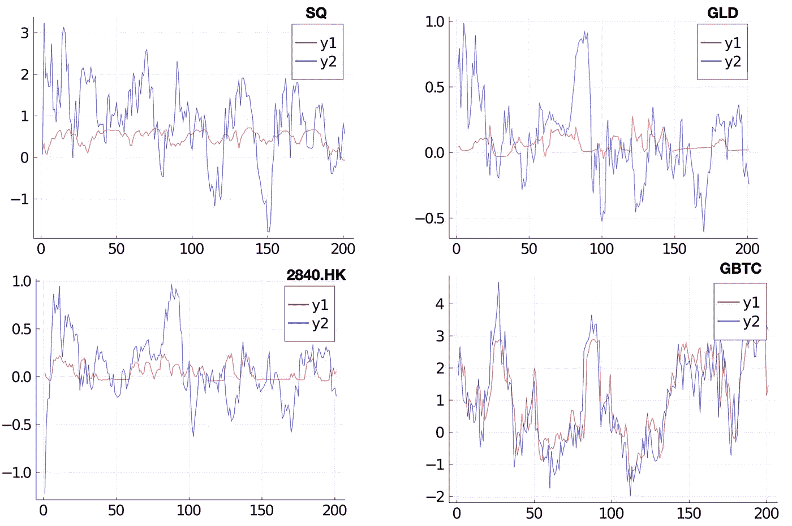

# 时间序列预测(专长。朱莉娅的介绍)

> 原文：<https://medium.com/analytics-vidhya/time-series-prediction-feat-introduction-of-julia-78ed6897910c?source=collection_archive---------4----------------------->

继续我的[上一篇文章](/analytics-vidhya/use-correlation-to-predict-market-index-dc16136bd28c)的工作，我将类似的 ML 模型应用于比特币 ETF 的预测。这一次，我将使用 Julia 而不是 Python 来编写模型代码。

# 朱莉娅简介

[Julia](https://julialang.org) 是科学计算的另一种流行语言。与 Python 的动态类型相反，它是一种严格类型化的函数语言。虽然严格的类型化给编码带来了一些不便，但它带来了更快的计算速度。你可以通过执行从其[页面](https://julialang.org/learning/getting-started/)下载的安装程序来尝试安装 Julia。

# 模型假设

假设比特币信托( [GBTC](https://finance.yahoo.com/quote/GBTC/) )与比特币价格(BTC)和外汇汇率(FX)相关，我们可以用 BTC 的历史收益率和 FX 汇率来预测第二天 GBTC 的未来收益率。

# 数据收集

1.  BTC 的历史数据可以通过 API (bitdataset.com)进行检索。

```
[http://api.bitdataset.com/v1/ohlcv/history/BITFINEX:BTCUSD](http://api.bitdataset.com/v1/ohlcv/history/BITFINEX:BTCUSD?period=D1)
```

Julia 提供了 HTTP 包来调用 HTTP 端点(API 端点)。要使用这个包，只需要下面几行代码来获得 json 响应。

```
using HTTP
using JSONraw_response = HTTP.request("GET", url_query, headers)
rsp = JSON.parse(String(raw_response.body))
```

Julia 还提供了数据结构——类似于 Python 熊猫家族的数据框架。从上面的 json 响应中检索到的每一行都可以插入到 DataFrame 中。“！”函数 push 意味着函数将更新变量 df。

```
using DataFramesdf = DataFrame(high = Float32[],low = Float32[],open = Float32[],close = Float32[],volume = Float32[], time = String[])

for d in rsp
    push!(df,d)
end
```

2.外汇的历史汇率可以通过 API (exchangeratesapi.io)以类似的方式检索。

```
[https://api.exchangeratesapi.io/history](https://api.exchangeratesapi.io/history?start_at=)
```

3.GBTC 的历史股票报价可以通过雅虎下载！Finanace API ( [yfinance](https://pypi.org/project/yfinance/) )。既然是 python 包，我们就用 Julia 里的 PyCall 来调用 python 包。

```
using PyCall
yf = pyimport("yfinance")
ticker = yf.Ticker("gbtc")
etf = ticker.history(period="3y")
```

pycall 方法(ticker.history)返回的对象“etf”是原始 Python 包中的 DataFrame。Python 数据帧可以转换成 Julia 数据帧。

```
function pd_to_df(df_pd)
    df= DataFrame()
    for col in df_pd.columns
        df[!, col] = getproperty(df_pd, col).values
    end
    df[!,:Date] = collect(df_pd[:index])
    return df
end
etf = pd_to_df(etf)
```

# 数据帧

在 Julia 中，DataFrame 的操作方式与 Python 类似。

*   在列上应用转换，这类似于 Pandas DataFrame 方法:Apply。下面是列“datestr”到日期对象的转换。的“.”函数后的“日期”意味着该函数应用于数组 x 的每个元素

```
transform!(df, :datestr => ( x -> Date.(x, Dates.DateFormat("yyyy-mm-dd")) ) => :date)
```

*   数据帧的读/写 CSV 文件很简单

```
using CSV

rawdata = CSV.File(infile)
rawdata = DataFrame(rawdata)
CSV.write(infile, rawdata)
```

*   通过 innerjoin 可以很容易地执行表连接，然后按列“日期”排序。结果被就地更新为“df”，如“！”所示排序后。

```
df = innerjoin(df, etf, on = :date)
sort!(df, [:date])
```

*   数据透视表可以通过表连接构造，如下所示。这里我们需要将所有 33 个国家的外汇表(“日期”、“货币”、“汇率”)转换为数据透视表，每个国家的货币作为单独的列。

1.  使用包“DataFramesMeta”和“@linq”选择每种货币(“c”)的数据

```
using DataFramesMeta
df1 = [@linq](http://twitter.com/linq) rawdata |> where(:CUR .== c) |> select(:ondate,:rate_mean)
```

2.将上面的输出与“on-date”列连接起来。

```
coldata = leftjoin(datecol,df1,on=:ondate)
```

3.将结果指定为货币“c”的列数据。

```
df[:,c] = coldata[:,:rate_mean]
```



数据帧:“原始数据”

```
df = DataFrame()
df.ondate = unique(rawdata.ondate)
datecol = df
for c in unique(rawdata.CUR)
    df1=[@linq](http://twitter.com/linq) rawdata|>where(:CUR .== c)|>select(:ondate,:rate_mean)
    coldata = leftjoin(datecol,df1,on=:ondate)
    df[:,c] = coldata[:,:rate_mean]
end
```

以上是要转换为以下数据透视表的完整 for 循环。



旋转数据帧:“df”

*   最后，通过删除丢失数据的行来清理数据。

```
dropmissing!(df)
```

# 特征工程

*   我使用 Julia 包时间序列从 BTC 和 GBTC 的外汇汇率和报价计算回报率。函数“percentchange”可以很容易地计算出当前值相对于滞后值的变化。
*   然后，对所有输入列应用 PCA(33 个国家的外汇汇率，以及 BTC 开盘价、收盘价、最高价、最低价及其每日交易量)。计算前 3 个 PCA 分量作为最终输入变量。
*   连接从时间 *i* 到 *i+seqlen-1* (pcax[:，i:i+seqlen-1])的 3 个 PCA 输出的当前和先前值
*   预测目标是第二天的 GBTC 收盘价收益= *i+seqlen* (df[i+seqlen，target])

```
ts = TimeArray(df,timestamp=:date)
pct = percentchange(ts)
df = DataFrame(pct)
mx = transpose(convert(Matrix,df[:,features]))
M = MultivariateStats.fit(PCA, mx; maxoutdim=3)
pcax = MultivariateStats.transform(M, mx)
for i in 1:len-seqlen-1
        x = pcax[:,i:i+seqlen-1]
        xtrain = vcat(xtrain,[x])
        y = df[i+seqlen,target]
        ytrain = vcat(ytrain,[y])
end
```

# 神经网络模型

我们在递归层 GRU 上叠加卷积层。

[Flux](http://julia flux example) 是茱莉亚给神经网络编码的 ML 包。

*   由于卷积层的输入形状是 4-D，我们需要使用 unsqueeze 添加 2 个维度。
*   经过 2 层 conv/最大池，我们平坦的所有通道输出。
*   然后，转置它，以便与 GRU 输入层匹配。
*   由于我只关心最后一个时间步的预测，我们将层(x -> x[:end])添加到 GRU 层的输出中。
*   最后，我们添加密集层以获得最终预测。

```
using Fluxfunction build_model(Nh)
    a = floor(Int8,Nh)
    return Chain(
    x -> Flux.unsqueeze(Flux.unsqueeze(x,3),4),

    # First convolution
    Conv((2, 2), 1=>a, pad=(1,1), relu),
    MaxPool((2,2)), # Second convolution
    Conv((2, 2), a=>Nh, pad=(1,1), relu),
    MaxPool((2,2)), Flux.flatten,
    Dropout(0.1),
    (x->transpose(x)), GRU(1,Nh),
    GRU(Nh,Nh), (x -> x[:,end]),
    Dense(Nh, 1),
    (x -> x[1]))
end
```

# 培训结果

按照以下方式训练模型“m ”:

```
train_loader = Flux.Data.DataLoader(xtrain,ytrain, batchsize=batchsize,shuffle=false)m = build_model(Nh)

function mae_loss(x,y)
     yh = m.(x)
     e = Flux.mae(yh,y)
     return e
end[@epochs](http://twitter.com/epochs) num_epoch Flux.train!(mae_loss,Flux.params(m),train_loader,RMSProp(lr))
```

培训效果不好。这是预测值 y1(红色)和训练数据 y2(蓝色)的曲线图。预测值与实际值不符。



您可以观察到实际值波动很大，这可能会导致梯度下降无法收敛。因此，我尝试使用移动平均来平滑数据。我计算了 PCA 降维前的 10 天移动平均线。我对输入变量和目标变量都应用了 10 天移动平均线。

```
pct = percentchange(ts)
ma = moving(mean, pct, 10)
```

这是使用移动平均后预测 y1(红色)和训练数据 y2(蓝色)的曲线图。预测可以很好地拟合实际线。答对了。



# 用看不见的数据测试

我通过拿出最近 250 天的数据进行验证和测试来重新运行培训。结果还是不错的。



# 数据泄露？

由于担心移动平均计算中的数据泄漏导致结果的改善，我重新详细讨论了该计算。

首先，输入变量是从时间 *i* 到 *i+seqlen-1* 的值。移动平均线取该值与前 9 天值的平均值。因此，它在时间 *i+seqlen* 不会有未来值。虽然我也对目标变量进行移动平均，但是输入仍然不包含时间 *i+seqlen* 的未来值。

为了安全起见，我尝试在其他目标数据上运行相同的模型。如果好的结果是由数据泄漏而不是数据相关性引起的，那么我会对其他目标数据得到类似的结果。我尝试了股票:新加坡、2840.HK 和 GLD。SQ 是与比特币相关的 NASAQ 股票。GLD 和 2840 是美国市场和香港市场的黄金 ETF。下面是训练数据的拟合。结果表明，即使使用移动平均法，相关性较小的目标数据也不能很好地拟合模型。



# 评论朱莉娅

虽然据称 Julia 在计算上非常快，但编译开销会使代码在第一次运行时变慢。当您使用“using <pkg>”命令导入包时，预编译需要一些时间。</pkg>

而且打字比较严格，不好用。尤其是 DataFrame 没有 Python 熊猫 DataFrame 好用。

你可以在我的 [git repo](https://github.com/iwasnothing/JuliaConvGRU) ( [模块文件](https://github.com/iwasnothing/JuliaConvGRU/blob/main/ConvGRU/src/ConvGRU.jl) / [笔记本](https://github.com/iwasnothing/JuliaConvGRU/blob/main/loading.ipynb))里查看完整的 Julia 代码。