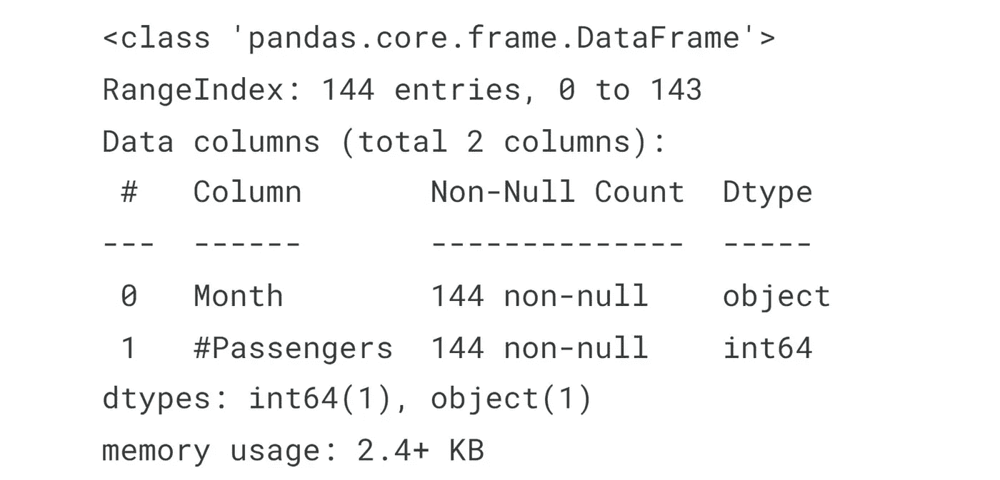
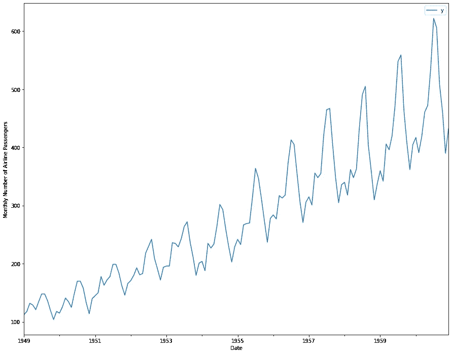
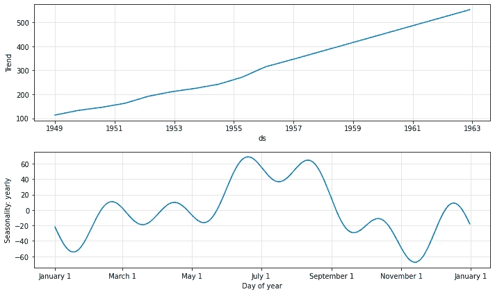
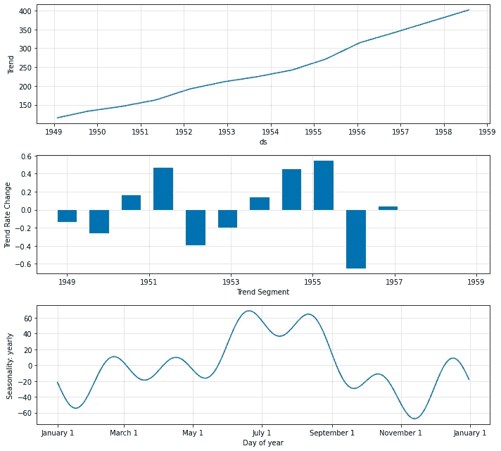
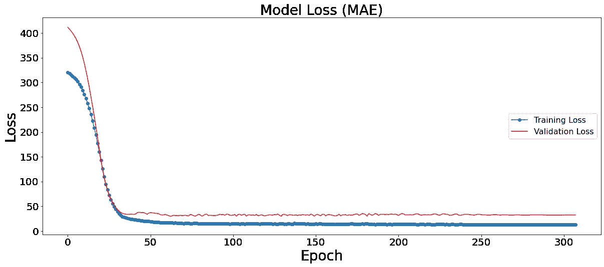

# 使用 NeuralProphet 的时间序列教程

> 原文：<https://medium.com/analytics-vidhya/time-series-tutorial-using-neuralprophet-e918a1b437ed?source=collection_archive---------0----------------------->

神经原植物。图片来源:NeuralProphet 官方知识库

在本文中，我们将使用 NeuralProphet 建立一个时间序列预测模型。NeuralProphet 是一个基于神经网络的时间序列模型，受[脸书先知](https://github.com/facebook/prophet)和 [AR-Net](https://github.com/ourownstory/AR-Net) 的启发，建立在 PyTorch 之上。在本文中，我们将使用 AirPassengers 数据集，该数据集提供了 1949 年至 1960 年美国航空公司乘客的月度总数。

# 本文教程:

1.  **神经营养学家简介**
2.  **神经营养蛋白的优势**
3.  **先知的变化**
4.  **安装神经营养器**
5.  **导入库**
6.  **导入输入数据**
7.  **数据集的预处理**

*   重命名列。
*   更改数据类型。

**8。可视化数据集**

9。训练神经营养模型

*   通过模型可视化预测
*   可视化组件
*   可视化参数
*   可视化培训和验证损失

10。结论

11。参考文献

# 神经营养简介

NeuralProphet 是 PyTorch 的一个实现，它是一个基于神经网络的用户友好的时间序列预测工具。这在很大程度上受到了脸书开发的流行预测工具 Prophet 的影响。NeuralProphet 建立在完全模块化的架构上，这使得它可以在未来随着新组件的添加而增长。这是一个用户友好的预测工具，保持了 Prophet 的原始目标，如可解释性和可配置性，同时还通过使用 PyTorch 作为后端添加了新的功能，如自动差异功能。

# NeuralProphet 的优势

NeuralProphet 革新了时间序列建模和预测:

*   支持自动回归和协变量。
*   自动选择与训练相关的超参数。
*   傅立叶术语不同时间尺度的季节性，包括每年、每天、每周和每小时。
*   分段线性趋势，可选择自动变点检测。
*   预测成分绘图、模型系数绘图和最终预测绘图。
*   全球建模协助。
*   未来和滞后回归量
*   正则化降低了系数稀疏性。
*   Python 包，用户友好且功能强大。

# 神经营养的变化

与最初的 Prophet 相比，NeuralProphet 有许多额外的特性。以下是详细内容。

*   使用 PyTorch 作为后端的梯度下降进行优化。
*   用 AR-Net 建立时间序列自相关模型。
*   使用单独的前馈神经网络来模拟滞后回归量。
*   具有可配置非线性深层的 FFNNs。
*   适应不同的预测范围(大于 1)。
*   你独有的损失和指标。

# 神经营养细胞的安装

我们可以使用 pip 直接安装 neuralprophet:

## 导入库

## 导入输入数据

数据集摘要

数据集摘要

# 数据集的预处理

默认情况下，NeuralProphet 只需要两列——一列称为“ds ”,代表日期，另一列称为“y ”,代表我们试图预测的值。

## 重命名列

## 更改数据类型

这里需要注意的重要一点是，ds 列必须是 datetime 类型。但是，我们可以看到它是对象数据类型。现在，因为 ds 列不是 datetime 类型。因此，我们需要将它转换成日期时间类型。

## 可视化数据集

可视化数据集

# 训练神经营养模型

我们将用 neural_prophet 为这个数据集制作一个简单的模型，可以通过创建一个 NeuralProphet 类的对象来拟合它。这里，数据集的频率是“月”。因此，我们将使用相应的改变频率参数。所有参数默认由 NeuralProphet 设置。NeuralProphet 的模型验证可以通过两种方式完成。用户可以通过在参数 valid_p 中指定用于验证的数据部分，手动分割数据集以在模型拟合后进行验证，如下所示。在本文中，我们将使用第一种方法。

一旦模型被拟合，我们就可以使用拟合模型进行预测。

## 通过模型可视化预测

神经营养预测图。图片由作者提供。

## 可视化组件

神经营养模型成分图。图片由作者提供。

## 可视化模型参数

神经营养模型参数预测图。图片由作者提供。

## 可视化培训和验证损失

使用平均绝对误差的模型损失

# 摘要

在本文中，我们讨论了 NeuralProphet，这是一个使用神经网络对时间序列建模的 Python 包。图书馆的后台是 PyTorch。在这篇文章中，我们开发了一个预测模型使用时间序列数据的航空旅客。NeuralProphet 建立在基于 AR-Net 的完全模块化架构上，使其可扩展以在未来纳入新功能。

你可以在这个 GitHub 资源库中访问全部代码: [NeuralProphet 教程](https://github.com/chiragsamal/NeuralProphet-Tutorial)

# 参考资料:

*   [NeuralProphet GitHub 知识库](https://github.com/ourownstory/neural_prophet)
*   [先知文献](https://facebook.github.io/prophet/)
*   [AR -Net 纸](https://arxiv.org/pdf/1911.12436.pdf)

感谢阅读；我很快会写更多类似的帖子。大家一起参与讨论，随时欢迎建议。