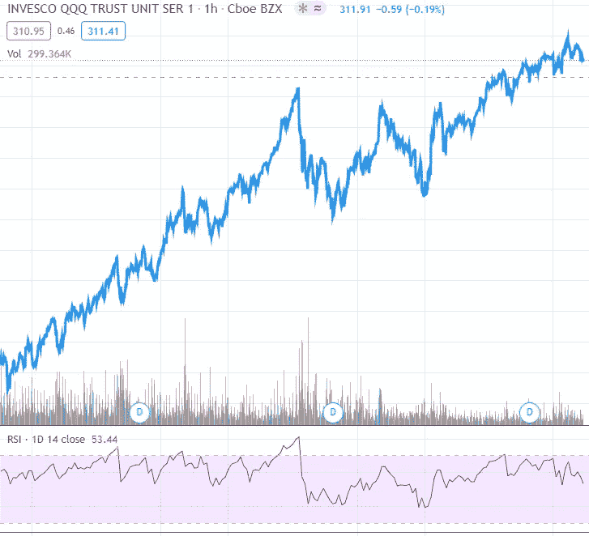

# 用 RSI 把握市场时机:统计数据说明了什么。

> 原文：<https://medium.com/analytics-vidhya/timing-the-market-with-rsi-what-stats-say-da9e7b7123d8?source=collection_archive---------4----------------------->

图 1:纳斯达克 100 指数 ETF QQQ 的 RSI 指数(来源:tradingview.com)

相对强弱指数(RSI)是私人投资者最常用的技术指标之一。它由一个在 0 和 100 两个极端值之间运动的动量振荡器组成。

当 RSI 高于 70 时，资产被视为超买，当 RSI 低于 30 时，资产被视为超卖。这些简单的规则非常有吸引力，人们可能会发现许多例子，其中 RSI…