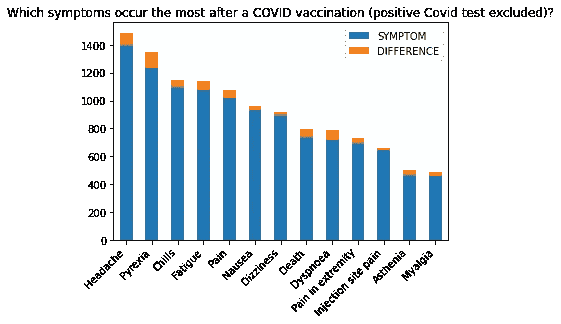

# 厌倦了假新闻？如何自己做数据分析

> 原文：<https://medium.com/analytics-vidhya/tired-of-fake-news-how-to-do-your-own-data-analysis-4fa7259f2f03?source=collection_archive---------19----------------------->

iStock.com/style-photography

现在是 2021 年，我们正身处疫情。我们已经等了几个月，现在它们终于来了:对抗新冠肺炎的疫苗。但是除了希望结束这个疫情，他们带来了怀疑和担忧:“他们真的工作吗？”，“听说有人因此而死。”、“副作用有多严重？”

那么，除了仔细评估所有的新闻文章、病毒学家和其他专家的解释或者阅读这方面的研究，我们还能做什么呢？我们可以看看真实的数据，感受一下。这就是我要展示给你们的数据集，它包含了新冠肺炎疫苗可能的副作用。

这不是一个关于如何用 Python 分析数据的教程(虽然你可以在本文最后看我的代码)。相反，我将着重于如何批判性地看待数据，以及基于这些数据我们可以或不可以解释什么。

# 关于数据集

在此分析中，我使用了 2021 年“疫苗不良事件报告系统”(VAERS)的数据(包含截至 2021 年 2 月 19 日处理的 VAERS 报告)[1]。VAERS 是美国的一个系统，医疗保健提供者和个人都可以报告可能(但当然不一定)与疫苗接种相关的症状。总共有 **9100** 人报告在接种新冠肺炎疫苗后出现一次或多次不良事件。大致来看:自 2020 年 12 月开始，截至 2021 年 3 月 1 日，**美国已经接种了 7690 万剂**新冠肺炎疫苗[2]，因此我们的数据集只是整个接种人群的一小部分。从数据中得出结论时，记住这一点很重要。

## 概述

为了得到一个简要的概述，我们可以看一些关于报告可能的副作用的人的一般信息。

平均来说，在这个数据集中接种疫苗的人是 53 岁。68 %的患者为女性，28.4%为男性，3.6 %的患者性别不明。55.4 %的疫苗来自辉瑞/德国生物新技术公司，而 45.5 %是 Moderna 疫苗。

下一步，我们可以通过询问有关数据的问题来探索数据集。

**这里有一些我感兴趣的问题:**

1.  报道的最常见的副作用(症状)是什么，何时发生？
2.  严重的症状——有多少病人不得不住院或死亡？
3.  死亡患者的(医学)背景是什么？
4.  我们能根据数据预测一个病人的住院情况吗？

# 问题 1:报道的最常见的副作用(症状)是什么，何时发生？

我们预计，像德国生物新技术公司[3]和 Moderna [4]的安全性和有效性研究中报告的疲劳、头痛、寒战或疼痛等较轻症状的出现频率会很高。

## 我们所看到的

让我们从描述我们所看到的开始。大多数最常见的症状是较轻的症状，如头痛、疲劳、发冷。然而，新冠肺炎病毒检测呈阳性，死亡是最常见的潜在症状。症状平均在 3 天后出现。

## 这意味着什么

那么这意味着什么，接种疫苗会导致 Covid 感染甚至死亡吗？—简答:没有。

当我们观察频率时，我们必须记住

*   与接种疫苗的人群相比，这是一个非常小的数据集
*   我们不知道这些症状的真正原因
*   数据集可能会有偏差，因为并非所有出现轻微症状的人都将其评定为不良反应，而死亡是一个明显的症状，有更好的记录，因此该症状的估计数字应该更低
*   我们这里没有未接种疫苗的对照组来比较症状

所以有很多我们不知道的。但是我们知道什么呢？根据我们以前的知识，我们知道新冠肺炎试验阳性和死亡都不是新冠肺炎疫苗接种的常见“副作用”[1，2]。此外，基于 mRNA 的疫苗并不是由新型冠状病毒病毒的整个基因组组成，而只是由刺突蛋白组成。因此，从技术上讲，这些疫苗不会导致新冠肺炎试验呈阳性。[5]有可能的是，这些人在接种疫苗之前已经被感染，或者在接种疫苗之后被感染(因为接种疫苗不能立即提供完全的保护)。

通常，当您在实验研究中收集数据时，您会事先考虑可能影响结果的混杂变量，并排除或控制它们(例如，使用对照组)。来自 VAERS 的数据并不是这样准备的，所以我们必须注意不要妄下结论，看看我们的数据集中提供的可能的混淆变量。当我们把频繁出现的“死亡”视为症状时，这一点可能很重要。

根据我们第一个图中的这些见解，我们知道数据集包括感染了新冠肺炎病毒的患者。对他们来说，我们不能将可能由疫苗接种或感染引起的症状分开，所以他们需要从数据集中排除。

这是所有未检测出新冠肺炎阳性的患者最常见症状的概述:

只能观察到轻微的变化，所以来自新冠肺炎检测呈阳性的人的数据似乎没有影响症状频率的总体趋势。

虽然到目前为止，概述显示主要是较轻的症状，但也有病人住院或死亡。一个有趣的下一步将是观察这些患者表现出的症状是否与整体症状不同。

# **问题 2:严重的症状——有多少病人不得不住院或死亡？**

## 我们所期待的

对于住院和死亡的患者，我们预计更严重症状的发生频率更高。

## 我们所看到的

在数据集中所有接种疫苗的人中，16.6 % (1334 名患者)在新冠肺炎疫苗接种后住院，10.8 % (873 名患者)死亡。而对于住院患者，症状与总体常见症状非常相似，死亡患者经历了严重的症状，如对刺激无反应、心脏骤停或复苏。

## 这意味着什么

从记录的症状来看，总览图([问题 1](/p/4fa7259f2f03#057d) )中的常见症状与住院患者的症状没有明显区别。发热和呼吸困难可能是住院的原因，但这些症状仅适用于部分患者。仍然可能有一种模式，我们只是在观察最常见的症状时看不到它。

虽然来自[问题 1](/p/4fa7259f2f03#057d) 的图显示死亡是一种常见的症状，但对死亡率的进一步观察有助于我们理解，事实上只有 10.8 %报告症状的患者在接种疫苗后死亡。与其他常见症状相比，这些患者的症状更加严重。

如上所述，采用目前的方法，我们没有考虑可能与患者死亡相关的其他影响。幸运的是，数据集提供了一些关于患者的额外信息，我们也可以对其进行分析。

# **问题 3:死亡患者的(医学)背景是什么？**

## 我们所期待的

我们预计患者的平均年龄会更高，并且大多数患者可能患有现有疾病或至少有病史。

## 我们所看到的

死亡的病人平均年龄为 77 岁。这些患者中有 72.5 % (633 人)有病史或目前正在患病。更准确地说，69.1 % (603 名患者)有疾病史，而 41.8 % (365 名患者)在接种疫苗时患病。

## 这意味着什么

当我们将数据集中所有患者的年龄分布和平均年龄与死亡患者进行比较时，死亡患者的平均年龄更高(差异:24 岁)，并且分布比包括所有患者的分布更稀疏。这表明主要是老年人死亡。事实上，70 %的死者都是 70 岁以上的老人。
查看病史和当前疾病，两组患者的死亡百分比都较高。大多数死亡的人知道以前的疾病，而目前患病的人死亡的百分比是所有患者的两倍。
所以所有这些特性都可能对患者的死亡有影响。

有很多可能性可以更详细地讨论这个问题。但是现在，我想告诉你如何从一个不同的角度来看这些数据。

# **问题 4:我们能否根据数据预测一位患者的住院情况？**

虽然我们迄今为止所做的分析只能一次查看一个或几个因素，但机器学习算法可以同时考虑多个因素。通常，您在分析数据之前已经定义了一个用例(例如，一个预测任务)。这些数据会是什么呢？
一个可能的用例是，根据患者的症状和其他信息，预测患者是否必须住院(可能与疫苗接种相关)。这在理论上可以帮助医院为更高容量的潜在需求做好准备，当然前提是症状发生在入院之前。
此外，经过训练的机器学习算法的性能可以帮助我们了解数据集中的信息是否为这种算法提供了足够的信息，以便以一定的准确度学习模式。

## 我们所期待的

对于这两个目标变量，我们期望预测精度> 50 % (50 %或更低意味着预测是随机的)，但不一定> 90 %，因为数据集可能无法提供一些信息。

## 该方法

对于预测任务，我们通常使用数据集中的一些变量作为输入(最好是数字变量),使用一个目标变量作为输出，以便与我们算法的预测进行比较。

**目标变量**

以下是用于模型的变量列表:

为了获得第一印象，让我们计算模型中一些可能有趣的因素之间的相关性:

年龄、急诊室就诊和性别与医院有轻微的相关性，而我选择的几个症状没有显示出显著的相关性。

**模特培训**

我用 3 种不同的分类器训练数据:逻辑回归、随机森林和梯度推进。作为度量，我使用了平衡的测试精度(因为类是不平衡的)。在下图中，显示了所有目标变量和算法的平衡测试精度。

## 我们所看到的

使用逻辑回归预测住院率的准确度达到 50 %,使用随机森林分类器达到 78 %,使用梯度推进分类器达到 77 %。

## 这意味着什么

显然，算法可以在我们的数据中找到某种模式。当我们比较不同的分类器时，我们看到逻辑回归分类器无法从数据中学习，而其他两种算法都可以。我们现在不应该过度解读这些结果，因为我们的数据中只有 15 %包含住院病人。然而，这将会改变，一旦我们在 VAERS 有更多的数据，这是可以预期的。

当我们回顾住院患者症状的结果([问题 2](/p/4fa7259f2f03#144d) )时，总体上最常见的症状没有明显差异。78 %的准确率是一个真实用例必须提高的结果，但它向我们展示的是，数据集确实提供了一些有价值的学习信息，尽管我们可能无法直接看到一切。

# 总结和结论

在这篇文章中，我们看到了如何摆脱假新闻，自己去看一看数据。

特别是，我们发现了数据

1.  只有一小部分接种了新冠肺炎疫苗的人报告了可能与疫苗接种相关的症状([关于数据集](/p/4fa7259f2f03#a738)
2.  数据集中的大多数人经历了较轻的症状( [Q 1](/p/4fa7259f2f03#057d)
3.  住院患者的常见症状与总体常见症状没有太大差异，而死亡患者的症状非常严重( [Q 2](/p/4fa7259f2f03#144d) )
4.  与完整的数据集相比，死亡的人年龄较大，通常有医学背景( [Q 3](/p/4fa7259f2f03#6a0f) )
5.  利用机器学习算法，有可能以一定的准确度预测一个人是否必须住院，这意味着我们的数据在信息内容方面具有一定的力量( [Q 4](/p/4fa7259f2f03#7fbc) )

一般来说，很难从数据集得出结论，因为样本量很小，我们当然不知道所有的混淆变量。而在对照研究中，死亡的人将被检查以确定死因，我们只能分析我们拥有的变量。不过，这是一个好信号，显然预测模型可以在数据中找到模式。

你可能已经注意到，我用科学报告的结构作为回答问题的指导。我发现这非常有助于确保你尽可能保持中立和谨慎的解释。当然，这几个问题和方法只是探索数据集的一个开始，还有更多的问题有待发现和研究。然而，这种分析的目的只是对数据有一种感觉，我们可能想问什么问题，以及如何批判性地解释结果。

当然，你不会总能找到有争议话题的数据。但有一点是好的:你在分析数据中获得的经验越多，当你阅读你感兴趣的主题的文章和论文时，你就越会知道要寻找什么:你会开始寻找数据的样本大小，思考可能对结果产生影响的混淆变量，并确定何时主观意见导致快速结论。这就是我们每天需要的！

**所以问题是:接下来你会分析什么？**

如果你想看看我的代码，请随意访问我的 Github 页面:【https://github.com/jannine92/covid19_vax_analysis

# 来源

[1] VAERS 数据集。https://vaers.hhs.gov/data/datasets.html[(检索时间:2021 年 03 月 04 日)](https://vaers.hhs.gov/data/datasets.html)

[2]疾病控制和预防中心。美国的新冠肺炎疫苗接种。https://Covid.cdc.gov/Covid-data-tracker/#vaccinations(检索时间:2021 年 03 月 02 日)

[3]f . p . Polack，s . j . Thomas，n . Kitchin，Absalon，j . gurt man，a .，Lockhart，s .，… & Gruber，W. C. (2020)。BNT162b2 mRNA 新冠肺炎疫苗的安全性和有效性。新英格兰医学杂志，383(27)，2603–2615。

[4]巴登、L. R .、萨赫勒、H. M .、埃辛克、b .、科特洛夫、k .、弗雷、s .、诺瓦克、… &扎克斯(2021 年)。mRNA-1273 新型冠状病毒疫苗的有效性和安全性。新英格兰医学杂志，384(5)，403–416。

[5]马修·宾尼克(Matthew Binnicker)，冠状病毒前线(投稿人组)(2021，2 月 26 日)。接种疫苗会导致我新冠肺炎病毒检测呈阳性吗？[https://www . Forbes . com/sites/coronavirusfrontlines/2021/02/26/can-vaccine-cause-me-to-test-positive-for-新冠肺炎/？sh=6ee7d8bb38b3](https://www.forbes.com/sites/coronavirusfrontlines/2021/02/26/could-vaccination-cause-me-to-test-positive-for-covid-19/?sh=6ee7d8bb38b3) (检索日期:2021 年 03 月 02 日)