# 泰坦尼克号数据集分析(约 80%的准确率)

> 原文：<https://medium.com/analytics-vidhya/titanic-dataset-analysis-80-accuracy-9480cf3db538?source=collection_archive---------0----------------------->


[来源](https://ornjhonnywingsfood.blogspot.com/2021/08/titanic-rms-titanic-wikiwand-murdoch.html)

# 介绍

泰坦尼克号，或者说，T2 号泰坦尼克号是有史以来最具标志性的悲剧之一的一部分。皇家邮轮泰坦尼克号是一艘英国客轮，在从南安普顿到纽约市的航行中撞上冰山，在北大西洋沉没，数百名乘客在这起致命事件中丧生。一些幸存下来的乘客获救了，而许多人在无助地等待救援到来时失去了生命。

传说中的卡格尔问题，[泰坦尼克号](https://www.kaggle.com/c/titanic)，基于皇家邮轮泰坦尼克号的悲惨沉没记录了皇家邮轮泰坦尼克号上 891 名乘客的数据，我们需要根据我们所掌握的关于乘客的信息和船只沉没后的结果来预测他们是否幸存。

注意:这个笔记本是我对 titanic 数据集的分析，以从数据中获得任何有意义的见解，并获得大约 80%的准确率(Kaggle 上 14k 条目的前 5%)。

我们开始吧！

# 内容:

1.关于数据

2.问题定义和指标

3.电子设计自动化(Electronic Design Automation)

4.基线模型性能

5.型号选择

6.结果和结论

# 关于数据:

首先，我们有一个预测变量，即他们是否在沉船中幸存。然后是一堆数字变量，比如身份证，乘客的年龄等等。后面是分类变量，如票的类别，以及字符串，如名称等。

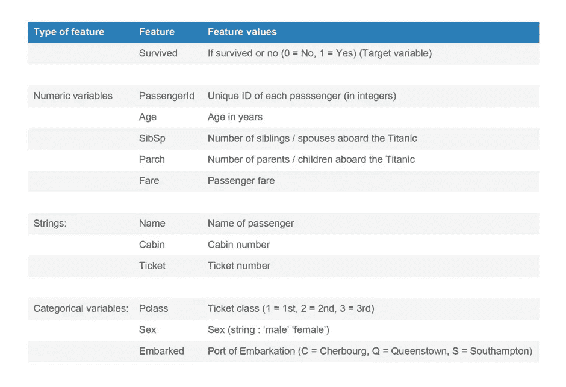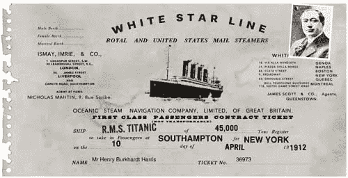

RMS 泰坦尼克号船票示例:[来源](https://www.encyclopedia-titanica.org/titanic-tickets/)

打印给定数据集的前 5 行..

# 问题定义和指标

这个问题是一个**二元类分类**问题。我们可以使用**二元交叉熵**或逻辑损失作为损失函数，以及任何度量标准，如**准确性**或/和 **ROC AUC 分数**作为评估结果的度量标准。

# 电子设计自动化(Electronic Design Automation)

## 特征之间的相关性:

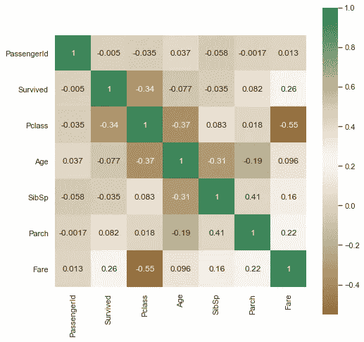

从特征之间的相关性中获得洞察力..

*   Fare 与 Pclass 呈负相关(皮尔逊相关系数为-0.55)；显然，**更高的票价意味着更好的机票等级**(更低的等级编号)，反之亦然。
*   Pclass 和目标特征呈中度负相关(-0.34)，这意味着**票证类别越好，存活的机会越高。**
*   对于特征 Parch、SibSp 和 Age，可以观察到类似的模式；Parch 和 SibSp 这两个特征与除年龄特征之外的所有特征都非常轻微地相关，并且都与年龄负相关(分别为-0.19 和-0.31)；**年龄越低，陪伴乘客的家庭人数越多**
*   SibSp 和 Parch 特征是正相关的，这两个特征都表示陪伴乘客的家庭成员的数量
*   PClass 和年龄负相关(-0.37)，暗示**年龄越高，机票等级越好**

## 缺失数据

**年龄**:包含 891 个条目中的 177 个 nan 值。用中位数估算得到最佳结果。

**上船**:包含 2 个 nan 值。用现有数据模式估算。

**舱室**:891 个舱室条目中有 687 个是 nan，即超过 50%的总数据以缺失数据或 nan 的形式存在，因此假设从该特征中导出其他特征更好。

现在，在处理缺失数据并将分类字符串转换为编码(0，1，2..)..

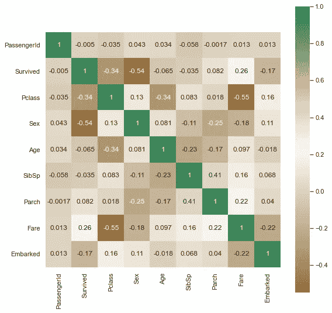

*   上船也与目标变量有轻微的相关性(-0.17)，乘客上船的**港口确实决定了他们的生存机会**
*   性别也与目标变量高度相关(-0.54)，表明**乘客的性别对他们的生存机会有很大影响**
*   乘客上船与票价呈负相关(-0.22)；显然，票价取决于乘客上船的港口。
*   上船和性别似乎也略有关联(0.11)，表明乘客从哪个**港口上船取决于乘客的性别**；上船和 Pclass 也相关(0.16)，表明**一等舱乘客可能与三等舱乘客**在不同的港口登机。
*   性别与票价、性别与 Parch、SibSp、性别与 Pclass 似乎都略有相关(分别为-0.18，-0.25，-0.11，0.13)；也就是说，乘客支付的费用，乘客的家庭，以及机票的等级似乎稍微取决于乘客的性别。

**问题 1:特征‘年龄’、‘性别’、‘票价’、‘上船’如何影响乘客的生还几率？**

年龄:

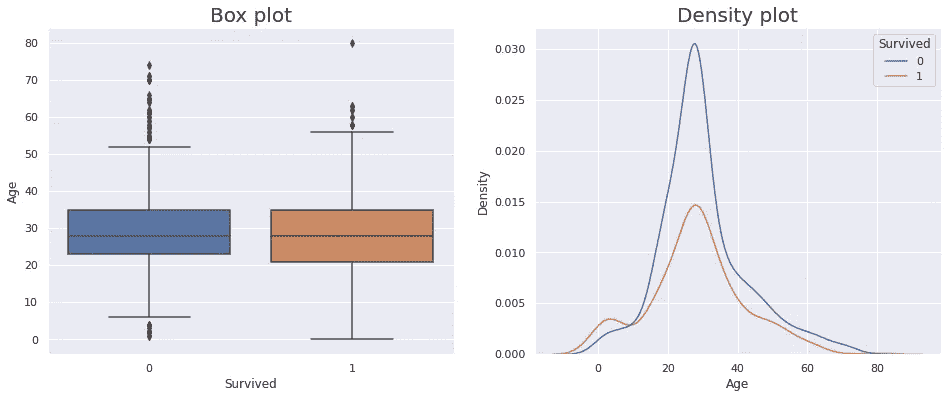

*   幸存者和未幸存者的两种分布都是正常的，未幸存者在 30 岁左右出现峰值，即**30 岁左右的人更有可能无法存活**
*   年龄> 51 岁的人被认为是死亡人口分布中的异常值。由于事实上**51 岁以上的人很少**，55 岁以上的人是幸存人口分布中的异常值，即**很少 55 岁以上的人真正幸存**

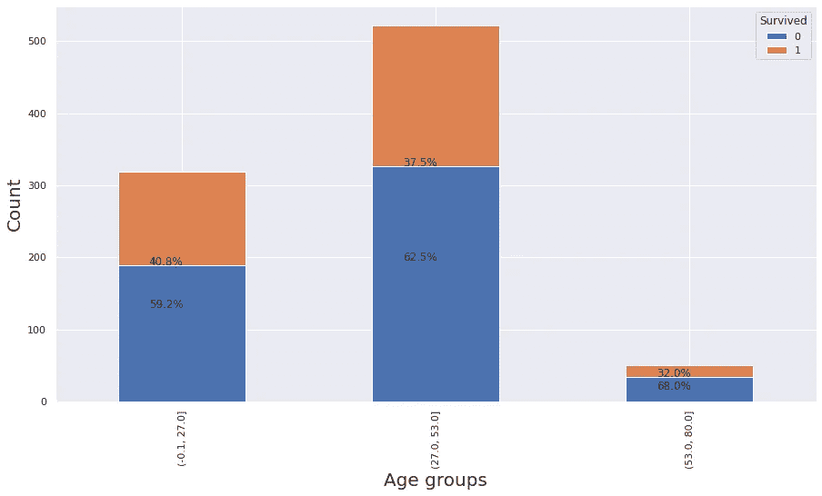

性:

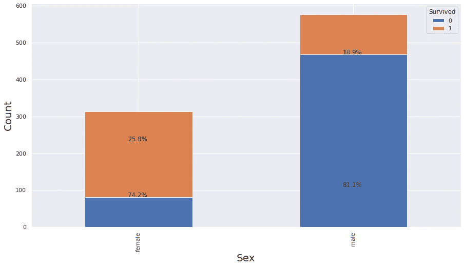

*   从上面的叠加图可以明显看出**有更多的女性乘客幸存**，即 74.2 %，而只有 18.9 %的男性乘客幸存，尽管车上有更多的男性乘客

票价:

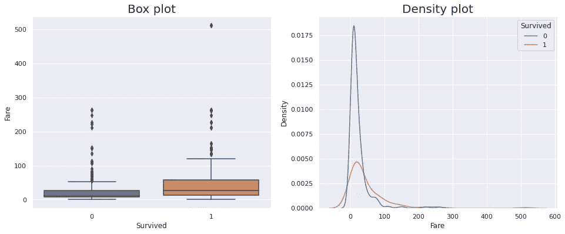

*   幸存者的票价分布明显具有更高的中值，因此**幸存者的平均票价更高**
*   两者的分布都有很多异常值
*   没有活下来的人的分布有一个巨大的峰值，或者说没有活下来的人有大约 10 个货币单位的概率非常高

上船:

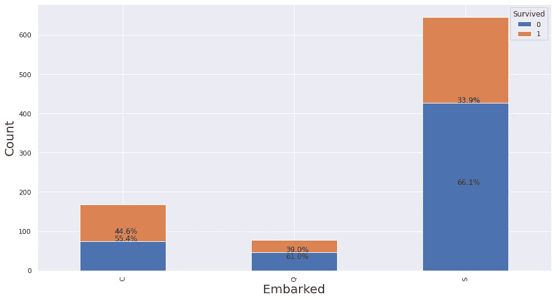

*   在南安普敦港登船的乘客似乎已经达到最大限度，只有 33%的人幸存下来；在皇后镇上船的所有乘客中，观察到类似的模式。
*   然而，在瑟堡登机的乘客幸存的比例更高(55.4%)；因此，如果一名乘客在瑟堡港登船，他们有更大的生存机会。

**问题 2:如何确定影响乘客生还几率的其他特征？**

## 特征工程

使用了三种可视化方法(主要是箱线图和密度图):

1.  箱线图:告诉我们每个输出类的要素分布范围(或第一个四分位数、中值、第三个四分位数),并让我们了解数据中的异常值
2.  密度图:告诉我们特征的分布和更多的分布形状(类似正态分布或任何其他分布)
3.  堆叠计数图:通过属于哪个输出类的百分比信息，告诉我们关于要素的每个类别的计数的更多信息

## SibSp 和炒制

由于这两个特征高度正相关(0.41)，我们可以通过添加配偶/兄弟姐妹的数量(SibSp)和父母/子女的数量(Parch)来推导出一个单一特征，该特征指示了乘客的随行家庭成员的数量。

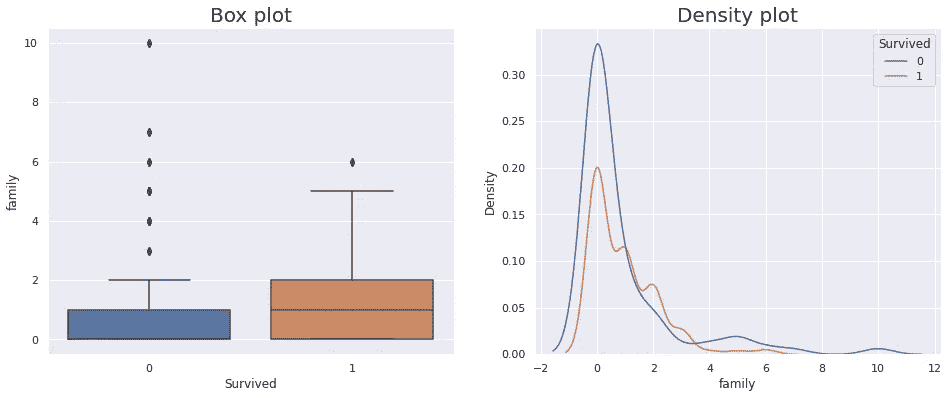

*   从箱线图来看，那些幸存下来的人平均有大约 1 个家庭成员，而那些没有幸存下来的人，家庭成员更少或者没有
*   从概率分布来看，这两种分布都类似于正态分布，只是略微向右倾斜
*   **家庭成员人数越少，乘客死亡的几率越高**

## 名字

由于乘客的名字不能直接用作特征，我们需要从中派生出特征。可以从每个乘客的名字中导出多个特征，例如:

*   名称的长度
*   姓名头衔(先生/夫人/等等)
*   字数(因为看起来确实与姓名长度相关，所以被丢弃)
*   姓氏字母

**名称长度**

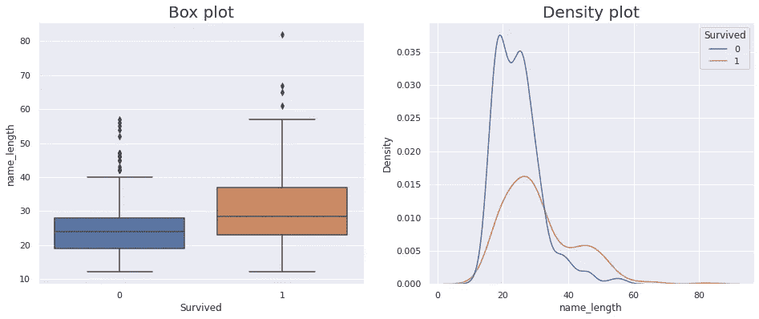

*   没有幸存下来的乘客名字的中位数往往是 25 个字母，而幸存下来的乘客名字的中位数是 30 个字母；没有幸存下来的乘客名字更短的可能性**(大约 25 个字母)。**

**姓名头衔**

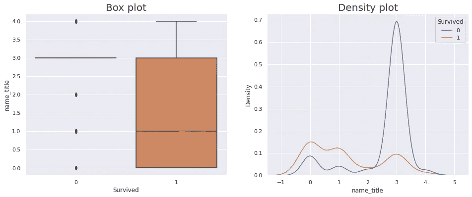

*   有 5 类姓名头衔，乘客有“小姐”、“夫人”、“主人”、“先生”，第五类有所有剩余的少数头衔，如“博士”、“牧师”。
*   三等舱中未能生还的乘客概率分布的急剧上升意味着拥有“主人”或**头衔的年轻男孩生还的机会更小。**

**姓氏的字母**

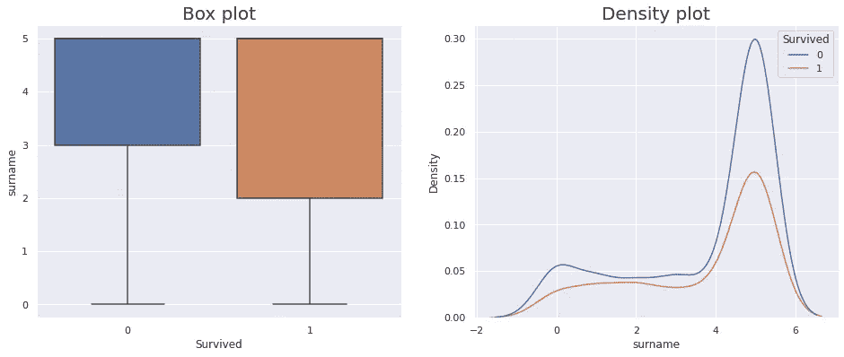

*   最常见的姓氏以下列字母开头:

```
Maximum occurence of letters in surname beginning : [('S', 86), ('M', 74), ('B', 72), ('C', 69), ('H', 69)]
```

*   这些被认为是姓氏特征的类别 1 至 5，而其余的姓氏是类别 6 的一部分。
*   相似的概率分布在两种乘客分布中被注意到，那些幸存的和那些没有的，姓氏以“H”开头的乘客有一个峰值。

## 小木屋

由于大量 nan 值的存在，我们从该特征中导出其他特征:

*   字母舱室号码开始(舱室的位置决定了乘客的生存，因为它决定了乘客离船的距离)
*   舱室值是否为 nan(在数据丢失或未知的情况下，表示存活的机会较小或与其他因素相关)

**宁滨号船舱**

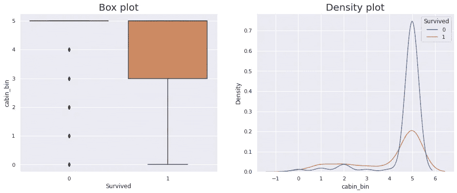

*   客舱分为 6 个等级，机票从“A”、“B”、“C”、“D”、“E”开始，第 6 个等级为剩余的客舱号。
*   两种概率分布都观察到了类似的模式，以“E”开头的客舱号码出现峰值。

**机舱男**

检查数据集中的随机行，我们可以看到许多三等舱乘客在他们的舱号中有多个 nan。

“客舱”作为“Pclass”值 3 的 nan 的数据中的随机行

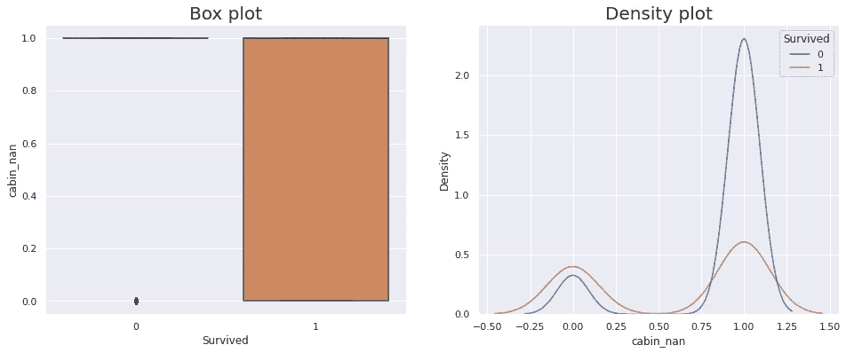

*   在机舱号中没有与 nans 一起幸存的乘客的分布中看到的峰值；如果客舱值为 nans ，乘客生还的几率会更高
*   **一等舱的乘客被安排在 A、B、C、D 和 E 甲板的船舱里，而二等舱的乘客主要被安排在 D 和 E 甲板的船舱里，而更远的甲板则为三等舱的乘客安排了船舱。**

## ****票**:**

*   **票号是指由订票代理提供的印在票上的值(如上图),它可以表示订票日期。(没有产生好的结果，所以不使用)**
*   **基于票据串的内容进行分箱(首先是数字，然后是每个串的第一个字母，但是由于更好的性能，保留了两个分箱，一个分箱具有仅包含数字的票据编号，另一个分箱具有数字和字母)。**
*   **我们在此基础上检查票号和 bin 中第一个字母的重要性。**

**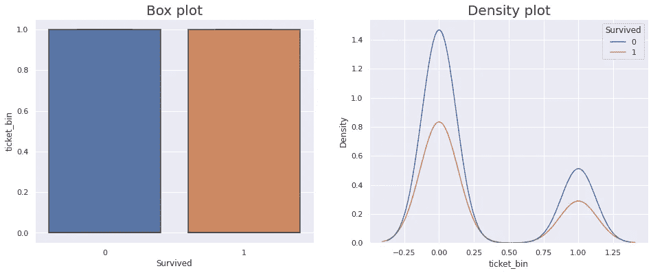**

*   **在两种概率分布中观察到相似的模式，并且在两种观察到的分布中观察到相似的平均值，对于没有幸存的乘客，分布稍微陡峭一些。**

## **特征编码:**

**我使用了熊猫的 get_dummies()函数进行热编码。对于数据中的多个类别，pd.get_dummies()为每个标签创建一个值为 0 或 1 的列，避免使用标签编码，这样会给出数字数据(0，1，2，3..类的数量)作为可能混淆模型的特征。**

## **特征工程后特征之间的相关性**

**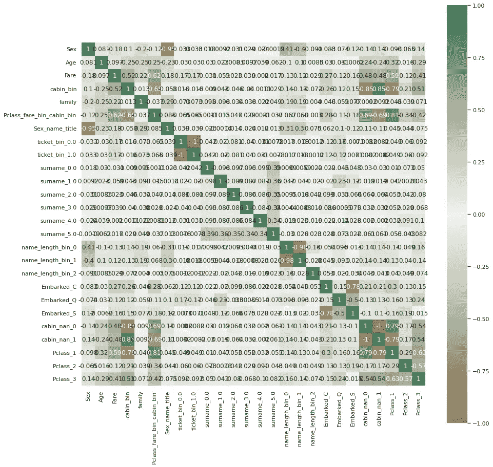**

## **组合高度相关的特征**

**我们将高度相关的功能组合在一起，创建一个新功能，即:**

*   **性别和姓名 _ 职务**
*   **P_class、fare_bin 和 cabin_bin**

## **不平衡数据集**

**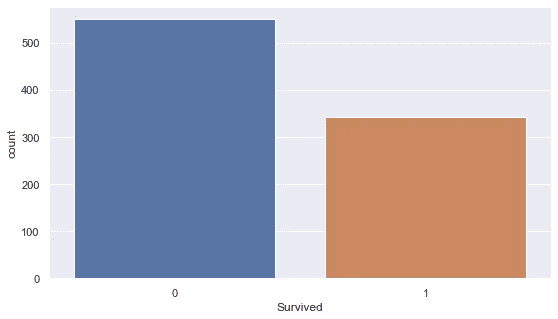**

**“幸存”特征计数图**

*   ****数据明显不平衡**，幸存**的人数几乎接近未幸存**人数的一半**
*   **我们可以使用分层抽样、过采样、SMOTE 或任何其他技术来处理数据中的不平衡，但我坚持使用分层抽样，参考了这里提到的几个笔记本。**

## **特征重要性**

**训练提取树分类器以查看 X_train 中最重要的特征。**

**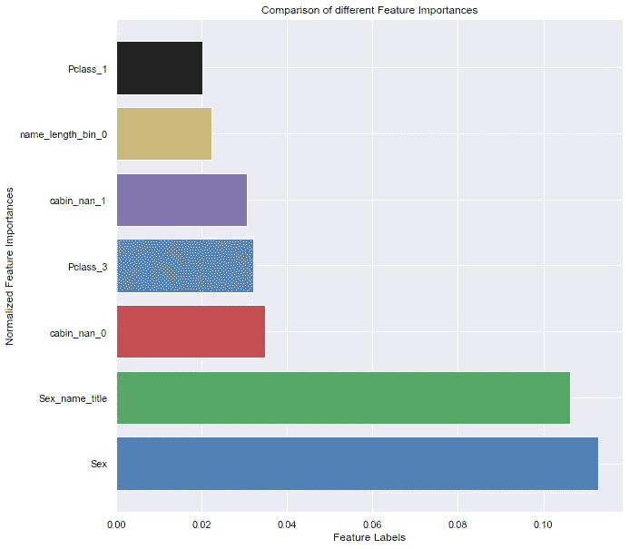**

# **基线模型**

**对于基线模型，我们使用优化的随机森林模型，因为它非常健壮，并且算法创建去相关的树，这有助于克服将模型过度拟合到较少的特征。**

**以下是来自已训练随机森林模型的树:**

**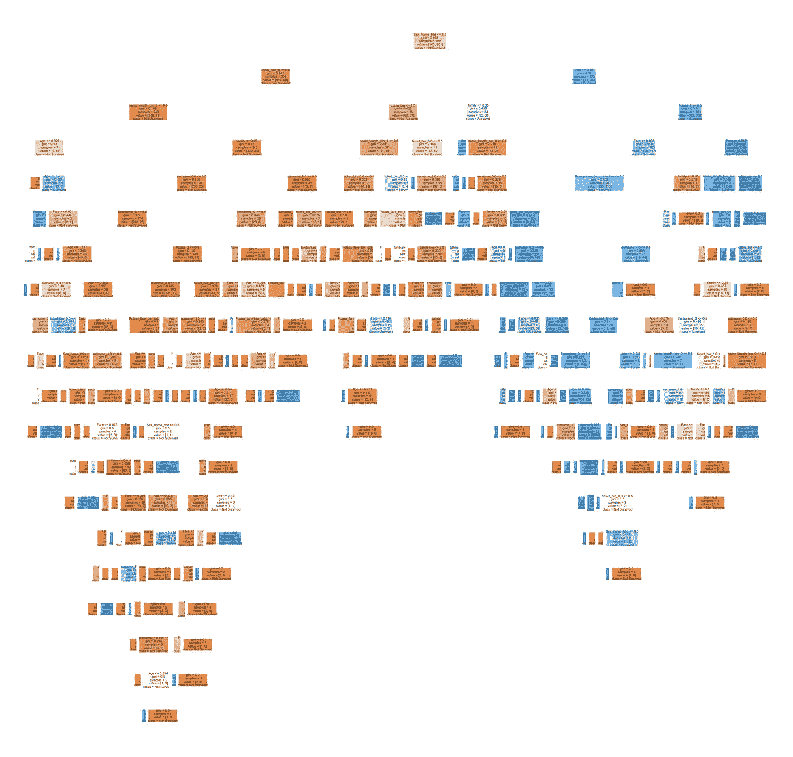**

**来自已训练的随机森林模型的单个决策树**

**在顶部，我们有第一个分割，特征“性别 _ 姓名 _ 头衔”，看起来是告诉我们关于乘客生存机会的最重要的特征。基于这个特征分割 X_train 给了我们一个 gini 杂质分数，或者更简单地说，一个 0.469 的信息增益。**

**‘cabin _ nan’和‘Age’是用于下一次分割的特征，具有第二好的信息增益值。**

**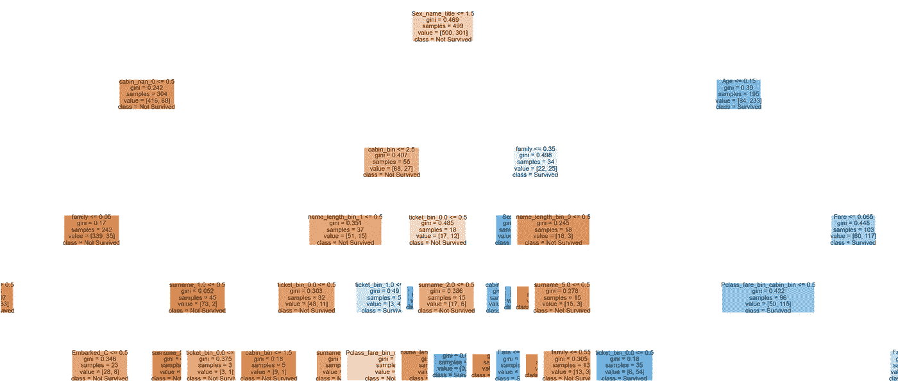**

**放大上图**

**我们使用实现了**贝叶斯优化**的**hyperpt**库来获得模型的优化超参数。**

**术语贝叶斯是指包含先验**和**可能性函数**的概率定律，先验**是在进行观察之前事件的概率分布，由过去的知识确定，而**可能性函数**根据记录的观察提供关于事件概率分布的信息。**

**贝叶斯优化是一种使用先验概率来确定函数的全局最小值的算法。简而言之，与网格搜索和随机搜索算法不同，网格搜索和随机搜索算法使用预测的当前值来寻找误差表面中的最小误差点，贝叶斯优化使用关于先前误差的信息来预测下一个预测，这使得在寻找优化问题中的最小误差点的过程中更加可靠。这是一个很棒的博客，用非常简单的术语解释了贝叶斯优化。**

# **型号选择**

**我们用简单的二元分类模型进行实验，如逻辑回归、SVM、KNN，然后是基于决策树的分类器，如随机森林、XGBoost。**

**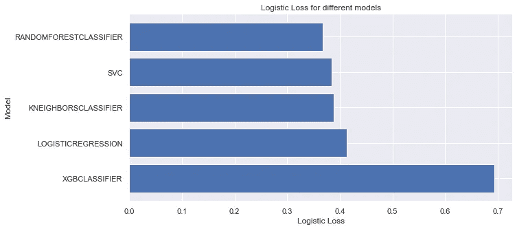**

**上图显示了分类结果，其中 SVC 和 Random Forest 预测的误差最小，而 XGBoost 预测的误差最大。**

# **结果和结论**

**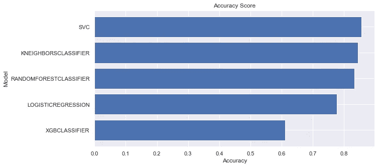**

*   **我们使用**随机森林和 KNN** 在测试集上得到最终的准确度分数 **0.8334** ，使用 **SVC** 得到分数 **0.855** 。**

***感谢阅读！***

**另外，如果有任何改进这篇文章的建议，请告诉我！**

**[这里](https://www.kaggle.com/aish0997/titanic-dataset-80-accuracy)是 Kaggle 笔记本的链接，供参考。**

# ****参考文献:****

1.  **[https://en.wikipedia.org/wiki/Titanic](https://en.wikipedia.org/wiki/Titanic)**

**[2。https://www.kaggle.com/slythe/infamous-titanic-80-accuracy](https://www.kaggle.com/slythe/infamous-titanic-80-accuracy):**

**[3。https://www . ka ggle . com/raysun 91/0-794-top-5-using-logistic-regression](https://www.kaggle.com/raysun91/0-794-top-5-using-logistic-regression)**

**[4。https://towards data science . com/choosing-the-right-encoding-method-label-vs-one hot-encoder-a 4434493149 b](https://towardsdatascience.com/choosing-the-right-encoding-method-label-vs-onehot-encoder-a4434493149b)**

**5.[https://data science . stack exchange . com/questions/63558/should-features-be-correlated-or-un-correlated-for-class ification](https://datascience.stackexchange.com/questions/63558/should-features-be-correlated-or-uncorrelated-for-classification)**

**6.[https://www.encyclopedia-titanica.org/cabins.html](https://www.encyclopedia-titanica.org/cabins.html)**

**7.https://www.encyclopedia-titanica.org/titanic-tickets/**