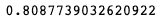

# 泰坦尼克号生存项目——从流行文化到数据科学

> 原文：<https://medium.com/analytics-vidhya/titanic-survival-project-pop-culture-to-data-science-55e8721ef0a8?source=collection_archive---------4----------------------->


泰坦尼克号——图片。壁纸耀斑)

首航就沉没的不沉之船。有争议的电影。悲惨的泰坦尼克号。通过使用 Kaggle 上提供的数据，我们作为数据科学家可以将我们的大量知识应用到相对干净的数据集上。数据集对于 EDA(探索性数据分析)、数据清理技术和机器学习算法来说已经成熟。数据科学不仅仅局限于博士和学术界。任何人都可以做到这一点，我希望分享我在解决这个 kaggle 挑战的方法论。泰坦尼克号嵌入了我们的流行文化，所以很容易拿起这个数据集并开始修补。所以让我们开始吧！

# 数据探索

## 导入和基本设置

因此，首先，我导入了我认为项目需要的包:

```
**import** **pandas** **as** **pd** 
**import** **numpy** **as** **np**
**import** **matplotlib.pyplot** **as** **plt**
**import** **sklearn** 
**import** **seaborn** **as** **sns**
```

我使用 pandas & NumPy 进行数据准备和变异，而如果我愿意，我会使用 Matplotlib 和 seaborn 进行可视化。

```
train_df = pd.read_csv('train.csv') 
test_df = pd.read_csv('test.csv')tempdf = pd.read_csv('gender_submission.csv') *#Might come useful later*
```

我加载了数据，并为测试数据框架的解决方案留出了一个临时数据框架。

```
train_df.head()
```


```
test_df.head()
```


立即突出的事实是，在测试数据帧中没有幸存的列。虽然这是可以预料的，因为幸存的那一列才是我们需要预测的。通过使用数据框架中的特征，我们应该能够预测泰坦尼克号悲剧中的幸存者。

## 进一步探索数据

首先，我从理解数据的内容开始分析数据。查看数据中有多少 NaN/null 值，以及每列中有多少唯一值，这一点很重要。因此，我开始写道:

```
train_df.nunique()
```


现在我们可以清楚地看到，我们的训练数据集中有 891 名乘客。正如我们所料，只有 2 个幸存的独特价值，因为你只能生存或不生存。乘客有 3 个等级:1、2 或 3。有 2 种性别等等。nunique()函数允许我们查看每一列中唯一值的数量。但是，为了查看有多少个 nan 值，我编写了代码:

```
train_df.isnull().sum()
```


这很有趣，因为座舱柱已经过时了。在 891 列中，缺少 687 行。因此，我从数据框中删除了该系列:

```
train_df = train_df.drop('Cabin', axis = 1)
train_df.head()
```

尽管我承认您可以从其他专栏中推断数据，但我发现与其他特性相比，它通常没有那么大的影响。尽管我们对数据集做了一些最小的清理，但仍有 177 个“年龄”没有在数据集中找到。

## 列车数据清理和准备

我开始用平均值填充年龄空值:

```
train_df['Age'].fillna(train_df['Age'].mean(), inplace = **True**)
```

通过填充平均值，我们不会破坏数据集的完整性。尽管中值可能会稍微偏移，但平均值将保持不变，并且在理论上，我们将能够在我们的模型中使用该列。为了完成数据的清理，我简单地删除了装载数据中具有空值的行，方法是:

```
train_df = train_df.dropna(subset = ['Embarked'])
```

然后，为了确认所有的空值确实都被删除了，我通过运行以下命令进行了检查:

```
train_df.isnull().sum()
```

瞧:


现在我们已经删除了所有的空值，我们可以继续进行特性工程和优化。

## 特征工程

首先，让我们创建一个名为“独自旅行”的新专栏。目前只有 SibSp 和 Parch 专栏，讨论的是兄弟姐妹、配偶、父母和子女。利用这些数据，我们可以推断出独自旅行一栏。使用该列，我们可以看到，如果你是一个人或不是一个人，生存概率是否有任何变化。

```
train_df['Travelling Alone'] = train_df.apply(**lambda** row: row.SibSp == 0 & row.Parch == 0, axis = 1)

train_df.loc[train_df['Travelling Alone'] == **True**, 'Travelling Alone'] = 1

train_df.loc[train_df['Travelling Alone'] == **False**, 'Travelling Alone'] = 0train_df.head()
```


通过使用 lambda 函数，我们可以检查条件是否满足，如果满足，那么我们可以将它添加到单独旅行列中。然而，使用 lambda 会产生一个布尔类型。因此，我们用熊猫。loc[]运算符将数据转换为整数数据类型。尽管您不一定必须执行这一步，但我发现在整个项目中保持类似的约定非常有用。

在这个项目中，我使用了 Scikit-Learn，他们的模型不接受字符串。因此，谨慎的做法是删除包含字符串或字符的列。姓名、机票、登机、性别都有字符串或字符在列中。对于 Name 和 Ticket，因为它们在模型中是不需要的，我们可以简单地删除它们。

```
train_df = train_df.drop(['Ticket', 'Name'], axis = 1)train_df.head()
```


我们已经有了一种区分乘客的方法，那就是简单地通过使用他们的乘客 ID。然而，性和他们从哪里出发是重要的栏目。它们可能对机器学习模型至关重要，因为它们是分类变量。用熊猫的。loc[]，我们可以把性别列从字符串改成整数。

```
train_df.loc[train_df['Sex'] == 'male', 'Sex'] = 1
train_df.loc[train_df['Sex'] == 'female', 'Sex'] = 0train_df.head()
```


既然我们已经将男性指定为数字 1，将女性指定为数字 0，那么我们可以继续讨论已上船列了。上船列包括 3 个类别。每个港口都是乘客离开的地方。C =瑟堡，Q =皇后镇，S =南安普顿。我把皇后镇设为 1，南安普敦设为 2，瑟堡设为 3。

```
train_df.loc[train_df['Embarked'] == 'Q', 'Embarked'] = 1

train_df.loc[train_df['Embarked'] == 'S', 'Embarked'] = 2

train_df.loc[train_df['Embarked'] == 'C', 'Embarked'] = 3
```

通过这种方式，所有的数据都是以整数的形式表示的，使用软件包 sci-kit learn 不会有任何问题。正如我们外推“独自旅行”专栏一样，我们可以以类似的方式创建另一个名为“家庭规模”的特性。通过使用 lambda 函数，我们可以访问行:SibSp 和 Parch 来创建一个新列。

```
train_df['Family Size'] = train_df.apply(**lambda** row: row.SibSp + row.Parch, axis = 1)train_df.head()
```


通过创建一个新的列，我们可以监控家庭规模对存活率的影响趋势。

既然我们已经清理了数据并创建了新的列进行分析，我们必须对测试数据框架做同样的事情。我们的测试数据框架和训练数据框架的特征必须相同，以确保在模型的训练和测试阶段不会出现错误。

```
test_df = test_df.drop(['Ticket', 'Name', 'Cabin'], axis = 1)

test_df['Age'].fillna(test_df['Age'].mean(), inplace = **True**)
test_df = test_df.dropna(subset = ['Embarked'])

test_df['Travelling Alone'] = test_df.apply(**lambda** row: row.SibSp == 0 & row.Parch == 0,axis = 1)

test_df.loc[test_df['Travelling Alone'] == **True**, 'Travelling Alone'] = 1

test_df.loc[test_df['Travelling Alone'] == **False**, 'Travelling Alone'] = 0

test_df.loc[test_df['Sex'] == 'male', 'Sex'] = 1

test_df.loc[test_df['Sex'] == 'female', 'Sex'] = 0

test_df['Family Size'] = test_df.apply(**lambda** row: row.SibSp + row.Parch, axis = 1)test_df.loc[test_df['Embarked'] == 'Q', 'Embarked'] = 1

test_df.loc[test_df['Embarked'] == 'S', 'Embarked'] = 2

test_df.loc[test_df['Embarked'] == 'C', 'Embarked'] = 3test_df['Fare'].fillna(test_df['Fare'].mean(), inplace = **True**)
```

# 机器学习模型

现在，让我们进入正题。由于这是我的第一个真正的数据科学项目，如果你们能在评论中给我反馈来改变和调整我的项目，我将不胜感激！

我从查看我的火车开始，并再次测试数据帧，只是为了看看一切是否同步并准备就绪！

```
train_df.head()
```


```
test_df.head()
```


看起来我们的数据处于最佳状态，如果我们需要编辑任何东西，我们可以随时进行。要开始机器学习过程，我们必须指定我们的功能:

```
features = ['Sex', 'SibSp', 'Parch', 'Travelling Alone', 'Family Size', 'Embarked', 'Pclass']

Y = train_df['Survived']
X = train_df[features]

X_test = test_df[features]
```

我选择的特征是性别、SibSp、Parch、独自旅行、家庭规模、上船和乘客的等级。值得注意的是，我没有包括年龄和费用，因为我在测试时发现这些往往会使我的模型过拟合。这可能是因为 891 名乘客中有 731 人只支付了 0-50 英镑，我用平均值从年龄中清除了 nan 值。然而，由于这些情况，我选择不使用这些功能。为了确保没有空值，我再次测试了训练和测试数据帧:

```
X_test.isnull().sum()
```


```
X.isnull().sum()
```


既然对 nan 值存在的任何怀疑都已消除，让我们开始建模。

## 随机森林分类器

我们列表中的第一个是随机森林分类器。我将使用的所有模型都与 sklearn 包兼容。我首先调用这个包:

```
**from** **sklearn.ensemble** **import** RandomForestClassifierrf = RandomForestClassifier(n_estimators = 100,
                           n_jobs = -1,
                           oob_score = **True**,
                           bootstrap = **True**,
                           random_state = 42)
```

我将 RandomForestClassifier 对象赋给一个易于输入的变量，因为正如比尔·盖茨所说:

> “我总是会选择一个懒惰的人来做一件困难的工作，因为一个懒惰的人会找到一个简单的方法来做这件事。”

我创建了一个模型变量并“拟合”了模型:

```
rfm = rf.fit(X,Y)
```

然后我给模型打分:

```
rfm.score(X,Y)
```


在训练数据帧中，特征和存活率之间的关系约为 84%。但是，基于决策树的算法因过度拟合而闻名，因此该值对于测试数据可能不准确。

因此，我试图用一种更好的技术来准确判断训练值和测试值之间的关系:

```
**from** **sklearn.model_selection** **import** cross_val_scoreaccuracyRFM = cross_val_score(estimator=rfm, X = X, y = Y, cv=5) accuracyRFM.mean()
```


我们得到 78.4%的相关性，这对于预调模型来说似乎更现实。

我继续为预测做一个数组，编码如下:

```
predictions = rfm.predict(X_test)predictions
```


## 支持向量机分类器

接下来，让我们通过 sci-kit learn 尝试 SVM 分类器！我们将经历相同的步骤:

```
**from** **sklearn** **import** svm
svms = svm.SVC()s = svms.fit(X,Y)svms.score(X,Y)
```



这一次，使用。score()函数，我们得到了 81%的粗略估计。现在让我们使用 cross_val_score 函数:

```
accuracySVM = cross_val_score(estimator=s, X = X, y = Y, cv=5)
accuracySVM.mean()
```


尽管我们的 scikit-learn 分数在技术上较低，但我们的交叉验证分数却较高。与基于决策树的模型相比，支持向量机似乎不太容易过度拟合。

就像上一个模型一样，我创建了一个预测数组:

```
predictions = svms.predict(X_test)
predictions
```


## 逻辑回归

我最后做了几个其他模型:决策树、AdaBoostClassifier、GradientBoostClassifier 和 KNN，但我发现向您展示相同的过程只会让这篇文章变得更长、更多余。所以我给你看我用的第三个模型:逻辑回归。虽然回归模型通常用于预测类型的问题，但逻辑回归用于基于分类的数据集。就像上次一样:

```
**from** **sklearn.linear_model** **import** LogisticRegressionlr = LogisticRegression()l = lr.fit(X,Y)l.score(X,Y)
```


我们的 sci-kit 学习分数达到了 81 分左右，但是，我们知道不能依赖单一的信息来源:

```
accuracySVM = cross_val_score(estimator=l, X = X, y = Y, cv=5)
accuracySVM.mean()
```


我们的交叉验证分数大约为 79%。在 sklearn 分数和交叉验证分数之间只有 1%的下降。这告诉我们，逻辑回归也不会像决策树一样被过度拟合所阻碍。就像上两个模型一样，我创建了预测数组:

```
predictions = l.predict(X_test)predictions
```


# 调整模型

在上一节中，我们最终使用了基本模型，并且我们对模型本身几乎没有控制。现在，我们将直接访问模型的参数，并修改它们以找到最佳参数和模型。

我们将从导入一些重要的包开始:

```
**from** **pprint** **import** pprint**from** **sklearn.model_selection** **import** GridSearchCV, StratifiedKFold
**from** **sklearn** **import** linear_model, decomposition
**from** **sklearn.preprocessing** **import** StandardScalerkfold = StratifiedKFold(n_splits=10)
```

我们使用 GridSearchCV 为我们的数据找到可能的最佳模型。

## 随机森林分类器的超参数调整

```
rf_param_grid = 
{'max_features' : [0.1, 0, 1, 2, 3, 4, 5, 6, 7, 8, 9, 10], 'min_samples_split': [0, 1, 2, 3, 4, 5, 6, 7, 8, 9, 10], 'min_samples_leaf': [0, 1, 2, 3, 4, 5, 6, 7, 8, 9, 10, 100, 150]}

best_rfc = GridSearchCV(rfc, param_grid = rf_param_grid, cv = kfold, scoring = 'accuracy', n_jobs  = 4, verbose = 2)

best_rfc.fit(X,Y)

pprint(best_rfc.best_score_)

best_rfc = best_rfc.best_estimator_
```


首先，我们必须研究模型的超参数是什么。要做到这一点，你可以做一个简单的谷歌搜索，然后到文档[这里](https://scikit-learn.org/stable/modules/generated/sklearn.ensemble.RandomForestClassifier.html)。通过改变最大特征、最小样本分割和叶子，我可以更好地控制我的分类模型。我将我的参数网格插入 GridCV 函数，并告诉它我希望如何评分。然后，我继续使用 GridSearchCV 对象来调优随机森林分类模型。我打印的最佳分数为 80.1%，比基线模型的 78%有了显著的提升。然后，我们将包含最佳参数的最佳估计量分配给变量:best_rfc。

## 支持向量机分类的超参数调整

使用与上一个模型类似的过程，我们编写代码:

```
svmc = SVC(probability = **True**)

svmc_param_grid = {"kernel": ['rbf'], 'gamma': [0.001, 0.01, 0.1, 1, 10], 'C': [0.01, 0.1, 1, 10, 50, 100, 500, 1000, 5000, 10000]}

best_svmc = GridSearchCV(svmc, param_grid = svmc_param_grid, cv = kfold, scoring = 'accuracy', n_jobs = 4, verbose = 2)

best_svmc.fit(X,Y)

pprint(best_svmc.best_score_)

best_svmc = best_svmc.best_estimator_
```


支持向量机也输出 80.1%的最佳得分。与基线模型相比没有显著增加。

## 逻辑回归的超参数调整

就像模型一样，我不希望它是多余的，所以我将展示另一个超参数调整的例子:

```
lr = LogisticRegression()

lr_param_grid = {'penalty': ['l1','l2'], 'C': [50, 10, 1.0, 0.1, 0.01], 'solver': ['newton-cg', 'lbfgs', 'liblinear', 'sag', 'saga']}

best_lr = GridSearchCV(lr, param_grid = lr_param_grid, cv = kfold, scoring = 'accuracy', n_jobs = 4, verbose = 2)

best_lr.fit(X,Y)

pprint(best_lr.best_score_)

best_lr = best_lr.best_estimator_
```


逻辑回归模型输出了 80%的最佳得分，比基线模型提高了 1%。

# 将所有调整后的模型组合成一个集合

既然我们已经排除了模型，是时候把它们串起来了。为此，我们将使用位于 sklearn 的 ensemble 子包中的投票分类器:

```
**from** **sklearn.ensemble** **import** VotingClassifier
```

然后，我们将继续把调好的模型串在一起:

```
stringClassifier = VotingClassifier(estimators=[('rfc', best_rfc),('svc', best_svmc), ('adac',best_abc),('gbc',best_gbc), ('knn', best_knn), ('lr', best_lr)], voting='soft', n_jobs=4)stringClassifier = stringClassifier.fit(X, Y)stringClassifier.score(X,Y)
```


使用投票分类器函数，我们可以获得 82.5%的预测率。现在我们简单地使用数组函数来创建我们的预测:

```
predictions = votingC.predict(X_test)
predictions
```


最后，我们编写一个 CSV，以便提交我们的发现:

```
Survived = pd.Series(stringClassifier.predict(X_test), name="Survived")

results = pd.concat([IDtest,Survived],axis=1)

results.to_csv("results.csv",index=**False**)
```

# 结论

尽管泰坦尼克号数据集可能不能代表真实世界的数据，但通过数据集肯定可以学到很多东西。我非常支持通过实践来学习，为此，我将永远感谢这个数据集。在许多方面，我能够应用我从吴恩达的机器学习课程(强烈推荐)和其他课程中学到的技能。当你在一个课程中，你会得到一些信息，但是在一个项目中，你什么也不会得到。你和数据。就是这样。我希望我能激励你们中的一些人拿起数据集，尝试学习那些原本无人触及的技术。我当然不是机器学习方面的专家，所以我会感谢反馈或任何问题！感谢大家的阅读！

## 重要链接

[](https://www.kaggle.com/c/titanic) [## 泰坦尼克号-机器从灾难中学习

### 从这里开始！预测泰坦尼克号上的生存并熟悉 ML 基础知识

www.kaggle.com](https://www.kaggle.com/c/titanic) 

[https://www . wallpaperflare . com/white-and-black-ship-titanic-vintage-ship-wallpaper-255721](https://www.wallpaperflare.com/white-and-black-ship-titanic-vintage-ship-wallpaper-255721)