# 解冻还是不解冻

> 原文：<https://medium.com/analytics-vidhya/to-defrost-or-not-to-defrost-b072b9d0bbd0?source=collection_archive---------11----------------------->


图片报冯乔丹假日 auf Pixabay

# 用递归神经网络预测空气/水热泵系统中的除霜事件

几年前，我和我的妻子在被动房屋标准的基础上建造了一个新的能量屋。中央供暖装置是我们新家前面的一个空气/水热泵。我们很快了解到，热泵的默认运行模式并不真正有效，大量的能源被浪费或没有得到有效利用。需要做点什么！当然，作为一名 IT 架构师，必须集成所有主要组件，以便能够监控和控制中央家庭自动化系统中的一切。

基于 openHAB 的当前实施是根据屋顶上的光伏发电、室内和室外温度、季节需求和天气预报来控制热泵。除了不时发生的一个小影响:除霜，这个方法真的很有效。

让我解释一下。空气/水热泵利用室外空气中的能量加热水，用于地板下供暖和热水。它使用内部压缩机将热能从源头(空气)转移到目的地(水)。这在零下 20 摄氏度的温度下也能工作，但是随着空气失去能量，它变得更冷，不再能够保持与以前相同数量的水蒸气。绝对湿度降低，水在热泵的板条上凝结成冰。取决于空气湿度、温度和许多其他因素，冰变得越来越厚，阻碍了空气流动，因此阻碍了热泵输送热量的能力。为了去除冰，热泵能够自行除霜。它使水流反向，并利用地板下供暖的热能来融化冰。除霜需要几分钟，根据温度和湿度的不同，一天要除霜 10 次。

这个过程需要大量的能量，但这是绝对必要的，无法阻止，除非你能预测解冻，提前停止热泵，并确保冰在接下来的几个小时里有足够的时间自然融化。当除霜发生时，监视热泵并停止一切是不够的。至少我们的热泵系统会一直运行到除霜结束，即使你命令它停止。因此时不时会发生监控算法在除霜开始后几秒钟就决定停止加热的情况。大量的能量被用来给热泵除霜，然后一切都关闭了，因为一天不再需要加热了。

这是没有效率的，我讨厌它。需要做点什么！

# 问题是

我的基于 openHAB 的解决方案在过去五年中一直监控热泵，并将所有传感器值、当前和未来温度、加热设置和除霜事件保存在 MySQL 数据库中。有没有可能利用这些数据在即将到来的除霜事件发生之前预测它们？

数据由每次数值变化的独立数据点组成，例如，只有当温度发生变化时，新值才会与发生变化时的时间戳一起写入数据库。在进行时间序列分析之前，需要导入、汇总和重新采样这些独立的数据点。

我的目标是使用重新采样的数据，用过去几年的解冻事件来训练一个机器学习算法。该算法应该学会基于来自过去某个时间段(例如，几分钟或几小时)的数据来预测即将到来的除霜事件，以便有希望预测接下来 5 分钟内的除霜事件。

# 数据

我将所有数据表导出为 csv 文件。这些是我在这个练习中使用的数据点:

*   *返回*:地暖后的原样温度
*   *参考 _ 返回*:加热待返回温度
*   *供给*:热泵后原样供给温度
*   *servicewater_reference* :热水的目标温度
*   *服务水*:热水的现状温度
*   *热气*:压缩机内热气的温度
*   *probe_in* :外部空气温度
*   *mk1* :地暖前的原样温度
*   *状态*:状态信息(制热、除霜等)。)
*   *扩展状态*:扩展状态信息(制热、除霜等)。)

(你可能会问为什么外面没有*的*温度？原因是传感器不在正确的位置，并且现在不用于控制热泵。)

所有 csv 文件只包含一个值的基于时间戳的值更改。这是*热泵 _ 热 _ 气. csv* 的样子:

```
...
"2018-10-01 15:42:33";"68.7"
"2018-10-01 15:42:54";"68.8"
"2018-10-01 15:43:14";"68.9"
"2018-10-01 15:43:44";"69"
"2018-10-01 15:44:24";"69.1"
"2018-10-01 15:44:44";"69.3"
"2018-10-01 15:45:15";"69.4"
...
```

state 和 extended_state 文件略有不同，因为它们的大小和基于文本的值带有额外的时间戳，所以需要在读取过程中进行处理。为了更好地解释，让我们看一下*热泵 _ 扩展 _ 状态. csv* :

```
"2016-01-16 14:41:43";"heating: 04:36:16"
"2016-01-16 14:41:53";"heating: 04:36:29"
"2016-01-16 14:42:03";"heating: 04:36:37"
"2016-01-16 14:42:13";"defrosting: 04:36:48"
"2016-01-16 14:42:23";"defrosting: 04:36:58"
"2016-01-16 14:42:34";"defrosting: 04:37:06"
```

由于数据量巨大(这个文件有 600 MB)，额外的时间戳立即被剥离(热泵的时钟无论如何都是错误的)为简单的字符串，如“加热”和“解冻”。

所有这些值被合并到一个稀疏的数据帧中，该数据帧具有 12 列、1600 行和许多 nan 值，当值发生变化时，以时间戳作为索引。

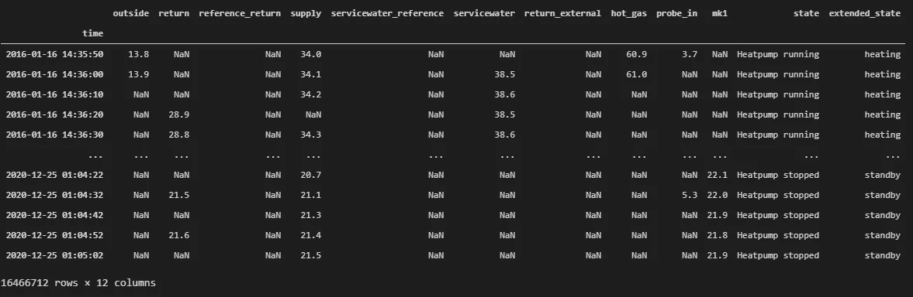

合并的数据帧

数据帧由稀疏列支持，否则会消耗大量内存。因此，由于 Pandas 的稀疏实现，一些数据转换需要走一些弯路。state 和 extended_state 列被转换为“二进制”值，它们有自己的列，如*压缩机 _ 加热*、*热泵 _ 加热*、*热泵 _ 服务水*、*热泵 _ 运行*以及最后的*除霜*。现在一切都很稀疏，有很多 NaN 值，没有发生变化。

现在是时候先看看图表了。这是数据在实施时的样子:


解冻事件正是我们所期待的。正如你所看到的，前面几分钟没有任何传感器发出强信号。至少在第一次除霜的时候，它就不知从哪里“发生”了。在 14:00 进行第二次除霜时，您会看到 15 分钟前从生产热水切换到地板供暖。这样做的原因是热泵需要预先加热地板，以获得足够的能量用于除霜。每次除霜产生热水时都会发生这种情况，但这只是所有除霜事件的一小部分。

我们来看看历年的整体除霜分布情况。

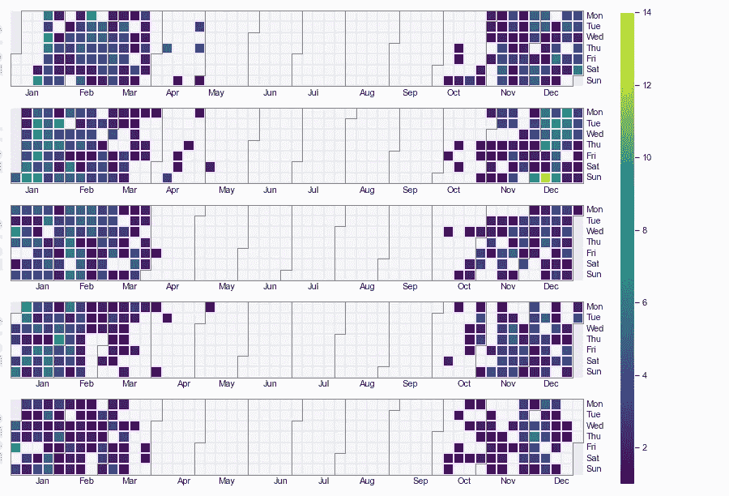

这些是 1853 年的解冻，大多发生在冬天。这应该是足够的数据来使用机器学习模型在除霜事件发生之前预测它。

顺便说一句，你可以看到每年解冻事件的轻微变化，在秋天开始得稍微早一点，在春天停止得稍微早一点。这是因为我优化了天气预报的使用和对未来几天室外温度的预测。这些年来，我设法将我们家的耗电量减少了 20%。

# 大量的预处理

为了将这种时间序列数据用于机器学习，需要将其从稀疏转换为密集，以规则的间隔(1 分钟)重新采样，并归一化到可用的范围(0.0 到 1.0 之间)。

这与上面的图表相同，但经过了标准化处理:

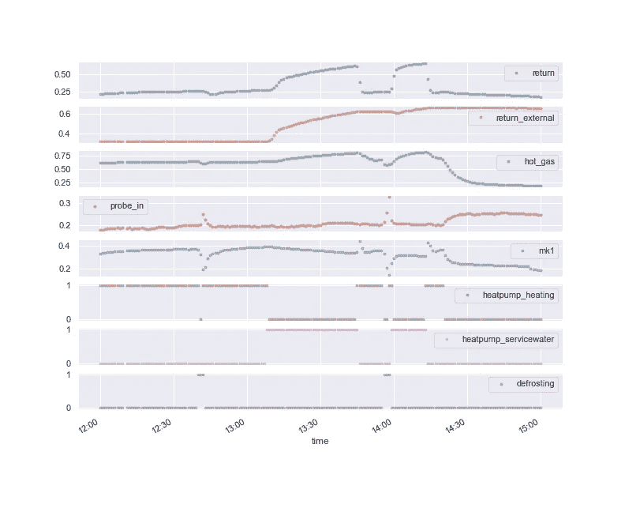

时间序列分析有很多方法和算法，但我决定专注于用递归神经网络(RNN)进行深度学习。需要注意的是，数据集中缺少一些数据。存在几分钟、几小时甚至几天的漏洞，需要通过 RNN 如何使用这些数据来解决。我决定将数据分成 120 分钟的重叠小块，并确保每个小块都有 120 分钟的数据。如果一个块比较短，就不会在训练中使用。在对我的模型进行了大量的训练、测试和重新验证之后，我最终得到了包含 115 分钟时间步长为 0–114 的输入特征的块:

*   *热气*
*   *探测 _ 输入*
*   *返回*
*   *热泵 _ 运行*
*   *除霜*

以及 115 分钟的输出数据，具有时间步长 5-119 的一个特征*除霜*。这个想法是训练 RNN 从之前 115 分钟的数据中预测 5 分钟内的除霜事件。

为了获得足够的训练数据，组块彼此重叠 3 分钟，因此在理想情况下，从 150 分钟的数据中产生 10 个组块。由于“未解冻”块比“解冻”块多得多，所以那些“未解冻”块被随机过滤，使得只有 20%被接受包括在数据集中。最后但并非最不重要的是，数据被过滤以仅包括来自冬季(9 月-4 月)和白天的数据，因为热泵与太阳能发电相关(上午 11:00-下午 6:00)。

我决定不对测试和训练数据使用随机的数据块分割，因为这将导致从训练到测试数据的信息泄漏，因为数据块大部分是重叠的。因此，测试和培训数据根据月份中的日期分为全天。每 5 天将用于测试数据，因此没有测试和训练块相互重叠。

在所有这些过滤和分割之后，我们最终得到 10722 个训练集的组块和 2443 个测试集的组块。训练集包含 2062 个块，在最后一个时间步中有解冻事件。

# 培养

对于训练来说，定义有效的损失函数是很重要的。对于这个练习，所有的神经网络使用具有两类(未解冻和解冻)的交叉熵损失。由于这两个等级在数据集中仍然没有得到平等的代表(大约 19%除霜和 81%不除霜)，损失的计算被重新平衡以考虑这些权重。准确度也是使用这些权重来给出关于训练进度的更好的估计。使用这些权重，完全随机的预测现在将给出 50%的准确度，而未加权的准确度将给出 81%。因此，加权精度用于给出相对于测试数据集的更有效的网络性能度量。

训练以 32 个样本的小批量进行，并且每次训练在 200 个时期后停止。我尝试了不同的优化器和学习率，但最终得到的是 RMSprop 和 0.0001 的学习率。学习率为 0.001 的 Adam 也给出了很好的结果，但是执行起来有点太慢了，尤其是在开始时(< epoch #30)，所以使用 RMSprop 测试不同的超参数要快得多。

梯度裁剪也被用来作为一些网络拓扑有一些问题，爆炸梯度，特别是。当使用多个 RNN 层时。

我没有对所有超参数进行全网格搜索，因为不幸的是我没有一个支持 CUDA 的工作站。每一次训练都是在我的 Windows 平板电脑上进行的，它配有英特尔 i5 处理器，只有 8 GB 内存，需要几个小时。在家不要这样！

# 结果

因为我想了解递归神经网络，第一个网络是基于一个简单的 LSTM 层，在末端有一个线性输出层。这是完整的规格:

```
DefrostLSTMLin(
(lstm): LSTM(5, 20, batch_first=True)   
(linear): Linear(in_features=20, out_features=2, bias=True)   
(dropout): Dropout(p=0.0, inplace=False) )
```

(0.0 的退学率就像没有退学！)

这是训练图表:

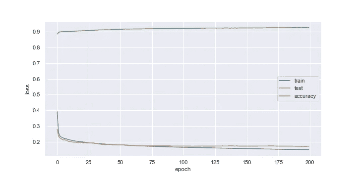

A) 20 x 1 x LSTM +线性:0.9280(过度配合#150)

这个非常简单的神经网络在第 195 个时期达到了 0.9280 的加权精度。对于开始来说还不错，但是你必须记住，一个随机的结果已经给出了 50%的加权准确率。尽管如此，这对于第一次尝试来说还是很不错的。正如你在图表中看到的，网络在纪元#150 之后倾向于过度拟合，所以早期停止训练过程可能是合适的，但是我决定对所有网络进行相同的训练，以给出更好的(视觉)比较。当过度拟合发生时，我会尝试给出一个估计，但正如在第一个图表中看到的，回答起来并不总是那么简单。在纪元#150 之后的某个地方，除了一些统计波动之外，你可以看到测试损失不再减少。

我测试了一些更复杂的网络，并获得了一些有趣的结果，我将在这里展示:

*   在 LSTM 层后增加了下降以减少过度拟合

```
DefrostLSTMLin(
(lstm): LSTM(5, 20, num_layers=1, batch_first=True, dropout=0.2)
(linear): Linear(in_features=20, out_features=2, bias=True)
(dropout): Dropout(p=0.0, inplace=False))
```

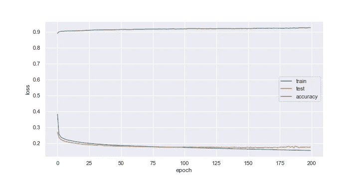

B) 20 x 1 x LSTM +线性+压差:0.9255(过拟合#170)

->过度拟合略有减少，但加权精度相同。

*   LSTM 层的隐藏尺寸增加到 30

```
DefrostLSTMLin( 
(lstm): LSTM(5, 30, batch_first=True, dropout=0.2) 
(linear): Linear(in_features=30, out_features=2, bias=True)
(dropout): Dropout(p=0.0, inplace=False) )
```

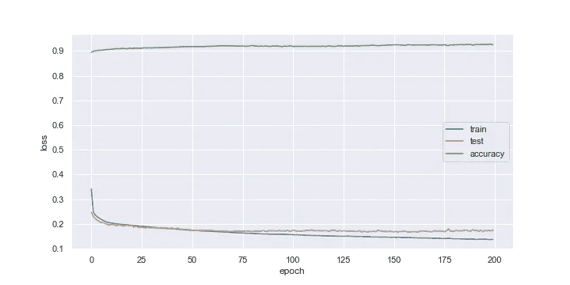

C) 30 x 1 x LSTM +线性+压差:0.9286(过拟合#70)

->加权精度略有提高，但过拟合过早。

*   尝试了第二个 LSTM 层

```
DefrostLSTMLin( 
(lstm): LSTM(5, 20, num_layers=2, batch_first=True, dropout=0.2) 
(linear): Linear(in_features=20, out_features=2, bias=True)
(dropout): Dropout(p=0.0, inplace=False) )
```

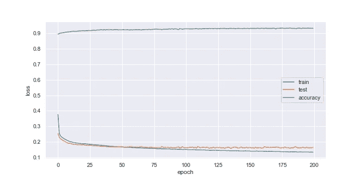

D) 20 x 2 x LSTM +线性:0.9351(过度配合#80)

->比上次测试好得多！可能需要第二个 LSTM 层。

*   在输出前增加了第二个漏失

```
DefrostLSTMLinDO( 
(lstm): LSTM(5, 20, num_layers=2, batch_first=True, dropout=0.2) (linear): Linear(in_features=20, out_features=2, bias=True) 
(dropout): Dropout(p=0.2, inplace=False) )
```

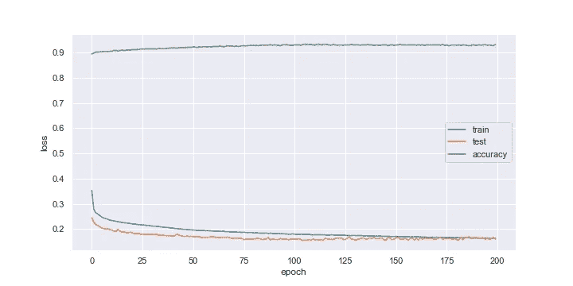

E) 20 x 2 x LSTM +线性+压差:0.9327(过拟合#110)

->在过度拟合方面再次略有改善。

正如你所看到的，更多的复杂性导致更高的加权精度，但更早的过度拟合。辍学有助于防止这一点，但整体加权精度似乎保持在 0.94 以下。

还显示了一个奇怪的特征:测试损失低于训练损失。我试图理解为什么，在深入研究这一现象后(例如[这里](https://www.pyimagesearch.com/2019/10/14/why-is-my-validation-loss-lower-than-my-training-loss/))，我认为这是多种缺点的混合。我的理论是，基于每 5 天的测试/训练可能会有一些我目前还不知道的副作用。但是得到一个好的解释本身就是一个有效的研究问题，目前不是我关注的焦点，所以我现在忽略它，因为它对培训的成功不是那么重要。

然而，目前的结果鼓励我去测试更复杂的网络。因此，我将架构改为卷积网络和 LSTM 层的组合。其思想是卷积层的内核将学习输入特征的较小模式，以给予 LSTM 层关注完整输入序列的时间结构的能力。

让我们从一个 CNN 开始，它有 5 个输出频道，内核大小为 5，如下所示:

```
DefrostCNNLSTM(
(conv): Conv1d(5, 5, kernel_size=(5,), stride=(1,), padding=(2,), padding_mode=replicate)
(lstm): LSTM(5, 20, num_layers=2, batch_first=True, dropout=0.2) 
(linear): Linear(in_features=20, out_features=2, bias=True) 
(dropout): Dropout(p=0.2, inplace=False) )
```

这导致所有 5 个输入通道有 5 个滤波器(=25 个内核)。正如您在培训图表中看到的，这种体系结构工作得更好:

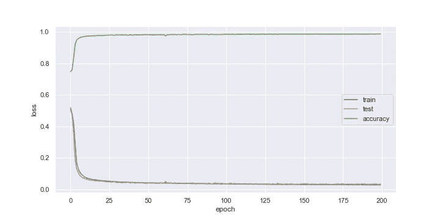

F) 5 x 5 CNN + 20 x 2 x LSTM +压差+线性+压差:0.9878(无过拟合)

该网络实现了加权精度提高到 0.9878！

所以我继续改变了一些超参数。这些是我想到的网络:

*   LSTM 层数增加到 3 层

```
DefrostCNNLSTM(   
(conv): Conv1d(5, 5, kernel_size=(5,), stride=(1,), padding=(2,), padding_mode=replicate)   
(lstm): LSTM(5, 20, num_layers=3, batch_first=True, dropout=0.2)   (linear): Linear(in_features=20, out_features=2, bias=True)   
(dropout): Dropout(p=0.2, inplace=False) )
```

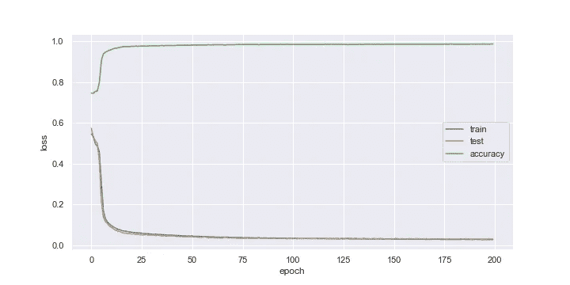

G) 5 x 5 CNN + 20 x 3 x LSTM +压差+线性+压差:0.9880(无过拟合)

->在过度拟合方面再次略有改善。

*   LSTM 层的隐藏尺寸增加到 30

```
DefrostCNNLSTM(   
(conv): Conv1d(5, 5, kernel_size=(5,), stride=(1,), padding=(2,), padding_mode=replicate)   
(lstm): LSTM(5, 30, num_layers=3, batch_first=True, dropout=0.2)   
(linear): Linear(in_features=30, out_features=2, bias=True)   
(dropout): Dropout(p=0.2, inplace=False) )
```

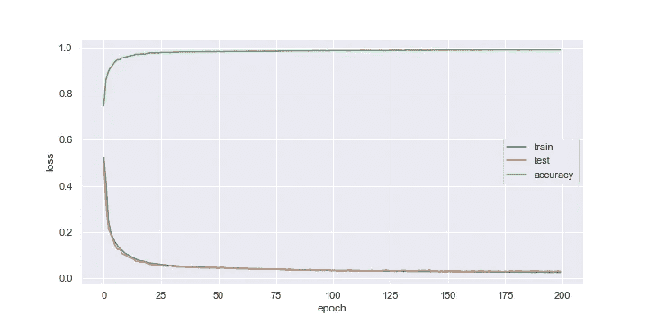

H) 5 x 5 CNN + 30 x 3 x LSTM +压差+线性+压差:0.9883(无过拟合)

*   将卷积滤波器从 5 个增加到 10 个:

```
DefrostCNNLSTM(   
(conv): Conv1d(5, 10, kernel_size=(5,), stride=(1,), padding=(2,), padding_mode=replicate)   
(lstm): LSTM(10, 30, num_layers=3, batch_first=True, dropout=0.2)   
(linear): Linear(in_features=30, out_features=2, bias=True)   
(dropout): Dropout(p=0.2, inplace=False) )
```

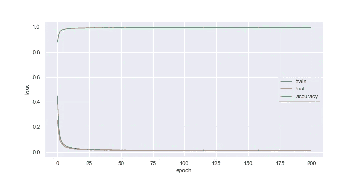

I) 5 x 10 CNN + 30 x 3 x LSTM +压降+线性+压降:0.9948(无过拟合)

正如你所看到的，最后一个网络做得非常好，没有发生过度拟合，加权精度在以后的时期仍然很好，我认为这种网络架构非常适合这种问题。

# 结论

该项目表明，仅通过几个特征(记得我使用了三个传感器值 *hot_gas* 、 *probe_in* 、 *return* 和两个二进制状态值*热泵 _ 运行*和*除霜*)就可以预测我们的热泵的除霜事件，精确度达到令人印象深刻的 0.9948 *。*

我确信有多种方法可以进一步提高这种精度，例如

*   添加更多功能
*   使用数据扩充来生成更多的训练数据
*   用每个序列更多或更少的时间戳重塑数据集
*   增加网络深度
*   使用网格搜索找到更好的超参数
*   …

我可以尝试不同的网络架构，比如

*   苏军总参谋部情报总局
*   IndRNN
*   预训练自动编码器
*   …

但是正如已经提到的，可用的硬件和我的可用时间都是有限的。对于下一个项目，我将使用基于云的设置，因为这将大大减少培训时间。


Bild von[Myriams-Fotos](https://pixabay.com/de/users/myriams-fotos-1627417/?utm_source=link-attribution&utm_medium=referral&utm_campaign=image&utm_content=1995598)auf[Pixabay](https://pixabay.com/de/?utm_source=link-attribution&utm_medium=referral&utm_campaign=image&utm_content=1995598)

缺少的是将这个基于 Pytorch 的模型带到我的基于 Java 的 openHAB 实例中。我相信当前的网络可以在内存有限的嵌入式 ARM 设备上使用，因为没有使用这么多参数(型号 I 的参数约为 20k)。但是将它移植到 Java 是另一个项目，希望在另一个时间实现…

你可以在我的 Github 库[这里](https://github.com/ccbur/deep-heatpump-analyzer)找到所有 Pytorch 代码。