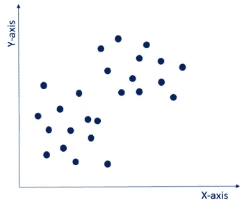

# 从 K-均值聚类开始

> 原文：<https://medium.com/analytics-vidhya/to-start-with-k-means-clustering-1c6ee3cb840f?source=collection_archive---------9----------------------->

在这篇博客中，我将写一个著名的无监督 ML 算法，即 K-Means 聚类。

在这里，我将解释*什么是聚类、聚类的类型、聚类算法的类型、k-means 聚类、k-means 算法如何工作、K-Means 聚类的应用*，并且我将提供到我的 *jupyter 笔记本*的链接，在那里我已经从头开始实现了 *K-means 聚类*。

因此，没有任何进一步的到期让我们开始。

来源:javatpoint

# **什么是聚类？**

聚类是将群体或数据点分成若干组的任务，使得同一组中的数据点比其他组中的数据点更类似于同一组中的其他数据点。简而言之，目标是分离具有相似特征的群体，并将其分配到集群中。

# 聚类的类型

**排他聚类**

**独占聚类**:在独占聚类中，一个项目只属于一个聚类，而不是几个。在图像中，您可以看到属于分类 0 的数据不属于分类 1 或分类 2。k-means 聚类是一种排他聚类。

**重叠聚类**

**重叠聚类**:这里一个项目可以属于多个聚类，每个聚类之间的关联程度不同。模糊 C-均值算法是基于重叠聚类的。

**层次聚类**

**层次聚类**:在层次聚类中，聚类不是在一个步骤中形成的，而是遵循一系列的划分来得出最终的聚类。它看起来像一棵树，如图所示。

# 聚类算法的类型

由于聚类的任务是主观的，可以用来实现这个目标的方法有很多。每种方法都遵循一套不同的规则来定义数据点之间的“*相似性”*。事实上，已知的聚类算法有 100 多种。但是很少有算法被广泛使用，让我们详细看看它们:

*   **连通性模型:**顾名思义，这些模型基于这样一个概念，即数据空间中距离较近的数据点比距离较远的数据点表现出更大的相似性。这些模型可以遵循两种方法。在第一种方法中，他们首先将所有数据点分类成单独的聚类&，然后随着距离的减小将它们聚集起来。在第二种方法中，所有数据点被分类为单个聚类，然后随着距离的增加进行分区。同样，距离函数的选择也是主观的。这些模型非常容易解释，但缺乏处理大数据集的可扩展性。这些模型的例子是分层聚类算法及其变体。
*   **质心模型:**这些是迭代聚类算法，其中相似性的概念是通过数据点与聚类质心的接近程度得出的。K-Means 聚类算法就是属于这一类的流行算法。在这些模型中，最终所需的聚类数必须事先提及，这使得事先了解数据集变得很重要。这些模型迭代运行以找到局部最优。
*   **分布模型:**这些聚类模型基于聚类中所有数据点属于同一分布的可能性(例如:正态分布、高斯分布)。这些模型经常遭受过度拟合。这些模型的一个流行的例子是使用多元正态分布的期望最大化算法。
*   **密度模型:**这些模型在数据空间中搜索数据点的不同密度的区域。它隔离各种不同的密度区域，并将这些区域内的数据点分配到同一个群集中。密度模型的常见示例有 DBSCAN 和 OPTICS。

# 聚类的应用

集群有大量跨不同领域的应用程序。集群的一些最受欢迎的应用是:

*   推荐引擎
*   市场分割
*   社会网络分析
*   搜索结果分组
*   医学成像
*   图象分割法
*   异常检测

# **什么是 K 均值聚类？**

K-means 是一种基于质心的算法，或基于距离的算法，其中我们计算距离以将一个点分配给一个聚类。在 K-Means 中，每个聚类都与一个质心相关联。

> ***K-Means 算法的主要目标是最小化点与其各自聚类质心之间的距离总和。***

# **K 均值聚类是如何工作的？**

假设您有一个未标记的数据集，如下所示，并且您想要将该数据分组到集群中。

现在，重要的问题是如何选择最佳的集群数量？有两种可能的方法来选择簇的数量。

**(一)肘法:**这里你画一条 WSS(在平方和内)和聚类数之间的曲线。它被称为肘方法，因为曲线看起来像人的手臂，肘点为我们提供了最佳的聚类数。正如你所看到的，在肘点之后，WSS 的值有一个非常缓慢的变化，所以你应该把肘点的值作为最终的聚类数。

**(ii)** **基于目的:**可以运行 k-means 聚类算法，根据各种目的得到不同的聚类。您可以根据不同的指标对数据进行划分，并查看它在特定情况下的表现。我们举一个营销不同尺码 t 恤的例子。根据您想要达到的目的，您可以将数据集划分为不同数量的聚类。在下面的例子中，我采用了两个不同的标准，价格和舒适度。

让我们看看这两种可能性，如下图所示。

1.  1.K=3:如果您想只提供 3 种尺寸(S、M、L)以便价格更便宜，您将把数据集分成 3 个聚类。
2.  K=5:现在，如果您想为您的客户提供更多尺寸(XS、S、M、L、XL)的舒适性和多样性，那么您将把数据集分成 5 个集群。

现在，一旦我们有了 k 的值，让我们来理解它的执行。

*   **初始化:**
    首先，你需要随机初始化两个叫做簇形心的点。这里，您需要确保如图所示由橙色和蓝色十字表示的聚类质心小于由深蓝色点表示的训练数据点。k-means 聚类算法是一种迭代算法，它迭代地遵循接下来的两步。完成初始化后，让我们进入下一步。

*   **聚类分配:** 在这一步中，它将遍历所有海军蓝数据点，以计算数据点与上一步初始化的聚类质心之间的距离。现在，根据与橙色簇形心或蓝色簇形心的最小距离，它会将自己分组到特定的组中。因此，数据点分为两组，一组用橙色表示，另一组用蓝色表示，如图所示。由于这些集群形式不是优化的集群，所以让我们继续，看看如何得到最终的集群。

*   **移动质心:**
    现在，你将取上述两个簇质心，迭代重新定位，进行优化。您将获得所有蓝点，计算它们的平均值，并将当前的聚类质心移动到这个新位置。类似地，将橙色聚类质心移动到橙色数据点的平均值。因此，新的簇质心将如图所示。接下来，让我们看看如何优化集群，这将为我们提供更好的洞察力。

*   **优化:**
    你需要反复重复以上两步，直到聚类质心停止改变位置，变成静态。一旦聚类变成静态的，那么 k-means 聚类算法就被认为是收敛的。
*   **收敛:** 最后，k-means 聚类算法收敛，将数据点分成清晰可见的橙色和蓝色两个聚类。根据聚类的初始化方式，k-means 最终可能会收敛到不同的解。

正如您在下图中所看到的，这三个簇清晰可见，但是根据您选择的簇质心，您最终可能会得到不同的簇。

下面显示的是基于不同的簇形心选择的其他一些簇划分的可能性。根据您的需求和您试图实现的目标，您最终可能会拥有这些分组中的任何一个。

**这是我的 Jupyter 笔记本的链接，在那里我从头开始实现了 K-Means 聚类。您可以在与笔记本相同的目录中找到数据集。在这本笔记本中，我在两个不同的数据集上实现了 K-means。(都在同一个笔记本里)**

 [## shag 10/机器学习

### 这个库包含机器学习算法的基础。基于监督学习的算法…

github.com](https://github.com/Shag10/Machine-Learning/blob/master/Internity_Internship/Day-11/K_means_Clustering.ipynb) 

# K-均值聚类的应用

资料来源:slideshare.net

**这都是我的观点，我试图提供 K-Means 聚类及其实现的所有重要信息。** **希望你能在这里找到有用的东西。谢谢你一直读到最后。**

# **参考文献**

 [## K-means 聚类算法:了解其工作原理

### 大多数零售企业主发现很难认识到顾客的需求。数据驱动型公司之所以…

www.edureka.co](https://www.edureka.co/blog/k-means-clustering-algorithm/) 

[https://www . analyticsvidhya . com/blog/2016/11/an-introduction-to-Clustering-and-different-methods-of-Clustering/#:~:text = Clustering % 20 is % 20 the % 20 task % 20 of，and % 20 assign % 20 them % 20 into % 20 clusters](https://www.analyticsvidhya.com/blog/2016/11/an-introduction-to-clustering-and-different-methods-of-clustering/#:~:text=Clustering%20is%20the%20task%20of,and%20assign%20them%20into%20clusters)。