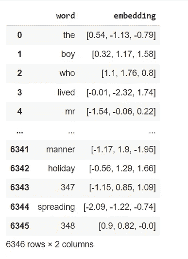

# 记号赋予者——你进入 NLP 的第一步

> 原文：<https://medium.com/analytics-vidhya/tokenizers-your-first-step-into-nlp-837c2ddae60a?source=collection_archive---------2----------------------->

解释了 NLP 管道的起点之一


由[凯文·Ku](https://unsplash.com/@ikukevk?utm_source=medium&utm_medium=referral)在 [Unsplash](https://unsplash.com?utm_source=medium&utm_medium=referral) 上拍摄的照片

# 简介:机器与人类——我们如何阅读？

对我们来说，语言是微不足道的。我们从出生的那天起就听到了。我们理解:

1.  语音学:讲话的声音帮助我们理解它的意思。
2.  句法:组成句子的单词和短语的组合。
3.  语义:每个单词、短语和句子的意思

现在，一旦你给计算机看一个句子，它不知道这个句子的结构和意思。不管怎样，我们必须在单词、短语和句子的层次上对意思进行编码。

我们能编码规则吗？我们可以说，“名词必须与动词一致，这意味着单数名词需要单数动词，复数名词需要复数动词”等等吗？嗯，那将需要一长串的规则，并使我们的工作更加困难。随着 ML 和深度学习的出现，事实证明，模型可以自己找出这些规则和意义。

## **基于单词的标记化**

第一步是将文本分解成“块”并用数字编码。然后这个数字表示会有一个向量表示( ***单词嵌入*** ，[你可以查看我写的关于那个](/analytics-vidhya/word-embeddings-aaef8c6bd04a)的整篇文章)，模型会学习这个向量表示。

**空白标记化:**

最简单的形式是，我们在空白区将整个文本分开。这会把它分解成单词。

让我们以《哈利·波特》小说中的词汇为例。我们的模型知道的所有单词都来自这段文本。

这里有一个缩写。

```
/ \n\n\n\n\nTHE BOY WHO LIVED \n\nMr. and Mrs. Dursley, of number four, Privet Drive, \nwere proud to say that they were perfectly normal, \nthank you very much. They were the last people you’d \nexpect to be involved in anything strange or \nmysterious, because they just didn’t hold with such \nnonsense. \n\nMr. Dursley was the director of a firm called \nGrunnings, which made drills. He was a big, beefy \nman with hardly any neck, although he did have a \nvery large mustache...
```

在这一点上，为了简单起见，我们想要去掉标点符号和`\n`来逐词清理文本。

```
**Regex to match any non alphanumeric character or whitespace, ie punctuation and replacing with empty ''**punc = re.sub('[^\w\s]', '', string)**Removing newlines \n and applying lowercase.**newlines=re.sub('[\n+]','',punc).lower() 
```

上面的代码将段落转换成类似这样的形式。

```
c=Corpus(path) 
c.tokenize()**2D vector where each element is a sentence. [0,1,2,3] corresponds to "the boy who lived"**--------------------------------------------------------------------[[], [], [], [], [], [0, 1, 2, 3], [], [4, 5, 6, 7, 8, 9, 10, 11, 12], [13, 14, 15, 16, 17, 18, 13, 19, 20], [21, 22, 23, 24, 18, 13, 0, 25, 26, 27], [28, 15, 29, 30, 31, 32, 33, 34], [35, ...
```

每个数字将对应于某个 **d 维向量**，模型将学习它的表示。



嵌入维数为 3 的示例

但是问题来了

```
df[df.word.str.startswith('brave')]
```


基础词勇敢

对于像`brave,bravery,bravely,braver`这样的单词，模型假设了独立的嵌入，这可能是对空间的浪费。此外，如果我们的词汇中使用每一个独特的单词，它可能会变得过于庞大。

还有我避免的标点符号的复杂性。理想情况下，您会希望保留一些标点符号来增加句子的含义。像`?` 这样的字符可以被单独剥离和标记。

像`nltk` 这样有内置标记器的库处理标点符号的方式如下。

**基于规则的标记化:**

```
from nltk.tokenize import word_tokenize
word_tokenize("Do you like this? I don't")--------------------------------------------------------------['Do', 'you', 'like', 'this', '?', 'I', 'do', "n't"]
```

注意到了吗？是一个单独的令牌。而“不”又分裂为“做”和“不做”。这是由于“不”来源于“不做”。这种分裂通常被称为`**rule-based tokenization.**`

**基于标点符号化**

如果用标点符号分隔，`dont`将被拆分为`don`和`t`，标点符号`'`将是一个单独的符号。

所有这些基于单词的分词器都面临着大词汇量的基本问题。如果你加入规则来缩短你的词汇量，比如只取常用词——在测试/生成的时候，你就面临着对**未知词**使用`unk`标记的问题。

> 但是有一个简单的解决方法，对吗？人物！至少对于英语来说，字符比单词要少得多。

## **基于字符的标记化:**

我在这篇文章中已经谈到了一点这个[。但是这个想法只是映射到每个字符(或特殊字符&标点符号)并学习每个字符的嵌入。](/analytics-vidhya/character-awareness-for-language-models-using-cnns-6b1c1a331042)


图片来源:【https://blog.floydhub.com/tokenization-nlp/ 

如上例所示，模型将分别学习每个角色`I s n t..` 的表示。这将解决我们最初的两个问题。

1.  **Vocab size** :我们需要考虑的字符只有几个。我们可以把它们混合起来组成任何单词。
2.  **未收录单词**:在纯基于单词的标记化中，有可能在测试时，我们会遇到以前没有见过的单词。例如，如果我们在测试集中有一个像`Gobbledygook`这样的罕见单词，而不是给它分配`unk`标记，它会组合所有的单个字符并形成它的一个表示。

但是很明显，有问题。就单词而言，每一个代表都有一个意义。单个字符的向量表示真正意味着什么？

此外，我们的序列变得不必要的长。对于 7 个单词的单句，我们的基于单词的记号赋予器将产生 7 个记号。对于相同的序列，基于字符的记号赋予器将根据单词的大小产生大约 35-40 个记号。(对于顺序模型，这可能是一个更大的问题，因为我们的输入需要一个接一个地处理。但是现在我们有了变压器，输入被并行处理。)

因此，我们继续前进到最佳点`subword-based tokenization`，在这里我们(有点)结合了基于字符和单词级别的标记。

## **基于子词的标记化:**

这里的主要思想是，较罕见的词将被分解成子词，其他的保持原样。例如，语料库中的一个普通单词如`Harry`将保持原样。像`gryffindor`这样罕见的词会被分解成子词，比如`gr,y,ffin,dor`

你注意到后缀`y,r,ly,est,er`加在其他单词上可能意味着什么吗？例如，最高/最强有一个共同的后缀 est，使其成为最高级。因此，也许学习`est`的表示法会对我们有所帮助。

**字节对编码:**

**字节对编码**是一种数据压缩形式，其中数据中最常见的**对连续字节**被替换为该数据中不存在的字节。

例如，如果我们有像`bbdcdcae`这样的字节

1.  看这一对`dc repeated twice`
2.  我们用 X 代替 cd，所以我们有`bbXXae`
3.  接下来，我们有一对`bb`，我们可以用 Y、`YXXae`来代替它
4.  现在没有对存在，我们可以停止。

对于使用 BPE 的标记化，我们应用一个非常相似的算法。

1.  从人物词汇开始。

```
All tokens: dict_keys(['/', '</w>', 'T', 'H', 'E', 'B', 'O', 'Y', 'W', 'L', 'I', 'V', 'D', 'M', 'r', '.', 'a', 'n', 'd', 's', 'u', 'l', 'e', 'y', ',', 'o', 'f', 'm', 'b', 'P', 'i', 'v', 't', 'w', 'p', 'h', 'c', 'k', '’', 'x', 'g', 'j', 'G', '|', '2', 'S', '-', 'J', 'K', 'R', ';', 'N', 'A', '“', '”', '—', 'F', 'z', '?', '3', '!', 'q', '4', 'C', '5', '6', '(', ')', ':', '7', '8', '9', '1', '0', 'U', '"', '\\', '‘', '•', 'Z', 'Q', '■', "'"])No. of tokens : 83
```

计算每个令牌出现的频率。

```
....'c': 6372,            
'd': 16279,              
'e': 41351,              
'f': 6429,....
```

2.根据基本词汇拆分所有单词(目前都是字符)，用标记标记每个单词的结尾(这样后缀和前缀就可以分开，例如，用 Real 和 algebra 标记。如果 al 是标记，那么它一定来自 Real )。

```
T H E </w> : 17 
B O Y </w> : 1
W H O </w> : 1 
L I V E D </w> : 1
M r . </w> : 79 
a n d </w> : 2139 
M r s . </w> : 44 
D u r s l e y , </w> : 6 
o f </w> : 1233 
n u m b e r </w> : 14
...
```

3.根据当前 vocab 计算当前单词的`pairwise-frequency`。

```
('/', '</w>') : 4 
('T', 'H') : 28 
('H', 'E') : 21 
('E', '</w>') : 33 
('B', 'O') : 4 
('O', 'Y') : 1 
('Y', '</w>') : 8 
('W', 'H') : 6 
('H', 'O') : 7 
('O', '</w>') : 6 
('L', 'I') : 3 
('I', 'V') : 2 
('V', 'E') : 6 
('E', 'D') : 9 
('D', '</w>')
...
```

这两个字母中的每一个都以右边提到的频率重复出现。

4.计算具有最大频率的对并合并。将此添加到当前 vocab。

```
('e', '</w>'): 13356 # these will be merged in this caseAll tokens: dict_keys(['/', '</w>', 'T', 'H', 'E', 'B', 'O', 'Y', 'W', 'L', 'I', 'V', 'D', 'M', 'r', '.', 'a', 'n', 'd', 's', 'u', 'l', 'e', 'y', ',', 'o', 'f', 'm', 'b', 'P', 'i', 'v', 't', 'w', **'e</w>'**, 'p', 'h', 'c', ...No of tokens: 84**Current list of words**'T h e y </w>': 155,  
't h **e</w>**': 3654,  
'l a s t </w>': 61,
```

现在，我们可以将 e 与其他字符组合成下一对字符。我们还需要重新计算令牌频率

```
...'c': 6372,         
'd': 16279,    
'e': 27995,         
'e</w>': 13356, ... 
```

注意`e`的频率是如何变化的。

5.重复一遍。选择合并的数量作为一个适合你的超级参数。通过这种方式，经过多次合并后，常用词和子词会保持不变，然后子词可以组合起来形成未知词。

一旦你有了记号列表，对于一个未知单词，我们可以组合在这个过程中找到的子单词来形成表示。

**词块:**

一旦你了解了 BPE，只需要做一些小小的调整就可以学习 WordPiece 了。这是最近最成功的 NLP 论文之一 BERT 中使用的标记化方法。

主要的区别在于合并令牌的想法。在 BPE，我们只取最频繁的一对&合并它。

相比之下，wordpiece 只有在增加训练数据的可能性时才会合并。例如，如果“er”比 e & r 更可能出现，则它们被合并。你可以在这里阅读更多关于这个[的内容。](https://static.googleusercontent.com/media/research.google.com/ja//pubs/archive/37842.pdf)

```
from transformers import BertTokenizer
tokenizer = BertTokenizer.from_pretrained("bert-base-uncased")
tokenizer.tokenize("Slytherin is the best house ever!")Output:
['sly', '##ther', '##in', 'is', 'the', 'best', 'house', 'ever', '!']
```

`##`表示单词不是以`ther`开头的。“Syltherin”在伯特的字典里是一个陌生的词。但是它有对应于#ther，##in & sly 的令牌。因此，它用它知道的记号来分解这个词。

**资源:**

1.  [https://huggingface.co/transformers/tokenizer_summary.html](https://huggingface.co/transformers/tokenizer_summary.html)
2.  [https://blog.floydhub.com/tokenization-nlp/](https://blog.floydhub.com/tokenization-nlp/)
3.  [https://leimao.github.io/blog/Byte-Pair-Encoding/](https://leimao.github.io/blog/Byte-Pair-Encoding/)