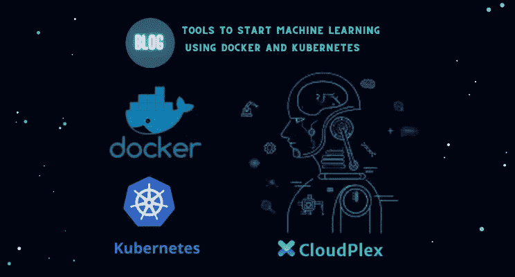

# 使用 Docker 和 Kubernetes 启动机器学习的工具

> 原文：<https://medium.com/analytics-vidhya/tools-to-start-machine-learning-using-docker-and-kubernetes-ae32647367d8?source=collection_archive---------3----------------------->

MLOps 本质上是两个术语的复合——机器学习和操作。MLOps 是一种实践，其中数据科学家，特别是那些专门从事机器学习的科学家，与公司的运营团队合作和沟通，以管理即将投入生产的机器学习软件生命周期。