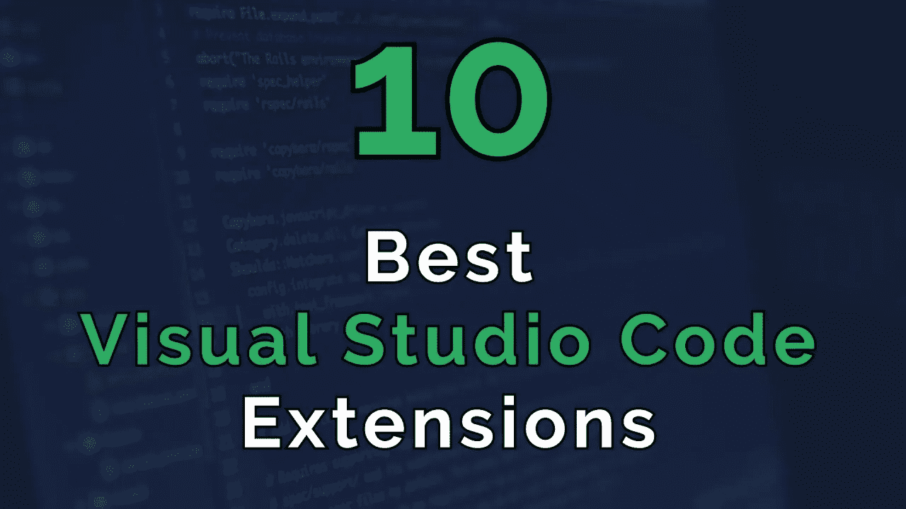

# 每个开发人员都必须知道的 10 大 Visual Studio 代码扩展

> 原文：<https://medium.com/analytics-vidhya/top-10-visual-studio-code-extensions-every-developer-must-know-739dbf12b295?source=collection_archive---------10----------------------->

截图来自 Youtube [视频](https://www.youtube.com/watch?v=XU57YBbSueM)作者 [WebDevSimplified](https://www.youtube.com/channel/UCFbNIlppjAuEX4znoulh0Cw)

**1。现场分享**

Live Share 是我最喜欢的列表之一。它允许你主动与他人共享你的代码。这样你们就可以看到彼此的代码，你想和谁分享，一起调试。