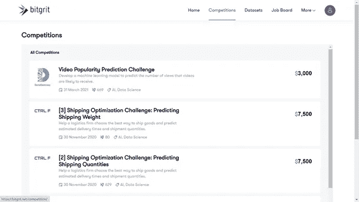

# 25 大机器学习和人工智能黑客马拉松，任何人都可以转向数据科学！

> 原文：<https://medium.com/analytics-vidhya/top-25-machine-learning-hackathons-its-here-now-for-anyone-to-move-to-data-science-a93deb2a198a?source=collection_archive---------0----------------------->

## 行动中的数据科学竞赛

## 立即开始您的数据科学职业生涯！

图片来自 [Unsplash](https://unsplash.com/photos/g1Kr4Ozfoac) 的 Brooke Cagle

# 介绍

> *你的想法也属于下面列出的疑惑吗？如果是这样，你已经到达了完美的地方。本文将帮助您在数据科学方面迈出下一步，并让您在职业生涯中取得巨大进步。*

*   我很困惑，我应该从哪里开始我的数据科学生涯？
*   作为一名在职专业人士，在不同领域工作多年后，我如何一头扎进数据科学和机器学习并快速学到东西？
*   作为一名学生，没有做过任何项目或挑战，我如何接近黑客马拉松并创建自己的项目和应用程序？
*   以及更多… **我从哪里开始，如何继续？**

你在这里很快就能理解并运用你的技能。这篇文章对任何想从事数据科学职业的人来说都是一个很好的指南。

# 开始时要记住的 3 件事

*   始终保持不断学习，坚持不懈地进行实验，跟随你的直觉，你的领域知识和商业敏锐度将随着时间的推移而积累。
*   请记住，应用机器学习和数据科学概念的唯一方法是，一旦学习了理论，立即实践，让自己的双手变脏。
*   通过浏览下面提到的博客和训练营，决定你的兴趣领域和所需的技能。这将帮助你决定参加黑客马拉松网站。

> 一旦你掌握了这三个要点，让我们从竞赛或黑客马拉松开始吧。数据科学挑战不仅是关于应用机器学习算法，而且是一个学习、理解和实施特定问题所需的解决方案的绝佳机会，可以带来巨大的满足感。同时，现实世界中的问题不一定与竞赛中提供的问题相同，但是，这些平台使您能够将您的知识应用到过程中，并查看您与他人相比的表现。

# 参加数据科学竞赛的优势

通过参加这些比赛，你会有很多收获，也不会有什么损失。参加黑客马拉松有很大的优势，比如:

*   惊人的学习和合作机会。与志同道合的人建立关系网将是一笔巨大的财富。在团队中工作甚至更好，因为它有助于从不同的角度思考问题，并合作解决问题。
*   应用和试验许多最先进的方法和数据集。
*   通过向世界展示你的激情和技能，你可能会遇到一个很好的联系人，并得到一份很棒的工作。
*   参与并看看自己在排行榜上的表现总是很有趣。在公布我们排名的排行榜上，肾上腺素激增是真实的。
*   如果我们赢了，奖金总是奖金，但它不应该是我们参与的唯一标准。我们的目标和重点是学习应用我们的技能。

下面是 25 个最棒的机器学习黑客马拉松(数据科学的竞争平台)，它们既提供了学习资源，也提供了应用你所获得的技能的挑战。下面列出了这些，让我们花一些时间来欣赏这样一个事实，即你已经准备好有意识地努力获得技能，并在接近真实世界的环境中应用它们。

# **1。卡格尔**(等级:初级、中级&高级)

[**Kaggle**](https://www.kaggle.com/) 是全球最大的数据科学竞赛社区平台，拥有超过 1000，000 名注册用户，包括新手和专家。这是一个众包平台(被谷歌收购)，旨在吸引、培养、培训和挑战来自世界各地的数据科学家，以解决数据科学、机器学习和预测分析问题。

****招商网站****

****Kaggle 使数据科学家和其他开发人员能够托管数据集，参与运行机器学习竞赛，并以 Python、R 和 R Markdown 编写和共享代码。Kaggle 上已经分享了超过 15 万个“内核”/代码，涵盖了从情感分析到物体检测的所有内容。****

******主要亮点:******

****i. 4 类专业知识竞赛、笔记本、数据集和讨论。****

****二。5 个绩效等级—新手、贡献者、专家、大师和特级大师。****

****三。许多公司根据 Kaggle 个人资料进行招聘，这会给你的简历增加巨大的价值。****

****四。初学者可以从 [**课程**](https://www.kaggle.com/learn) 开始学习数据科学的基本技能&机器学习，然后转移到 [**表格操场系列**](https://www.kaggle.com/search?q=Tabular+Playground+Series) ，这有助于在参加中高级比赛之前进行练习。****

# ******2。数据黑客分析 Vidhya** (级别:初级和中级)****

****[**分析 Vidhya**](https://datahack.analyticsvidhya.com/contest/all/#active) 是全球领先的数据科学社区&知识门户之一。分析 Vidhya 黑客马拉松对于任何热衷于提高他们的数字技能的人来说都是一个绝佳的机会，如人工智能、机器学习、自然语言处理、深度学习、商业分析、数据科学、大数据、数据可视化技术等。****

********

****[**分析 Vidhya**](https://datahack.analyticsvidhya.com/contest/all/#active) 招商会网站****

******数据科学博客**已经进行了 7 个版本(未来还会有更多版本)帮助崭露头角的作家和数据科学爱好者展示他们撰写技术博客的才华和热情，并建立数据科学作品集**。**分析 Vidhya 是我个人最喜欢的，因为它提供黑客马拉松和博客马拉松。它提供了两个有趣的部分 [**免费课程**](https://courses.analyticsvidhya.com/pages/all-free-courses) 和 [**博客**](https://www.analyticsvidhya.com/blog/) 来学习和应用你的技能。初学者可以利用上述部分，并从中受益匪浅。****

# ******3。津迪**(等级:中级)****

****[**Zindi**](https://zindi.africa/competitions) 是**非洲**的第一个数据科学竞赛平台，其使命是通过由数据科学家、科学家、工程师、学者、公司、非政府组织、政府和专注于解决非洲最紧迫问题的机构组成的人才社区，让组织和政府获得世界级的机器学习和人工智能解决方案。****

********

********招商网站********

******有趣的**现实世界的挑战**如[**“空白—正确的现场检测挑战**](https://zindi.africa/competitions/lacuna-correct-field-detection-challenge) ”:设计一种方法来准确地找到现场位置**&**[**“自动车内保险索赔挑战”**](https://zindi.africa/competitions/autoinland-vehicle-insurance-claim-challenge) :预测客户是否会在未来 3 个月内提交车辆保险索赔**，**主办在 Zindi 提供丰厚的奖励**********

# ******4.机器黑客(级别:初级和中级)******

******[**Machine hack**](https://www.machinehack.com/hackathons)**是一个机器学习竞赛的在线平台，它是《分析印度》杂志的一个创意，该杂志是一个媒体门户网站，致力于扩大和促进**印度**的数据和分析社区。他们主持业务问题，参与者可以使用机器学习找到解决方案。********

************

******[**MachineHack**](https://www.machinehack.com/hackathons) 竞赛网站******

********关键亮点:********

******MachineHack 的 4 个部分是活动黑客马拉松、练习黑客马拉松、排名和训练营。******

******二。除了黑客马拉松，最有趣的部分是训练营，它提供视频讲座，在专家的帮助下学习。查看 [**令人惊叹的训练营**](https://www.machinehack.com/bootcamp) 举办的—“零售业中的客户分析”、“HR 中的机器学习使用 Tensorflow”、“堆叠系综解决 Kaggle”等等。******

******三。 **4 个表现等级——学徒、冠军、大师和特级大师。********

# ******5.驱动数据(级别:初级、中级和高级)******

******[**DrivenData**](https://www.drivendata.org/competitions/) 举办数据科学竞赛以建设更美好的世界，为组织带来尖端的预测模型**解决世界上最棘手的问题**。在 DrivenData，他们为一些世界上最大的社会挑战带来了数据科学和众包方面的前沿实践。他们举办在线挑战，通常持续 2-3 个月，在这里，全球数据科学家社区竞争，为困难的预测问题提出最佳的统计和机器学习模型，从而有所作为。******

************

******[**驱动数据**](https://www.drivendata.org/competitions/) 竞赛网站******

********主要亮点:********

******比赛分为两类:为了奖金和娱乐。******

******二。3 个难度级别—初级、中级、高级。******

******三。一些挑战包括:******

******1.邓艾:预测疾病传播******

******2.里希特预测器:模拟地震破坏******

******3.可恶的迷因:第二阶段，前 5 个解决方案[在这里](https://github.com/drivendataorg/hateful-memes)。******

******四。 [**博客**](https://www.drivendata.co/blog.html) 版块，介绍数据科学概念并宣布竞赛获奖者。******

# ******6.XEEK.ai(级别:初级和中级)******

******[**Xeek.ai**](https://xeek.ai/challenges) 挑战，团结**数据和地球科学社区**，其中包括领先的数据科学家、开发人员、地球科学家和机器学习专家——围绕解决能源最大挑战的众包创新解决方案的共同目标。******

************

******[**xeek . ai**](https://xeek.ai/challenges)**招商网站********

********Xeek.ai 是 Studio X 推出的一款产品，Studio X 是一家数字创新工作室，重新想象探索工作的未来。**由壳牌**提供支持，Studio X 团队发现、推出并推广改变能源行业的突破性产品。Xeek.ai 挑战非常有趣，适合初级和中级水平。********

# ********7.钻头(级别:中级)********

********[**Bitgrit**](https://bitgrit.net/) ，于 2017 年在东京成立，是一个面向数据科学家的人工智能竞赛、招聘和网络平台，他们在这里挑战他们久负盛名的数据科学家社区，以开发独特的数据驱动解决方案来优化人工智能，并更好地将其融入当今社会的各个行业。它是全球 25，000 多名工程师社区的所在地。********

****************

********[**Bitgrit**](https://bitgrit.net/) 竞赛网站********

********主要亮点:********

******I .为**日本**地区的数据科学和数据工程工作托管一个工作门户。******

******二。到目前为止，已经发布了 3 个关于农业、娱乐和非营利的重要数据集。******

******三。从 2019 年 8 月到 2021 年 3 月，共举办了 9 次挑战，每次持续 2-3 个月。其中大部分是**优化和预测挑战**，前 3 名获胜者将获得奖金。******

# ******8.dpi(级别:中级)******

******[**DPhi**](https://dphi.tech/challenges/#active) 是一个致力于构建数据文化和民主化数据科学学习的社区。******

************

******[**DPhi**](https://dphi.tech/challenges/#active)**招商会网站********

**********关键亮点:**********

******一、dpi 的人工智能挑战模拟现实世界的问题。******

******二。这是一个在不同数据集上测试您的人工智能/数据科学技能的好地方，允许您通过竞争促进学习，使 DPhi 成为他们数据科学学习和挑战的默认目的地。******

******三。最近的挑战像[**【seg mind 肺炎分类挑战】**](https://dphi.tech/challenges/pneumonia-classification-challenge-by-segmind/76/overview/about)[**【AETA 地震预测 AI 算法大赛 2021】**](https://dphi.tech/challenges/aeta-earthquake-prediction-ai-algorithm-competition-2021/70/overview/about)都是很关键的真实世界挑战，可以一试。******

******四。 [**训练营**](https://dphi.tech/bootcamps/online-bootcamp-to-get-started-with-data-science/?utm_source=ds_nav) 提供数据科学和数据分析概念的沉浸式体验。******

# ******9.AI 人群(等级:中级)******

******[**AI Crowd**](https://www.aicrowd.com/challenges) 使数据科学专家和爱好者(众包 AI)能够解决现实世界的问题。AI Crowd 举办过各种真人挑战赛，如[**【ADDI 老年痴呆症检测挑战赛】**](https://www.aicrowd.com/challenges/addi-alzheimers-detection-challenge)**[**【空中物体追踪挑战赛】**](https://www.aicrowd.com/challenges/airborne-object-tracking-challenge#introduction) **。**********

************

******[**艾**](https://www.aicrowd.com/challenges) 招商会网站******

********主要亮点:********

******挑战涵盖图像分类问题、文本识别、强化学习、对抗性攻击、图像分割、资源分配优化等多个领域。******

******二。 [**博客**](https://www.aicrowd.com/blogs) 版块提供制胜方案、各种 DS、ML 概念等有趣的文章。******

# ******10.未出土(级别:中级、高级)******

******[**出土**](https://unearthed.solutions/u/) 是创业公司、开发者和数据科学家的最大社区，使**能源和资源行业**更加高效和可持续。******

************

**********网站为招商会**********

********最近也是最有趣的挑战是 [**【氢气假说】**](https://unearthed.solutions/u/competitions/104/) ，它期望用户提出一个实验，展示在采矿中安全有效使用氢气的用例**。**向该平台提交解决方案将基于 **Docker** 。所有用户都有机会接触到令人惊叹的 [**行业用例**](https://unearthed.solutions/industry) **。**********

# ********11.CodaLab(级别:高级)********

********[**CodaLab**](https://competitions.codalab.org/competitions/) 是一个开源的基于网络的平台，使研究人员、开发人员和数据科学家能够合作推进使用机器学习和高级计算的研究领域。********

****************

********[**CodaLab**](https://competitions.codalab.org/competitions/) 招商网站********

********主要亮点:********

******I .它通过其在线社区帮助解决许多面向数据的研究中的常见问题，在那里人们可以分享有用的 [**工作表**](https://worksheets.codalab.org/)****加速可再现的计算研究实验并创建可执行的论文，还可以参加竞赛。**********

******二。这里最有趣的黑客马拉松可以作为概念验证应用到行业中。******

******三。你既可以参加现有的比赛，也可以在这个平台上举办新的比赛。******

# ******12.数字(级别:高级)******

******[**numeri**](https://numer.ai)号称是这个星球上最难的数据科学锦标赛 **,** 正在通过使用机器学习和预测建模的能力来模拟股票市场来建立**世界开放式对冲基金。********

************

******[**numeri**](https://numer.ai)招商网站******

********关键亮点:********

******I .它每周举办一次数据科学竞赛，为真正的对冲基金提供动力。******

******二。它提供了一个 [**论坛**](https://forum.numer.ai/) 来讨论 DS 和 ML 的概念以及关于比赛的内容。******

******三。Numerai 每周向参与者提供加密数据，然后参与者提交他们的预测。Numerai 然后从所有提交的资料中创建一个元模型，并进行投资，这是一个伟大的想法！******

# ******13.数据压缩(级别:中级)******

******[**data crunch**](https://datacrunch.com/)**一个由来自巴黎 ESSEC 的 42 名巴黎学生和一名前金融教师组成的团队，旨在通过建立第一个由数据科学家社区运营和拥有的对冲基金来颠覆对冲基金行业**！**********

****************

********[**DataCrunch**](https://datacrunch.com/) 竞赛网站********

********DataCrunch 社区通过改进基金预测来工作，参与者可以根据自己的决定获得代表基金直接所有权的股票代币或现金(每周挑战的获胜者可以获得 200 欧元)。********

# ********14.CrowdAnalytix(级别:中级、高级)********

********[**CrowdANALYTIX**](https://www.crowdanalytix.com/listContests) 是一个人工智能平台，为零售商、分销商和制造商提供工具和庞大的数据科学家网络，以构建部署在安全、可扩展的服务器上并通过 API 集成的企业级定制解决方案。********

************

******[**CrowdANALYTIX**](https://www.crowdanalytix.com/listContests) 招商网站******

******该平台托管了一个 [**社区博客**](https://www.crowdanalytix.com/jq/communityBlog/listBlog.html) ，其中有令人敬畏的资源，包括访谈、评论、用例以及参考资料。******

# ******15.坡道(等级:初学者)******

******[**快速分析&使用 Python (RAMP)建立模型原型**](https://ramp.studio/problems) 主持数据挑战，这是协作建立**原型和基准**机器学习工作流的绝佳方式。******

************

******[**快速分析&模型原型制作利用 Python**](https://ramp.studio/problems)**网站进行招商********

**********主要亮点:**********

********I .参与者提交他们的预测解决方案(代码)，争夺最佳分数，并向组织者提供功能齐全的原型。********

********二。RAMP 最初是为数据科学家开发的一种工具，用于高效、协作地解决高影响力领域科学问题的数据分析方面。自问世以来，RAMP 经历了多次迭代，也已经用于教学和机器学习算法的基准测试。********

# ********16.挑战数据(级别:中级和高级)********

********[**挑战数据**](https://challengedata.ens.fr/challenges/year/2021) 巴黎高等师范学院(école Normale supérieure)和法兰西学院(Collège de France)的网站，组织来自公共服务、公司和实验室提供的数据的数据科学挑战。它得到了 CFM 教席和草原研究所的支持。挑战的参与者指南是 [**这里是**](https://challengedata.ens.fr/static/participant_user_guide.pdf) 。********

****************

********[**挑战数据**](https://challengedata.ens.fr/challenges/year/2021) 竞赛网站********

# ******17.天池(中级和高级)******

******[**【天池(阿里云，中国)**](https://tianchi.aliyun.com/competition/gameList/activeList) 举办应用大数据和分布式计算资源的大数据竞赛，为现实世界的应用提供尖端解决方案。这些挑战通常涵盖大数据、人工智能操作、机器学习、人工智能、深度学习、对象检测**、**以及跨多个领域的许多其他领域。******

************

******[**【天池(阿里云，中国)**](https://tianchi.aliyun.com/competition/gameList/activeList) 招商网站******

# ******18.签名日本(级别:中级)******

******[**SIGNATE**](https://signate.jp/competitions)**是**日本**唯一一个通过数据科学竞赛赋能 AI/数据分析人才，解决企业和政府所面临的商业问题的平台。除了比赛，还有像 [**学习网站**](https://quest.signate.jp/about?rf=quest_gv_nav) **这样足智多谋的内容。**********

************

******[**签约**](https://signate.jp/competitions) 网站参加竞赛******

# ******19.大挑战(等级:高级)******

******[**大挑战**](https://grand-challenge.org/challenges/) 是一个在**生物医学成像领域进行机器学习解决方案端到端开发的平台。大多数高级研究挑战都发布在这个令人惊叹的平台上。********

************

******[**大挑战**](https://grand-challenge.org/challenges/) 竞赛网站******

# ******20.开发组合(级别:中级)******

******[**Devfolio**](https://devfolio.co/hackathons) 的使命是帮助创建一个由热爱制造的建设者组成的繁荣社区。她们是印度最大的社区黑客马拉松主持人— [**InOut**](https://inout.devfolio.co/) **，**印度最大的女性专属黑客马拉松— [**wmn**](https://wmn.devfolio.co/) &印度最大的以太坊黑客马拉松— [**ETHIndia**](https://ethindia2019.devfolio.co/) 。Devfolio 已经帮助组织者在世界各地举办了 100 多场黑客马拉松，包括区块链& Fintech challenges。******

************

**********招商网站**********

# **********21.船坞船(级别:初级、中级)**********

**********[**dockship . io**](https://dockship.io/challenges?subtype=0)**是一个开发者社区，举办在线挑战，开发者可以参与其中获得聘用、赚钱或提高技能。************

********************

**********[**dockship . io**](https://dockship.io/challenges?subtype=0)**招商网站************

************关键亮点:************

********i. 4 类:数据科学、全栈、安卓、IOS********

********二。3 种类型的挑战:********

********1.招聘挑战(奖金+招聘机会)********

********2.社区挑战********

********3.练习挑战********

********三。在这个令人敬畏的平台上， [**博客**](https://dockship.io/articles) 文章是一种享受。********

# ********22.TechGig(级别:初级、中级)********

********[**Tech gig**](https://www.techgig.com/challenge)**是印度最大的在线技术社区，程序员可以在这里学习、更新技能，在黑客马拉松&挑战中与技术伙伴竞争，并获得他们梦想的工作。**********

********************

**********[**tech gig**](https://www.techgig.com/challenge)**招商网站************

************主要亮点:************

**********I .它面临着广泛的挑战，包括数据分析、机器学习、人工智能、RPA、设计、编码等等。**********

**********二。它既有招聘，也有基于奖金的黑客马拉松。**********

# **********23.黑客地球(级别:初级、中级)**********

**********[**hackere earth**](https://www.hackerearth.com/challenges/hackathon/)建立了 500 万+开发者的庞大社区基础。在社区中，HackerEarth 以迄今为止举办了 1000 多次黑客马拉松和 10000 多次编程挑战而闻名。**********

********************

**********[**hackere earth**](https://www.hackerearth.com/challenges/hackathon/)**招商网站************

************主要亮点:************

********I .该平台提供企业软件，使用技术技能评估和远程视频面试，帮助来自组织的 1000 多名招聘人员进行技术招聘。********

********二。它既举办现场比赛，也举办雇佣黑客马拉松。********

********三。它面临着广泛的挑战，从数据分析、机器学习、人工智能、RPA、设计、编码，以及与 TechGig 相似的许多挑战。********

# ********24.Topcoder(级别:中级、高级)********

********[**top coder**](https://www.topcoder.com/challenges?tracks[DS]=true&tracks[Des]=true&tracks[Dev]=true&tracks[QA]=true&types[]=CH&types[]=F2F&types[]=TSK)**是一家众包公司，是世界上最大的开放式全球社区，由设计师、开发人员、数据科学家和有竞争力的程序员组成。**********

********************

************Topcoder** 竞赛网站**********

********该平台提供 5 个技术方向——竞争性编程、数据科学、设计、开发、QA，以及一个有趣的 [**博客**](https://www.topcoder.com/blog/) 部分。********

# ******25.InnoCentive(级别:中级、高级)******

******[**InnoCentive**](https://innocentive.wazoku.com/#/community/9396a088f8614c2eac89aacf2ae1c624/discover?entities=challenge&sort=-posted&page=1&pageSize=15&include_descendants&communityId=9396a088f8614c2eac89aacf2ae1c624&filters=%7B%22show_archived%22:true%7D)**是全球众包创新的先驱。他们通过技术、科学、商业、人工智能和数据帮助创新组织解决重要的生命科学问题。在这里，问题解决者致力于解决一些世界上最紧迫的问题，从在家庭层面促进清洁水的获取到旨在吸引&杀死携带疟疾的蚊子的被动式太阳能装置。********

****************

********[**InnoCentive**](https://innocentive.wazoku.com/#/community/9396a088f8614c2eac89aacf2ae1c624/discover?entities=challenge&sort=-posted&page=1&pageSize=15&include_descendants&communityId=9396a088f8614c2eac89aacf2ae1c624&filters=%7B%22show_archived%22:true%7D)**招商网站**********

********这些挑战需要现实世界中解决问题的技能，如持续的专注、批判性思维、研究、创造力和知识综合。所有用户都可以访问令人惊叹的 [**行业用例。**](https://www.innocentive.com/resources-overview/case-studies/?__hstc=129674451.eba87c0b43777d4096fcf5322804b6eb.1618692413094.1619689671502.1619802158825.4&__hssc=129674451.1.1619802158825&__hsfp=454551083)********

# **********特别提及**********

********[**OpenML**](https://www.openml.org/home) 是一个共享&组织数据和机器学习算法的在线机器学习平台。********

****************

********[**OpenML**](https://www.openml.org/home)**招商会网站**********

********OpenML 是一个令人愉快的地方，在这里您可以与喜欢分析数据的人共享有趣的数据集，并通过协作一起构建最佳解决方案。这个平台由一个[**数据集**](https://www.openml.org/search?type=data) **的庞大集合组成。**********

# ******结论******

******希望你对每个黑客马拉松平台提供的东西和学习资源有一个清晰的认识，以磨练你的技能。我尽力让这篇文章尽可能全面，但你会发现这里遗漏了一些著名的景点**——这就是惊喜！保持好奇，不断学习，并愿意学习新的东西，直到我们下次见面！在接下来的文章中，你会读到关于整合网站的内容，找到黑客马拉松。如果你喜欢这篇文章并希望与我联系，请关注我的 [**Linkedin**](https://www.linkedin.com/in/vetrivel-ps-456b3b73/) 和 [**Youtube**](https://www.youtube.com/c/MLMonk) 。在下面的评论区分享你的想法，你在这篇文章中发现了什么有趣的东西！********

> ******“重要的是不要停止提问。好奇心有它存在的理由。
> ― **阿尔伯特·爱因斯坦********
> 
> ******直到下一次，照顾好你自己，你的家人，你的大家庭(邻居)和朋友，保持安全和健康！******
> 
> ********✨** 感谢维特瑞尔 **✨********