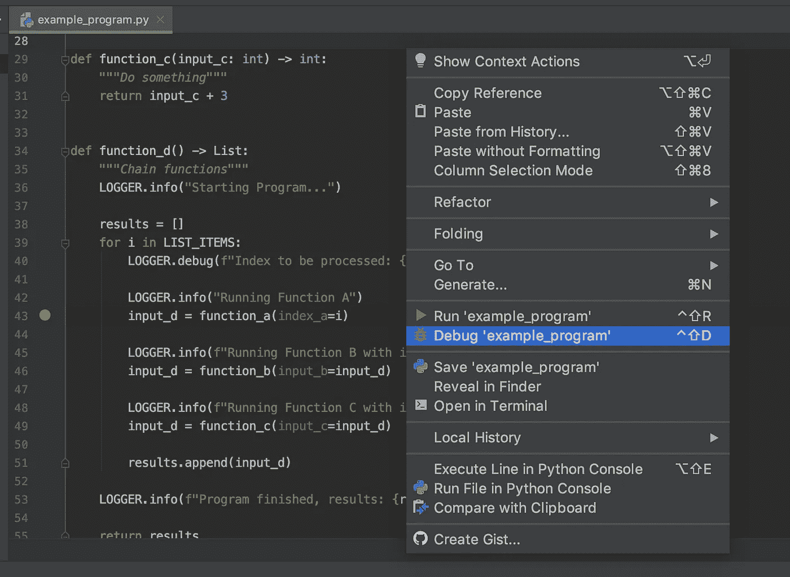
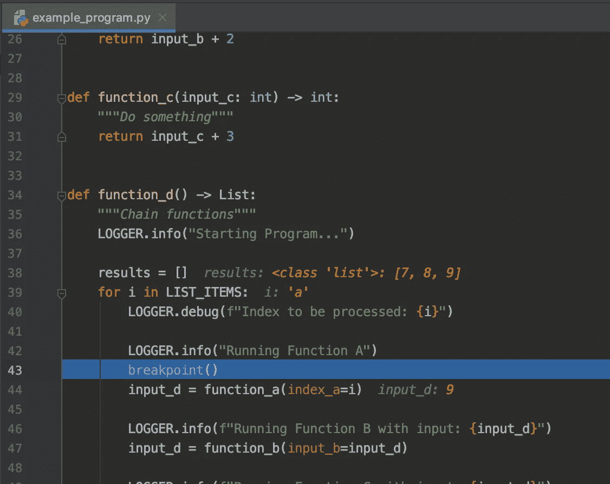
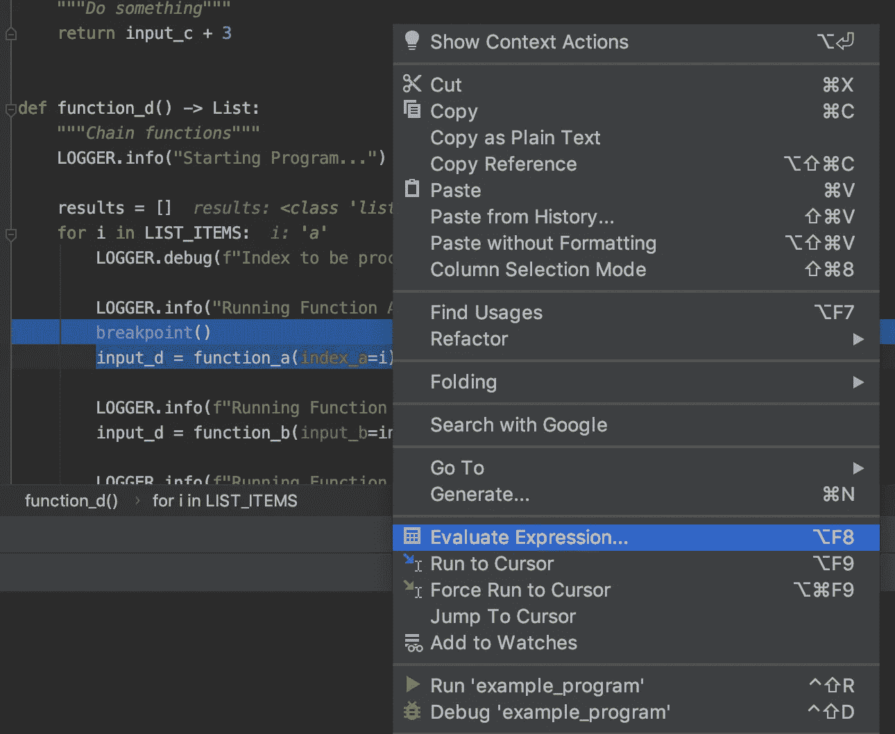
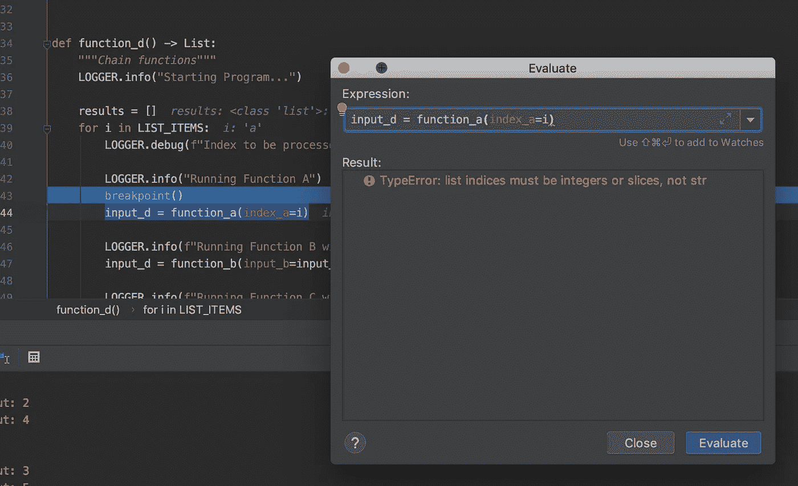

# 调试代码的三大技巧

> 原文：<https://medium.com/analytics-vidhya/top-3-tips-to-debug-your-code-179448cb9661?source=collection_archive---------20----------------------->


你好，你好，我的工程师同事们！

我最近花了很多时间做这件事，所以今天我想谈谈我用来帮助我调试的一些工具。

我们都经历过，我们写了一些代码，我们认为我们已经用单元测试和集成测试覆盖了每一个用例，每一个边缘用例。但不幸的是，一只虫子溜了进来。

***有趣的事实:***“Bug”和“debugging”这两个术语是格蕾丝·赫柏上将在哈佛大学研究马克 2 号计算机时创造的，当时她在一个继电器中发现了一只飞蛾。他们说他们正在“调试”系统。

现在，在你把你的错误追溯粘贴到谷歌之前，让我们花点时间来看一下我的第一个提示，最常见的错误…

## 打字稿

如果你没有因为打字错误而出错，你就是一个谜，你应该同时运行亚马逊、谷歌、脸书和网飞。

这似乎微不足道，你可能会想“亚历克斯，这是显而易见的…”

我无法告诉你有多少次因为一个打字错误，我的头撞到了墙上。但是，唉，这是我们作为软件工程师在调试时经常忽略的第一件事。所以在变成爱丽丝和跳进兔子洞之前，帮你自己一个忙…检查一下拼写错误。

下一个顶部提示…

## 断点

在出现错误的地方设置断点可能是最常见的调试方式。这可能非常强大，因为您可以在导致错误的环境中使用系统执行代码。

大多数 IDE 都有调试功能。我每天都用 PyCharm 编码。在 PyCharm 中你只需点击你想要设置红色断点的代码行，然后你就可以在调试模式下运行程序，见下图:



Python 3.7 有一个叫`breakpoint()`的内置，可以使用。只需在代码中您想要暂停程序执行的那一行设置该值，并再次以调试模式运行代码:



PyCharm 甚至突出显示了断点时当前设置的变量值。

然后，您可以通过高亮显示行并右键单击来计算表达式，从而执行代码，如下所示:



在这里，您可以执行突出显示的行，或者您喜欢的任何其他代码:



这样我们就可以解决这个问题了。

## 记录

可能是最重要的提示…

如果你还在使用`print()`进行调试，你需要照照镜子，给自己一个耳光。

日志记录是软件开发的重要部分。如果你对它不熟悉，可以把它想象成你的代码的故事讲述设备。一步一步地，你应该记录下关于代码进度的重要信息。

当您的代码运行一个函数、存储一些数据、向队列系统添加一条消息时，应该会写入一个日志。

让我们通过一个例子来讨论这个问题。

假设我们有一个包含 4 个功能的系统。函数 A、函数 B、函数 C 和函数 D。A、B 和 C 都在系统中运行不同的进程，函数 D 是将它们链接在一起的主要函数，如下所示(用 Python 编写，但可以是任何代码):

```
*"""Example program"""*from typing import ListLIST_ITEMS = [1, 2, 3, "a", 1, 2]

LIST_TO_INDEX = [1, 2, 3, 4, 5, 6]

def function_a(index_a: int) -> int:
    *"""Do something"""* return LIST_TO_INDEX[index_a]

def function_b(input_b: int) -> int:
    *"""Do something"""* return input_b + 2

def function_c(input_c: int) -> int:
    *"""Do something"""* return input_c + 3

def function_d() -> List:
    results = []
    for i in LIST_ITEMS:
        input_d = function_a(index_a=i)
        input_d = function_b(input_b=input_d)
        input_d = function_c(input_c=input_d)
        results.append(input_d)    
    return results

output = function_d()
```

上面的脚本运行了一个索引列表，并使用它们对函数 a 中的不同列表进行索引。然后，结果被传递给函数 B，并为其加 2，结果被传递给函数 C，并为其加 3。

如果您运行以上脚本，您将获得以下输出:

```
Traceback (most recent call last):
  File "/Users/alex/PycharmProjects/bug_tips/example_program.py", line 35, in <module>
    output = function_d(input_d=2)
  File "/Users/alex/PycharmProjects/bug_tips/example_program.py", line 29, in function_d
    input_d = function_a(index_a=i)
  File "/Users/alex/PycharmProjects/bug_tips/example_program.py", line 14, in function_a
    return LIST_TO_INDEX[index_a]
TypeError: list indices must be integers or slices, not strProcess finished with exit code 1
```

在这个非常简单的例子中，我们可以看到列表中的`a`导致了错误。但是让我们想象这个列表有几百万个数据点长，函数和程序要复杂得多。你已经可以看到这可能有点难以确定。

日志可以帮助我们隔离我们正在搜索的区域，就像一个过滤器，这样我们就可以看到代码在错误发生之前运行到了哪里。

对于一些适当放置的日志，我们得到以下代码:

```
*"""Example program"""* import logging
from typing import List

logging.basicConfig(level="INFO")
LOGGER = logging.getLogger(__name__)

LIST_ITEMS = [
    1, 2, 3, "a", 1, 2,
]

LIST_TO_INDEX = [
    1, 2, 3, 4, 5, 6,
]

def function_a(index_a: int) -> int:
    *"""Do something"""* return LIST_TO_INDEX[index_a]

def function_b(input_b: int) -> int:
    *"""Do something"""* return input_b + 2

def function_c(input_c: int) -> int:
    *"""Do something"""* return input_c + 3

def function_d() -> List:
    *"""Chain functions"""* LOGGER.info("Starting Program...")

    results = []
    for i in LIST_ITEMS:
        LOGGER.info(f"Index to be processed: {i}")

        LOGGER.info("Running Function A")
        input_d = function_a(index_a=i)

        LOGGER.info(f"Running Function B with input: {input_d}")
        input_d = function_b(input_b=input_d)

        LOGGER.info(f"Running Function C with input: {input_d}")
        input_d = function_c(input_c=input_d)

        results.append(input_d)

    LOGGER.info(f"Program finished, results: {results}")

    return results

output = function_d()
```

如果我们运行这段代码，控制台会得到以下输出:

```
INFO:__main__:Starting Program...
INFO:__main__:Index to be processed: 1
INFO:__main__:Running Function A
INFO:__main__:Running Function B with input: 2
INFO:__main__:Running Function C with input: 4
INFO:__main__:Index to be processed: 2
INFO:__main__:Running Function A
INFO:__main__:Running Function B with input: 3
INFO:__main__:Running Function C with input: 5
INFO:__main__:Index to be processed: 3
INFO:__main__:Running Function A
INFO:__main__:Running Function B with input: 4
INFO:__main__:Running Function C with input: 6
INFO:__main__:Index to be processed: a
INFO:__main__:Running Function A
Traceback (most recent call last):
  File "/Users/alex/PycharmProjects/bug_tips/example_program.py", line 58, in <module>
    output = function_d()
  File "/Users/alex/PycharmProjects/bug_tips/example_program.py", line 43, in function_d
    input_d = function_a(index_a=i)
  File "/Users/alex/PycharmProjects/bug_tips/example_program.py", line 21, in function_a
    return LIST_TO_INDEX[index_a]
TypeError: list indices must be integers or slices, not strProcess finished with exit code 1
```

这里我们注销程序启动，当函数 A、B 和 C 运行时，我们可以看到索引`1`、`2`和`3`运行正常。那么当`a`是要处理的指标时。我们得到一个失败，所以我们可以看到这是错误的直接原因。

有时，您可能在测试环境中一切都运行得非常好，但是生产环境是不同的动物。对于大量的实际数据，可能会出现意外错误，有时您可能希望记录与原因相关的数据。然而，我们不想无限期地这样做。这是您可以利用日志记录级别的地方。

如果我们改变下面一行:

```
LOGGER.info(f"Index to be processed: {i}")
```

收件人:

```
LOGGER.debug(f"Index to be processed: {i}")
```

然后再次运行该程序，您将得到输出:

```
INFO:__main__:Starting Program...
INFO:__main__:Running Function A
INFO:__main__:Running Function B with input: 2
INFO:__main__:Running Function C with input: 4
INFO:__main__:Running Function A
INFO:__main__:Running Function B with input: 3
INFO:__main__:Running Function C with input: 5
INFO:__main__:Running Function A
INFO:__main__:Running Function B with input: 4
INFO:__main__:Running Function C with input: 6
INFO:__main__:Running Function A
Traceback (most recent call last):
  File "/Users/alex/PycharmProjects/bug_tips/example_program.py", line 58, in <module>
    output = function_d()
  File "/Users/alex/PycharmProjects/bug_tips/example_program.py", line 43, in function_d
    input_d = function_a(index_a=i)
  File "/Users/alex/PycharmProjects/bug_tips/example_program.py", line 21, in function_a
    return LIST_TO_INDEX[index_a]
TypeError: list indices must be integers or slices, not str
```

这将删除日志中正在处理的索引值。实际上，这可能是您不希望无限输出的真实数据。但是，您可以将日志级别设置为`DEBUG`来输出它们。

更改以下行:

```
logging.basicConfig(level="INFO")
```

收件人:

```
logging.basicConfig(level="DEBUG")
```

然后再次运行该程序，您将得到以下输出:

```
INFO:__main__:Starting Program...
DEBUG:__main__:Index to be processed: 1
INFO:__main__:Running Function A
INFO:__main__:Running Function B with input: 2
INFO:__main__:Running Function C with input: 4
DEBUG:__main__:Index to be processed: 2
INFO:__main__:Running Function A
INFO:__main__:Running Function B with input: 3
INFO:__main__:Running Function C with input: 5
DEBUG:__main__:Index to be processed: 3
INFO:__main__:Running Function A
INFO:__main__:Running Function B with input: 4
INFO:__main__:Running Function C with input: 6
DEBUG:__main__:Index to be processed: a
INFO:__main__:Running Function A
Traceback (most recent call last):
  File "/Users/alex/PycharmProjects/bug_tips/example_program.py", line 58, in <module>
    output = function_d()
  File "/Users/alex/PycharmProjects/bug_tips/example_program.py", line 43, in function_d
    input_d = function_a(index_a=i)
  File "/Users/alex/PycharmProjects/bug_tips/example_program.py", line 21, in function_a
    return LIST_TO_INDEX[index_a]
TypeError: list indices must be integers or slices, not strProcess finished with exit code 1
```

注意，包含索引(要处理的数据)的行现在是一个`DEBUG`日志。如果您想关注代码的不稳定版本，这是很有帮助的。当您需要查看数据时，您可以将日志级别设置为`DEBUG`，然后在您对日志进行分析后，将其改回`INFO`。好的、放置得当的日志是软件开发中最有用的工具之一。

我希望这些建议对你有用，任何问题都可以留下评论！